---
aliases:
  - EffectAi
tags:
  - java/class
  - module/forge-ai
  - pkg/forge/ai/ability
fqn: forge.ai.ability.EffectAi
package: forge.ai.ability
module: forge-ai
kind: Class
---

# EffectAi

**Package:** `forge.ai.ability`   **Module:** `forge-ai`   **Kind:** Class



```mermaid
classDiagram
    class EffectAi {
        #checkApiLogic(Player ai, SpellAbility sa) AiAbilityDecision
        #doTriggerNoCost(Player aiPlayer, SpellAbility sa, boolean mandatory) AiAbilityDecision
        #cantRegenerateCheckCombat(Card host) boolean
        #cantRegenerateCheckStack(Card host) boolean
        +willPayUnlessCost(Player payer, SpellAbility sa, Cost cost, boolean alreadyPaid, FCollectionView~Player~ payers) boolean
    }
    EffectAi --|> SpellAbilityAi : extends
    EffectAi ..> AbilityKey : uses
    EffectAi ..> AiAbilityDecision : uses
    EffectAi ..> AiAttackController : uses
    EffectAi ..> AiController : uses
    EffectAi ..> ApiType : uses
    EffectAi ..> Card : uses
    EffectAi ..> CardCollection : uses
    EffectAi ..> CardCollectionView : uses
    EffectAi ..> Combat : uses
    EffectAi ..> CombatUtil : uses
    EffectAi ..> Cost : uses
    EffectAi ..> FCollectionView : uses
    EffectAi ..> FogAi : uses
    EffectAi ..> Game : uses
    EffectAi ..> GameEntity : uses
    EffectAi ..> MagicStack : uses
    EffectAi ..> PhaseHandler : uses
    EffectAi ..> Player : uses
    EffectAi ..> PlayerCollection : uses
    EffectAi ..> PlayerControllerAi : uses
    EffectAi ..> ReplacementEffect : uses
    EffectAi ..> SpellAbility : uses
    EffectAi ..> SpellAbilityStackInstance : uses
    EffectAi ..> StaticAbilityMode : uses
    EffectAi ..> TargetRestrictions : uses
```

## Relationships
**Extends:**
- [[forge.ai.SpellAbilityAi|SpellAbilityAi]]
**Uses:**
- [[forge.ai.AiAbilityDecision|AiAbilityDecision]]
- [[forge.ai.AiAttackController|AiAttackController]]
- [[forge.ai.AiController|AiController]]
- [[forge.ai.PlayerControllerAi|PlayerControllerAi]]
- [[forge.ai.ability.FogAi|FogAi]]
- [[forge.game.Game|Game]]
- [[forge.game.GameEntity|GameEntity]]
- [[forge.game.ability.AbilityKey|AbilityKey]]
- [[forge.game.ability.ApiType|ApiType]]
- [[forge.game.card.Card|Card]]
- [[forge.game.card.CardCollection|CardCollection]]
- [[forge.game.card.CardCollectionView|CardCollectionView]]
- [[forge.game.combat.Combat|Combat]]
- [[forge.game.combat.CombatUtil|CombatUtil]]
- [[forge.game.cost.Cost|Cost]]
- [[forge.game.phase.PhaseHandler|PhaseHandler]]
- [[forge.game.player.Player|Player]]
- [[forge.game.player.PlayerCollection|PlayerCollection]]
- [[forge.game.replacement.ReplacementEffect|ReplacementEffect]]
- [[forge.game.spellability.SpellAbility|SpellAbility]]
- [[forge.game.spellability.SpellAbilityStackInstance|SpellAbilityStackInstance]]
- [[forge.game.spellability.TargetRestrictions|TargetRestrictions]]
- [[forge.game.staticability.StaticAbilityMode|StaticAbilityMode]]
- [[forge.game.zone.MagicStack|MagicStack]]
- [[forge.util.collect.FCollectionView|FCollectionView]]

## Design Description

EffectAi is the AI decision-making companion for Forge's generic `Effect` ability API, extending `SpellAbilityAi` to override how the computer evaluates whether and how to play effect-producing spells and abilities. Its core `checkApiLogic` dispatches on an `AILogic` parameter to dozens of card-specific strategies—fog effects, blocking restrictions, life-gain denial, regeneration prevention, unblockable finishers—each consulting game state via collaborators like `PhaseHandler`, `Combat`/`CombatUtil`, `MagicStack`, and `ReplacementEffect` to return an `AiAbilityDecision`.

The class concentrates heuristic, situational logic rather than rules enforcement: it inspects the stack for threats, predicts combat outcomes, and selects targets through `ComputerUtil*` helpers. `doTriggerNoCost`, `willPayUnlessCost`, and the regeneration-check helpers extend the base AI contract for triggered and cost-payment scenarios, reflecting an intent to centralize the many bespoke behaviors of Forge's catch-all effect API behind a single, parameter-driven AI handler.

## Source
`forge-ai/src/main/java/forge/ai/ability/EffectAi.java`

```java
package forge.ai.ability;

import com.google.common.collect.Iterables;
import forge.ai.*;
import forge.game.CardTraitPredicates;
import forge.game.Game;
import forge.game.GameEntity;
import forge.game.ability.AbilityKey;
import forge.game.ability.AbilityUtils;
import forge.game.ability.ApiType;
import forge.game.card.*;
import forge.game.combat.Combat;
import forge.game.combat.CombatUtil;
import forge.game.cost.Cost;
import forge.game.keyword.Keyword;
import forge.game.phase.PhaseHandler;
import forge.game.phase.PhaseType;
import forge.game.player.Player;
import forge.game.player.PlayerCollection;
import forge.game.replacement.ReplacementEffect;
import forge.game.replacement.ReplacementLayer;
import forge.game.replacement.ReplacementType;
import forge.game.spellability.SpellAbility;
import forge.game.spellability.SpellAbilityStackInstance;
import forge.game.spellability.TargetRestrictions;
import forge.game.staticability.StaticAbilityMode;
import forge.game.zone.MagicStack;
import forge.game.zone.ZoneType;
import forge.util.FileSection;
import forge.util.MyRandom;
import forge.util.collect.FCollectionView;

import java.util.ArrayList;
import java.util.List;
import java.util.Map;
import java.util.Set;

public class EffectAi extends SpellAbilityAi {
    @Override
    protected AiAbilityDecision checkApiLogic(final Player ai, final SpellAbility sa) {
        final Game game = ai.getGame();
        final PhaseHandler phase = game.getPhaseHandler();
        boolean randomReturn = MyRandom.getRandom().nextFloat() <= .6667;
        String logic = "";

        if (sa.hasParam("AILogic")) {
            logic = sa.getParam("AILogic");
            if (logic.equals("BeginningOfOppTurn")) {
                if (!phase.getPlayerTurn().isOpponentOf(ai) || phase.getPhase().isAfter(PhaseType.DRAW)) {
                    return new AiAbilityDecision(0, AiPlayDecision.CantPlayAi);
                }
                randomReturn = true;
            } else if (logic.equals("KeepOppCreatsLandsTapped")) {
                for (Player opp : ai.getOpponents()) {
                    boolean worthHolding = false;
                    CardCollectionView oppCreatsLands = CardLists.filter(opp.getCardsIn(ZoneType.Battlefield),
                            CardPredicates.LANDS.or(CardPredicates.CREATURES));
                    CardCollectionView oppCreatsLandsTapped = CardLists.filter(oppCreatsLands, CardPredicates.TAPPED);

                    if (oppCreatsLandsTapped.size() >= 3 || oppCreatsLands.size() == oppCreatsLandsTapped.size()) {
                        worthHolding = true;
                    }
                    if (!worthHolding) {
                        return new AiAbilityDecision(0, AiPlayDecision.CantPlayAi);
                    }
                    randomReturn = true;
                }
            } else if (logic.equals("RestrictBlocking")) {
                if (!phase.isPlayerTurn(ai) || phase.getPhase().isBefore(PhaseType.COMBAT_BEGIN)
                        || phase.getPhase().isAfter(PhaseType.COMBAT_DECLARE_ATTACKERS)) {
                    return new AiAbilityDecision(0, AiPlayDecision.CantPlayAi);
                }

                if (sa.getPayCosts().getTotalMana().countX() > 0 && sa.getHostCard().getSVar("X").equals("Count$xPaid")) {
                    // Set PayX here to half the remaining mana to allow for Main 2 and other combat shenanigans.
                    final int xPay = ComputerUtilMana.determineLeftoverMana(sa, ai, sa.isTrigger()) / 2;
                    if (xPay == 0) {
                        return new AiAbilityDecision(0, AiPlayDecision.CantPlayAi);
                    }
                    sa.setXManaCostPaid(xPay);
                }

                Player opp = ai.getStrongestOpponent();
                List<Card> possibleAttackers = ai.getCreaturesInPlay();
                List<Card> possibleBlockers = opp.getCreaturesInPlay();
                possibleBlockers = CardLists.filter(possibleBlockers, CardPredicates.UNTAPPED);
                final Combat combat = game.getCombat();
                int oppLife = opp.getLife();
                int potentialDmg = 0;
                List<Card> currentAttackers = new ArrayList<>();

                if (possibleBlockers.isEmpty()) {
                    return new AiAbilityDecision(0, AiPlayDecision.CantPlayAi);
                }

                for (final Card creat : possibleAttackers) {
                    if (CombatUtil.canAttack(creat, opp) && possibleBlockers.size() > 1) {
                        potentialDmg += creat.getCurrentPower();
                        if (potentialDmg >= oppLife) {
                            return new AiAbilityDecision(100, AiPlayDecision.WillPlay);
                        }
                    }
                    if (combat != null && combat.isAttacking(creat)) {
                        currentAttackers.add(creat);
                    }
                }

                if (currentAttackers.size() > possibleBlockers.size()) {
                    return new AiAbilityDecision(100, AiPlayDecision.WillPlay);
                }
                return new AiAbilityDecision(0, AiPlayDecision.CantPlayAi);
            } else if (logic.equals("Fog")) {
                FogAi fogAi = new FogAi();
                if (!fogAi.canPlay(ai, sa).willingToPlay()) {
                    return new AiAbilityDecision(0, AiPlayDecision.CantPlayAi);
                }

                final TargetRestrictions tgt = sa.getTargetRestrictions();
                if (tgt != null) {
                    sa.resetTargets();
                    if (tgt.canOnlyTgtOpponent()) {
                        boolean canTgt = false;

                        for (Player opp2 : ai.getOpponents()) {
                            if (sa.canTarget(opp2)) {
                                sa.getTargets().add(opp2);
                                canTgt = true;
                                break;
                            }
                        }

                        if (!canTgt) {
                            return new AiAbilityDecision(0, AiPlayDecision.CantPlayAi);
                        }
                    } else {
                        Combat combat = game.getCombat();
                        List<Card> list = combat.getAttackers();
                        list = CardLists.getTargetableCards(list, sa);
                        list = CardLists.filter(list, c -> ai.equals(combat.getDefenderPlayerByAttacker(c)));
                        Card target = ComputerUtilCard.getBestCreatureAI(list);
                        if (target == null) {
                            return new AiAbilityDecision(0, AiPlayDecision.CantPlayAi);
                        }
                        sa.getTargets().add(target);
                    }
                }
                randomReturn = true;
            } else if (logic.equals("ChainVeil")) {
                if (!phase.isPlayerTurn(ai) || !phase.getPhase().equals(PhaseType.MAIN2) || ai.getPlaneswalkersInPlay().isEmpty()) {
                    return new AiAbilityDecision(0, AiPlayDecision.CantPlayAi);
                }
                randomReturn = true;
            } else if (logic.equals("SecretTunnel")) {
                randomReturn = false;
                if (phase.is(PhaseType.COMBAT_BEGIN, ai)) {
                    for (String s : CardFactoryUtil.getMostProminentCreatureType(ai.getCreaturesInPlay())) {
                        CardCollection typedCards = CardLists.filter(ai.getCreaturesInPlay(), CardPredicates.isType(s));
                        if (typedCards.size() >= 2) {
                            Card tgt1 = typedCards.get(0);
                            Card tgt2 = typedCards.get(1);
                            if (ComputerUtilCard.doesCreatureAttackAI(ai, tgt1) || ComputerUtilCard.doesCreatureAttackAI(ai, tgt2)) {
                                sa.getTargets().add(tgt1);
                                sa.getTargets().add(tgt2);
                                randomReturn = true;
                                break;
                            }
                        }
                    }
                }
            } else if (logic.equals("WillCastCreature") && ai.isAI()) {
                AiController aic = ((PlayerControllerAi) ai.getController()).getAi();
                SpellAbility saCreature = aic.predictSpellToCastInMain2(ApiType.PermanentNoncreature);
                randomReturn = saCreature != null;
            } else if (logic.equals("Always")) {
                randomReturn = true;
            } else if (logic.equals("Main1")) {
                if (phase.getPhase().isBefore(PhaseType.MAIN1)) {
                    return new AiAbilityDecision(0, AiPlayDecision.CantPlayAi);
                }
                randomReturn = true;
            } else if (logic.equals("Main2")) {
                if (phase.getPhase().isBefore(PhaseType.MAIN2)) {
                    return new AiAbilityDecision(0, AiPlayDecision.CantPlayAi);
                }
                randomReturn = true;
            } else if (logic.equals("Evasion")) {
                if (!phase.isPlayerTurn(ai)) {
                    return new AiAbilityDecision(0, AiPlayDecision.CantPlayAi);
                }

                boolean shouldPlay = false;

                List<Card> comp = ai.getCreaturesInPlay();

                for (final Player opp : ai.getOpponents()) {
                    List<Card> human = opp.getCreaturesInPlay();

                    // only count creatures that can attack or block
                    comp = CardLists.filter(comp, c -> CombatUtil.canAttack(c, opp));
                    if (comp.size() < 2) {
                        continue;
                    }
                    final List<Card> attackers = comp;
                    human = CardLists.filter(human, c -> CombatUtil.canBlockAtLeastOne(c, attackers));
                    if (human.isEmpty()) {
                        continue;
                    }

                    shouldPlay = true;
                    break;
                }

                return shouldPlay ? new AiAbilityDecision(100, AiPlayDecision.WillPlay) : new AiAbilityDecision(0, AiPlayDecision.CantPlayAi);
            } else if (logic.equals("RedirectSpellDamageFromPlayer")) {
                if (game.getStack().isEmpty()) {
                    return new AiAbilityDecision(0, AiPlayDecision.CantPlayAi);
                }
                boolean threatened = false;
                for (final SpellAbilityStackInstance stackInst : game.getStack()) {
                    if (!stackInst.isSpell()) {
                        continue;
                    }
                    SpellAbility stackSpellAbility = stackInst.getSpellAbility();
                    if (stackSpellAbility.getApi() == ApiType.DealDamage) {
                        final SpellAbility saTargeting = stackSpellAbility.getSATargetingPlayer();
                        if (saTargeting != null && Iterables.contains(saTargeting.getTargets().getTargetPlayers(), ai)) {
                            threatened = true;
                        }
                    }
                }
                randomReturn = threatened;
            } else if (logic.equals("Prevent")) { // prevent burn spell from opponent
                if (game.getStack().isEmpty()) {
                    return new AiAbilityDecision(0, AiPlayDecision.CantPlayAi);
                }
                final SpellAbility saTop = game.getStack().peekAbility();
                final Card host = saTop.getHostCard();
                if (saTop.getActivatingPlayer() != ai // from opponent
                        && host.canDamagePrevented(false) // no prevent damage
                        && (host.isInstant() || host.isSorcery())
                        && !host.hasKeyword("Prevent all damage that would be dealt by CARDNAME.")) { // valid target
                    final ApiType type = saTop.getApi();
                    if (type == ApiType.DealDamage || type == ApiType.DamageAll) { // burn spell
                        sa.getTargets().add(saTop);
                        return new AiAbilityDecision(100, AiPlayDecision.WillPlay);
                    }
                }
                return new AiAbilityDecision(0, AiPlayDecision.CantPlayAi);
            } else if (logic.equals("NoGain")) {
                // basic logic to cancel GainLife on stack
                if (!game.getStack().isEmpty()) {
                    SpellAbility topStack = game.getStack().peekAbility();
                    final Player activator = topStack.getActivatingPlayer();
                    if (activator.isOpponentOf(ai) && activator.canGainLife()) {
                        while (topStack != null) {
                            if (topStack.getApi() == ApiType.GainLife) {
                                if ("You".equals(topStack.getParam("Defined")) || topStack.isTargeting(activator) || (!topStack.usesTargeting() && !topStack.hasParam("Defined"))) {
                                    return new AiAbilityDecision(100, AiPlayDecision.WillPlay);
                                }
                            } else if (topStack.getApi() == ApiType.DealDamage && topStack.getHostCard().hasKeyword(Keyword.LIFELINK)) {
                                Card host = topStack.getHostCard();
                                for (GameEntity target : topStack.getTargets().getTargetEntities()) {
                                    if (ComputerUtilCombat.predictDamageTo(target,
                                            AbilityUtils.calculateAmount(host, topStack.getParam("NumDmg"), topStack), host, false) > 0) {
                                        return new AiAbilityDecision(100, AiPlayDecision.WillPlay);
                                    }
                                }
                            }
                            topStack = topStack.getSubAbility();
                        }
                    }
                }
                // also check for combat lifelink
                if (game.getPhaseHandler().is(PhaseType.COMBAT_DECLARE_BLOCKERS)) {
                    final Combat combat = ai.getGame().getCombat();
                    final Player attackingPlayer = combat.getAttackingPlayer();
                    if (attackingPlayer.isOpponentOf(ai) && attackingPlayer.canGainLife()) {
                        if (ComputerUtilCombat.checkAttackerLifelinkDamage(combat) > 0) {
                            return new AiAbilityDecision(100, AiPlayDecision.WillPlay);
                        }
                    }
                }
                return new AiAbilityDecision(0, AiPlayDecision.CantPlayAi);
            } else if (logic.equals("NonCastCreature")) {
                // TODO: add support for more cases with more convoluted API setups
                if (!game.getStack().isEmpty()) {
                    SpellAbility topStack = game.getStack().peekAbility();
                    final Player activator = topStack.getActivatingPlayer();
                    if (activator.isOpponentOf(ai)) {
                        boolean changeZone = topStack.getApi() == ApiType.ChangeZone || topStack.getApi() == ApiType.ChangeZoneAll;
                        boolean toBattlefield = "Battlefield".equals(topStack.getParam("Destination"));
                        boolean reanimator = "true".equalsIgnoreCase(topStack.getSVar("IsReanimatorCard"));
                        if (changeZone && (toBattlefield || reanimator)) {
                            if ("Creature".equals(topStack.getParam("ChangeType")) || topStack.getParamOrDefault("Defined", "").contains("Creature"))
                                return new AiAbilityDecision(100, AiPlayDecision.WillPlay);
                        }
                    }
                }
                return new AiAbilityDecision(0, AiPlayDecision.CantPlayAi);
            } else if (logic.equals("Fight")) {
                return FightAi.canFight(ai, sa, 0, 0);
            } else if (logic.equals("Pump")) {
                sa.resetTargets();
                List<Card> options = CardUtil.getValidCardsToTarget(sa);
                options = CardLists.filterControlledBy(options, ai);
                if (sa.getPayCosts().hasTapCost()) {
                    options.remove(sa.getHostCard());
                }
                if (!options.isEmpty() && phase.isPlayerTurn(ai) && phase.getPhase().isBefore(PhaseType.COMBAT_DECLARE_BLOCKERS)) {
                    sa.getTargets().add(ComputerUtilCard.getBestCreatureAI(options));
                    return new AiAbilityDecision(100, AiPlayDecision.WillPlay);
                }
                return new AiAbilityDecision(0, AiPlayDecision.CantPlayAi);
            } else if (logic.equals("MakeUnblockable")) {
                if (ai.getOpponents().getCreaturesInPlay().isEmpty()) {
                    return new AiAbilityDecision(0, AiPlayDecision.AnotherTime);
                }
                sa.resetTargets();
                CardCollection options = new CardCollection(CardUtil.getValidCardsToTarget(sa));
                options = CardLists.filterControlledBy(options, ai);
                options = CardLists.filter(options, CombatUtil::canAttack);
                if (sa.getPayCosts().hasTapCost()) {
                    options.remove(sa.getHostCard());
                }
                if (options.isEmpty()) {
                    return new AiAbilityDecision(0, AiPlayDecision.AnotherTime);
                }
                if (phase.is(PhaseType.MAIN1, ai)) {
                    int predictedLife = ai.getLife();
                    if (ai.canLoseLife() && !ai.cantLoseForZeroOrLessLife()) {
                        predictedLife = ComputerUtil.predictNextCombatsRemainingLife(ai, false, false, 0, options);
                    }
                    ComputerUtilCard.sortByEvaluateCreature(options);
                    for (Card card : options) {
                        if (!CombatUtil.canBeBlocked(card, ai.getOpponents().getCreaturesInPlay(), phase.getCombat())) {
                            continue;
                        }
                        if (card.getNetPower() >= ai.getWeakestOpponent().getLife() && ai.getWeakestOpponent().canLoseLife() && !ai.getWeakestOpponent().cantLoseForZeroOrLessLife()) {
                            // try to finish off the opponent with an unblockable creature
                            sa.getTargets().add(card);
                            return new AiAbilityDecision(100, AiPlayDecision.WillPlay);
                        }
                        final Card copy = CardCopyService.getLKICopy(card);
                        String cantBeBlocked = "Mode$ CantBlockBy | ValidAttacker$ Creature.Self";
                        copy.addStaticAbility(cantBeBlocked);
                        copy.setSickness(false); // for some reason is copied as if having summoning sickness
                        // TODO: also check the case where the AI would attack with the creature but it will be traded, to avoid trading unfavorably?
                        if (predictedLife > 0 && ComputerUtilCard.doesSpecifiedCreatureAttackAI(ai, copy) && !ComputerUtilCard.doesCreatureAttackAI(ai, card)) {
                            sa.getTargets().add(card);
                            return new AiAbilityDecision(100, AiPlayDecision.WillPlay);
                        }
                    }
                }
                return new AiAbilityDecision(0, AiPlayDecision.CantPlayAi);
            } else if (logic.equals("Burn")) {
                SpellAbility burn = sa.getSubAbility();
                return SpellApiToAi.Converter.get(burn).canPlayWithSubs(ai, burn).willingToPlay() ? new AiAbilityDecision(100, AiPlayDecision.WillPlay) : new AiAbilityDecision(0, AiPlayDecision.CantPlayAi);
            } else if (logic.equals("YawgmothsWill")) {
                return SpecialCardAi.YawgmothsWill.consider(ai, sa) ? new AiAbilityDecision(100, AiPlayDecision.WillPlay) : new AiAbilityDecision(0, AiPlayDecision.CantPlayAi);
            } else if (logic.startsWith("NeedCreatures")) {
                // TODO convert to AiCheckSVar
                if (ai.getCreaturesInPlay().isEmpty()) {
                    return new AiAbilityDecision(0, AiPlayDecision.CantPlayAi);
                }
                if (logic.contains(":")) {
                    String[] k = logic.split(":");
                    int i = Integer.parseInt(k[1]);
                    return ai.getCreaturesInPlay().size() >= i ? new AiAbilityDecision(100, AiPlayDecision.WillPlay) : new AiAbilityDecision(0, AiPlayDecision.CantPlayAi);
                }
                return new AiAbilityDecision(100, AiPlayDecision.WillPlay);
            } else if (logic.equals("PeaceTalks")) {
                Player nextPlayer = game.getNextPlayerAfter(ai);

                // If opponent doesn't have creatures, preventing attacks don't mean as much
                if (nextPlayer.getCreaturesInPlay().isEmpty()) {
                    return new AiAbilityDecision(0, AiPlayDecision.CantPlayAi);
                }

                // Only cast Peace Talks after you attack just in case you have creatures
                if (!phase.is(PhaseType.MAIN2)) {
                    return new AiAbilityDecision(0, AiPlayDecision.CantPlayAi);
                }

                // Create a pseudo combat and see if my life is in danger
                return randomReturn ? new AiAbilityDecision(100, AiPlayDecision.WillPlay) : new AiAbilityDecision(0, AiPlayDecision.CantPlayAi);
            } else if (logic.equals("Bribe")) {
                Card host = sa.getHostCard();
                Combat combat = game.getCombat();
                if (combat != null && combat.isAttacking(host, ai) && !combat.isBlocked(host)
                        && phase.is(PhaseType.COMBAT_DECLARE_BLOCKERS)
                        && !host.getAbilityActivatedThisTurn().getActivators(sa).contains(ai)) {
                    // ideally needs once per combat or something
                    return new AiAbilityDecision(100, AiPlayDecision.WillPlay);
                }
                return new AiAbilityDecision(0, AiPlayDecision.CantPlayAi);
            } else if (logic.equals("CantRegenerate")) {
                if (sa.usesTargeting()) {
                    CardCollection list = CardLists.getTargetableCards(ai.getOpponents().getCardsIn(ZoneType.Battlefield), sa);
                    list = CardLists.filter(list, Card::canBeDestroyed, input -> {
                        Map<AbilityKey, Object> runParams = AbilityKey.mapFromAffected(input);
                        runParams.put(AbilityKey.Regeneration, true);
                        List<ReplacementEffect> repDestroyList = game.getReplacementHandler().getReplacementList(ReplacementType.Destroy, runParams, ReplacementLayer.Other);
                        // no Destroy Replacement, or one non-Regeneration one like Totem-Armor
                        if (repDestroyList.isEmpty() || repDestroyList.stream().anyMatch(CardTraitPredicates.hasParam("Regeneration").negate())) {
                            return false;
                        }

                        if (cantRegenerateCheckCombat(input) || cantRegenerateCheckStack(input)) {
                            return true;
                        }

                        return false;
                    });

                    if (list.isEmpty()) {
                        return new AiAbilityDecision(0, AiPlayDecision.CantPlayAi);
                    }
                    // TODO check Stack for Effects that would destroy the selected card?
                    sa.getTargets().add(ComputerUtilCard.getBestAI(list));
                    return new AiAbilityDecision(100, AiPlayDecision.WillPlay);
                } else if (sa.getParent() != null) {
                    // sub ability should be okay
                    return new AiAbilityDecision(100, AiPlayDecision.WillPlay);
                } else if ("Self".equals(sa.getParam("RememberObjects"))) {
                    // the ones affecting itself are Nimbus cards, were opponent can activate this effect
                    Card host = sa.getHostCard();
                    if (!host.canBeDestroyed()) {
                        return new AiAbilityDecision(0, AiPlayDecision.CantPlayAi);
                    }

                    Map<AbilityKey, Object> runParams = AbilityKey.mapFromAffected(sa.getHostCard());
                    runParams.put(AbilityKey.Regeneration, true);
                    List<ReplacementEffect> repDestroyList = game.getReplacementHandler().getReplacementList(ReplacementType.Destroy, runParams, ReplacementLayer.Other);
                    // no Destroy Replacement, or one non-Regeneration one like Totem-Armor
                    if (repDestroyList.isEmpty() || repDestroyList.stream().anyMatch(CardTraitPredicates.hasParam("Regeneration").negate())) {
                        return new AiAbilityDecision(0, AiPlayDecision.CantPlayAi);
                    }

                    if (cantRegenerateCheckCombat(host) || cantRegenerateCheckStack(host)) {
                        return new AiAbilityDecision(100, AiPlayDecision.WillPlay);
                    }

                    return new AiAbilityDecision(0, AiPlayDecision.CantPlayAi);
                }
            }
        } else if (sa.hasParam("RememberObjects") && sa.hasParam("StaticAbilities")) { //generic
            boolean cantAttack = false;
            boolean cantBlock = false;
            boolean cantActivate = false;
            boolean hasMayPlayFromGrave = false;
            String duration = sa.getParam("Duration");
            String matchStr = "Card.IsRemembered";

            for (String st : sa.getParam("StaticAbilities").split(",")) {
                Map<String, String> params = FileSection.parseToMap(sa.getSVar(st), FileSection.DOLLAR_SIGN_KV_SEPARATOR);
                Set<StaticAbilityMode> modes = StaticAbilityMode.setValueOf(params.get("Mode"));

                if (modes.contains(StaticAbilityMode.CantAttack) && matchStr.equals(params.get("ValidCard"))) {
                    cantAttack = true;
                }
                if (modes.contains(StaticAbilityMode.CantBlock) && matchStr.equals(params.get("ValidCard"))) {
                    cantBlock = true;
                }
                if (modes.contains(StaticAbilityMode.CantBlockBy) && matchStr.equals(params.get("ValidBlocker"))) {
                    cantBlock = true;
                }
                if (modes.contains(StaticAbilityMode.CantBeActivated) && matchStr.equals(params.get("ValidCard"))) {
                    cantActivate = true;
                }
                if ("True".equalsIgnoreCase(params.getOrDefault("MayPlay", "False"))
                        && "Graveyard".equalsIgnoreCase(params.getOrDefault("AffectedZone", ""))) {
                    hasMayPlayFromGrave = true;
                    break;
                }
            }

            if (hasMayPlayFromGrave && sa.usesTargeting()) {
                List<Card> targetables = CardUtil.getValidCardsToTarget(sa);

                if (!phase.isPlayerTurn(ai) && phase.is(PhaseType.COMBAT_DECLARE_ATTACKERS)) {
                    Combat combat = game.getCombat();
                    CardCollection attackersVsAi = combat.getAttackersOf(ai);
                    if (!attackersVsAi.isEmpty()) {
                        CardCollection flashCreatures = CardLists.filter(targetables, c -> c.isCreature() && c.hasKeyword(Keyword.FLASH));

                        Card bestBlocker = null;
                        for (Card attacker : attackersVsAi) {
                            for (Card blocker : flashCreatures) {
                                SpellAbility castSa = blocker.getFirstSpellAbility();
                                if (castSa == null || !ComputerUtilMana.canPayManaCost(castSa, ai, sa.getPayCosts().getTotalMana().getCMC(), false)) {
                                    continue;
                                }

                                boolean blockerDies = ComputerUtilCombat.canDestroyBlocker(ai, blocker, attacker, combat, false);
                                boolean attackerDies = ComputerUtilCombat.canDestroyAttacker(ai, attacker, blocker, combat, false);

                                if (attackerDies || !blockerDies) {
                                    bestBlocker = blocker;
                                    break;
                                }
                            }
                            if (bestBlocker != null) break;
                        }

                        if (bestBlocker != null) {
                            sa.resetTargets();
                            sa.getTargets().add(bestBlocker);
                            return new AiAbilityDecision(100, AiPlayDecision.WillPlay);
                        }
                        return new AiAbilityDecision(0, AiPlayDecision.CantPlayAi);
                    }
                }

                if (!ComputerUtil.targetPlayableSpellCard(ai, targetables, sa, false, false)) {
                    return new AiAbilityDecision(0, AiPlayDecision.CantPlayAi);
                }
                return new AiAbilityDecision(100, AiPlayDecision.WillPlay);
            }

            // TODO add more cases later
            if (!cantAttack && !cantBlock && !cantActivate) {
                return new AiAbilityDecision(0, AiPlayDecision.CantPlayAi);
            }

            if (cantBlock && duration == null && phase.isPlayerTurn(ai) && !phase.getPhase().isBefore(PhaseType.COMBAT_DECLARE_BLOCKERS)) {
                return new AiAbilityDecision(0, AiPlayDecision.CantPlayAi);
            }

            if (sa.usesTargeting()) {
                final Player opp = AiAttackController.choosePreferredDefenderPlayer(ai);

                CardCollection list = new CardCollection(CardUtil.getValidCardsToTarget(sa));

                list = ComputerUtil.filterAITgts(sa, ai, list, true);

                if (list.isEmpty()) {
                    return new AiAbilityDecision(0, AiPlayDecision.CantPlayAi);
                }

                List<Card> oppCreatures = CardLists.filterAsList(list, c -> c.isCreature() && c.getController().isOpponentOf(ai));

                List<Card> oppWithAbilities = CardLists.filterAsList(list, c -> !c.isCreature() && c.getController().isOpponentOf(ai) && c.getSpellAbilities().anyMatch(SpellAbility::isActivatedAbility));

                if (cantAttack || cantBlock) {
                    if (oppCreatures.isEmpty()) {
                        if (!cantActivate || oppWithAbilities.isEmpty()) {
                            return new AiAbilityDecision(0, AiPlayDecision.CantPlayAi);
                        }
                    }
                }

                while (sa.canAddMoreTarget()) {
                    Card choice = null;
                    if (cantAttack && cantBlock && !oppCreatures.isEmpty()) {
                        Card primeTarget = ComputerUtil.getKilledByTargeting(sa, oppCreatures);
                        if (primeTarget != null) {
                            choice = primeTarget;
                        } else if (phase.isPlayerTurn(ai) && phase.getPhase().isBefore(PhaseType.COMBAT_DECLARE_BLOCKERS)) {
                            // Tap creatures possible blockers before combat during AI's turn.
                            List<Card> attackers;
                            if (phase.getPhase().isAfter(PhaseType.COMBAT_DECLARE_ATTACKERS)) {
                                //Combat has already started
                                attackers = game.getCombat().getAttackers();
                            } else {
                                attackers = CardLists.filter(ai.getCreaturesInPlay(), c -> CombatUtil.canAttack(c, opp));
                            }
                            List<Card> creatureList = CardLists.filter(list, CardPredicates.possibleBlockerForAtLeastOne(attackers));

                            // TODO check if own creature would be forced to attack and we want to keep it alive

                            if (!attackers.isEmpty() && !creatureList.isEmpty()) {
                                choice = ComputerUtilCard.getBestCreatureAI(creatureList);
                            } else if (sa.isTrigger() || ComputerUtil.castSpellInMain1(ai, sa)) {
                                choice = ComputerUtilCard.getMostExpensivePermanentAI(list);
                            }
                        }
                    } // TODO add logic to tap non creatures with activated abilities if cantActivate is true

                    if (choice == null) { // can't find anything left
                        if (!sa.isMinTargetChosen() || sa.isZeroTargets()) {
                            sa.resetTargets();
                            return new AiAbilityDecision(0, AiPlayDecision.CantPlayAi);
                        }
                        if (!ComputerUtil.shouldCastLessThanMax(ai, sa.getHostCard())) {
                            return new AiAbilityDecision(0, AiPlayDecision.CantPlayAi);
                        }
                        break;
                    }

                    list.remove(choice);
                    oppCreatures.remove(choice);
                    sa.getTargets().add(choice);
                }
                return new AiAbilityDecision(100, AiPlayDecision.WillPlay);
            }

            return new AiAbilityDecision(0, AiPlayDecision.CantPlayAi);
        } else { //no AILogic
            return new AiAbilityDecision(0, AiPlayDecision.CantPlayAi);
        }

        if ("False".equals(sa.getParam("Stackable"))) {
            String name = sa.getParam("Name");
            if (name == null) {
                name = sa.getHostCard().getName() + "'s Effect";
            }
            if (sa.getActivatingPlayer().isCardInCommand(name)) {
                return new AiAbilityDecision(0, AiPlayDecision.CantPlayAi);
            }
        }

        final TargetRestrictions tgt = sa.getTargetRestrictions();
        if (tgt != null && tgt.canTgtPlayer()) {
            sa.resetTargets();
            if (tgt.canOnlyTgtOpponent() || logic.equals("BeginningOfOppTurn")) {
                boolean canTgt = false;
                for (Player opp : ai.getOpponents()) {
                    if (sa.canTarget(opp)) {
                        sa.getTargets().add(opp);
                        canTgt = true;
                        break;
                    }
                }
                return canTgt ? new AiAbilityDecision(100, AiPlayDecision.WillPlay) : new AiAbilityDecision(0, AiPlayDecision.CantPlayAi);
            } else {
                sa.getTargets().add(ai);
            }
        }

        return randomReturn ? new AiAbilityDecision(100, AiPlayDecision.WillPlay) : new AiAbilityDecision(0, AiPlayDecision.CantPlayAi);
    }

    @Override
    protected AiAbilityDecision doTriggerNoCost(final Player aiPlayer, final SpellAbility sa, final boolean mandatory) {
        if (sa.hasParam("AILogic")) {
            if (canPlay(aiPlayer, sa).willingToPlay()) {
                return new AiAbilityDecision(100, AiPlayDecision.WillPlay);
            }
        }

        // E.g. Nova Pentacle
        if (sa.usesTargeting() && !sa.getTargetRestrictions().canTgtPlayer()) {
            // try to target the opponent's best targetable permanent, if able
            CardCollection oppPerms = CardLists.getValidCards(aiPlayer.getOpponents().getCardsIn(sa.getTargetRestrictions().getZone()), sa.getTargetRestrictions().getValidTgts(), aiPlayer, sa.getHostCard(), sa);
            oppPerms = CardLists.filter(oppPerms, sa::canTarget);
            if (!oppPerms.isEmpty()) {
                sa.resetTargets();
                sa.getTargets().add(ComputerUtilCard.getBestAI(oppPerms));
                return new AiAbilityDecision(100, AiPlayDecision.WillPlay);
            }

            if (mandatory) {
                // try to target the AI's worst targetable permanent, if able
                CardCollection aiPerms = CardLists.getValidCards(aiPlayer.getCardsIn(sa.getTargetRestrictions().getZone()), sa.getTargetRestrictions().getValidTgts(), aiPlayer, sa.getHostCard(), sa);
                aiPerms = CardLists.filter(aiPerms, sa::canTarget);
                if (!aiPerms.isEmpty()) {
                    sa.resetTargets();
                    sa.getTargets().add(ComputerUtilCard.getWorstAI(aiPerms));
                    return new AiAbilityDecision(100, AiPlayDecision.WillPlay);
                }
            }

            return new AiAbilityDecision(0, AiPlayDecision.CantPlayAi);
        }

        return super.doTriggerNoCost(aiPlayer, sa, mandatory);
    }

    protected boolean cantRegenerateCheckCombat(Card host) {
        final Game game = host.getGame();
        if (!game.getPhaseHandler().inCombat()) {
            return false;
        }
        if (!game.getPhaseHandler().getPhase().isBefore(PhaseType.COMBAT_DAMAGE)) {
            return false;
        }

        Combat combat = game.getCombat();

        if (game.getPhaseHandler().isPlayerTurn(host.getController())) {
            // attacking player
            if (!combat.isAttacking(host)) {
                return false;
            }
            // TODO predict lethal combat damage
            return combat.isBlocked(host);
        } else {
            // TODO predict lethal combat damage
            return combat.isBlocking(host);
        }
    }

    protected boolean cantRegenerateCheckStack(Card host) {
        final Game game = host.getGame();

        // do this only in reaction to a threatening spell on directly on the stack
        MagicStack stack = game.getStack();
        if (stack.isEmpty()) {
            return false;
        }
        // TODO check Stack for Effects that would destroy host, either direct or indirect
        SpellAbility stackSa = stack.peekAbility();
        if (stackSa == null) {
            return false;
        }

        // regenerate is a replace destroy, meaning either destroyed by effect
        // or destroyed by state based action, when dying by lethal damage
        SpellAbility subAbility = stackSa;
        while (subAbility != null) {
            ApiType apiType = subAbility.getApi();
            if (apiType == null) {
                continue;
            }

            if (ApiType.DestroyAll == apiType) {
                // or skip to sub abilities?
                if (subAbility.hasParam("NoRegen")) {
                    return false;
                }
                if (subAbility.usesTargeting() && !Iterables.contains(subAbility.getTargets().getTargetPlayers(), host.getController())) {
                    return false;
                }
                String valid = subAbility.getParamOrDefault("ValidCards", "");

                CardCollectionView list = game.getCardsIn(ZoneType.Battlefield);

                if (subAbility.usesTargeting()) {
                    list = CardLists.filterControlledBy(list, new PlayerCollection(subAbility.getTargets().getTargetPlayers()));
                }

                list = AbilityUtils.filterListByType(list, valid, subAbility);
                if (list.contains(host)) {
                    return true;
                }
                // check for defined
            } else if (ApiType.Destroy == apiType) {
                if (subAbility.hasParam("NoRegen")) {
                    return false;
                }
                if (subAbility.hasParam("Sacrifice")) {
                    return false;
                }
                // simulate getTargetCards
                if (subAbility.usesTargeting()) {
                    // isTargeting checks parents, i think that might be wrong
                    if (subAbility.getTargets().contains(host)) {
                        return true;
                    }
                } else if (AbilityUtils.getDefinedObjects(subAbility.getHostCard(), subAbility.getParam("Defined"), subAbility).contains(host)) {
                    return true;
                }

                if (CardUtil.getRadiance(subAbility).contains(host)) {
                    return true;
                }

                // check for target or indirect target
            } else if (ApiType.DamageAll == apiType) {
                if (!subAbility.hasParam("ValidCards")) {
                    continue;
                }
                String valid = subAbility.getParamOrDefault("ValidCards", "");
                if (valid.isEmpty()) {
                    continue;
                }

                Card source = game.getChangeZoneLKIInfo(subAbility.getHostCard());
                if (source.isWitherDamage()) {
                    return false;
                }

                // host card is valid
                if (host.isValid(valid.split(","), subAbility.getActivatingPlayer(), subAbility.getHostCard(), subAbility)) {
                    // TODO check if damage would be lethal
                    return true;
                }
                // failed to check via valid, need to pass through the filterList method
                CardCollectionView list = game.getCardsIn(ZoneType.Battlefield);
                if (subAbility.usesTargeting()) {
                    list = CardLists.filterControlledBy(list, new PlayerCollection(subAbility.getTargets().getTargetPlayers()));
                }

                list = AbilityUtils.filterListByType(list, valid, subAbility);
                if (list.contains(host)) {
                    // TODO check if damage would be lethal
                    return true;
                }
            } else if (ApiType.DealDamage == apiType) {
                // skip choices
                if (subAbility.hasParam("CardChoices") || subAbility.hasParam("PlayerChoices")) {
                    continue;
                }

                final List<Card> definedSources = AbilityUtils.getDefinedCards(subAbility.getHostCard(), subAbility.getParam("DamageSource"), subAbility);
                if (definedSources == null || definedSources.isEmpty()) {
                    continue;
                }

                boolean targeting = false;
                // simulate getTargetCards
                if (subAbility.usesTargeting()) {
                    // isTargeting checks parents, i think that might be wrong
                    if (subAbility.getTargets().contains(host)) {
                        targeting = true;
                    }
                } else if (AbilityUtils.getDefinedObjects(subAbility.getHostCard(), subAbility.getParam("Defined"), subAbility).contains(host)) {
                    targeting = true;
                }

                for (Card source : definedSources) {
                    final Card sourceLKI = game.getChangeZoneLKIInfo(source);

                    if (sourceLKI.isWitherDamage()) {
                        return false;
                    }

                    if (subAbility.hasParam("RelativeTarget")) {
                        targeting = false;
                        if (AbilityUtils.getDefinedEntities(subAbility.getHostCard(), subAbility.getParam("Defined"), subAbility).contains(host)) {
                            targeting = true;
                        }
                    }
                    // TODO predict damage
                    if (targeting) {
                        return true;
                    }
                }

                if (CardUtil.getRadiance(subAbility).contains(host)) {
                    return true;
                }
            }

            subAbility = subAbility.getSubAbility();
        }

        return false;
    }

    @Override
    public boolean willPayUnlessCost(Player payer, SpellAbility sa, Cost cost, boolean alreadyPaid, FCollectionView<Player> payers) {
        final String aiLogic = sa.getParam("UnlessAI");
        if ("WillAttack".equals(aiLogic)) {
            // TODO use AiController::getPredictedCombat
            AiAttackController aiAtk = new AiAttackController(payer);
            Combat combat = new Combat(payer);
            aiAtk.declareAttackers(combat);
            if (combat.getAttackers().isEmpty()) {
                return false;
            }
        }
        return super.willPayUnlessCost(payer, sa, cost, alreadyPaid, payers);
    }
}
```

## Python
`forge/ai/ability/EffectAi.py`

```python
from forge.ai.SpellAbilityAi import SpellAbilityAi
from forge.ai.AiAbilityDecision import AiAbilityDecision
from forge.ai.AiPlayDecision import AiPlayDecision
from forge.ai.AiAttackController import AiAttackController
from forge.ai.AiController import AiController
from forge.ai.PlayerControllerAi import PlayerControllerAi
from forge.ai.ComputerUtil import ComputerUtil
from forge.ai.ComputerUtilCard import ComputerUtilCard
from forge.ai.ComputerUtilCombat import ComputerUtilCombat
from forge.ai.ComputerUtilMana import ComputerUtilMana
from forge.ai.SpellApiToAi import SpellApiToAi
from forge.ai.SpecialCardAi import SpecialCardAi
from forge.ai.FightAi import FightAi
from forge.ai.ability.FogAi import FogAi
from forge.game.CardTraitPredicates import CardTraitPredicates
from forge.game.Game import Game
from forge.game.GameEntity import GameEntity
from forge.game.ability.AbilityKey import AbilityKey
from forge.game.ability.AbilityUtils import AbilityUtils
from forge.game.ability.ApiType import ApiType
from forge.game.card.Card import Card
from forge.game.card.CardCollection import CardCollection
from forge.game.card.CardCollectionView import CardCollectionView
from forge.game.card.CardLists import CardLists
from forge.game.card.CardPredicates import CardPredicates
from forge.game.card.CardFactoryUtil import CardFactoryUtil
from forge.game.card.CardUtil import CardUtil
from forge.game.card.CardCopyService import CardCopyService
from forge.game.combat.Combat import Combat
from forge.game.combat.CombatUtil import CombatUtil
from forge.game.cost.Cost import Cost
from forge.game.keyword.Keyword import Keyword
from forge.game.phase.PhaseHandler import PhaseHandler
from forge.game.phase.PhaseType import PhaseType
from forge.game.player.Player import Player
from forge.game.player.PlayerCollection import PlayerCollection
from forge.game.replacement.ReplacementEffect import ReplacementEffect
from forge.game.replacement.ReplacementLayer import ReplacementLayer
from forge.game.replacement.ReplacementType import ReplacementType
from forge.game.spellability.SpellAbility import SpellAbility
from forge.game.spellability.SpellAbilityStackInstance import SpellAbilityStackInstance
from forge.game.spellability.TargetRestrictions import TargetRestrictions
from forge.game.staticability.StaticAbilityMode import StaticAbilityMode
from forge.game.zone.MagicStack import MagicStack
from forge.game.zone.ZoneType import ZoneType
from forge.util.FileSection import FileSection
from forge.util.MyRandom import MyRandom
from forge.util.collect.FCollectionView import FCollectionView


class EffectAi(SpellAbilityAi):
    def checkApiLogic(self, ai: Player, sa: SpellAbility) -> AiAbilityDecision:
        game = ai.getGame()
        phase = game.getPhaseHandler()
        randomReturn = MyRandom.getRandom().nextFloat() <= .6667
        logic = ""

        if sa.hasParam("AILogic"):
            logic = sa.getParam("AILogic")
            if logic == "BeginningOfOppTurn":
                if not phase.getPlayerTurn().isOpponentOf(ai) or phase.getPhase().isAfter(PhaseType.DRAW):
                    return AiAbilityDecision(0, AiPlayDecision.CantPlayAi)
                randomReturn = True
            elif logic == "KeepOppCreatsLandsTapped":
                for opp in ai.getOpponents():
                    worthHolding = False
                    oppCreatsLands = CardLists.filter(opp.getCardsIn(ZoneType.Battlefield),
                            lambda c: CardPredicates.LANDS(c) or CardPredicates.CREATURES(c))
                    oppCreatsLandsTapped = CardLists.filter(oppCreatsLands, CardPredicates.TAPPED)

                    if oppCreatsLandsTapped.size() >= 3 or oppCreatsLands.size() == oppCreatsLandsTapped.size():
                        worthHolding = True
                    if not worthHolding:
                        return AiAbilityDecision(0, AiPlayDecision.CantPlayAi)
                    randomReturn = True
            elif logic == "RestrictBlocking":
                if (not phase.isPlayerTurn(ai) or phase.getPhase().isBefore(PhaseType.COMBAT_BEGIN)
                        or phase.getPhase().isAfter(PhaseType.COMBAT_DECLARE_ATTACKERS)):
                    return AiAbilityDecision(0, AiPlayDecision.CantPlayAi)

                if sa.getPayCosts().getTotalMana().countX() > 0 and sa.getHostCard().getSVar("X") == "Count$xPaid":
                    # Set PayX here to half the remaining mana to allow for Main 2 and other combat shenanigans.
                    xPay = ComputerUtilMana.determineLeftoverMana(sa, ai, sa.isTrigger()) // 2
                    if xPay == 0:
                        return AiAbilityDecision(0, AiPlayDecision.CantPlayAi)
                    sa.setXManaCostPaid(xPay)

                opp = ai.getStrongestOpponent()
                possibleAttackers = ai.getCreaturesInPlay()
                possibleBlockers = opp.getCreaturesInPlay()
                possibleBlockers = CardLists.filter(possibleBlockers, CardPredicates.UNTAPPED)
                combat = game.getCombat()
                oppLife = opp.getLife()
                potentialDmg = 0
                currentAttackers = []

                if possibleBlockers.isEmpty():
                    return AiAbilityDecision(0, AiPlayDecision.CantPlayAi)

                for creat in possibleAttackers:
                    if CombatUtil.canAttack(creat, opp) and possibleBlockers.size() > 1:
                        potentialDmg += creat.getCurrentPower()
                        if potentialDmg >= oppLife:
                            return AiAbilityDecision(100, AiPlayDecision.WillPlay)
                    if combat is not None and combat.isAttacking(creat):
                        currentAttackers.append(creat)

                if len(currentAttackers) > possibleBlockers.size():
                    return AiAbilityDecision(100, AiPlayDecision.WillPlay)
                return AiAbilityDecision(0, AiPlayDecision.CantPlayAi)
            elif logic == "Fog":
                fogAi = FogAi()
                if not fogAi.canPlay(ai, sa).willingToPlay():
                    return AiAbilityDecision(0, AiPlayDecision.CantPlayAi)

                tgt = sa.getTargetRestrictions()
                if tgt is not None:
                    sa.resetTargets()
                    if tgt.canOnlyTgtOpponent():
                        canTgt = False

                        for opp2 in ai.getOpponents():
                            if sa.canTarget(opp2):
                                sa.getTargets().add(opp2)
                                canTgt = True
                                break

                        if not canTgt:
                            return AiAbilityDecision(0, AiPlayDecision.CantPlayAi)
                    else:
                        combat = game.getCombat()
                        cards = combat.getAttackers()
                        cards = CardLists.getTargetableCards(cards, sa)
                        cards = CardLists.filter(cards, lambda c: ai == combat.getDefenderPlayerByAttacker(c))
                        target = ComputerUtilCard.getBestCreatureAI(cards)
                        if target is None:
                            return AiAbilityDecision(0, AiPlayDecision.CantPlayAi)
                        sa.getTargets().add(target)
                randomReturn = True
            elif logic == "ChainVeil":
                if not phase.isPlayerTurn(ai) or not phase.getPhase() == PhaseType.MAIN2 or ai.getPlaneswalkersInPlay().isEmpty():
                    return AiAbilityDecision(0, AiPlayDecision.CantPlayAi)
                randomReturn = True
            elif logic == "SecretTunnel":
                randomReturn = False
                if phase.is_(PhaseType.COMBAT_BEGIN, ai):
                    for s in CardFactoryUtil.getMostProminentCreatureType(ai.getCreaturesInPlay()):
                        typedCards = CardLists.filter(ai.getCreaturesInPlay(), CardPredicates.isType(s))
                        if typedCards.size() >= 2:
                            tgt1 = typedCards.get(0)
                            tgt2 = typedCards.get(1)
                            if ComputerUtilCard.doesCreatureAttackAI(ai, tgt1) or ComputerUtilCard.doesCreatureAttackAI(ai, tgt2):
                                sa.getTargets().add(tgt1)
                                sa.getTargets().add(tgt2)
                                randomReturn = True
                                break
            elif logic == "WillCastCreature" and ai.isAI():
                aic = (ai.getController()).getAi()
                saCreature = aic.predictSpellToCastInMain2(ApiType.PermanentNoncreature)
                randomReturn = saCreature is not None
            elif logic == "Always":
                randomReturn = True
            elif logic == "Main1":
                if phase.getPhase().isBefore(PhaseType.MAIN1):
                    return AiAbilityDecision(0, AiPlayDecision.CantPlayAi)
                randomReturn = True
            elif logic == "Main2":
                if phase.getPhase().isBefore(PhaseType.MAIN2):
                    return AiAbilityDecision(0, AiPlayDecision.CantPlayAi)
                randomReturn = True
            elif logic == "Evasion":
                if not phase.isPlayerTurn(ai):
                    return AiAbilityDecision(0, AiPlayDecision.CantPlayAi)

                shouldPlay = False

                comp = ai.getCreaturesInPlay()

                for opp in ai.getOpponents():
                    human = opp.getCreaturesInPlay()

                    # only count creatures that can attack or block
                    comp = CardLists.filter(comp, lambda c: CombatUtil.canAttack(c, opp))
                    if comp.size() < 2:
                        continue
                    attackers = comp
                    human = CardLists.filter(human, lambda c: CombatUtil.canBlockAtLeastOne(c, attackers))
                    if human.isEmpty():
                        continue

                    shouldPlay = True
                    break

                return AiAbilityDecision(100, AiPlayDecision.WillPlay) if shouldPlay else AiAbilityDecision(0, AiPlayDecision.CantPlayAi)
            elif logic == "RedirectSpellDamageFromPlayer":
                if game.getStack().isEmpty():
                    return AiAbilityDecision(0, AiPlayDecision.CantPlayAi)
                threatened = False
                for stackInst in game.getStack():
                    if not stackInst.isSpell():
                        continue
                    stackSpellAbility = stackInst.getSpellAbility()
                    if stackSpellAbility.getApi() == ApiType.DealDamage:
                        saTargeting = stackSpellAbility.getSATargetingPlayer()
                        if saTargeting is not None and ai in saTargeting.getTargets().getTargetPlayers():
                            threatened = True
                randomReturn = threatened
            elif logic == "Prevent":  # prevent burn spell from opponent
                if game.getStack().isEmpty():
                    return AiAbilityDecision(0, AiPlayDecision.CantPlayAi)
                saTop = game.getStack().peekAbility()
                host = saTop.getHostCard()
                if (saTop.getActivatingPlayer() != ai  # from opponent
                        and host.canDamagePrevented(False)  # no prevent damage
                        and (host.isInstant() or host.isSorcery())
                        and not host.hasKeyword("Prevent all damage that would be dealt by CARDNAME.")):  # valid target
                    type_ = saTop.getApi()
                    if type_ == ApiType.DealDamage or type_ == ApiType.DamageAll:  # burn spell
                        sa.getTargets().add(saTop)
                        return AiAbilityDecision(100, AiPlayDecision.WillPlay)
                return AiAbilityDecision(0, AiPlayDecision.CantPlayAi)
            elif logic == "NoGain":
                # basic logic to cancel GainLife on stack
                if not game.getStack().isEmpty():
                    topStack = game.getStack().peekAbility()
                    activator = topStack.getActivatingPlayer()
                    if activator.isOpponentOf(ai) and activator.canGainLife():
                        while topStack is not None:
                            if topStack.getApi() == ApiType.GainLife:
                                if "You" == topStack.getParam("Defined") or topStack.isTargeting(activator) or (not topStack.usesTargeting() and not topStack.hasParam("Defined")):
                                    return AiAbilityDecision(100, AiPlayDecision.WillPlay)
                            elif topStack.getApi() == ApiType.DealDamage and topStack.getHostCard().hasKeyword(Keyword.LIFELINK):
                                host = topStack.getHostCard()
                                for target in topStack.getTargets().getTargetEntities():
                                    if ComputerUtilCombat.predictDamageTo(target,
                                            AbilityUtils.calculateAmount(host, topStack.getParam("NumDmg"), topStack), host, False) > 0:
                                        return AiAbilityDecision(100, AiPlayDecision.WillPlay)
                            topStack = topStack.getSubAbility()
                # also check for combat lifelink
                if game.getPhaseHandler().is_(PhaseType.COMBAT_DECLARE_BLOCKERS):
                    combat = ai.getGame().getCombat()
                    attackingPlayer = combat.getAttackingPlayer()
                    if attackingPlayer.isOpponentOf(ai) and attackingPlayer.canGainLife():
                        if ComputerUtilCombat.checkAttackerLifelinkDamage(combat) > 0:
                            return AiAbilityDecision(100, AiPlayDecision.WillPlay)
                return AiAbilityDecision(0, AiPlayDecision.CantPlayAi)
            elif logic == "NonCastCreature":
                # TODO: add support for more cases with more convoluted API setups
                if not game.getStack().isEmpty():
                    topStack = game.getStack().peekAbility()
                    activator = topStack.getActivatingPlayer()
                    if activator.isOpponentOf(ai):
                        changeZone = topStack.getApi() == ApiType.ChangeZone or topStack.getApi() == ApiType.ChangeZoneAll
                        toBattlefield = "Battlefield" == topStack.getParam("Destination")
                        reanimator = "true".lower() == (topStack.getSVar("IsReanimatorCard") or "").lower()
                        if changeZone and (toBattlefield or reanimator):
                            if "Creature" == topStack.getParam("ChangeType") or "Creature" in topStack.getParamOrDefault("Defined", ""):
                                return AiAbilityDecision(100, AiPlayDecision.WillPlay)
                return AiAbilityDecision(0, AiPlayDecision.CantPlayAi)
            elif logic == "Fight":
                return FightAi.canFight(ai, sa, 0, 0)
            elif logic == "Pump":
                sa.resetTargets()
                options = CardUtil.getValidCardsToTarget(sa)
                options = CardLists.filterControlledBy(options, ai)
                if sa.getPayCosts().hasTapCost():
                    options.remove(sa.getHostCard())
                if not options.isEmpty() and phase.isPlayerTurn(ai) and phase.getPhase().isBefore(PhaseType.COMBAT_DECLARE_BLOCKERS):
                    sa.getTargets().add(ComputerUtilCard.getBestCreatureAI(options))
                    return AiAbilityDecision(100, AiPlayDecision.WillPlay)
                return AiAbilityDecision(0, AiPlayDecision.CantPlayAi)
            elif logic == "MakeUnblockable":
                if ai.getOpponents().getCreaturesInPlay().isEmpty():
                    return AiAbilityDecision(0, AiPlayDecision.AnotherTime)
                sa.resetTargets()
                options = CardCollection(CardUtil.getValidCardsToTarget(sa))
                options = CardLists.filterControlledBy(options, ai)
                options = CardLists.filter(options, CombatUtil.canAttack)
                if sa.getPayCosts().hasTapCost():
                    options.remove(sa.getHostCard())
                if options.isEmpty():
                    return AiAbilityDecision(0, AiPlayDecision.AnotherTime)
                if phase.is_(PhaseType.MAIN1, ai):
                    predictedLife = ai.getLife()
                    if ai.canLoseLife() and not ai.cantLoseForZeroOrLessLife():
                        predictedLife = ComputerUtil.predictNextCombatsRemainingLife(ai, False, False, 0, options)
                    ComputerUtilCard.sortByEvaluateCreature(options)
                    for card in options:
                        if not CombatUtil.canBeBlocked(card, ai.getOpponents().getCreaturesInPlay(), phase.getCombat()):
                            continue
                        if card.getNetPower() >= ai.getWeakestOpponent().getLife() and ai.getWeakestOpponent().canLoseLife() and not ai.getWeakestOpponent().cantLoseForZeroOrLessLife():
                            # try to finish off the opponent with an unblockable creature
                            sa.getTargets().add(card)
                            return AiAbilityDecision(100, AiPlayDecision.WillPlay)
                        copy = CardCopyService.getLKICopy(card)
                        cantBeBlocked = "Mode$ CantBlockBy | ValidAttacker$ Creature.Self"
                        copy.addStaticAbility(cantBeBlocked)
                        copy.setSickness(False)  # for some reason is copied as if having summoning sickness
                        # TODO: also check the case where the AI would attack with the creature but it will be traded, to avoid trading unfavorably?
                        if predictedLife > 0 and ComputerUtilCard.doesSpecifiedCreatureAttackAI(ai, copy) and not ComputerUtilCard.doesCreatureAttackAI(ai, card):
                            sa.getTargets().add(card)
                            return AiAbilityDecision(100, AiPlayDecision.WillPlay)
                return AiAbilityDecision(0, AiPlayDecision.CantPlayAi)
            elif logic == "Burn":
                burn = sa.getSubAbility()
                return AiAbilityDecision(100, AiPlayDecision.WillPlay) if SpellApiToAi.Converter.get(burn).canPlayWithSubs(ai, burn).willingToPlay() else AiAbilityDecision(0, AiPlayDecision.CantPlayAi)
            elif logic == "YawgmothsWill":
                return AiAbilityDecision(100, AiPlayDecision.WillPlay) if SpecialCardAi.YawgmothsWill.consider(ai, sa) else AiAbilityDecision(0, AiPlayDecision.CantPlayAi)
            elif logic.startswith("NeedCreatures"):
                # TODO convert to AiCheckSVar
                if ai.getCreaturesInPlay().isEmpty():
                    return AiAbilityDecision(0, AiPlayDecision.CantPlayAi)
                if ":" in logic:
                    k = logic.split(":")
                    i = int(k[1])
                    return AiAbilityDecision(100, AiPlayDecision.WillPlay) if ai.getCreaturesInPlay().size() >= i else AiAbilityDecision(0, AiPlayDecision.CantPlayAi)
                return AiAbilityDecision(100, AiPlayDecision.WillPlay)
            elif logic == "PeaceTalks":
                nextPlayer = game.getNextPlayerAfter(ai)

                # If opponent doesn't have creatures, preventing attacks don't mean as much
                if nextPlayer.getCreaturesInPlay().isEmpty():
                    return AiAbilityDecision(0, AiPlayDecision.CantPlayAi)

                # Only cast Peace Talks after you attack just in case you have creatures
                if not phase.is_(PhaseType.MAIN2):
                    return AiAbilityDecision(0, AiPlayDecision.CantPlayAi)

                # Create a pseudo combat and see if my life is in danger
                return AiAbilityDecision(100, AiPlayDecision.WillPlay) if randomReturn else AiAbilityDecision(0, AiPlayDecision.CantPlayAi)
            elif logic == "Bribe":
                host = sa.getHostCard()
                combat = game.getCombat()
                if (combat is not None and combat.isAttacking(host, ai) and not combat.isBlocked(host)
                        and phase.is_(PhaseType.COMBAT_DECLARE_BLOCKERS)
                        and ai not in host.getAbilityActivatedThisTurn().getActivators(sa)):
                    # ideally needs once per combat or something
                    return AiAbilityDecision(100, AiPlayDecision.WillPlay)
                return AiAbilityDecision(0, AiPlayDecision.CantPlayAi)
            elif logic == "CantRegenerate":
                if sa.usesTargeting():
                    list_ = CardLists.getTargetableCards(ai.getOpponents().getCardsIn(ZoneType.Battlefield), sa)

                    def _cantRegen(input):
                        runParams = AbilityKey.mapFromAffected(input)
                        runParams.put(AbilityKey.Regeneration, True)
                        repDestroyList = game.getReplacementHandler().getReplacementList(ReplacementType.Destroy, runParams, ReplacementLayer.Other)
                        # no Destroy Replacement, or one non-Regeneration one like Totem-Armor
                        if repDestroyList.isEmpty() or any(not CardTraitPredicates.hasParam("Regeneration")(re) for re in repDestroyList):
                            return False

                        if self.cantRegenerateCheckCombat(input) or self.cantRegenerateCheckStack(input):
                            return True

                        return False

                    list_ = CardLists.filter(list_, Card.canBeDestroyed, _cantRegen)

                    if list_.isEmpty():
                        return AiAbilityDecision(0, AiPlayDecision.CantPlayAi)
                    # TODO check Stack for Effects that would destroy the selected card?
                    sa.getTargets().add(ComputerUtilCard.getBestAI(list_))
                    return AiAbilityDecision(100, AiPlayDecision.WillPlay)
                elif sa.getParent() is not None:
                    # sub ability should be okay
                    return AiAbilityDecision(100, AiPlayDecision.WillPlay)
                elif "Self" == sa.getParam("RememberObjects"):
                    # the ones affecting itself are Nimbus cards, were opponent can activate this effect
                    host = sa.getHostCard()
                    if not host.canBeDestroyed():
                        return AiAbilityDecision(0, AiPlayDecision.CantPlayAi)

                    runParams = AbilityKey.mapFromAffected(sa.getHostCard())
                    runParams.put(AbilityKey.Regeneration, True)
                    repDestroyList = game.getReplacementHandler().getReplacementList(ReplacementType.Destroy, runParams, ReplacementLayer.Other)
                    # no Destroy Replacement, or one non-Regeneration one like Totem-Armor
                    if repDestroyList.isEmpty() or any(not CardTraitPredicates.hasParam("Regeneration")(re) for re in repDestroyList):
                        return AiAbilityDecision(0, AiPlayDecision.CantPlayAi)

                    if self.cantRegenerateCheckCombat(host) or self.cantRegenerateCheckStack(host):
                        return AiAbilityDecision(100, AiPlayDecision.WillPlay)

                    return AiAbilityDecision(0, AiPlayDecision.CantPlayAi)
        elif sa.hasParam("RememberObjects") and sa.hasParam("StaticAbilities"):  # generic
            cantAttack = False
            cantBlock = False
            cantActivate = False
            hasMayPlayFromGrave = False
            duration = sa.getParam("Duration")
            matchStr = "Card.IsRemembered"

            for st in sa.getParam("StaticAbilities").split(","):
                params = FileSection.parseToMap(sa.getSVar(st), FileSection.DOLLAR_SIGN_KV_SEPARATOR)
                modes = StaticAbilityMode.setValueOf(params.get("Mode"))

                if StaticAbilityMode.CantAttack in modes and matchStr == params.get("ValidCard"):
                    cantAttack = True
                if StaticAbilityMode.CantBlock in modes and matchStr == params.get("ValidCard"):
                    cantBlock = True
                if StaticAbilityMode.CantBlockBy in modes and matchStr == params.get("ValidBlocker"):
                    cantBlock = True
                if StaticAbilityMode.CantBeActivated in modes and matchStr == params.get("ValidCard"):
                    cantActivate = True
                if ("True".lower() == params.getOrDefault("MayPlay", "False").lower()
                        and "Graveyard".lower() == params.getOrDefault("AffectedZone", "").lower()):
                    hasMayPlayFromGrave = True
                    break

            if hasMayPlayFromGrave and sa.usesTargeting():
                targetables = CardUtil.getValidCardsToTarget(sa)

                if not phase.isPlayerTurn(ai) and phase.is_(PhaseType.COMBAT_DECLARE_ATTACKERS):
                    combat = game.getCombat()
                    attackersVsAi = combat.getAttackersOf(ai)
                    if not attackersVsAi.isEmpty():
                        flashCreatures = CardLists.filter(targetables, lambda c: c.isCreature() and c.hasKeyword(Keyword.FLASH))

                        bestBlocker = None
                        for attacker in attackersVsAi:
                            for blocker in flashCreatures:
                                castSa = blocker.getFirstSpellAbility()
                                if castSa is None or not ComputerUtilMana.canPayManaCost(castSa, ai, sa.getPayCosts().getTotalMana().getCMC(), False):
                                    continue

                                blockerDies = ComputerUtilCombat.canDestroyBlocker(ai, blocker, attacker, combat, False)
                                attackerDies = ComputerUtilCombat.canDestroyAttacker(ai, attacker, blocker, combat, False)

                                if attackerDies or not blockerDies:
                                    bestBlocker = blocker
                                    break
                            if bestBlocker is not None:
                                break

                        if bestBlocker is not None:
                            sa.resetTargets()
                            sa.getTargets().add(bestBlocker)
                            return AiAbilityDecision(100, AiPlayDecision.WillPlay)
                        return AiAbilityDecision(0, AiPlayDecision.CantPlayAi)

                if not ComputerUtil.targetPlayableSpellCard(ai, targetables, sa, False, False):
                    return AiAbilityDecision(0, AiPlayDecision.CantPlayAi)
                return AiAbilityDecision(100, AiPlayDecision.WillPlay)

            # TODO add more cases later
            if not cantAttack and not cantBlock and not cantActivate:
                return AiAbilityDecision(0, AiPlayDecision.CantPlayAi)

            if cantBlock and duration is None and phase.isPlayerTurn(ai) and not phase.getPhase().isBefore(PhaseType.COMBAT_DECLARE_BLOCKERS):
                return AiAbilityDecision(0, AiPlayDecision.CantPlayAi)

            if sa.usesTargeting():
                opp = AiAttackController.choosePreferredDefenderPlayer(ai)

                list_ = CardCollection(CardUtil.getValidCardsToTarget(sa))

                list_ = ComputerUtil.filterAITgts(sa, ai, list_, True)

                if list_.isEmpty():
                    return AiAbilityDecision(0, AiPlayDecision.CantPlayAi)

                oppCreatures = CardLists.filterAsList(list_, lambda c: c.isCreature() and c.getController().isOpponentOf(ai))

                oppWithAbilities = CardLists.filterAsList(list_, lambda c: not c.isCreature() and c.getController().isOpponentOf(ai) and any(s.isActivatedAbility() for s in c.getSpellAbilities()))

                if cantAttack or cantBlock:
                    if oppCreatures.isEmpty():
                        if not cantActivate or oppWithAbilities.isEmpty():
                            return AiAbilityDecision(0, AiPlayDecision.CantPlayAi)

                while sa.canAddMoreTarget():
                    choice = None
                    if cantAttack and cantBlock and not oppCreatures.isEmpty():
                        primeTarget = ComputerUtil.getKilledByTargeting(sa, oppCreatures)
                        if primeTarget is not None:
                            choice = primeTarget
                        elif phase.isPlayerTurn(ai) and phase.getPhase().isBefore(PhaseType.COMBAT_DECLARE_BLOCKERS):
                            # Tap creatures possible blockers before combat during AI's turn.
                            if phase.getPhase().isAfter(PhaseType.COMBAT_DECLARE_ATTACKERS):
                                # Combat has already started
                                attackers = game.getCombat().getAttackers()
                            else:
                                attackers = CardLists.filter(ai.getCreaturesInPlay(), lambda c: CombatUtil.canAttack(c, opp))
                            creatureList = CardLists.filter(list_, CardPredicates.possibleBlockerForAtLeastOne(attackers))

                            # TODO check if own creature would be forced to attack and we want to keep it alive

                            if not attackers.isEmpty() and not creatureList.isEmpty():
                                choice = ComputerUtilCard.getBestCreatureAI(creatureList)
                            elif sa.isTrigger() or ComputerUtil.castSpellInMain1(ai, sa):
                                choice = ComputerUtilCard.getMostExpensivePermanentAI(list_)
                    # TODO add logic to tap non creatures with activated abilities if cantActivate is true

                    if choice is None:  # can't find anything left
                        if not sa.isMinTargetChosen() or sa.isZeroTargets():
                            sa.resetTargets()
                            return AiAbilityDecision(0, AiPlayDecision.CantPlayAi)
                        if not ComputerUtil.shouldCastLessThanMax(ai, sa.getHostCard()):
                            return AiAbilityDecision(0, AiPlayDecision.CantPlayAi)
                        break

                    list_.remove(choice)
                    oppCreatures.remove(choice)
                    sa.getTargets().add(choice)
                return AiAbilityDecision(100, AiPlayDecision.WillPlay)

            return AiAbilityDecision(0, AiPlayDecision.CantPlayAi)
        else:  # no AILogic
            return AiAbilityDecision(0, AiPlayDecision.CantPlayAi)

        if "False" == sa.getParam("Stackable"):
            name = sa.getParam("Name")
            if name is None:
                name = sa.getHostCard().getName() + "'s Effect"
            if sa.getActivatingPlayer().isCardInCommand(name):
                return AiAbilityDecision(0, AiPlayDecision.CantPlayAi)

        tgt = sa.getTargetRestrictions()
        if tgt is not None and tgt.canTgtPlayer():
            sa.resetTargets()
            if tgt.canOnlyTgtOpponent() or logic == "BeginningOfOppTurn":
                canTgt = False
                for opp in ai.getOpponents():
                    if sa.canTarget(opp):
                        sa.getTargets().add(opp)
                        canTgt = True
                        break
                return AiAbilityDecision(100, AiPlayDecision.WillPlay) if canTgt else AiAbilityDecision(0, AiPlayDecision.CantPlayAi)
            else:
                sa.getTargets().add(ai)

        return AiAbilityDecision(100, AiPlayDecision.WillPlay) if randomReturn else AiAbilityDecision(0, AiPlayDecision.CantPlayAi)

    def doTriggerNoCost(self, aiPlayer: Player, sa: SpellAbility, mandatory: bool) -> AiAbilityDecision:
        if sa.hasParam("AILogic"):
            if self.canPlay(aiPlayer, sa).willingToPlay():
                return AiAbilityDecision(100, AiPlayDecision.WillPlay)

        # E.g. Nova Pentacle
        if sa.usesTargeting() and not sa.getTargetRestrictions().canTgtPlayer():
            # try to target the opponent's best targetable permanent, if able
            oppPerms = CardLists.getValidCards(aiPlayer.getOpponents().getCardsIn(sa.getTargetRestrictions().getZone()), sa.getTargetRestrictions().getValidTgts(), aiPlayer, sa.getHostCard(), sa)
            oppPerms = CardLists.filter(oppPerms, sa.canTarget)
            if not oppPerms.isEmpty():
                sa.resetTargets()
                sa.getTargets().add(ComputerUtilCard.getBestAI(oppPerms))
                return AiAbilityDecision(100, AiPlayDecision.WillPlay)

            if mandatory:
                # try to target the AI's worst targetable permanent, if able
                aiPerms = CardLists.getValidCards(aiPlayer.getCardsIn(sa.getTargetRestrictions().getZone()), sa.getTargetRestrictions().getValidTgts(), aiPlayer, sa.getHostCard(), sa)
                aiPerms = CardLists.filter(aiPerms, sa.canTarget)
                if not aiPerms.isEmpty():
                    sa.resetTargets()
                    sa.getTargets().add(ComputerUtilCard.getWorstAI(aiPerms))
                    return AiAbilityDecision(100, AiPlayDecision.WillPlay)

            return AiAbilityDecision(0, AiPlayDecision.CantPlayAi)

        return super().doTriggerNoCost(aiPlayer, sa, mandatory)

    def cantRegenerateCheckCombat(self, host: Card) -> bool:
        game = host.getGame()
        if not game.getPhaseHandler().inCombat():
            return False
        if not game.getPhaseHandler().getPhase().isBefore(PhaseType.COMBAT_DAMAGE):
            return False

        combat = game.getCombat()

        if game.getPhaseHandler().isPlayerTurn(host.getController()):
            # attacking player
            if not combat.isAttacking(host):
                return False
            # TODO predict lethal combat damage
            return combat.isBlocked(host)
        else:
            # TODO predict lethal combat damage
            return combat.isBlocking(host)

    def cantRegenerateCheckStack(self, host: Card) -> bool:
        game = host.getGame()

        # do this only in reaction to a threatening spell on directly on the stack
        stack = game.getStack()
        if stack.isEmpty():
            return False
        # TODO check Stack for Effects that would destroy host, either direct or indirect
        stackSa = stack.peekAbility()
        if stackSa is None:
            return False

        # regenerate is a replace destroy, meaning either destroyed by effect
        # or destroyed by state based action, when dying by lethal damage
        subAbility = stackSa
        while subAbility is not None:
            apiType = subAbility.getApi()
            if apiType is None:
                continue

            if ApiType.DestroyAll == apiType:
                # or skip to sub abilities?
                if subAbility.hasParam("NoRegen"):
                    return False
                if subAbility.usesTargeting() and host.getController() not in subAbility.getTargets().getTargetPlayers():
                    return False
                valid = subAbility.getParamOrDefault("ValidCards", "")

                list_ = game.getCardsIn(ZoneType.Battlefield)

                if subAbility.usesTargeting():
                    list_ = CardLists.filterControlledBy(list_, PlayerCollection(subAbility.getTargets().getTargetPlayers()))

                list_ = AbilityUtils.filterListByType(list_, valid, subAbility)
                if list_.contains(host):
                    return True
                # check for defined
            elif ApiType.Destroy == apiType:
                if subAbility.hasParam("NoRegen"):
                    return False
                if subAbility.hasParam("Sacrifice"):
                    return False
                # simulate getTargetCards
                if subAbility.usesTargeting():
                    # isTargeting checks parents, i think that might be wrong
                    if subAbility.getTargets().contains(host):
                        return True
                elif host in AbilityUtils.getDefinedObjects(subAbility.getHostCard(), subAbility.getParam("Defined"), subAbility):
                    return True

                if host in CardUtil.getRadiance(subAbility):
                    return True

                # check for target or indirect target
            elif ApiType.DamageAll == apiType:
                if not subAbility.hasParam("ValidCards"):
                    continue
                valid = subAbility.getParamOrDefault("ValidCards", "")
                if valid == "":
                    continue

                source = game.getChangeZoneLKIInfo(subAbility.getHostCard())
                if source.isWitherDamage():
                    return False

                # host card is valid
                if host.isValid(valid.split(","), subAbility.getActivatingPlayer(), subAbility.getHostCard(), subAbility):
                    # TODO check if damage would be lethal
                    return True
                # failed to check via valid, need to pass through the filterList method
                list_ = game.getCardsIn(ZoneType.Battlefield)
                if subAbility.usesTargeting():
                    list_ = CardLists.filterControlledBy(list_, PlayerCollection(subAbility.getTargets().getTargetPlayers()))

                list_ = AbilityUtils.filterListByType(list_, valid, subAbility)
                if list_.contains(host):
                    # TODO check if damage would be lethal
                    return True
            elif ApiType.DealDamage == apiType:
                # skip choices
                if subAbility.hasParam("CardChoices") or subAbility.hasParam("PlayerChoices"):
                    continue

                definedSources = AbilityUtils.getDefinedCards(subAbility.getHostCard(), subAbility.getParam("DamageSource"), subAbility)
                if definedSources is None or definedSources.isEmpty():
                    continue

                targeting = False
                # simulate getTargetCards
                if subAbility.usesTargeting():
                    # isTargeting checks parents, i think that might be wrong
                    if subAbility.getTargets().contains(host):
                        targeting = True
                elif host in AbilityUtils.getDefinedObjects(subAbility.getHostCard(), subAbility.getParam("Defined"), subAbility):
                    targeting = True

                for source in definedSources:
                    sourceLKI = game.getChangeZoneLKIInfo(source)

                    if sourceLKI.isWitherDamage():
                        return False

                    if subAbility.hasParam("RelativeTarget"):
                        targeting = False
                        if host in AbilityUtils.getDefinedEntities(subAbility.getHostCard(), subAbility.getParam("Defined"), subAbility):
                            targeting = True
                    # TODO predict damage
                    if targeting:
                        return True

                if host in CardUtil.getRadiance(subAbility):
                    return True

            subAbility = subAbility.getSubAbility()

        return False

    def willPayUnlessCost(self, payer: Player, sa: SpellAbility, cost: Cost, alreadyPaid: bool, payers: FCollectionView) -> bool:
        aiLogic = sa.getParam("UnlessAI")
        if "WillAttack" == aiLogic:
            # TODO use AiController::getPredictedCombat
            aiAtk = AiAttackController(payer)
            combat = Combat(payer)
            aiAtk.declareAttackers(combat)
            if combat.getAttackers().isEmpty():
                return False
        return super().willPayUnlessCost(payer, sa, cost, alreadyPaid, payers)
```
