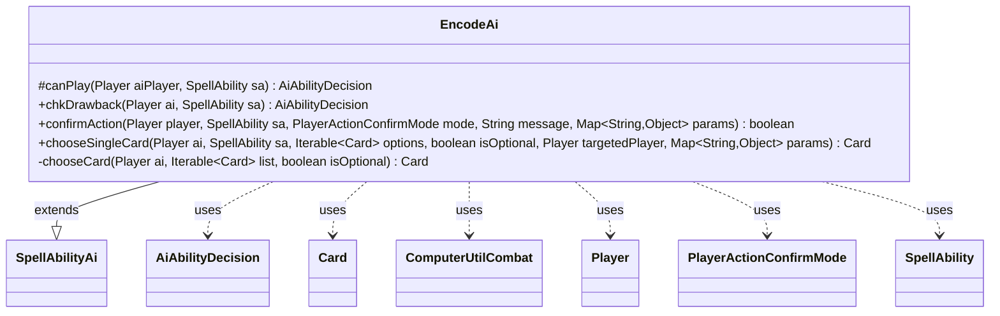

---
aliases:
  - EncodeAi
tags:
  - java/class
  - module/forge-ai
  - pkg/forge/ai/ability
fqn: forge.ai.ability.EncodeAi
package: forge.ai.ability
module: forge-ai
kind: Class
---

# EncodeAi

**Package:** `forge.ai.ability`   **Module:** `forge-ai`   **Kind:** Class



## Relationships
**Extends:**
- [[forge.ai.SpellAbilityAi|SpellAbilityAi]]
**Uses:**
- [[forge.ai.AiAbilityDecision|AiAbilityDecision]]
- [[forge.ai.ComputerUtilCombat|ComputerUtilCombat]]
- [[forge.game.card.Card|Card]]
- [[forge.game.player.Player|Player]]
- [[forge.game.player.PlayerActionConfirmMode|PlayerActionConfirmMode]]
- [[forge.game.spellability.SpellAbility|SpellAbility]]

## Design Description

EncodeAi is the forge-ai decision component for the "encode" mechanic, extending `SpellAbilityAi` to supply the computer player's behavior when casting and resolving an Encode spell. It overrides the base hooks—`canPlay`/`chkDrawback` (which unconditionally return a high-confidence WillPlay decision), `confirmAction`, and `chooseSingleCard`—delegating the substantive work to a private `chooseCard` helper.

That helper encodes the strategic intent: it prefers to host the encoded ciphertext on a creature that can attack next turn and is unblockable by any opponent, falling back to the best available attacker and, when the choice is mandatory, to the overall best creature. It collaborates with combat-evaluation utilities (`ComputerUtilCombat`, `CombatUtil`) and card-ranking helpers (`ComputerUtilCard`, `CardLists`) over `Card`/`Player` objects, returning its verdicts as `AiAbilityDecision` values—keeping all encode-specific AI heuristics isolated from the shared ability framework.

## Source
`forge-ai/src/main/java/forge/ai/ability/EncodeAi.java`

```java
/*
 * Forge: Play Magic: the Gathering.
 * Copyright (C) 2011  Forge Team
 *
 * This program is free software: you can redistribute it and/or modify
 * it under the terms of the GNU General Public License as published by
 * the Free Software Foundation, either version 3 of the License, or
 * (at your option) any later version.
 * 
 * This program is distributed in the hope that it will be useful,
 * but WITHOUT ANY WARRANTY; without even the implied warranty of
 * MERCHANTABILITY or FITNESS FOR A PARTICULAR PURPOSE.  See the
 * GNU General Public License for more details.
 * 
 * You should have received a copy of the GNU General Public License
 * along with this program.  If not, see <http://www.gnu.org/licenses/>.
 */
package forge.ai.ability;

import forge.ai.*;
import forge.game.card.Card;
import forge.game.card.CardLists;
import forge.game.combat.CombatUtil;
import forge.game.player.Player;
import forge.game.player.PlayerActionConfirmMode;
import forge.game.spellability.SpellAbility;

import java.util.List;
import java.util.Map;

/**
 * <p>
 * AbilityFactoryBond class.
 * </p>
 * 
 * @author Forge
 * @version $Id: AbilityFactoryBond.java 15090 2012-04-07 12:50:31Z Max mtg $
 */
public final class EncodeAi extends SpellAbilityAi {
    /**
     * <p>
     * bondCanPlayAI.
     * </p>
     * @param sa
     *            a {@link forge.game.spellability.SpellAbility} object.
     * 
     * @return a boolean.
     */
    @Override
    protected AiAbilityDecision canPlay(Player aiPlayer, SpellAbility sa) {
        return new AiAbilityDecision(100, AiPlayDecision.WillPlay);
    }

    @Override
    public AiAbilityDecision chkDrawback(Player ai, SpellAbility sa) {
        return new AiAbilityDecision(100, AiPlayDecision.WillPlay);
    }

    /*
     * (non-Javadoc)
     * 
     * @see forge.ai.SpellAbilityAi#confirmAction(forge.game.player.Player,
     * forge.game.spellability.SpellAbility,
     * forge.game.player.PlayerActionConfirmMode, java.lang.String)
     */
    @Override
    public boolean confirmAction(Player player, SpellAbility sa, PlayerActionConfirmMode mode, String message, Map<String, Object> params) {
        // only try to encode if there is a creature it can be used on
        return chooseCard(player, player.getCreaturesInPlay(), true) != null;
    }

    /*
     * (non-Javadoc)
     * 
     * @see forge.ai.SpellAbilityAi#chooseSingleCard(forge.game.player.Player,
     * forge.game.spellability.SpellAbility, java.lang.Iterable, boolean,
     * forge.game.player.Player)
     */
    @Override
    public Card chooseSingleCard(final Player ai, SpellAbility sa, Iterable<Card> options, boolean isOptional, Player targetedPlayer, Map<String, Object> params) {
        return chooseCard(ai, options, isOptional);
    }

    private Card chooseCard(final Player ai, Iterable<Card> list, boolean isOptional) {
        Card choice = null;
        // final String logic = sa.getParam("AILogic");
        // if (logic == null) {
        final List<Card> attackers = CardLists.filter(list, ComputerUtilCombat::canAttackNextTurn);
        final List<Card> unblockables = CardLists.filter(attackers, c -> {
            boolean canAttackOpponent = false;
            for (Player opp : ai.getOpponents()) {
                if (CombatUtil.canAttack(c, opp) && !CombatUtil.canBeBlocked(c, null, opp)) {
                    canAttackOpponent = true;
                    break;
                }
            }
            return canAttackOpponent;
        });
        if (!unblockables.isEmpty()) {
            choice = ComputerUtilCard.getBestAI(unblockables);
        } else if (!attackers.isEmpty()) {
            choice = ComputerUtilCard.getBestAI(attackers);
        } else if (!isOptional) {
            choice = ComputerUtilCard.getBestAI(list);
        }
        // }
        return choice;
    }
}
```

## Python
`forge/ai/ability/EncodeAi.py`

```python
from forge.ai.SpellAbilityAi import SpellAbilityAi
from forge.ai.AiAbilityDecision import AiAbilityDecision
from forge.ai.AiPlayDecision import AiPlayDecision
from forge.ai.ComputerUtilCombat import ComputerUtilCombat
from forge.ai.ComputerUtilCard import ComputerUtilCard
from forge.game.card.Card import Card
from forge.game.card.CardLists import CardLists
from forge.game.combat.CombatUtil import CombatUtil
from forge.game.player.Player import Player
from forge.game.player.PlayerActionConfirmMode import PlayerActionConfirmMode
from forge.game.spellability.SpellAbility import SpellAbility

from typing import Iterable, List, Map


class EncodeAi(SpellAbilityAi):
    def canPlay(self, aiPlayer: Player, sa: SpellAbility) -> AiAbilityDecision:
        return AiAbilityDecision(100, AiPlayDecision.WillPlay)

    def chkDrawback(self, ai: Player, sa: SpellAbility) -> AiAbilityDecision:
        return AiAbilityDecision(100, AiPlayDecision.WillPlay)

    def confirmAction(self, player: Player, sa: SpellAbility, mode: PlayerActionConfirmMode, message: str, params: dict) -> bool:
        # only try to encode if there is a creature it can be used on
        return self.chooseCard(player, player.getCreaturesInPlay(), True) is not None

    def chooseSingleCard(self, ai: Player, sa: SpellAbility, options: Iterable[Card], isOptional: bool, targetedPlayer: Player, params: dict) -> Card:
        return self.chooseCard(ai, options, isOptional)

    def chooseCard(self, ai: Player, list: Iterable[Card], isOptional: bool) -> Card:
        choice = None
        # final String logic = sa.getParam("AILogic");
        # if (logic == null) {
        attackers = CardLists.filter(list, ComputerUtilCombat.canAttackNextTurn)

        def _isUnblockable(c):
            canAttackOpponent = False
            for opp in ai.getOpponents():
                if CombatUtil.canAttack(c, opp) and not CombatUtil.canBeBlocked(c, None, opp):
                    canAttackOpponent = True
                    break
            return canAttackOpponent

        unblockables = CardLists.filter(attackers, _isUnblockable)
        if unblockables:
            choice = ComputerUtilCard.getBestAI(unblockables)
        elif attackers:
            choice = ComputerUtilCard.getBestAI(attackers)
        elif not isOptional:
            choice = ComputerUtilCard.getBestAI(list)
        # }
        return choice
```
