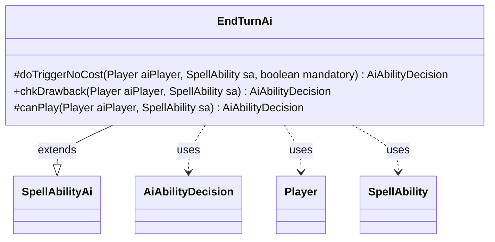

---
aliases:
  - EndTurnAi
tags:
  - java/class
  - module/forge-ai
  - pkg/forge/ai/ability
fqn: forge.ai.ability.EndTurnAi
package: forge.ai.ability
module: forge-ai
kind: Class
---

# EndTurnAi

**Package:** `forge.ai.ability` &nbsp; **Module:** `forge-ai` &nbsp; **Kind:** Class



## Relationships
**Extends:**
- [[forge.ai.SpellAbilityAi|SpellAbilityAi]]
**Uses:**
- [[forge.ai.AiAbilityDecision|AiAbilityDecision]]
- [[forge.game.player.Player|Player]]
- [[forge.game.spellability.SpellAbility|SpellAbility]]

## Design Description

EndTurnAi is the AI decision handler for the "End Turn" spell ability, implementing how Forge's computer-controlled players evaluate whether to play an ability that ends the current turn. Extending `SpellAbilityAi`, it overrides three decision hooks—`canPlay`, `chkDrawback`, and `doTriggerNoCost`—each returning an `AiAbilityDecision` that pairs a confidence score with an `AiPlayDecision` verdict. It collaborates with `Player` and `SpellAbility` to receive the acting AI and the ability under consideration.

The design intent is deliberately conservative: the AI never volunteers to end its own turn, so `canPlay` and `chkDrawback` always return `CantPlayAi` with zero weight. Only when the effect is mandatory (a forced trigger) does `doTriggerNoCost` commit with full confidence (`WillPlay`, score 100). This makes the handler a minimal, defensive stub that prevents the AI from harming itself while still honoring obligatory resolutions.

## Source
`forge-ai/src/main/java/forge/ai/ability/EndTurnAi.java`

```java
package forge.ai.ability;


import forge.ai.AiAbilityDecision;
import forge.ai.AiPlayDecision;
import forge.ai.SpellAbilityAi;
import forge.game.player.Player;
import forge.game.spellability.SpellAbility;

/** 
 * TODO: Write javadoc for this type.
 *
 */
public class EndTurnAi extends SpellAbilityAi  {

    @Override
    protected AiAbilityDecision doTriggerNoCost(Player aiPlayer, SpellAbility sa, boolean mandatory) {
        if (mandatory) {
            return new AiAbilityDecision(100, AiPlayDecision.WillPlay);
        } else {
            return new AiAbilityDecision(0, AiPlayDecision.CantPlayAi);
        }
    }

    @Override
    public AiAbilityDecision chkDrawback(Player aiPlayer, SpellAbility sa) { return new AiAbilityDecision(0, AiPlayDecision.CantPlayAi); }

    /* (non-Javadoc)
     * @see forge.card.abilityfactory.SpellAiLogic#canPlayAI(forge.game.player.Player, java.util.Map, forge.card.spellability.SpellAbility)
     */
    @Override
    protected AiAbilityDecision canPlay(Player aiPlayer, SpellAbility sa) {
        return new AiAbilityDecision(0, AiPlayDecision.CantPlayAi);
    }
}
```
