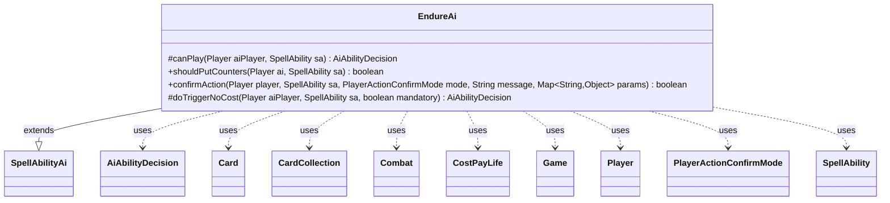

---
aliases:
  - EndureAi
tags:
  - java/class
  - module/forge-ai
  - pkg/forge/ai/ability
fqn: forge.ai.ability.EndureAi
package: forge.ai.ability
module: forge-ai
kind: Class
---

# EndureAi

**Package:** `forge.ai.ability` &nbsp; **Module:** `forge-ai` &nbsp; **Kind:** Class



## Relationships
**Extends:**
- [[forge.ai.SpellAbilityAi|SpellAbilityAi]]
**Uses:**
- [[forge.ai.AiAbilityDecision|AiAbilityDecision]]
- [[forge.game.Game|Game]]
- [[forge.game.card.Card|Card]]
- [[forge.game.card.CardCollection|CardCollection]]
- [[forge.game.combat.Combat|Combat]]
- [[forge.game.cost.CostPayLife|CostPayLife]]
- [[forge.game.player.Player|Player]]
- [[forge.game.player.PlayerActionConfirmMode|PlayerActionConfirmMode]]
- [[forge.game.spellability.SpellAbility|SpellAbility]]

## Design Description

EndureAi is the forge-ai decision module for the "Endure" keyword action, extending `SpellAbilityAi` to teach the computer player when and how to resolve abilities that either place +1/+1 counters on a creature or instead create a Spirit token. Its `canPlay` selects the best controlled creature when the ability is targeted and, for variable-X Endure with a life cost, restricts play to the second main phase and sizes X against available mana while respecting a danger life threshold. The core `shouldPutCounters` heuristic compares a counter-boosted LKI copy of the host against a simulated token—checking survivability, combat profitability, and creature evaluation—to choose the better outcome, and `confirmAction` defers to it. It collaborates with combat (`Combat`, `CombatUtil`), card evaluation utilities, and token simulation rather than mutating real game state during analysis.

That's ~150 words. Good.EndureAi is the forge-ai decision module for the "Endure" keyword action, extending `SpellAbilityAi` to teach the computer player when and how to resolve abilities that either place +1/+1 counters on a creature or instead create a Spirit token. Its `canPlay` selects the best controlled creature when the ability is targeted and, for variable-X Endure carrying a life cost, restricts casting to the second main phase while sizing X against available mana and a danger life threshold. The core `shouldPutCounters` heuristic compares a counter-boosted LKI copy of the host against a simulated token—weighing survivability, combat profitability, and creature evaluation—to pick the stronger outcome, with `confirmAction` delegating to it and `doTriggerNoCost` reusing the targeting and play logic for triggered contexts. Notably, it works on copies and pre-lists with static abilities recomputed, evaluating hypothetical board states without firing real game events.

## Source
`forge-ai/src/main/java/forge/ai/ability/EndureAi.java`

```java
package forge.ai.ability;

import com.google.common.collect.Sets;
import forge.ai.*;
import forge.game.Game;
import forge.game.ability.AbilityUtils;
import forge.game.card.*;
import forge.game.card.token.TokenInfo;
import forge.game.combat.Combat;
import forge.game.combat.CombatUtil;
import forge.game.cost.CostPayLife;
import forge.game.phase.PhaseType;
import forge.game.player.Player;
import forge.game.player.PlayerActionConfirmMode;
import forge.game.spellability.SpellAbility;
import forge.game.zone.ZoneType;

import java.util.Map;

public class EndureAi extends SpellAbilityAi {
    /* (non-Javadoc)
     * @see forge.card.abilityfactory.SpellAiLogic#canPlayAI(forge.game.player.Player, java.util.Map, forge.card.spellability.SpellAbility)
     */
    @Override
    protected AiAbilityDecision canPlay(Player aiPlayer, SpellAbility sa) {
        // Support for possible targeted Endure (e.g. target creature endures X)
        if (sa.usesTargeting()) {
            Card bestCreature = ComputerUtilCard.getBestCreatureAI(aiPlayer.getCardsIn(ZoneType.Battlefield));
            if (bestCreature == null) {
                return new AiAbilityDecision(0, AiPlayDecision.CantPlayAi);
            }

            sa.resetTargets();
            sa.getTargets().add(bestCreature);
        }

        // Card-specific logic
        final String num = sa.getParamOrDefault("Num", "1");
        if ("X".equals(num) && sa.getPayCosts().hasSpecificCostType(CostPayLife.class)) {
            if (!aiPlayer.getGame().getPhaseHandler().is(PhaseType.MAIN2)) {
                return new AiAbilityDecision(0, AiPlayDecision.AnotherTime);
            }
            int curLife = aiPlayer.getLife();
            int dangerLife = AiProfileUtil.getIntProperty(aiPlayer, AiProps.AI_IN_DANGER_THRESHOLD);
            if (curLife <= dangerLife) {
                return new AiAbilityDecision(0, AiPlayDecision.CantAffordX);
            }
            int availableMana = ComputerUtilMana.getAvailableManaEstimate(aiPlayer) - 1;
            int maxEndureX = Math.min(availableMana, curLife - dangerLife);
            if (maxEndureX > 0) {
                sa.setXManaCostPaid(maxEndureX);
            } else {
                return new AiAbilityDecision(0, AiPlayDecision.CantAffordX);
            }
        }

        return new AiAbilityDecision(100, AiPlayDecision.WillPlay);
    }

    public static boolean shouldPutCounters(Player ai, SpellAbility sa) {
        // TODO: adapted from Fabricate AI in TokenAi, maybe can be refactored to a single method
        final Card source = sa.getHostCard();
        final Game game = source.getGame();
        final String num = sa.getParamOrDefault("Num", "1");
        final int amount = AbilityUtils.calculateAmount(source, num, sa);

        // if host would leave the play or if host is useless, create the token
        if (source.hasSVar("EndOfTurnLeavePlay") || ComputerUtilCard.isUselessCreature(ai, source)) {
            return false;
        }

        // need a copy for one with extra +1/+1 counter boost,
        // without causing triggers to run
        final Card copy = CardCopyService.getLKICopy(source);
        copy.setCounters(CounterEnumType.P1P1, copy.getCounters(CounterEnumType.P1P1) + amount);
        copy.setZone(source.getZone());

        // if host would put into the battlefield attacking
        Combat combat = source.getGame().getCombat();
        if (combat != null && combat.isAttacking(source)) {
            final Player defender = combat.getDefenderPlayerByAttacker(source);
            return defender.canLoseLife() && !ComputerUtilCard.canBeBlockedProfitably(defender, copy, true);
        }

        // if the host has haste and can attack
        if (CombatUtil.canAttack(copy)) {
            for (final Player opp : ai.getOpponents()) {
                if (CombatUtil.canAttack(copy, opp) &&
                        opp.canLoseLife() &&
                        !ComputerUtilCard.canBeBlockedProfitably(opp, copy, true))
                    return true;
            }
        }

        // TODO check for trigger to turn token ETB into +1/+1 counter for host
        // TODO check for trigger to turn token ETB into damage or life loss for opponent
        // in these cases token might be preferred even if they would not survive

        // evaluate creature with counters
        int evalCounter = ComputerUtilCard.evaluateCreature(copy);

        // spawn the token so it's possible to evaluate it
        final Card token = TokenInfo.getProtoType("w_x_x_spirit", sa, ai, false);

        token.setController(ai, 0);
        token.setLastKnownZone(ai.getZone(ZoneType.Battlefield));
        token.setTokenSpawningAbility(sa);

        // evaluate the generated token
        token.setBasePowerString(num);
        token.setBasePower(amount);
        token.setBaseToughnessString(num);
        token.setBaseToughness(amount);

        boolean result = true;

        // need to check what the cards would be on the battlefield
        // do not attach yet, that would cause Events
        CardCollection preList = new CardCollection(token);
        game.getAction().checkStaticAbilities(false, Sets.newHashSet(token), preList);

        // token would not survive
        if (!token.isCreature() || token.getNetToughness() < 1) {
            result = false;
        }

        if (result) {
            int evalToken = ComputerUtilCard.evaluateCreature(token);
            result = evalToken < evalCounter;
        }

        //reset static abilities
        game.getAction().checkStaticAbilities(false);

        return result;
    }

    @Override
    public boolean confirmAction(Player player, SpellAbility sa, PlayerActionConfirmMode mode, String message, Map<String, Object> params) {
        return shouldPutCounters(player, sa);
    }

    @Override
    protected AiAbilityDecision doTriggerNoCost(Player aiPlayer, SpellAbility sa, boolean mandatory) {
        // Support for possible targeted Endure (e.g. target creature endures X)
        if (sa.usesTargeting()) {
            CardCollection list = CardLists.getValidCards(aiPlayer.getGame().getCardsIn(ZoneType.Battlefield),
                    sa.getTargetRestrictions().getValidTgts(), aiPlayer, sa.getHostCard(), sa);

            if (!list.isEmpty()) {
                sa.getTargets().add(ComputerUtilCard.getBestCreatureAI(list));
                return new AiAbilityDecision(100, AiPlayDecision.WillPlay);
            }

            return new AiAbilityDecision(0, AiPlayDecision.CantPlayAi);
        }

        if (mandatory) {
            return new AiAbilityDecision(100, AiPlayDecision.WillPlay);
        }

        return canPlay(aiPlayer, sa);
    }
}
```
