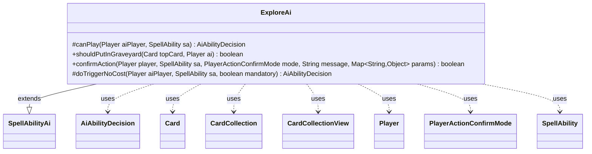

---
aliases:
  - ExploreAi
tags:
  - java/class
  - module/forge-ai
  - pkg/forge/ai/ability
fqn: forge.ai.ability.ExploreAi
package: forge.ai.ability
module: forge-ai
kind: Class
---

# ExploreAi

**Package:** `forge.ai.ability` &nbsp; **Module:** `forge-ai` &nbsp; **Kind:** Class



## Relationships
**Extends:**
- [[forge.ai.SpellAbilityAi|SpellAbilityAi]]
**Uses:**
- [[forge.ai.AiAbilityDecision|AiAbilityDecision]]
- [[forge.game.card.Card|Card]]
- [[forge.game.card.CardCollection|CardCollection]]
- [[forge.game.card.CardCollectionView|CardCollectionView]]
- [[forge.game.player.Player|Player]]
- [[forge.game.player.PlayerActionConfirmMode|PlayerActionConfirmMode]]
- [[forge.game.spellability.SpellAbility|SpellAbility]]

## Design Description

ExploreAi supplies the AI's decision logic for the Magic mechanic "explore," extending the engine's `SpellAbilityAi` base class so the engine can delegate when, how, and whether the computer plays an explore-granting ability. Through the overridden `canPlay` and `doTriggerNoCost` it evaluates the battlefield via `ComputerUtilCard` to pick the best creature target (or declines when none exists), returning weighted `AiAbilityDecision` verdicts that signal intent and confidence.

Its core domain rule lives in the static `shouldPutInGraveyard` helper, which weighs mana sources, lands in hand and play, and the revealed card's CMC against tunable `AiProps` profile thresholds to decide whether to bin a revealed non-land or keep it on top of the library; `confirmAction` simply routes the engine's reveal prompt to that heuristic. The class is stateless and collaborates loosely with `Card`, `CardCollection`, and `Player` purely through method parameters.

## Source
`forge-ai/src/main/java/forge/ai/ability/ExploreAi.java`

```java
package forge.ai.ability;


import forge.ai.*;
import forge.game.card.*;
import forge.game.player.Player;
import forge.game.player.PlayerActionConfirmMode;
import forge.game.spellability.SpellAbility;
import forge.game.zone.ZoneType;

import java.util.Map;

public class ExploreAi extends SpellAbilityAi {
    /* (non-Javadoc)
     * @see forge.card.abilityfactory.SpellAiLogic#canPlayAI(forge.game.player.Player, java.util.Map, forge.card.spellability.SpellAbility)
     */
    @Override
    protected AiAbilityDecision canPlay(Player aiPlayer, SpellAbility sa) {
        // Explore with a target (e.g. Enter the Unknown)
        if (sa.usesTargeting()) {
            Card bestCreature = ComputerUtilCard.getBestCreatureAI(aiPlayer.getCardsIn(ZoneType.Battlefield));
            if (bestCreature == null) {
                return new AiAbilityDecision(0, AiPlayDecision.CantPlayAi);
            }

            sa.resetTargets();
            sa.getTargets().add(bestCreature);
        }

        return new AiAbilityDecision(100, AiPlayDecision.WillPlay);
    }

    public static boolean shouldPutInGraveyard(Card topCard, Player ai) {
        int predictedMana = ComputerUtilMana.getAvailableManaSources(ai, false).size();
        CardCollectionView cardsOTB = ai.getCardsIn(ZoneType.Battlefield);
        CardCollectionView cardsInHand = ai.getCardsIn(ZoneType.Hand);
        CardCollection landsOTB = CardLists.filter(cardsOTB, CardPredicates.LANDS_PRODUCING_MANA);
        CardCollection landsInHand = CardLists.filter(cardsInHand, CardPredicates.LANDS_PRODUCING_MANA);

        int maxCMCDiff = AiProfileUtil.getIntProperty(ai, AiProps.EXPLORE_MAX_CMC_DIFF_TO_PUT_IN_GRAVEYARD);
        int numLandsToStillNeedMore = AiProfileUtil.getIntProperty(ai, AiProps.EXPLORE_NUM_LANDS_TO_STILL_NEED_MORE);

        if (landsInHand.isEmpty() && landsOTB.size() <= numLandsToStillNeedMore) {
            // We need more lands to improve our mana base, explore away the non-lands
            return true;
        } else if (topCard.getCMC() - maxCMCDiff >= predictedMana && !topCard.hasSVar("DoNotDiscardIfAble")) {
            // We're not casting this in foreseeable future, put it in the graveyard
            return true;
        }

        // Put on top of the library (do not mark the card for placement in the graveyard)
        return false;
    }

    @Override
    public boolean confirmAction(Player player, SpellAbility sa, PlayerActionConfirmMode mode, String message, Map<String, Object> params) {
        return shouldPutInGraveyard((Card)params.get("RevealedCard"), player);
    }

    @Override
    protected AiAbilityDecision doTriggerNoCost(Player aiPlayer, SpellAbility sa, boolean mandatory) {
        if (sa.usesTargeting()) {
            CardCollection list = CardLists.getValidCards(aiPlayer.getGame().getCardsIn(ZoneType.Battlefield),
                    sa.getTargetRestrictions().getValidTgts(), aiPlayer, sa.getHostCard(), sa);

            if (!list.isEmpty()) {
                sa.getTargets().add(ComputerUtilCard.getBestCreatureAI(list));
                return new AiAbilityDecision(100, AiPlayDecision.WillPlay);
            }

            return new AiAbilityDecision(0, AiPlayDecision.TargetingFailed);
        }

        if (mandatory) {
            return new AiAbilityDecision(100, AiPlayDecision.WillPlay);
        }

        return canPlay(aiPlayer, sa);
    }
}
```

## Python
`forge/ai/ability/ExploreAi.py`

```python
from forge.ai.SpellAbilityAi import SpellAbilityAi
from forge.ai.AiAbilityDecision import AiAbilityDecision
from forge.ai.AiPlayDecision import AiPlayDecision
from forge.ai.ComputerUtilCard import ComputerUtilCard
from forge.ai.ComputerUtilMana import ComputerUtilMana
from forge.ai.AiProps import AiProps
from forge.ai.AiProfileUtil import AiProfileUtil
from forge.game.card.Card import Card
from forge.game.card.CardCollection import CardCollection
from forge.game.card.CardCollectionView import CardCollectionView
from forge.game.card.CardLists import CardLists
from forge.game.card.CardPredicates import CardPredicates
from forge.game.player.Player import Player
from forge.game.player.PlayerActionConfirmMode import PlayerActionConfirmMode
from forge.game.spellability.SpellAbility import SpellAbility
from forge.game.zone.ZoneType import ZoneType

from typing import Map


class ExploreAi(SpellAbilityAi):
    # (non-Javadoc)
    # @see forge.card.abilityfactory.SpellAiLogic#canPlayAI(forge.game.player.Player, java.util.Map, forge.card.spellability.SpellAbility)
    def canPlay(self, aiPlayer: Player, sa: SpellAbility) -> AiAbilityDecision:
        # Explore with a target (e.g. Enter the Unknown)
        if sa.usesTargeting():
            bestCreature = ComputerUtilCard.getBestCreatureAI(aiPlayer.getCardsIn(ZoneType.Battlefield))
            if bestCreature is None:
                return AiAbilityDecision(0, AiPlayDecision.CantPlayAi)

            sa.resetTargets()
            sa.getTargets().add(bestCreature)

        return AiAbilityDecision(100, AiPlayDecision.WillPlay)

    @staticmethod
    def shouldPutInGraveyard(topCard: Card, ai: Player) -> bool:
        predictedMana = ComputerUtilMana.getAvailableManaSources(ai, False).size()
        cardsOTB = ai.getCardsIn(ZoneType.Battlefield)
        cardsInHand = ai.getCardsIn(ZoneType.Hand)
        landsOTB = CardLists.filter(cardsOTB, CardPredicates.LANDS_PRODUCING_MANA)
        landsInHand = CardLists.filter(cardsInHand, CardPredicates.LANDS_PRODUCING_MANA)

        maxCMCDiff = AiProfileUtil.getIntProperty(ai, AiProps.EXPLORE_MAX_CMC_DIFF_TO_PUT_IN_GRAVEYARD)
        numLandsToStillNeedMore = AiProfileUtil.getIntProperty(ai, AiProps.EXPLORE_NUM_LANDS_TO_STILL_NEED_MORE)

        if landsInHand.isEmpty() and landsOTB.size() <= numLandsToStillNeedMore:
            # We need more lands to improve our mana base, explore away the non-lands
            return True
        elif topCard.getCMC() - maxCMCDiff >= predictedMana and not topCard.hasSVar("DoNotDiscardIfAble"):
            # We're not casting this in foreseeable future, put it in the graveyard
            return True

        # Put on top of the library (do not mark the card for placement in the graveyard)
        return False

    def confirmAction(self, player: Player, sa: SpellAbility, mode: PlayerActionConfirmMode, message: str, params: Map[str, object]) -> bool:
        return ExploreAi.shouldPutInGraveyard(params.get("RevealedCard"), player)

    def doTriggerNoCost(self, aiPlayer: Player, sa: SpellAbility, mandatory: bool) -> AiAbilityDecision:
        if sa.usesTargeting():
            list = CardLists.getValidCards(aiPlayer.getGame().getCardsIn(ZoneType.Battlefield),
                    sa.getTargetRestrictions().getValidTgts(), aiPlayer, sa.getHostCard(), sa)

            if not list.isEmpty():
                sa.getTargets().add(ComputerUtilCard.getBestCreatureAI(list))
                return AiAbilityDecision(100, AiPlayDecision.WillPlay)

            return AiAbilityDecision(0, AiPlayDecision.TargetingFailed)

        if mandatory:
            return AiAbilityDecision(100, AiPlayDecision.WillPlay)

        return self.canPlay(aiPlayer, sa)
```
