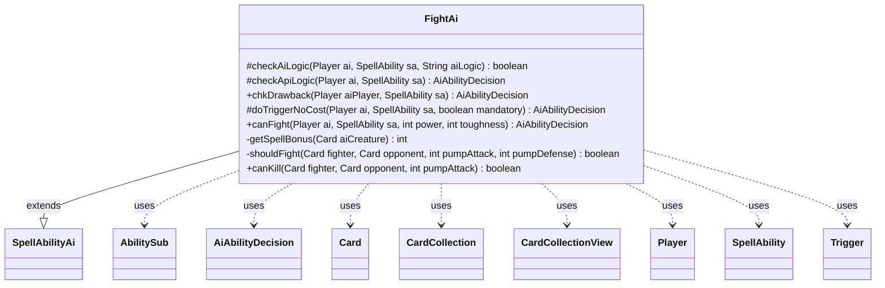

---
aliases:
  - FightAi
tags:
  - java/class
  - module/forge-ai
  - pkg/forge/ai/ability
fqn: forge.ai.ability.FightAi
package: forge.ai.ability
module: forge-ai
kind: Class
---

# FightAi

**Package:** `forge.ai.ability` &nbsp; **Module:** `forge-ai` &nbsp; **Kind:** Class



## Relationships
**Extends:**
- [[forge.ai.SpellAbilityAi|SpellAbilityAi]]
**Uses:**
- [[forge.ai.AiAbilityDecision|AiAbilityDecision]]
- [[forge.game.card.Card|Card]]
- [[forge.game.card.CardCollection|CardCollection]]
- [[forge.game.card.CardCollectionView|CardCollectionView]]
- [[forge.game.player.Player|Player]]
- [[forge.game.spellability.AbilitySub|AbilitySub]]
- [[forge.game.spellability.SpellAbility|SpellAbility]]
- [[forge.game.trigger.Trigger|Trigger]]

## Design Description

FightAi is the forge-ai action handler that supplies the artificial-intelligence decision logic for "fight" effects, where two creatures deal damage to each other. Extending `SpellAbilityAi`, it overrides the standard hooks (`checkApiLogic`, `chkDrawback`, `doTriggerNoCost`) to choose whether and how to play a fight ability and to select the creature targets, returning an `AiAbilityDecision` that pairs a confidence score with a play verdict. It collaborates with `Card`, `CardCollection`/`CardCollectionView`, `Player`, `SpellAbility`, and `AbilitySub` to enumerate and filter legal targets, and inspects `Trigger`s to fold in heroic/prowess bonuses.

The design centers on favorable-trade evaluation: helper methods `canKill`, `shouldFight`, and `getSpellBonus` predict combat outcomes so the AI seeks matchups that destroy an opponent's creature while keeping its own alive, accepting trades only probabilistically by mana value. Numerous card-specific branches (Time to Feed, Savage Punch, Chandra's Ignition, Band Together, Grothama) and parameter-driven modes show special-case handling layered over the general heuristic, with a mandatory-play fallback that still tries to secure the best possible trade.

## Source
`forge-ai/src/main/java/forge/ai/ability/FightAi.java`

```java
package forge.ai.ability;

import forge.ai.*;
import forge.game.ability.AbilityUtils;
import forge.game.ability.ApiType;
import forge.game.card.Card;
import forge.game.card.CardCollection;
import forge.game.card.CardCollectionView;
import forge.game.card.CardLists;
import forge.game.player.Player;
import forge.game.spellability.AbilitySub;
import forge.game.spellability.SpellAbility;
import forge.game.staticability.StaticAbilityMustTarget;
import forge.game.trigger.Trigger;
import forge.game.trigger.TriggerType;
import forge.util.MyRandom;

import java.util.List;

public class FightAi extends SpellAbilityAi {
    @Override
    protected boolean checkAiLogic(final Player ai, final SpellAbility sa, final String aiLogic) {
        return super.checkAiLogic(ai, sa, aiLogic);
    }

    @Override
    protected AiAbilityDecision checkApiLogic(final Player ai, final SpellAbility sa) {
        sa.resetTargets();
        final Card source = sa.getHostCard();

        // everything is defined or targeted above, can't do anything there unless a specific logic is set
        if (sa.hasParam("Defined") && !sa.usesTargeting()) {
            return new AiAbilityDecision(100, AiPlayDecision.WillPlay);
        }

        // Get creature lists
        CardCollectionView aiCreatures = ai.getCreaturesInPlay();
        aiCreatures = CardLists.getTargetableCards(aiCreatures, sa);
        aiCreatures = ComputerUtil.getSafeTargets(ai, sa, aiCreatures);
        List<Card> humCreatures = ai.getOpponents().getCreaturesInPlay();
        humCreatures = CardLists.getTargetableCards(humCreatures, sa);
        // Filter MustTarget requirements
        StaticAbilityMustTarget.filterMustTargetCards(ai, humCreatures, sa);

        //prevent IndexOutOfBoundsException on MOJHOSTO variant
        if (humCreatures.isEmpty()) {
            return new AiAbilityDecision(0, AiPlayDecision.MissingNeededCards);
        }

        // assumes the triggered card belongs to the ai
        if (sa.hasParam("Defined")) {
            CardCollection fighter1List = AbilityUtils.getDefinedCards(source, sa.getParam("Defined"), sa);
            if ("ChosenAsTgt".equals(sa.getParam("AILogic")) && sa.getRootAbility().getTargetCard() != null) {
                if (fighter1List.isEmpty()) {
                    fighter1List.add(sa.getRootAbility().getTargetCard());
                }
            }
            if (fighter1List.isEmpty()) {
                return new AiAbilityDecision(0, AiPlayDecision.MissingNeededCards);
            }
            Card fighter1 = fighter1List.get(0);
            for (Card humanCreature : humCreatures) {
                if (canKill(fighter1, humanCreature, 0)
                        && !canKill(humanCreature, fighter1, 0)) {
                    // todo: check min/max targets; see if we picked the best matchup
                    sa.getTargets().add(humanCreature);
                    return new AiAbilityDecision(100, AiPlayDecision.WillPlay);
                }
            }
            // bail at this point, otherwise the AI will overtarget and waste the activation
            return new AiAbilityDecision(0, AiPlayDecision.TargetingFailed);
        }

        if (sa.hasParam("TargetsFromDifferentZone")) {
            if (!(humCreatures.isEmpty() && aiCreatures.isEmpty())) {
                for (Card humanCreature : humCreatures) {
                    for (Card aiCreature : aiCreatures) {
                        if (canKill(aiCreature, humanCreature, 0)
                                && !canKill(humanCreature, aiCreature, 0)) {
                            // todo: check min/max targets; see if we picked the best matchup
                            sa.getTargets().add(humanCreature);
                            sa.getTargets().add(aiCreature);
                            return new AiAbilityDecision(100, AiPlayDecision.WillPlay);
                        }
                    }
                }
            }
            return new AiAbilityDecision(0, AiPlayDecision.TargetingFailed);
        }
        for (Card creature1 : humCreatures) {
            for (Card creature2 : humCreatures) {
                if (creature1.equals(creature2)) {
                    continue;
                }
                if (sa.hasParam("TargetsWithoutSameCreatureType") && creature1.sharesCreatureTypeWith(creature2)) {
                    continue;
                }
                if (canKill(creature1, creature2, 0)
                        && canKill(creature2, creature1, 0)) {
                    // todo: check min/max targets; see if we picked the best matchup
                    sa.getTargets().add(creature1);
                    sa.getTargets().add(creature2);
                    return new AiAbilityDecision(100, AiPlayDecision.WillPlay);
                }
            }
        }
        return new AiAbilityDecision(0, AiPlayDecision.TargetingFailed);
    }

    @Override
    public AiAbilityDecision chkDrawback(final Player aiPlayer, final SpellAbility sa) {
        if ("Always".equals(sa.getParam("AILogic"))) {
            return new AiAbilityDecision(100, AiPlayDecision.WillPlay); // e.g. Hunt the Weak, the AI logic was already checked through canFightAi
        }

        return checkApiLogic(aiPlayer, sa);
    }

    @Override
    protected AiAbilityDecision doTriggerNoCost(Player ai, SpellAbility sa, boolean mandatory) {
        final String aiLogic = sa.getParamOrDefault("AILogic", "");
        if (aiLogic.equals("Grothama")) {
            if (mandatory) {
                return new AiAbilityDecision(100, AiPlayDecision.WillPlay);
            }

            if (SpecialCardAi.GrothamaAllDevouring.consider(ai, sa)) {
                return new AiAbilityDecision(100, AiPlayDecision.WillPlay);
            }
            return new AiAbilityDecision(0, AiPlayDecision.CantPlayAi);
        }

        AiAbilityDecision decision = checkApiLogic(ai, sa);
        if (decision.willingToPlay()) {
            return decision;
        }
        if (!mandatory) {
            return decision;
        }
        // if mandatory, we have to play it, so we will try to make a good trade or no trade

        //try to make a good trade or no trade
        final Card source = sa.getHostCard();
        List<Card> humCreatures = ai.getOpponents().getCreaturesInPlay();
        humCreatures = CardLists.getTargetableCards(humCreatures, sa);
        if (humCreatures.isEmpty()) {
            return new AiAbilityDecision(0, AiPlayDecision.CantPlayAi);
        }
        //assumes the triggered card belongs to the ai
        if (sa.hasParam("Defined")) {
            CardCollection definedCards = AbilityUtils.getDefinedCards(source, sa.getParam("Defined"), sa);
            if (definedCards.isEmpty()) {
                return new AiAbilityDecision(0, AiPlayDecision.CantPlayAi);
            }
            Card aiCreature = definedCards.get(0);
            for (Card humanCreature : humCreatures) {
                if (canKill(aiCreature, humanCreature, 0)
                        && ComputerUtilCard.evaluateCreature(humanCreature) > ComputerUtilCard.evaluateCreature(aiCreature)) {
                    sa.getTargets().add(humanCreature);
                    return new AiAbilityDecision(100, AiPlayDecision.MandatoryPlay);
                }
            }
            for (Card humanCreature : humCreatures) {
                if (!canKill(humanCreature, aiCreature, 0)) {
                    sa.getTargets().add(humanCreature);
                    return new AiAbilityDecision(50, AiPlayDecision.MandatoryPlay);
                }
            }
            sa.getTargets().add(humCreatures.get(0));
            return new AiAbilityDecision(50, AiPlayDecision.MandatoryPlay);
        }
        return new AiAbilityDecision(50, AiPlayDecision.MandatoryPlay);
    }
    
    /**
     * Logic for evaluating fight effects
     * @param ai controlling player
     * @param sa host SpellAbility
     * @param toughness bonus to toughness
     * @param power	bonus to power
     * @return true if fight effect should be played, false otherwise
     */
    public static AiAbilityDecision canFight(final Player ai, final SpellAbility sa, int power, int toughness) {
    	final Card source = sa.getHostCard();
        final String sourceName = ComputerUtilAbility.getAbilitySourceName(sa);
        AbilitySub tgtFight = sa.getSubAbility();
        while (tgtFight != null && tgtFight.getApi() != ApiType.Fight && tgtFight.getApi() != ApiType.DealDamage && tgtFight.getApi() != ApiType.EachDamage) {
            // Search for the Fight/DealDamage subability (matters e.g. for Ent's Fury where the Fight SA is not an immediate child of Pump)
            tgtFight = tgtFight.getSubAbility();
        }
        if (tgtFight == null) {
            System.out.println("Warning: couldn't find a Fight/DealDamage subability from FightAi.canFightAi for card " + source.toString());
            tgtFight = sa.getSubAbility(); // at least avoid a NPE, although this will most likely fail
        }
        final boolean isChandrasIgnition = "Chandra's Ignition".equals(sourceName); // TODO: generalize this for other "fake Fight" cases that do not target
        if ("Savage Punch".equals(sourceName) && !ai.hasFerocious()) {
            power = 0;
            toughness = 0;
        }
        // Get sorted creature lists
        CardCollection aiCreatures = ai.getCreaturesInPlay();
        CardCollection humCreatures = ai.getOpponents().getCreaturesInPlay();
        if ("Time to Feed".equals(sourceName)) { // flip sa
            aiCreatures = CardLists.getTargetableCards(aiCreatures, tgtFight);
            aiCreatures = ComputerUtil.getSafeTargets(ai, tgtFight, aiCreatures);
            humCreatures = CardLists.getTargetableCards(humCreatures, sa);
        } else {
            aiCreatures = CardLists.getTargetableCards(aiCreatures, sa);
            aiCreatures = ComputerUtil.getSafeTargets(ai, sa, aiCreatures);
            humCreatures = CardLists.getTargetableCards(humCreatures, tgtFight);
        }
        ComputerUtilCard.sortByEvaluateCreature(aiCreatures);
        ComputerUtilCard.sortByEvaluateCreature(humCreatures);
        if (humCreatures.isEmpty() || aiCreatures.isEmpty()) {
            return new AiAbilityDecision(0, AiPlayDecision.MissingNeededCards);
        }
        // Evaluate creature pairs
        for (Card humanCreature : humCreatures) {
            for (Card aiCreature : aiCreatures) {
                if (source.isSpell()) { // heroic triggers adding counters and prowess
                    final int bonus = getSpellBonus(aiCreature);
                    power += bonus;
                    toughness += bonus;
                }
                if ("PowerDmg".equals(sa.getParam("AILogic"))) {
                    if ("2".equals(sa.getParam("TargetMax"))) {
                        // Band Together, uses up to two targets to deal damage to a single target
                        // TODO: Generalize this so that other TargetMax values can be properly accounted for
                        CardCollection aiCreaturesByPower = new CardCollection(aiCreatures);
                        CardLists.sortByPowerDesc(aiCreaturesByPower);
                        Card maxPower = aiCreaturesByPower.getFirst();
                        if (maxPower != aiCreature) {
                            power += maxPower.getNetPower(); // potential bonus from adding a second target
                        }
                        else if ("2".equals(sa.getParam("TargetMin"))) {
                            continue;
                        }
                        if (canKill(aiCreature, humanCreature, power)) {
                            sa.getTargets().add(aiCreature);
                            sa.getTargets().add(maxPower);
                            if (!isChandrasIgnition) {
                                tgtFight.resetTargets();
                                tgtFight.getTargets().add(humanCreature);
                            }
                            return new AiAbilityDecision(100, AiPlayDecision.WillPlay);
                        }
                    } else {
                        // Other cards that use AILogic PowerDmg and a single target
                        if (canKill(aiCreature, humanCreature, power)) {
                            sa.getTargets().add(aiCreature);
                            if (!isChandrasIgnition) {
                                tgtFight.resetTargets();
                                tgtFight.getTargets().add(humanCreature);
                            }
                            return new AiAbilityDecision(100, AiPlayDecision.WillPlay);
                        }
                    }
                } else {
                    if (shouldFight(aiCreature, humanCreature, power, toughness)) {
                    	if ("Time to Feed".equals(sourceName)) { // flip targets
                    		final Card tmp = aiCreature;
                    		aiCreature = humanCreature;
                    		humanCreature = tmp;
                    	}
                        sa.getTargets().add(aiCreature);
                        tgtFight.resetTargets();
                        tgtFight.getTargets().add(humanCreature);
                        return new AiAbilityDecision(100, AiPlayDecision.WillPlay);
                    }
                }
            }
        }
        return new AiAbilityDecision(0, AiPlayDecision.TargetingFailed);
    }

    /**
     * Compute the bonus from Heroic +1/+1 counters or Prowess
     */
    private static int getSpellBonus(final Card aiCreature) {
        for (Trigger t : aiCreature.getTriggers()) {
            if (t.getMode() == TriggerType.SpellCast) {
                SpellAbility sa = t.ensureAbility();
                if (sa == null) {
                    continue;
                }
                if (ApiType.PutCounter.equals(sa.getApi())) {
                    if ("Card.Self".equals(t.getParam("TargetsValid")) && "You".equals(t.getParam("ValidActivatingPlayer"))) {
                        if ("Self".equals(sa.getParam("Defined")) && "P1P1".equals(sa.getParam("CounterType"))) {
                            return AbilityUtils.calculateAmount(aiCreature, sa.getParam("CounterNum"), sa);
                        }
                        break;
                    }
                } else if (ApiType.Pump.equals(sa.getApi())) {
                    // TODO add prowess boost
                }
            }
        }
        return 0;
    }

    private static boolean shouldFight(Card fighter, Card opponent, int pumpAttack, int pumpDefense) {
    	if (canKill(fighter, opponent, pumpAttack)) {
    		if (!canKill(opponent, fighter, -pumpDefense)) { // can survive
    		    return true;
    		}
    		if (MyRandom.getRandom().nextInt(20) < (opponent.getCMC() - fighter.getCMC())) { // trade
    		    return true;
    		}
    	}
    	return false;
    }

    public static boolean canKill(Card fighter, Card opponent, int pumpAttack) {
        if (opponent.getSVar("Targeting").equals("Dies")) {
            return true;
        }
        // the damage prediction is later
        int damage = fighter.getNetPower() + pumpAttack;
        if (damage <= 0 || opponent.getShieldCount() > 0 || ComputerUtil.canRegenerate(opponent.getController(), opponent)) {
            return false;
        }
        // try to predict the damage that fighter would deal to opponent
        // this should also handle if the opponents creature can be destroyed or not
        if (ComputerUtilCombat.getEnoughDamageToKill(opponent, damage, fighter, false) <= damage) {
            return true;
        }
        return false;
    }
}
```

## Python
`forge/ai/ability/FightAi.py`

```python
from forge.ai.SpellAbilityAi import SpellAbilityAi
from forge.ai.AiAbilityDecision import AiAbilityDecision
from forge.ai.AiPlayDecision import AiPlayDecision
from forge.ai.ComputerUtil import ComputerUtil
from forge.ai.ComputerUtilAbility import ComputerUtilAbility
from forge.ai.ComputerUtilCard import ComputerUtilCard
from forge.ai.ComputerUtilCombat import ComputerUtilCombat
from forge.ai.SpecialCardAi import SpecialCardAi
from forge.game.ability.AbilityUtils import AbilityUtils
from forge.game.ability.ApiType import ApiType
from forge.game.card.Card import Card
from forge.game.card.CardCollection import CardCollection
from forge.game.card.CardCollectionView import CardCollectionView
from forge.game.card.CardLists import CardLists
from forge.game.player.Player import Player
from forge.game.spellability.AbilitySub import AbilitySub
from forge.game.spellability.SpellAbility import SpellAbility
from forge.game.staticability.StaticAbilityMustTarget import StaticAbilityMustTarget
from forge.game.trigger.Trigger import Trigger
from forge.game.trigger.TriggerType import TriggerType
from forge.util.MyRandom import MyRandom


class FightAi(SpellAbilityAi):
    def checkAiLogic(self, ai: Player, sa: SpellAbility, aiLogic: str) -> bool:
        return super().checkAiLogic(ai, sa, aiLogic)

    def checkApiLogic(self, ai: Player, sa: SpellAbility) -> AiAbilityDecision:
        sa.resetTargets()
        source = sa.getHostCard()

        # everything is defined or targeted above, can't do anything there unless a specific logic is set
        if sa.hasParam("Defined") and not sa.usesTargeting():
            return AiAbilityDecision(100, AiPlayDecision.WillPlay)

        # Get creature lists
        aiCreatures = ai.getCreaturesInPlay()
        aiCreatures = CardLists.getTargetableCards(aiCreatures, sa)
        aiCreatures = ComputerUtil.getSafeTargets(ai, sa, aiCreatures)
        humCreatures = ai.getOpponents().getCreaturesInPlay()
        humCreatures = CardLists.getTargetableCards(humCreatures, sa)
        # Filter MustTarget requirements
        StaticAbilityMustTarget.filterMustTargetCards(ai, humCreatures, sa)

        # prevent IndexOutOfBoundsException on MOJHOSTO variant
        if not humCreatures:
            return AiAbilityDecision(0, AiPlayDecision.MissingNeededCards)

        # assumes the triggered card belongs to the ai
        if sa.hasParam("Defined"):
            fighter1List = AbilityUtils.getDefinedCards(source, sa.getParam("Defined"), sa)
            if "ChosenAsTgt" == sa.getParam("AILogic") and sa.getRootAbility().getTargetCard() is not None:
                if fighter1List.isEmpty():
                    fighter1List.add(sa.getRootAbility().getTargetCard())
            if fighter1List.isEmpty():
                return AiAbilityDecision(0, AiPlayDecision.MissingNeededCards)
            fighter1 = fighter1List.get(0)
            for humanCreature in humCreatures:
                if self.canKill(fighter1, humanCreature, 0) \
                        and not self.canKill(humanCreature, fighter1, 0):
                    # todo: check min/max targets; see if we picked the best matchup
                    sa.getTargets().add(humanCreature)
                    return AiAbilityDecision(100, AiPlayDecision.WillPlay)
            # bail at this point, otherwise the AI will overtarget and waste the activation
            return AiAbilityDecision(0, AiPlayDecision.TargetingFailed)

        if sa.hasParam("TargetsFromDifferentZone"):
            if not (not humCreatures and not aiCreatures):
                for humanCreature in humCreatures:
                    for aiCreature in aiCreatures:
                        if self.canKill(aiCreature, humanCreature, 0) \
                                and not self.canKill(humanCreature, aiCreature, 0):
                            # todo: check min/max targets; see if we picked the best matchup
                            sa.getTargets().add(humanCreature)
                            sa.getTargets().add(aiCreature)
                            return AiAbilityDecision(100, AiPlayDecision.WillPlay)
            return AiAbilityDecision(0, AiPlayDecision.TargetingFailed)
        for creature1 in humCreatures:
            for creature2 in humCreatures:
                if creature1.equals(creature2):
                    continue
                if sa.hasParam("TargetsWithoutSameCreatureType") and creature1.sharesCreatureTypeWith(creature2):
                    continue
                if self.canKill(creature1, creature2, 0) \
                        and self.canKill(creature2, creature1, 0):
                    # todo: check min/max targets; see if we picked the best matchup
                    sa.getTargets().add(creature1)
                    sa.getTargets().add(creature2)
                    return AiAbilityDecision(100, AiPlayDecision.WillPlay)
        return AiAbilityDecision(0, AiPlayDecision.TargetingFailed)

    def chkDrawback(self, aiPlayer: Player, sa: SpellAbility) -> AiAbilityDecision:
        if "Always" == sa.getParam("AILogic"):
            return AiAbilityDecision(100, AiPlayDecision.WillPlay)  # e.g. Hunt the Weak, the AI logic was already checked through canFightAi

        return self.checkApiLogic(aiPlayer, sa)

    def doTriggerNoCost(self, ai: Player, sa: SpellAbility, mandatory: bool) -> AiAbilityDecision:
        aiLogic = sa.getParamOrDefault("AILogic", "")
        if aiLogic == "Grothama":
            if mandatory:
                return AiAbilityDecision(100, AiPlayDecision.WillPlay)

            if SpecialCardAi.GrothamaAllDevouring.consider(ai, sa):
                return AiAbilityDecision(100, AiPlayDecision.WillPlay)
            return AiAbilityDecision(0, AiPlayDecision.CantPlayAi)

        decision = self.checkApiLogic(ai, sa)
        if decision.willingToPlay():
            return decision
        if not mandatory:
            return decision
        # if mandatory, we have to play it, so we will try to make a good trade or no trade

        # try to make a good trade or no trade
        source = sa.getHostCard()
        humCreatures = ai.getOpponents().getCreaturesInPlay()
        humCreatures = CardLists.getTargetableCards(humCreatures, sa)
        if not humCreatures:
            return AiAbilityDecision(0, AiPlayDecision.CantPlayAi)
        # assumes the triggered card belongs to the ai
        if sa.hasParam("Defined"):
            definedCards = AbilityUtils.getDefinedCards(source, sa.getParam("Defined"), sa)
            if definedCards.isEmpty():
                return AiAbilityDecision(0, AiPlayDecision.CantPlayAi)
            aiCreature = definedCards.get(0)
            for humanCreature in humCreatures:
                if self.canKill(aiCreature, humanCreature, 0) \
                        and ComputerUtilCard.evaluateCreature(humanCreature) > ComputerUtilCard.evaluateCreature(aiCreature):
                    sa.getTargets().add(humanCreature)
                    return AiAbilityDecision(100, AiPlayDecision.MandatoryPlay)
            for humanCreature in humCreatures:
                if not self.canKill(humanCreature, aiCreature, 0):
                    sa.getTargets().add(humanCreature)
                    return AiAbilityDecision(50, AiPlayDecision.MandatoryPlay)
            sa.getTargets().add(humCreatures.get(0))
            return AiAbilityDecision(50, AiPlayDecision.MandatoryPlay)
        return AiAbilityDecision(50, AiPlayDecision.MandatoryPlay)

    @staticmethod
    def canFight(ai: Player, sa: SpellAbility, power: int, toughness: int) -> AiAbilityDecision:
        """
        Logic for evaluating fight effects
        @param ai controlling player
        @param sa host SpellAbility
        @param toughness bonus to toughness
        @param power	bonus to power
        @return true if fight effect should be played, false otherwise
        """
        source = sa.getHostCard()
        sourceName = ComputerUtilAbility.getAbilitySourceName(sa)
        tgtFight = sa.getSubAbility()
        while tgtFight is not None and tgtFight.getApi() != ApiType.Fight and tgtFight.getApi() != ApiType.DealDamage and tgtFight.getApi() != ApiType.EachDamage:
            # Search for the Fight/DealDamage subability (matters e.g. for Ent's Fury where the Fight SA is not an immediate child of Pump)
            tgtFight = tgtFight.getSubAbility()
        if tgtFight is None:
            print("Warning: couldn't find a Fight/DealDamage subability from FightAi.canFightAi for card " + source.toString())
            tgtFight = sa.getSubAbility()  # at least avoid a NPE, although this will most likely fail
        isChandrasIgnition = "Chandra's Ignition" == sourceName  # TODO: generalize this for other "fake Fight" cases that do not target
        if "Savage Punch" == sourceName and not ai.hasFerocious():
            power = 0
            toughness = 0
        # Get sorted creature lists
        aiCreatures = ai.getCreaturesInPlay()
        humCreatures = ai.getOpponents().getCreaturesInPlay()
        if "Time to Feed" == sourceName:  # flip sa
            aiCreatures = CardLists.getTargetableCards(aiCreatures, tgtFight)
            aiCreatures = ComputerUtil.getSafeTargets(ai, tgtFight, aiCreatures)
            humCreatures = CardLists.getTargetableCards(humCreatures, sa)
        else:
            aiCreatures = CardLists.getTargetableCards(aiCreatures, sa)
            aiCreatures = ComputerUtil.getSafeTargets(ai, sa, aiCreatures)
            humCreatures = CardLists.getTargetableCards(humCreatures, tgtFight)
        ComputerUtilCard.sortByEvaluateCreature(aiCreatures)
        ComputerUtilCard.sortByEvaluateCreature(humCreatures)
        if not humCreatures or not aiCreatures:
            return AiAbilityDecision(0, AiPlayDecision.MissingNeededCards)
        # Evaluate creature pairs
        for humanCreature in humCreatures:
            for aiCreature in aiCreatures:
                if source.isSpell():  # heroic triggers adding counters and prowess
                    bonus = FightAi.getSpellBonus(aiCreature)
                    power += bonus
                    toughness += bonus
                if "PowerDmg" == sa.getParam("AILogic"):
                    if "2" == sa.getParam("TargetMax"):
                        # Band Together, uses up to two targets to deal damage to a single target
                        # TODO: Generalize this so that other TargetMax values can be properly accounted for
                        aiCreaturesByPower = CardCollection(aiCreatures)
                        CardLists.sortByPowerDesc(aiCreaturesByPower)
                        maxPower = aiCreaturesByPower.getFirst()
                        if maxPower != aiCreature:
                            power += maxPower.getNetPower()  # potential bonus from adding a second target
                        elif "2" == sa.getParam("TargetMin"):
                            continue
                        if FightAi.canKill(aiCreature, humanCreature, power):
                            sa.getTargets().add(aiCreature)
                            sa.getTargets().add(maxPower)
                            if not isChandrasIgnition:
                                tgtFight.resetTargets()
                                tgtFight.getTargets().add(humanCreature)
                            return AiAbilityDecision(100, AiPlayDecision.WillPlay)
                    else:
                        # Other cards that use AILogic PowerDmg and a single target
                        if FightAi.canKill(aiCreature, humanCreature, power):
                            sa.getTargets().add(aiCreature)
                            if not isChandrasIgnition:
                                tgtFight.resetTargets()
                                tgtFight.getTargets().add(humanCreature)
                            return AiAbilityDecision(100, AiPlayDecision.WillPlay)
                else:
                    if FightAi.shouldFight(aiCreature, humanCreature, power, toughness):
                        if "Time to Feed" == sourceName:  # flip targets
                            tmp = aiCreature
                            aiCreature = humanCreature
                            humanCreature = tmp
                        sa.getTargets().add(aiCreature)
                        tgtFight.resetTargets()
                        tgtFight.getTargets().add(humanCreature)
                        return AiAbilityDecision(100, AiPlayDecision.WillPlay)
        return AiAbilityDecision(0, AiPlayDecision.TargetingFailed)

    @staticmethod
    def getSpellBonus(aiCreature: Card) -> int:
        """
        Compute the bonus from Heroic +1/+1 counters or Prowess
        """
        for t in aiCreature.getTriggers():
            if t.getMode() == TriggerType.SpellCast:
                sa = t.ensureAbility()
                if sa is None:
                    continue
                if ApiType.PutCounter == sa.getApi():
                    if "Card.Self" == t.getParam("TargetsValid") and "You" == t.getParam("ValidActivatingPlayer"):
                        if "Self" == sa.getParam("Defined") and "P1P1" == sa.getParam("CounterType"):
                            return AbilityUtils.calculateAmount(aiCreature, sa.getParam("CounterNum"), sa)
                        break
                elif ApiType.Pump == sa.getApi():
                    # TODO add prowess boost
                    pass
        return 0

    @staticmethod
    def shouldFight(fighter: Card, opponent: Card, pumpAttack: int, pumpDefense: int) -> bool:
        if FightAi.canKill(fighter, opponent, pumpAttack):
            if not FightAi.canKill(opponent, fighter, -pumpDefense):  # can survive
                return True
            if MyRandom.getRandom().nextInt(20) < (opponent.getCMC() - fighter.getCMC()):  # trade
                return True
        return False

    @staticmethod
    def canKill(fighter: Card, opponent: Card, pumpAttack: int) -> bool:
        if opponent.getSVar("Targeting") == "Dies":
            return True
        # the damage prediction is later
        damage = fighter.getNetPower() + pumpAttack
        if damage <= 0 or opponent.getShieldCount() > 0 or ComputerUtil.canRegenerate(opponent.getController(), opponent):
            return False
        # try to predict the damage that fighter would deal to opponent
        # this should also handle if the opponents creature can be destroyed or not
        if ComputerUtilCombat.getEnoughDamageToKill(opponent, damage, fighter, False) <= damage:
            return True
        return False
```
