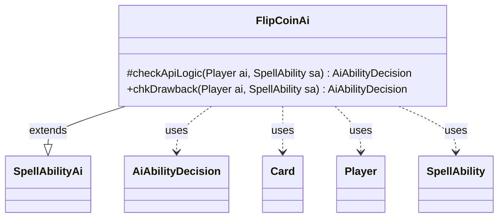

---
aliases:
  - FlipCoinAi
tags:
  - java/class
  - module/forge-ai
  - pkg/forge/ai/ability
fqn: forge.ai.ability.FlipCoinAi
package: forge.ai.ability
module: forge-ai
kind: Class
---

# FlipCoinAi

**Package:** `forge.ai.ability` &nbsp; **Module:** `forge-ai` &nbsp; **Kind:** Class



## Relationships
**Extends:**
- [[forge.ai.SpellAbilityAi|SpellAbilityAi]]
**Uses:**
- [[forge.ai.AiAbilityDecision|AiAbilityDecision]]
- [[forge.game.card.Card|Card]]
- [[forge.game.player.Player|Player]]
- [[forge.game.spellability.SpellAbility|SpellAbility]]

## Design Description

FlipCoinAi is the AI decision-maker for coin-flip abilities, extending `SpellAbilityAi` to plug into Forge's ability-handling framework. Its core responsibility is deciding whether and how the computer should activate such an ability, returning an `AiAbilityDecision` that pairs a numeric score with an `AiPlayDecision` verdict. Overriding `checkApiLogic`, it branches on a card-supplied `AILogic` parameter to handle special cases—phasing out a threatened host, or targeting opponents and their creatures for "Bangchuckers" and "KillOrcs" effects—while falling back to a simple valid-target check otherwise.

The class collaborates with `Player`, `Card`, and `SpellAbility` to inspect game state, candidate targets, and phase timing, and delegates threat analysis to `ComputerUtil`. The design keeps per-card behavior data-driven through the `AILogic` string rather than subclassing, and `chkDrawback` simply reuses the inherited `canPlay`, reflecting that the ability is equally reasonable as a sub-effect of another spell.

## Source
`forge-ai/src/main/java/forge/ai/ability/FlipCoinAi.java`

```java
package forge.ai.ability;

import forge.ai.AiAbilityDecision;
import forge.ai.AiPlayDecision;
import forge.ai.ComputerUtil;
import forge.ai.SpellAbilityAi;
import forge.game.card.Card;
import forge.game.phase.PhaseType;
import forge.game.player.Player;
import forge.game.spellability.SpellAbility;

public class FlipCoinAi extends SpellAbilityAi {

    /* (non-Javadoc)
     * @see forge.card.abilityfactory.SpellAiLogic#checkApiLogic(forge.game.player.Player, java.util.Map, forge.card.spellability.SpellAbility)
     */
    @Override
    protected AiAbilityDecision checkApiLogic(Player ai, SpellAbility sa) {
        if (sa.hasParam("AILogic")) {
            String ailogic = sa.getParam("AILogic");
            if (ailogic.equals("PhaseOut")) {
                if (!ComputerUtil.predictThreatenedObjects(sa.getActivatingPlayer(), sa).contains(sa.getHostCard())) {
                    return new AiAbilityDecision(0, AiPlayDecision.CantPlayAi);
                }
            } else if (ailogic.equals("Bangchuckers")) {
                if (ai.getGame().getPhaseHandler().getPhase().isBefore(PhaseType.END_OF_TURN) ) {
                    return new AiAbilityDecision(0, AiPlayDecision.CantPlayAi);
                }
                sa.resetTargets();
                for (Player o : ai.getOpponents()) {
                    if (sa.canTarget(o) && o.canLoseLife() && !o.cantLoseForZeroOrLessLife()) {
                        sa.getTargets().add(o);
                        return new AiAbilityDecision(100, AiPlayDecision.WillPlay);
                    }
                }
                for (Card c : ai.getOpponents().getCreaturesInPlay()) {
                    if (sa.canTarget(c)) {
                        sa.getTargets().add(c);
                        return new AiAbilityDecision(100, AiPlayDecision.WillPlay);
                    }
                }
                return new AiAbilityDecision(0, AiPlayDecision.CantPlayAi);
            } else if (ailogic.equals("KillOrcs")) {
            	if (ai.getGame().getPhaseHandler().getPhase().isBefore(PhaseType.END_OF_TURN) ) {
                    return new AiAbilityDecision(0, AiPlayDecision.CantPlayAi);
            	}
            	sa.resetTargets();
                for (Card c : ai.getOpponents().getCreaturesInPlay()) {
                    if (sa.canTarget(c)) {
                        sa.getTargets().add(c);
                        return new AiAbilityDecision(100, AiPlayDecision.WillPlay);
                    }
            	}
            	return new AiAbilityDecision(0, AiPlayDecision.CantPlayAi);
            }
        }
        if (sa.isTargetNumberValid()) {
            return new AiAbilityDecision(100, AiPlayDecision.WillPlay);
        } else {
            return new AiAbilityDecision(0, AiPlayDecision.TargetingFailed);
        }
    }

    @Override
    public AiAbilityDecision chkDrawback(Player ai, SpellAbility sa) {
        return canPlay(ai, sa);
    }
}
```
