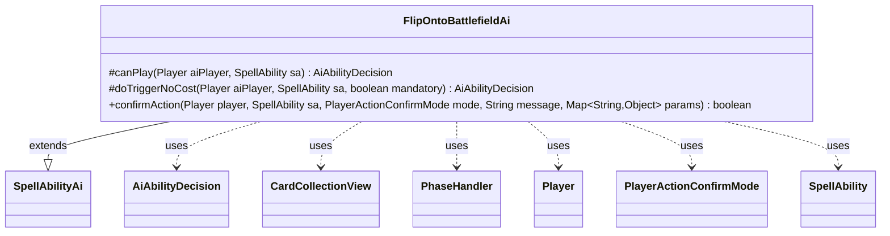

---
aliases:
  - FlipOntoBattlefieldAi
tags:
  - java/class
  - module/forge-ai
  - pkg/forge/ai/ability
fqn: forge.ai.ability.FlipOntoBattlefieldAi
package: forge.ai.ability
module: forge-ai
kind: Class
---

# FlipOntoBattlefieldAi

**Package:** `forge.ai.ability` &nbsp; **Module:** `forge-ai` &nbsp; **Kind:** Class



## Relationships
**Extends:**
- [[forge.ai.SpellAbilityAi|SpellAbilityAi]]
**Uses:**
- [[forge.ai.AiAbilityDecision|AiAbilityDecision]]
- [[forge.game.card.CardCollectionView|CardCollectionView]]
- [[forge.game.phase.PhaseHandler|PhaseHandler]]
- [[forge.game.player.Player|Player]]
- [[forge.game.player.PlayerActionConfirmMode|PlayerActionConfirmMode]]
- [[forge.game.spellability.SpellAbility|SpellAbility]]

## Design Description

`FlipOntoBattlefieldAi` supplies the AI decision logic for spell abilities that flip a card onto the battlefield, extending the `SpellAbilityAi` base class and overriding its hooks. Its `canPlay` method evaluates timing and board state: it defers mana-cost abilities to the end of the turn when not at sorcery speed, and—under the `DamageCreatures` AI logic—scans opponents' creatures via `CardCollectionView`/`CardLists` to confirm a worthwhile target exists below the sub-ability's toughness threshold, otherwise requiring only that opponents hold permanents. Each branch returns an `AiAbilityDecision` pairing a numeric confidence with an `AiPlayDecision` rationale.

The class collaborates with `PhaseHandler` and `PhaseType` for timing checks and `Player` for opponent and zone queries. `doTriggerNoCost` always plays mandatory triggers and otherwise reuses `canPlay`, while `confirmAction` unconditionally approves prompts—reflecting a design where the costly evaluation is concentrated in `canPlay` and downstream confirmations are trusted.

## Source
`forge-ai/src/main/java/forge/ai/ability/FlipOntoBattlefieldAi.java`

```java
package forge.ai.ability;

import forge.ai.AiAbilityDecision;
import forge.ai.AiPlayDecision;
import forge.ai.SpellAbilityAi;
import forge.game.card.CardCollectionView;
import forge.game.card.CardLists;
import forge.game.phase.PhaseHandler;
import forge.game.phase.PhaseType;
import forge.game.player.Player;
import forge.game.player.PlayerActionConfirmMode;
import forge.game.spellability.SpellAbility;
import forge.game.zone.ZoneType;

import java.util.Map;

public class FlipOntoBattlefieldAi extends SpellAbilityAi {
    @Override
    protected AiAbilityDecision canPlay(Player aiPlayer, SpellAbility sa) {
        PhaseHandler ph = sa.getHostCard().getGame().getPhaseHandler();
        String logic = sa.getParamOrDefault("AILogic", "");

        if (!isSorcerySpeed(sa, aiPlayer) && sa.getPayCosts().hasManaCost()) {
            if (ph.is(PhaseType.END_OF_TURN)) {
                return new AiAbilityDecision(100, AiPlayDecision.WillPlay);
            } else {
                return new AiAbilityDecision(0, AiPlayDecision.WaitForEndOfTurn);
            }
        }

        if ("DamageCreatures".equals(logic)) {
            int maxToughness = Integer.parseInt(sa.getSubAbility().getParam("NumDmg"));
            CardCollectionView rightToughness = CardLists.filter(aiPlayer.getOpponents().getCreaturesInPlay(), card -> card.getNetToughness() <= maxToughness && card.canBeDestroyed());

            if (rightToughness.isEmpty()) {
                return new AiAbilityDecision(0, AiPlayDecision.MissingNeededCards);
            } else {
                return new AiAbilityDecision(100, AiPlayDecision.WillPlay);
            }
        }

        if (!aiPlayer.getOpponents().getCardsIn(ZoneType.Battlefield).isEmpty()) {
            return new AiAbilityDecision(100, AiPlayDecision.WillPlay);
        } else {
            return new AiAbilityDecision(0, AiPlayDecision.CantPlayAi);
        }
    }

    @Override
    protected AiAbilityDecision doTriggerNoCost(Player aiPlayer, SpellAbility sa, boolean mandatory) {
        if (mandatory) {
            return new AiAbilityDecision(100, AiPlayDecision.WillPlay);
        }

        return canPlay(aiPlayer, sa);
    }

    @Override
    public boolean confirmAction(Player player, SpellAbility sa, PlayerActionConfirmMode mode, String message, Map<String, Object> params) {
        return true;
    }
}
```
