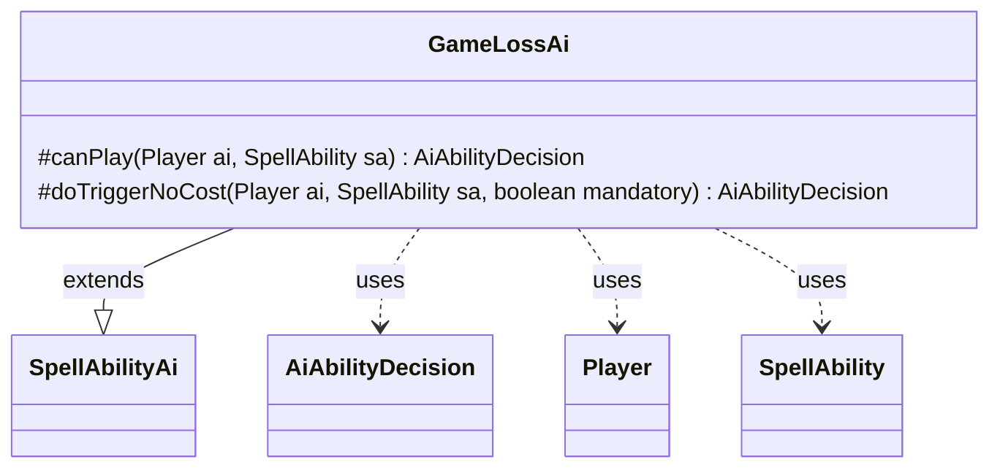

---
aliases:
  - GameLossAi
tags:
  - java/class
  - module/forge-ai
  - pkg/forge/ai/ability
fqn: forge.ai.ability.GameLossAi
package: forge.ai.ability
module: forge-ai
kind: Class
---

# GameLossAi

**Package:** `forge.ai.ability` &nbsp; **Module:** `forge-ai` &nbsp; **Kind:** Class



## Relationships
**Extends:**
- [[forge.ai.SpellAbilityAi|SpellAbilityAi]]
**Uses:**
- [[forge.ai.AiAbilityDecision|AiAbilityDecision]]
- [[forge.game.player.Player|Player]]
- [[forge.game.spellability.SpellAbility|SpellAbility]]

## Design Description

`GameLossAi` is the AI controller for spell abilities whose effect is to make a player lose the game outright (e.g. Door to Nothingness, Phage the Untouchable). As a concrete subclass of `SpellAbilityAi`, it overrides the framework's two decision hooks: `canPlay`, which evaluates voluntary casting, and `doTriggerNoCost`, which handles triggered or forced resolution. Each returns an `AiAbilityDecision` pairing a numeric score with an `AiPlayDecision` verdict, the engine's standard contract for ranking AI choices.

The design intent is to weaponize the effect against opponents while guarding self-harm: `canPlay` targets the strongest opponent and declines when that player `cantLose()`, whereas `doTriggerNoCost` resolves combat context to identify the rightful loser and, when non-mandatory, refuses to target the AI itself. It collaborates with `Player` for win/loss eligibility and combat lookups and mutates the `SpellAbility`'s targets directly, reflecting the targeting-driven nature of these cards.

## Source
`forge-ai/src/main/java/forge/ai/ability/GameLossAi.java`

```java
package forge.ai.ability;

import forge.ai.AiAbilityDecision;
import forge.ai.AiPlayDecision;
import forge.ai.SpellAbilityAi;
import forge.game.player.Player;
import forge.game.spellability.SpellAbility;

public class GameLossAi extends SpellAbilityAi {
    @Override
    protected AiAbilityDecision canPlay(Player ai, SpellAbility sa) {
        final Player opp = ai.getStrongestOpponent();
        if (opp.cantLose()) {
            return new AiAbilityDecision(0, AiPlayDecision.CantPlayAi);
        }

        // Only one SA Lose the Game card right now, which is Door to Nothingness

        if (sa.usesTargeting() && sa.canTarget(opp)) {
            sa.resetTargets();
            sa.getTargets().add(opp);
            return new AiAbilityDecision(100, AiPlayDecision.WillPlay);
        }

        return new AiAbilityDecision(0, AiPlayDecision.CantPlayAi);
    }

    @Override
    protected AiAbilityDecision doTriggerNoCost(Player ai, SpellAbility sa, boolean mandatory) {
        Player loser = ai;
        
        // Phage the Untouchable
        if (ai.getGame().getCombat() != null) {
            loser = ai.getGame().getCombat().getDefenderPlayerByAttacker(sa.getHostCard());
        }

        if (!mandatory && (loser == ai || loser.cantLose())) {
            return new AiAbilityDecision(0, AiPlayDecision.CantPlayAi);
        }

        if (sa.usesTargeting() && sa.canTarget(loser)) {
            sa.resetTargets();
            sa.getTargets().add(loser);
        }

        return new AiAbilityDecision(100, AiPlayDecision.WillPlay);
    }
}
```

## Python
`forge/ai/ability/GameLossAi.py`

```python
from forge.ai.AiAbilityDecision import AiAbilityDecision
from forge.ai.AiPlayDecision import AiPlayDecision
from forge.ai.SpellAbilityAi import SpellAbilityAi
from forge.game.player.Player import Player
from forge.game.spellability.SpellAbility import SpellAbility


class GameLossAi(SpellAbilityAi):
    def canPlay(self, ai: Player, sa: SpellAbility) -> AiAbilityDecision:
        opp = ai.getStrongestOpponent()
        if opp.cantLose():
            return AiAbilityDecision(0, AiPlayDecision.CantPlayAi)

        # Only one SA Lose the Game card right now, which is Door to Nothingness

        if sa.usesTargeting() and sa.canTarget(opp):
            sa.resetTargets()
            sa.getTargets().add(opp)
            return AiAbilityDecision(100, AiPlayDecision.WillPlay)

        return AiAbilityDecision(0, AiPlayDecision.CantPlayAi)

    def doTriggerNoCost(self, ai: Player, sa: SpellAbility, mandatory: bool) -> AiAbilityDecision:
        loser = ai

        # Phage the Untouchable
        if ai.getGame().getCombat() is not None:
            loser = ai.getGame().getCombat().getDefenderPlayerByAttacker(sa.getHostCard())

        if not mandatory and (loser == ai or loser.cantLose()):
            return AiAbilityDecision(0, AiPlayDecision.CantPlayAi)

        if sa.usesTargeting() and sa.canTarget(loser):
            sa.resetTargets()
            sa.getTargets().add(loser)

        return AiAbilityDecision(100, AiPlayDecision.WillPlay)
```
