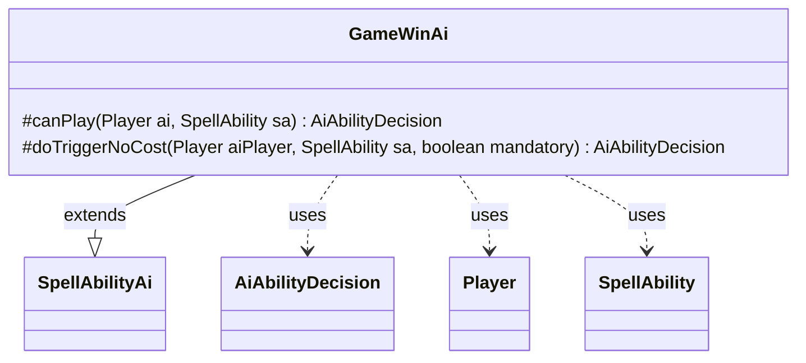

---
aliases:
  - GameWinAi
tags:
  - java/class
  - module/forge-ai
  - pkg/forge/ai/ability
fqn: forge.ai.ability.GameWinAi
package: forge.ai.ability
module: forge-ai
kind: Class
---

# GameWinAi

**Package:** `forge.ai.ability`   **Module:** `forge-ai`   **Kind:** Class



## Relationships
**Extends:**
- [[forge.ai.SpellAbilityAi|SpellAbilityAi]]
**Uses:**
- [[forge.ai.AiAbilityDecision|AiAbilityDecision]]
- [[forge.game.player.Player|Player]]
- [[forge.game.spellability.SpellAbility|SpellAbility]]

## Design Description

`GameWinAi` supplies the AI decision logic for spell abilities that win the game outright (such as Coalition Victory). As a concrete subclass of `SpellAbilityAi`, it overrides the two evaluation hooks the AI framework invokes when weighing a `SpellAbility`: `canPlay`, used for proactive casting decisions, and `doTriggerNoCost`, used when resolving the ability is free or mandated. Each returns an `AiAbilityDecision` pairing a numeric weight with an `AiPlayDecision` verdict.

The design intent is a deliberate special case: rather than the framework's usual conservative bias against playing, `canPlay` first rejects the ability only when the `Player` literally cannot win (`cantWin()`), then otherwise assigns an overwhelming score (10000) to ensure the game-winning effect is always preferred. Inline TODOs acknowledge unhandled gaps — verifying card-specific win conditions and accounting for the risk of the ability being countered.

## Source
`forge-ai/src/main/java/forge/ai/ability/GameWinAi.java`

```java
package forge.ai.ability;


import forge.ai.AiAbilityDecision;
import forge.ai.AiPlayDecision;
import forge.ai.SpellAbilityAi;
import forge.game.player.Player;
import forge.game.spellability.SpellAbility;

public class GameWinAi extends SpellAbilityAi {
    /* (non-Javadoc)
     * @see forge.card.abilityfactory.SpellAiLogic#canPlayAI(forge.game.player.Player, java.util.Map, forge.card.spellability.SpellAbility)
     */
    @Override
    protected AiAbilityDecision canPlay(Player ai, SpellAbility sa) {
        if (ai.cantWin()) {
            return new AiAbilityDecision(0, AiPlayDecision.CantPlayAi);
        }
        // If the AI can win the game, it should play this ability.
        // This is a special case where the AI should always play the ability if it can win.

        // TODO Check conditions are met on card (e.g. Coalition Victory)

        // TODO Consider likelihood of SA getting countered

        return new AiAbilityDecision(10000, AiPlayDecision.WillPlay);
        // In general, don't return true.
        // But this card wins the game, I can make an exception for that
    }

    @Override
    protected AiAbilityDecision doTriggerNoCost(Player aiPlayer, SpellAbility sa, boolean mandatory) {
        return new AiAbilityDecision(100, AiPlayDecision.WillPlay);
    }

}
```

## Python
`forge/ai/ability/GameWinAi.py`

```python
from forge.ai.AiAbilityDecision import AiAbilityDecision
from forge.ai.AiPlayDecision import AiPlayDecision
from forge.ai.SpellAbilityAi import SpellAbilityAi
from forge.game.player.Player import Player
from forge.game.spellability.SpellAbility import SpellAbility


class GameWinAi(SpellAbilityAi):
    # (non-Javadoc)
    # @see forge.card.abilityfactory.SpellAiLogic#canPlayAI(forge.game.player.Player, java.util.Map, forge.card.spellability.SpellAbility)
    def canPlay(self, ai: Player, sa: SpellAbility) -> AiAbilityDecision:
        if ai.cantWin():
            return AiAbilityDecision(0, AiPlayDecision.CantPlayAi)
        # If the AI can win the game, it should play this ability.
        # This is a special case where the AI should always play the ability if it can win.

        # TODO Check conditions are met on card (e.g. Coalition Victory)

        # TODO Consider likelihood of SA getting countered

        return AiAbilityDecision(10000, AiPlayDecision.WillPlay)
        # In general, don't return true.
        # But this card wins the game, I can make an exception for that

    def doTriggerNoCost(self, aiPlayer: Player, sa: SpellAbility, mandatory: bool) -> AiAbilityDecision:
        return AiAbilityDecision(100, AiPlayDecision.WillPlay)
```
