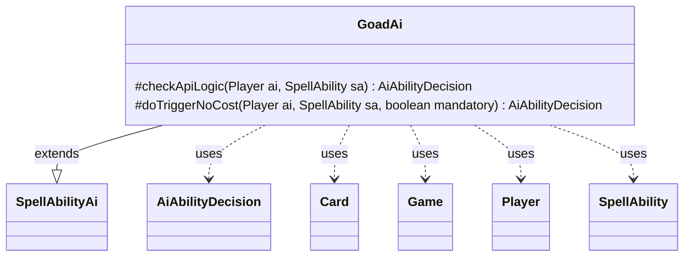

---
aliases:
  - GoadAi
tags:
  - java/class
  - module/forge-ai
  - pkg/forge/ai/ability
fqn: forge.ai.ability.GoadAi
package: forge.ai.ability
module: forge-ai
kind: Class
---

# GoadAi

**Package:** `forge.ai.ability` &nbsp; **Module:** `forge-ai` &nbsp; **Kind:** Class



## Relationships
**Extends:**
- [[forge.ai.SpellAbilityAi|SpellAbilityAi]]
**Uses:**
- [[forge.ai.AiAbilityDecision|AiAbilityDecision]]
- [[forge.game.Game|Game]]
- [[forge.game.card.Card|Card]]
- [[forge.game.player.Player|Player]]
- [[forge.game.spellability.SpellAbility|SpellAbility]]

## Design Description

GoadAi is the AI decision strategy for the "goad" ability, extending `SpellAbilityAi` to override the engine's hooks for deciding whether and how the computer plays a goad effect. Its `checkApiLogic` evaluates targeting on the battlefield and selects a creature to goad, returning an `AiAbilityDecision` weighted by desirability; `doTriggerNoCost` handles forced (mandatory) triggers by falling back to a legal target when the optimal play isn't available.

The class encodes the tactical intent behind goading: in multiplayer it picks an opponent's capable attacker that will be redirected at *another* player, while in a duel it only goads creatures the AI can block profitably, avoiding self-harm. It collaborates with `Card`, `Player`, and `Game` for board state and leans on `ComputerUtilCard`/`ComputerUtilCombat` helpers for combat heuristics, keeping the rules-agnostic AI framework decoupled from per-ability logic.

## Source
`forge-ai/src/main/java/forge/ai/ability/GoadAi.java`

```java
package forge.ai.ability;

import forge.ai.*;
import forge.game.Game;
import forge.game.card.Card;
import forge.game.card.CardLists;
import forge.game.player.Player;
import forge.game.spellability.SpellAbility;
import forge.game.zone.ZoneType;

import java.util.List;

public class GoadAi extends SpellAbilityAi {

    @Override
    protected AiAbilityDecision checkApiLogic(final Player ai, final SpellAbility sa) {
        final Card source = sa.getHostCard();
        final Game game = source.getGame();

        if (sa.usesTargeting()) {
            List<Card> goadable = CardLists.getTargetableCards(game.getCardsIn(ZoneType.Battlefield), sa);

            if (goadable.isEmpty())
                return new AiAbilityDecision(0, AiPlayDecision.TargetingFailed);

            if (game.getPlayers().size() > 2) {
                // use this part only in multiplayer
                goadable = CardLists.filter(goadable, c -> {
                    // filter only creatures which can attack
                    if (ComputerUtilCard.isUselessCreature(ai, c)) {
                        return false;
                    }
                    // useless
                    if (c.isGoadedBy(ai)) {
                        return false;
                    }
                    // select creatures which can attack an Opponent other than ai
                    for (Player o : ai.getOpponents()) {
                        if (ComputerUtilCombat.canAttackNextTurn(c, o)) {
                            return true;
                        }
                    }
                    return false;
                });
            } else {
                // single Player, goaded creature would attack ai
                goadable = CardLists.filter(goadable, c -> {
                    // filter only creatures which can attack
                    if (ComputerUtilCard.isUselessCreature(ai, c)) {
                        return false;
                    }
                    // useless
                    if (c.isGoadedBy(ai)) {
                        return false;
                    }
                    // select only creatures AI can block
                    return ComputerUtilCard.canBeBlockedProfitably(ai, c, false);
                });
            }

            if (!goadable.isEmpty()) {
                sa.getTargets().add(ComputerUtilCard.getBestCreatureAI(goadable));
                return new AiAbilityDecision(100, AiPlayDecision.WillPlay);
            }

            // AI does not find a good creature to goad.
            // because if it would goad a creature it would attack AI.
            // AI might not have enough information to block it
            return new AiAbilityDecision(0, AiPlayDecision.TargetingFailed);
        }

        return new AiAbilityDecision(100, AiPlayDecision.WillPlay);
    }

    @Override
    protected AiAbilityDecision doTriggerNoCost(Player ai, SpellAbility sa, boolean mandatory) {
        AiAbilityDecision decision = checkApiLogic(ai, sa);
        if (decision.willingToPlay()) {
            return decision;
        }
        if (!mandatory) {
            return new AiAbilityDecision(0, AiPlayDecision.CantPlayAi);
        }
        if (sa.usesTargeting()) {
            if (sa.getTargetRestrictions().canTgtPlayer()) {
                for (Player opp : ai.getOpponents()) {
                    if (sa.canTarget(opp)) {
                        sa.getTargets().add(opp);
                        return new AiAbilityDecision(50, AiPlayDecision.MandatoryPlay);
                    }
                }
                if (sa.canTarget(ai)) {
                    sa.getTargets().add(ai);
                    return new AiAbilityDecision(50, AiPlayDecision.MandatoryPlay);
                }
            } else {
                List<Card> list = CardLists.getTargetableCards(ai.getGame().getCardsIn(ZoneType.Battlefield), sa);

                if (list.isEmpty())
                    return new AiAbilityDecision(0, AiPlayDecision.CantPlayAi);

                sa.getTargets().add(ComputerUtilCard.getWorstCreatureAI(list));
                return new AiAbilityDecision(30, AiPlayDecision.MandatoryPlay);
            }
        }
        return new AiAbilityDecision(0, AiPlayDecision.CantPlayAi);
    }
}
```
