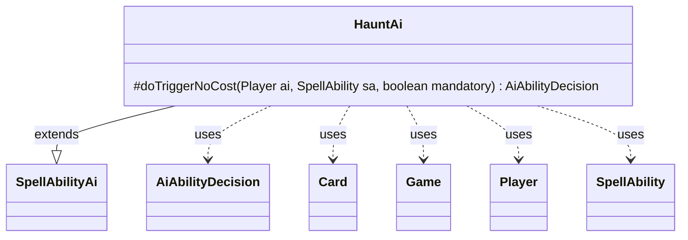

---
aliases:
  - HauntAi
tags:
  - java/class
  - module/forge-ai
  - pkg/forge/ai/ability
fqn: forge.ai.ability.HauntAi
package: forge.ai.ability
module: forge-ai
kind: Class
---

# HauntAi

**Package:** `forge.ai.ability` &nbsp; **Module:** `forge-ai` &nbsp; **Kind:** Class



## Relationships
**Extends:**
- [[forge.ai.SpellAbilityAi|SpellAbilityAi]]
**Uses:**
- [[forge.ai.AiAbilityDecision|AiAbilityDecision]]
- [[forge.game.Game|Game]]
- [[forge.game.card.Card|Card]]
- [[forge.game.player.Player|Player]]
- [[forge.game.spellability.SpellAbility|SpellAbility]]

## Design Description

HauntAi is the AI decision-maker for spell abilities driven by the "Haunt" keyword mechanic. As a concrete subclass of `SpellAbilityAi`, it overrides `doTriggerNoCost` to determine whether and how the computer player should resolve a haunt-related `SpellAbility`. Its core responsibility is target selection: when the ability targets and its host is not a token, it surveys all creatures on the battlefield via `Game`, prefers the worst opponent-controlled creature (falling back to any creature) using `ComputerUtilCard.getWorstCreatureAI`, and declines to act when no creatures exist.

It collaborates with `Player`, `Card`, `SpellAbility`, and `Game` to inspect game state, returning an `AiAbilityDecision` paired with an `AiPlayDecision` to signal intent. The design reflects a conservative heuristic — haunting a low-value enemy creature when possible — and otherwise commits eagerly (score 100, `WillPlay`), keeping the keyword-specific logic narrowly focused while delegating evaluation to shared AI utilities.

## Source
`forge-ai/src/main/java/forge/ai/ability/HauntAi.java`

```java
package forge.ai.ability;

import forge.ai.AiAbilityDecision;
import forge.ai.AiPlayDecision;
import forge.ai.ComputerUtilCard;
import forge.ai.SpellAbilityAi;
import forge.game.Game;
import forge.game.card.Card;
import forge.game.card.CardLists;
import forge.game.card.CardPredicates;
import forge.game.player.Player;
import forge.game.spellability.SpellAbility;
import forge.game.zone.ZoneType;

import java.util.List;

public class HauntAi extends SpellAbilityAi {

    @Override
    protected AiAbilityDecision doTriggerNoCost(Player ai, SpellAbility sa, boolean mandatory) {
        final Card card = sa.getHostCard();
        final Game game = ai.getGame();
        if (sa.usesTargeting() && !card.isToken()) {
            final List<Card> creats = CardLists.filter(game.getCardsIn(ZoneType.Battlefield),
                    CardPredicates.CREATURES);

            // nothing to haunt
            if (creats.isEmpty()) {
                return new AiAbilityDecision(0, AiPlayDecision.CantPlayAi);
            }

            final List<Card> oppCreats = CardLists.filterControlledBy(creats, ai.getOpponents());
            sa.getTargets().add(ComputerUtilCard.getWorstCreatureAI(oppCreats.isEmpty() ? creats : oppCreats));
        }
        return new AiAbilityDecision(100, AiPlayDecision.WillPlay);
    }
}
```
