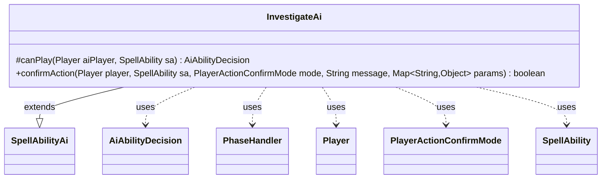

---
aliases:
  - InvestigateAi
tags:
  - java/class
  - module/forge-ai
  - pkg/forge/ai/ability
fqn: forge.ai.ability.InvestigateAi
package: forge.ai.ability
module: forge-ai
kind: Class
---

# InvestigateAi

**Package:** `forge.ai.ability`   **Module:** `forge-ai`   **Kind:** Class



## Relationships
**Extends:**
- [[forge.ai.SpellAbilityAi|SpellAbilityAi]]
**Uses:**
- [[forge.ai.AiAbilityDecision|AiAbilityDecision]]
- [[forge.game.phase.PhaseHandler|PhaseHandler]]
- [[forge.game.player.Player|Player]]
- [[forge.game.player.PlayerActionConfirmMode|PlayerActionConfirmMode]]
- [[forge.game.spellability.SpellAbility|SpellAbility]]

## Design Description

InvestigateAi is the AI decision handler for spell abilities that create Clue tokens (the "Investigate" mechanic), extending SpellAbilityAi to plug into Forge's ability-factory framework. It overrides canPlay to evaluate timing: the AI commits fully (score 100, WillPlay) only when the game is at end of turn immediately preceding its own, deferring otherwise (score 0, TimingRestrictions) so the mana investment is delayed as late as possible without losing the opportunity.

Its confirmAction override unconditionally returns true, accepting any investigate prompt once the timing gate is satisfied. The class collaborates with the game state through Player and the PhaseHandler/PhaseType pair to read turn phase, communicates verdicts via AiAbilityDecision wrapping an AiPlayDecision, and operates on the SpellAbility it is asked to evaluate—keeping all logic stateless and focused solely on when, not whether, to investigate.

## Source
`forge-ai/src/main/java/forge/ai/ability/InvestigateAi.java`

```java
package forge.ai.ability;

import forge.ai.AiAbilityDecision;
import forge.ai.AiPlayDecision;
import forge.ai.SpellAbilityAi;
import forge.game.phase.PhaseHandler;
import forge.game.phase.PhaseType;
import forge.game.player.Player;
import forge.game.player.PlayerActionConfirmMode;
import forge.game.spellability.SpellAbility;

import java.util.Map;

public class InvestigateAi extends SpellAbilityAi {
    /* (non-Javadoc)
     * @see forge.card.abilityfactory.SpellAiLogic#canPlayAI(forge.game.player.Player, java.util.Map, forge.card.spellability.SpellAbility)
     */
    @Override
    protected AiAbilityDecision canPlay(Player aiPlayer, SpellAbility sa) {
        PhaseHandler ph = aiPlayer.getGame().getPhaseHandler();
        boolean result = ph.is(PhaseType.END_OF_TURN) && ph.getNextTurn() == aiPlayer;
        return result ? new AiAbilityDecision(100, AiPlayDecision.WillPlay) : new AiAbilityDecision(0, AiPlayDecision.TimingRestrictions);
    }

    @Override
    public boolean confirmAction(Player player, SpellAbility sa, PlayerActionConfirmMode mode, String message, Map<String, Object> params) {
        return true;
    }
}
```

## Python
`forge/ai/ability/InvestigateAi.py`

```python
from forge.ai.AiAbilityDecision import AiAbilityDecision
from forge.ai.AiPlayDecision import AiPlayDecision
from forge.ai.SpellAbilityAi import SpellAbilityAi
from forge.game.phase.PhaseHandler import PhaseHandler
from forge.game.phase.PhaseType import PhaseType
from forge.game.player.Player import Player
from forge.game.player.PlayerActionConfirmMode import PlayerActionConfirmMode
from forge.game.spellability.SpellAbility import SpellAbility

from typing import Map


class InvestigateAi(SpellAbilityAi):
    # (non-Javadoc)
    # @see forge.card.abilityfactory.SpellAiLogic#canPlayAI(forge.game.player.Player, java.util.Map, forge.card.spellability.SpellAbility)
    def canPlay(self, aiPlayer: Player, sa: SpellAbility) -> AiAbilityDecision:
        ph = aiPlayer.getGame().getPhaseHandler()
        result = ph.is_(PhaseType.END_OF_TURN) and ph.getNextTurn() == aiPlayer
        return AiAbilityDecision(100, AiPlayDecision.WillPlay) if result else AiAbilityDecision(0, AiPlayDecision.TimingRestrictions)

    def confirmAction(self, player: Player, sa: SpellAbility, mode: PlayerActionConfirmMode, message: str, params: dict[str, object]) -> bool:
        return True
```
