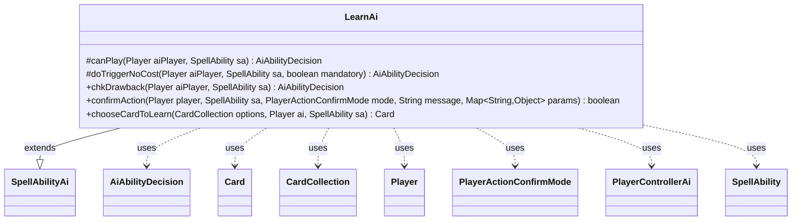

---
aliases:
  - LearnAi
tags:
  - java/class
  - module/forge-ai
  - pkg/forge/ai/ability
fqn: forge.ai.ability.LearnAi
package: forge.ai.ability
module: forge-ai
kind: Class
---

# LearnAi

**Package:** `forge.ai.ability` &nbsp; **Module:** `forge-ai` &nbsp; **Kind:** Class



## Relationships
**Extends:**
- [[forge.ai.SpellAbilityAi|SpellAbilityAi]]
**Uses:**
- [[forge.ai.AiAbilityDecision|AiAbilityDecision]]
- [[forge.ai.PlayerControllerAi|PlayerControllerAi]]
- [[forge.game.card.Card|Card]]
- [[forge.game.card.CardCollection|CardCollection]]
- [[forge.game.player.Player|Player]]
- [[forge.game.player.PlayerActionConfirmMode|PlayerActionConfirmMode]]
- [[forge.game.spellability.SpellAbility|SpellAbility]]

## Design Description

LearnAi is the AI decision handler for the "Learn" mechanic, extending `SpellAbilityAi` to plug into Forge's ability-evaluation framework. It overrides the standard hooks—`canPlay`, `doTriggerNoCost`, `chkDrawback`, and `confirmAction`—to report the action as universally favorable (a perfect score with `WillPlay`, always confirming), reflecting the design assumption that Learn is optional and therefore never harmful to take.

Its substantive logic lives in the static `chooseCardToLearn` helper, which collaborates with `Player`, `SpellAbility`, and `CardCollection` to pick the best outcome: it partitions the offered cards by zone, preferring to fetch the strongest "Lesson" from the sideboard (`ComputerUtilCard.getBestAI`), and otherwise falling back to discarding the least valuable card the AI is willing to part with (via `PlayerControllerAi`'s discard evaluation), returning `null` when no choice is worthwhile.

## Source
`forge-ai/src/main/java/forge/ai/ability/LearnAi.java`

```java
package forge.ai.ability;


import forge.ai.*;
import forge.game.card.Card;
import forge.game.card.CardCollection;
import forge.game.card.CardLists;
import forge.game.card.CardPredicates;
import forge.game.player.Player;
import forge.game.player.PlayerActionConfirmMode;
import forge.game.spellability.SpellAbility;
import forge.game.zone.ZoneType;

import java.util.Map;

public class LearnAi extends SpellAbilityAi {
    @Override
    protected AiAbilityDecision canPlay(Player aiPlayer, SpellAbility sa) {
        // For the time being, Learn is treated as universally positive due to being optional
        return new AiAbilityDecision(100, AiPlayDecision.WillPlay);
    }

    @Override
    protected AiAbilityDecision doTriggerNoCost(Player aiPlayer, SpellAbility sa, boolean mandatory) {
        if (mandatory) {
            return new AiAbilityDecision(100, AiPlayDecision.WillPlay);
        }
        return canPlay(aiPlayer, sa);
    }

    @Override
    public AiAbilityDecision chkDrawback(Player aiPlayer, SpellAbility sa) {
        return canPlay(aiPlayer, sa);
    }

    @Override
    public boolean confirmAction(Player player, SpellAbility sa, PlayerActionConfirmMode mode, String message, Map<String, Object> params) {
        return true;
    }

    public static Card chooseCardToLearn(CardCollection options, Player ai, SpellAbility sa) {
        CardCollection sideboard = CardLists.filter(options, CardPredicates.inZone(ZoneType.Sideboard));
        CardCollection hand = CardLists.filter(options, CardPredicates.inZone(ZoneType.Hand));
        hand.remove(sa.getHostCard()); // this card will be used in the process, don't consider it for discard

        CardCollection lessons = CardLists.getType(sideboard, "Lesson");
        CardCollection goodDiscards = ((PlayerControllerAi)ai.getController()).getAi().getCardsToDiscard(1, 1, hand, sa);

        if (!lessons.isEmpty()) {
            return ComputerUtilCard.getBestAI(lessons);
        } else if (goodDiscards != null && !goodDiscards.isEmpty()) {
            return ComputerUtilCard.getWorstAI(goodDiscards);
        }

        // Don't choose anything if there's no good option
        return null;
    }
}
```
