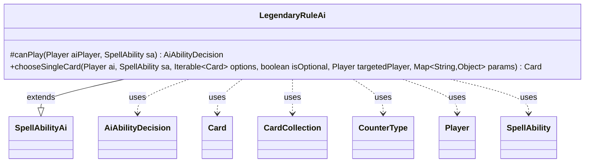

---
aliases:
  - LegendaryRuleAi
tags:
  - java/class
  - module/forge-ai
  - pkg/forge/ai/ability
fqn: forge.ai.ability.LegendaryRuleAi
package: forge.ai.ability
module: forge-ai
kind: Class
---

# LegendaryRuleAi

**Package:** `forge.ai.ability` &nbsp; **Module:** `forge-ai` &nbsp; **Kind:** Class



## Relationships
**Extends:**
- [[forge.ai.SpellAbilityAi|SpellAbilityAi]]
**Uses:**
- [[forge.ai.AiAbilityDecision|AiAbilityDecision]]
- [[forge.game.card.Card|Card]]
- [[forge.game.card.CardCollection|CardCollection]]
- [[forge.game.card.CounterType|CounterType]]
- [[forge.game.player.Player|Player]]
- [[forge.game.spellability.SpellAbility|SpellAbility]]

## Design Description

Forge's AI handler for the Legendary Rule state-based action, residing in the `forge.ai.ability` package alongside other ability-specific AI strategies. It extends `SpellAbilityAi`, but overrides `canPlay` to refuse outright—returning a `CantPlayAi` decision—since the legend rule is enforced by game state, not actively cast by the AI; the class exists solely to make the forced "which duplicate to keep" choice.

Its real work is in `chooseSingleCard`, where it decides which legendary permanent or planeswalker to retain. It first uses `ComputerUtil.choosePermanentsToSacrifice` to rank the `CardCollection` of candidates, then applies card-specific heuristics: preserving the lowest ICE-counter copy of "Dark Depths" (to hasten its Marit Lage transformation) and otherwise favoring the highest KI-counter card. The unfinished branches and TODOs reveal design intent toward more generic, counter- and combat-aware selection logic.

## Source
`forge-ai/src/main/java/forge/ai/ability/LegendaryRuleAi.java`

```java
package forge.ai.ability;

import com.google.common.collect.Iterables;
import forge.ai.AiAbilityDecision;
import forge.ai.AiPlayDecision;
import forge.ai.ComputerUtil;
import forge.ai.SpellAbilityAi;
import forge.game.card.Card;
import forge.game.card.CardCollection;
import forge.game.card.CounterType;
import forge.game.player.Player;
import forge.game.spellability.SpellAbility;

import java.util.Map;

/** 
 * TODO: Write javadoc for this type.
 *
 */
public class LegendaryRuleAi extends SpellAbilityAi {

    /* (non-Javadoc)
     * @see forge.card.ability.SpellAbilityAi#canPlayAI(forge.game.player.Player, forge.card.spellability.SpellAbility)
     */
    @Override
    protected AiAbilityDecision canPlay(Player aiPlayer, SpellAbility sa) {
        return new AiAbilityDecision(0, AiPlayDecision.CantPlayAi); // should not get here
    }

    @Override
    public Card chooseSingleCard(Player ai, SpellAbility sa, Iterable<Card> options, boolean isOptional, Player targetedPlayer, Map<String, Object> params) {
        // Choose a single legendary/planeswalker card to keep
        CardCollection legends = new CardCollection(options);
        CardCollection badOptions = ComputerUtil.choosePermanentsToSacrifice(ai, legends, legends.size() -1, sa, false, false);
        legends.removeAll(badOptions);
        Card firstOption = Iterables.getFirst(legends, null);
        boolean choosingFromPlanewalkers = firstOption.isPlaneswalker();
        
        if (choosingFromPlanewalkers) {
            // AI decision making - should AI compare counters?
        } else {
            // AI decision making - should AI compare damage and debuffs?
        }

        CounterType ice = CounterType.getType("ICE");
        CounterType ki = CounterType.getType("KI");

        // TODO: Can this be made more generic somehow?
        if (firstOption.getName().equals("Dark Depths")) {
            Card best = firstOption;
            for (Card c : options) {
                if (c.getCounters(ice) < best.getCounters(ice)) {
                    best = c;
                }
            }
            return best;
        } else if (firstOption.getCounters(ki) > 0) {
        	// Extra Rule for KI counter
        	Card best = firstOption;
            for (Card c : options) {
                if (c.getCounters(ki) > best.getCounters(ki)) {
                    best = c;
                }
            }
            return best;
        }

        return firstOption;
    }

}
```
