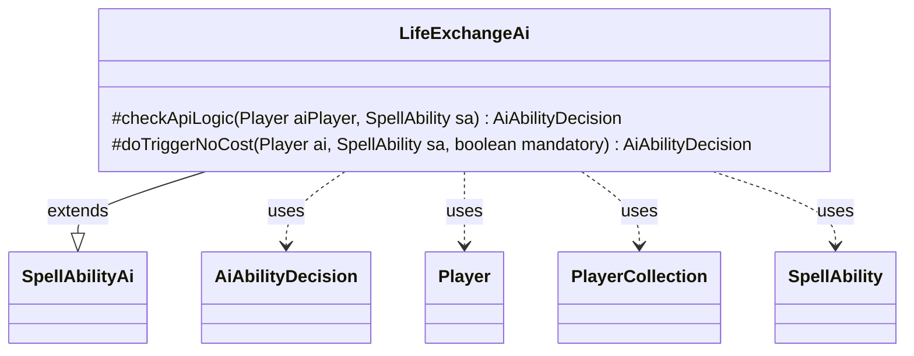

---
aliases:
  - LifeExchangeAi
tags:
  - java/class
  - module/forge-ai
  - pkg/forge/ai/ability
fqn: forge.ai.ability.LifeExchangeAi
package: forge.ai.ability
module: forge-ai
kind: Class
---

# LifeExchangeAi

**Package:** `forge.ai.ability`   **Module:** `forge-ai`   **Kind:** Class



## Relationships
**Extends:**
- [[forge.ai.SpellAbilityAi|SpellAbilityAi]]
**Uses:**
- [[forge.ai.AiAbilityDecision|AiAbilityDecision]]
- [[forge.game.player.Player|Player]]
- [[forge.game.player.PlayerCollection|PlayerCollection]]
- [[forge.game.spellability.SpellAbility|SpellAbility]]

## Design Description

`LifeExchangeAi` supplies the AI's decision-making for life-exchange spells and abilities, extending the `SpellAbilityAi` base class and overriding its two hooks: `checkApiLogic`, which decides whether to cast proactively, and `doTriggerNoCost`, which handles forced or triggered resolution. It collaborates with `Player` and `PlayerCollection` to survey opponents—filtering to legally targetable ones and selecting the highest-life opponent via `PlayerPredicates`—and returns its verdict as an `AiAbilityDecision` paired with a scored `AiPlayDecision`.

The design encodes a simple value heuristic: the AI always swaps life when its own total is critically low (under 5) against a healthier opponent, and otherwise only when the gain meaningfully exceeds the cost (opponent's life more than eight above its own), reflecting that exchange effects often carry a sacrifice. It deliberately never targets itself during selection, and an inline TODO acknowledges unhandled edge cases (Soul Conduit, Psychic Transfer).

## Source
`forge-ai/src/main/java/forge/ai/ability/LifeExchangeAi.java`

```java
package forge.ai.ability;

import forge.ai.AiAbilityDecision;
import forge.ai.AiPlayDecision;
import forge.ai.SpellAbilityAi;
import forge.game.player.Player;
import forge.game.player.PlayerCollection;
import forge.game.player.PlayerPredicates;
import forge.game.spellability.SpellAbility;

public class LifeExchangeAi extends SpellAbilityAi {

    /*
     * (non-Javadoc)
     * 
     * @see
     * forge.card.abilityfactory.AbilityFactoryAlterLife.SpellAiLogic#canPlayAI
     * (forge.game.player.Player, java.util.Map,
     * forge.card.spellability.SpellAbility)
     */
    @Override
    protected AiAbilityDecision checkApiLogic(Player aiPlayer, SpellAbility sa) {
        if (!aiPlayer.canGainLife()) {
            return new AiAbilityDecision(0, AiPlayDecision.CantPlayAi);
        }

        final int myLife = aiPlayer.getLife();
        final PlayerCollection targetableOpps = aiPlayer.getOpponents().filter(PlayerPredicates.isTargetableBy(sa));
        final Player opponent = targetableOpps.max(PlayerPredicates.compareByLife());
        final int hLife = opponent == null ? 0 : opponent.getLife();

        /*
         * TODO - There is one card that takes two targets (Soul Conduit)
         * and one card that has a conditional (Psychic Transfer) that are
         * not currently handled
         */
        if (sa.usesTargeting()) {
            sa.resetTargets();
            if (opponent != null && opponent.canLoseLife()) {
                // never target self, that would be silly for exchange
                sa.getTargets().add(opponent);
            } else {
                return new AiAbilityDecision(0, AiPlayDecision.CantPlayAi);
            }
        }

        // if life is in danger, always activate
        if (myLife < 5 && hLife > myLife) {
            return new AiAbilityDecision(100, AiPlayDecision.WillPlay);
        }

        // cost includes sacrifice probably, so make sure it's worth it
        boolean result = hLife > (myLife + 8);

        return result ? new AiAbilityDecision(100, AiPlayDecision.WillPlay) : new AiAbilityDecision(0, AiPlayDecision.CantPlayAi);
    }

    /**
     * <p>
     * exchangeLifeDoTriggerAINoCost.
     * </p>
     * @param sa
     *            a {@link forge.game.spellability.SpellAbility} object.
     * @param mandatory
     *            a boolean.
     * @param af
     *            a {@link forge.game.ability.AbilityFactory} object.
     *
     * @return a boolean.
     */
    @Override
    protected AiAbilityDecision doTriggerNoCost(final Player ai, final SpellAbility sa, final boolean mandatory) {
        PlayerCollection targetableOpps = ai.getOpponents().filter(PlayerPredicates.isTargetableBy(sa));
        Player opp = targetableOpps.max(PlayerPredicates.compareByLife());
        if (sa.usesTargeting()) {
            sa.resetTargets();
            if (sa.canTarget(opp) && (mandatory || ai.getLife() < opp.getLife())) {
                sa.getTargets().add(opp);
                if (sa.canAddMoreTarget()) {
                    sa.getTargets().add(ai);
                }
            } else {
                return new AiAbilityDecision(0, AiPlayDecision.CantPlayAi);
            }
        }
        return new AiAbilityDecision(100, AiPlayDecision.WillPlay);
    }

}
```

## Python
`forge/ai/ability/LifeExchangeAi.py`

```python
from forge.ai.AiAbilityDecision import AiAbilityDecision
from forge.ai.AiPlayDecision import AiPlayDecision
from forge.ai.SpellAbilityAi import SpellAbilityAi
from forge.game.player.Player import Player
from forge.game.player.PlayerCollection import PlayerCollection
from forge.game.player.PlayerPredicates import PlayerPredicates
from forge.game.spellability.SpellAbility import SpellAbility


class LifeExchangeAi(SpellAbilityAi):

    #
    # (non-Javadoc)
    #
    # @see
    # forge.card.abilityfactory.AbilityFactoryAlterLife.SpellAiLogic#canPlayAI
    # (forge.game.player.Player, java.util.Map,
    # forge.card.spellability.SpellAbility)
    #
    def checkApiLogic(self, aiPlayer: Player, sa: SpellAbility) -> AiAbilityDecision:
        if not aiPlayer.canGainLife():
            return AiAbilityDecision(0, AiPlayDecision.CantPlayAi)

        myLife = aiPlayer.getLife()
        targetableOpps = aiPlayer.getOpponents().filter(PlayerPredicates.isTargetableBy(sa))
        opponent = targetableOpps.max(PlayerPredicates.compareByLife())
        hLife = 0 if opponent is None else opponent.getLife()

        #
        # TODO - There is one card that takes two targets (Soul Conduit)
        # and one card that has a conditional (Psychic Transfer) that are
        # not currently handled
        #
        if sa.usesTargeting():
            sa.resetTargets()
            if opponent is not None and opponent.canLoseLife():
                # never target self, that would be silly for exchange
                sa.getTargets().add(opponent)
            else:
                return AiAbilityDecision(0, AiPlayDecision.CantPlayAi)

        # if life is in danger, always activate
        if myLife < 5 and hLife > myLife:
            return AiAbilityDecision(100, AiPlayDecision.WillPlay)

        # cost includes sacrifice probably, so make sure it's worth it
        result = hLife > (myLife + 8)

        return AiAbilityDecision(100, AiPlayDecision.WillPlay) if result else AiAbilityDecision(0, AiPlayDecision.CantPlayAi)

    #
    # exchangeLifeDoTriggerAINoCost.
    #
    # @param sa
    #            a {@link forge.game.spellability.SpellAbility} object.
    # @param mandatory
    #            a boolean.
    # @param af
    #            a {@link forge.game.ability.AbilityFactory} object.
    #
    # @return a boolean.
    #
    def doTriggerNoCost(self, ai: Player, sa: SpellAbility, mandatory: bool) -> AiAbilityDecision:
        targetableOpps = ai.getOpponents().filter(PlayerPredicates.isTargetableBy(sa))
        opp = targetableOpps.max(PlayerPredicates.compareByLife())
        if sa.usesTargeting():
            sa.resetTargets()
            if sa.canTarget(opp) and (mandatory or ai.getLife() < opp.getLife()):
                sa.getTargets().add(opp)
                if sa.canAddMoreTarget():
                    sa.getTargets().add(ai)
            else:
                return AiAbilityDecision(0, AiPlayDecision.CantPlayAi)
        return AiAbilityDecision(100, AiPlayDecision.WillPlay)
```
