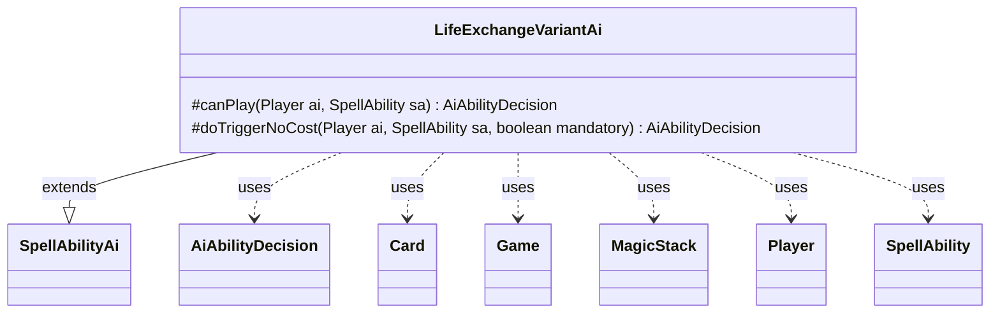

---
aliases:
  - LifeExchangeVariantAi
tags:
  - java/class
  - module/forge-ai
  - pkg/forge/ai/ability
fqn: forge.ai.ability.LifeExchangeVariantAi
package: forge.ai.ability
module: forge-ai
kind: Class
---

# LifeExchangeVariantAi

**Package:** `forge.ai.ability`   **Module:** `forge-ai`   **Kind:** Class



## Relationships
**Extends:**
- [[forge.ai.SpellAbilityAi|SpellAbilityAi]]
**Uses:**
- [[forge.ai.AiAbilityDecision|AiAbilityDecision]]
- [[forge.game.Game|Game]]
- [[forge.game.card.Card|Card]]
- [[forge.game.player.Player|Player]]
- [[forge.game.spellability.SpellAbility|SpellAbility]]
- [[forge.game.zone.MagicStack|MagicStack]]

## Design Description

`LifeExchangeVariantAi` is the forge-ai decision logic for life-altering/exchange spells whose play heuristics vary by card. Extending `SpellAbilityAi`, it overrides `canPlay` to evaluate, per named source (Tree of Redemption, Tree of Perdition, Evra, Halcyon Witness), whether the AI should activate the ability and which `Player` to target, returning an `AiAbilityDecision` paired with a confidence score and `AiPlayDecision`. It overrides `doTriggerNoCost` for the no-cost trigger path. Collaborating with `Card`, `Game`, `Player`, `SpellAbility`, and `MagicStack`, it inspects board state—combat, the stack, life totals, and life-gain hate like "Tainted Remedy" or "Rain of Gore"—through utility helpers. The notable design intent is card-name-dispatched branching: rather than one general rule, each card carries bespoke offensive and defensive evaluation, reflecting how differently these life-swap effects behave in practice.

## Source
`forge-ai/src/main/java/forge/ai/ability/LifeExchangeVariantAi.java`

```java
package forge.ai.ability;

import forge.ai.*;
import forge.game.Game;
import forge.game.card.Card;
import forge.game.keyword.Keyword;
import forge.game.phase.PhaseType;
import forge.game.player.Player;
import forge.game.spellability.SpellAbility;
import forge.game.zone.MagicStack;
import forge.util.MyRandom;

public class LifeExchangeVariantAi extends SpellAbilityAi {

    /*
     * (non-Javadoc)
     * 
     * @see
     * forge.card.abilityfactory.AbilityFactoryAlterLife.SpellAiLogic#canPlayAI
     * (forge.game.player.Player, java.util.Map,
     * forge.card.spellability.SpellAbility)
     */
    @Override
    protected AiAbilityDecision canPlay(Player ai, SpellAbility sa) {
        final Card source = sa.getHostCard();
        final String sourceName = ComputerUtilAbility.getAbilitySourceName(sa);
        final Game game = ai.getGame();

        if ("Tree of Redemption".equals(sourceName)) {
            if (!ai.canGainLife())
                return new AiAbilityDecision(0, AiPlayDecision.CantPlayAi);

            // someone controls "Rain of Gore" or "Sulfuric Vortex", lifegain is bad in that case
            if (game.isCardInPlay("Rain of Gore") || game.isCardInPlay("Sulfuric Vortex"))
                return new AiAbilityDecision(0, AiPlayDecision.CantPlayAi);

            // an opponent controls "Tainted Remedy", lifegain is bad in that case
            for (Player op : ai.getOpponents()) {
                if (op.isCardInPlay("Tainted Remedy"))
                    return new AiAbilityDecision(0, AiPlayDecision.CantPlayAi);
            }

            if (ComputerUtil.waitForBlocking(sa) || ai.getLife() + 1 >= source.getNetToughness()
                || (ai.getLife() > 5 && !ComputerUtilCombat.lifeInSeriousDanger(ai, ai.getGame().getCombat()))) {
                return new AiAbilityDecision(0, AiPlayDecision.CantPlayAi);
            }
        }
        else if ("Tree of Perdition".equals(sourceName)) {
            boolean shouldDo = false;

            if (ComputerUtil.waitForBlocking(sa))
                return new AiAbilityDecision(0, AiPlayDecision.CantPlayAi);

            for (Player op : ai.getOpponents()) {
                // if oppoent can't be targeted, or it can't lose life, try another one
                if (!op.canBeTargetedBy(sa) || !op.canLoseLife())
                    continue;
                // an opponent has more live than this toughness
                if (op.getLife() > source.getNetToughness()) {
                    shouldDo = true;
                } else {
                    // opponent can't gain life, so "Tainted Remedy" should not work.
                    if (!op.canGainLife()) {
                        continue;
                    } else if (ai.isCardInPlay("Tainted Remedy")) { // or AI has Tainted Remedy 
                        shouldDo = true;
                    } else {
                        for (Player ally : ai.getAllies()) {
                            // if an Ally has Tainted Remedy and opponent is also opponent of ally
                            if (ally.isCardInPlay("Tainted Remedy") && op.isOpponentOf(ally))
                                shouldDo = true;
                        }
                    }

                }

                if (shouldDo) {
                    sa.getTargets().add(op);
                    break;
                }
            }

            return shouldDo ? new AiAbilityDecision(100, AiPlayDecision.WillPlay) : new AiAbilityDecision(0, AiPlayDecision.CantPlayAi);
        }
        else if ("Evra, Halcyon Witness".equals(sourceName)) {
            int aiLife = ai.getLife();

            // Offensive use of Evra, try to kill the opponent or deal a lot of damage, and hopefully gain a lot of life too
            if (game.getCombat() != null && game.getPhaseHandler().is(PhaseType.COMBAT_DECLARE_BLOCKERS)
                    && game.getCombat().isAttacking(source) && source.getNetPower() > 0
                    && source.getNetPower() < aiLife) {
                Player def = game.getCombat().getDefenderPlayerByAttacker(source);
                if (game.getCombat().isUnblocked(source) && def.canLoseLife() && aiLife >= def.getLife() && source.getNetPower() < def.getLife()) {
                    // Unblocked Evra which can deal lethal damage
                    return new AiAbilityDecision(100, AiPlayDecision.WillPlay);
                } else if (aiLife > source.getNetPower() && source.hasKeyword(Keyword.LIFELINK)) {
                    int dangerMin = AiProfileUtil.getIntProperty(ai, AiProps.AI_IN_DANGER_THRESHOLD);
                    int dangerMax = AiProfileUtil.getIntProperty(ai, AiProps.AI_IN_DANGER_MAX_THRESHOLD);
                    int dangerDiff = dangerMax - dangerMin;
                    int lifeInDanger = dangerDiff <= 0 ? dangerMin : MyRandom.getRandom().nextInt(dangerDiff) + dangerMin;
                    if (source.getNetPower() >= lifeInDanger && ai.canGainLife() && ComputerUtil.lifegainPositive(ai, source)) {
                        // Blocked or unblocked Evra which will get bigger *and* we're getting our life back through Lifelink
                        return new AiAbilityDecision(100, AiPlayDecision.WillPlay);
                    }
                }
            }

            // Defensive use of Evra, try to debuff Evra to try to gain some life
            if (source.getNetPower() > aiLife) {
                // Only makes sense if the AI can actually gain life from this
                if (!ai.canGainLife())
                    return new AiAbilityDecision(0, AiPlayDecision.CantPlayAi);

                if (ComputerUtilCombat.lifeInSeriousDanger(ai, game.getCombat())) {
                    return new AiAbilityDecision(100, AiPlayDecision.WillPlay);
                }

                // check the top of stack
                MagicStack stack = game.getStack();
                if (!stack.isEmpty()) {
                    SpellAbility saTop = stack.peekAbility();
                    if (ComputerUtil.predictDamageFromSpell(saTop, ai) >= aiLife) {
                        return new AiAbilityDecision(100, AiPlayDecision.WillPlay);
                    }
                }
            }

        }
        return new AiAbilityDecision(0, AiPlayDecision.CantPlayAi);
    }

    /**
     * <p>
     * exchangeLifeDoTriggerAINoCost.
     * </p>
     * @param sa
     *            a {@link forge.game.spellability.SpellAbility} object.
     * @param mandatory
     *            a boolean.
     * @param af
     *            a {@link forge.game.ability.AbilityFactory} object.
     *
     * @return a boolean.
     */
    @Override
    protected AiAbilityDecision doTriggerNoCost(final Player ai, final SpellAbility sa, final boolean mandatory) {
        Player opp = AiAttackController.choosePreferredDefenderPlayer(ai);
        if (sa.usesTargeting()) {
            sa.resetTargets();
            if (sa.canTarget(opp) && (mandatory || ai.getLife() < opp.getLife())) {
                sa.getTargets().add(opp);
            } else {
                return new AiAbilityDecision(0, AiPlayDecision.CantPlayAi);
            }
        }
        return new AiAbilityDecision(100, AiPlayDecision.WillPlay);
    }

}
```

## Python
`forge/ai/ability/LifeExchangeVariantAi.py`

```python
from forge.ai.SpellAbilityAi import SpellAbilityAi
from forge.ai.AiAbilityDecision import AiAbilityDecision
from forge.ai.AiPlayDecision import AiPlayDecision
from forge.ai.ComputerUtilAbility import ComputerUtilAbility
from forge.ai.ComputerUtil import ComputerUtil
from forge.ai.ComputerUtilCombat import ComputerUtilCombat
from forge.ai.AiAttackController import AiAttackController
from forge.ai.AiProfileUtil import AiProfileUtil
from forge.ai.AiProps import AiProps
from forge.game.Game import Game
from forge.game.card.Card import Card
from forge.game.keyword.Keyword import Keyword
from forge.game.phase.PhaseType import PhaseType
from forge.game.player.Player import Player
from forge.game.spellability.SpellAbility import SpellAbility
from forge.game.zone.MagicStack import MagicStack
from forge.util.MyRandom import MyRandom


class LifeExchangeVariantAi(SpellAbilityAi):

    def canPlay(self, ai: Player, sa: SpellAbility) -> AiAbilityDecision:
        source = sa.getHostCard()
        sourceName = ComputerUtilAbility.getAbilitySourceName(sa)
        game = ai.getGame()

        if sourceName == "Tree of Redemption":
            if not ai.canGainLife():
                return AiAbilityDecision(0, AiPlayDecision.CantPlayAi)

            # someone controls "Rain of Gore" or "Sulfuric Vortex", lifegain is bad in that case
            if game.isCardInPlay("Rain of Gore") or game.isCardInPlay("Sulfuric Vortex"):
                return AiAbilityDecision(0, AiPlayDecision.CantPlayAi)

            # an opponent controls "Tainted Remedy", lifegain is bad in that case
            for op in ai.getOpponents():
                if op.isCardInPlay("Tainted Remedy"):
                    return AiAbilityDecision(0, AiPlayDecision.CantPlayAi)

            if (ComputerUtil.waitForBlocking(sa) or ai.getLife() + 1 >= source.getNetToughness()
                    or (ai.getLife() > 5 and not ComputerUtilCombat.lifeInSeriousDanger(ai, ai.getGame().getCombat()))):
                return AiAbilityDecision(0, AiPlayDecision.CantPlayAi)

        elif sourceName == "Tree of Perdition":
            shouldDo = False

            if ComputerUtil.waitForBlocking(sa):
                return AiAbilityDecision(0, AiPlayDecision.CantPlayAi)

            for op in ai.getOpponents():
                # if oppoent can't be targeted, or it can't lose life, try another one
                if not op.canBeTargetedBy(sa) or not op.canLoseLife():
                    continue
                # an opponent has more live than this toughness
                if op.getLife() > source.getNetToughness():
                    shouldDo = True
                else:
                    # opponent can't gain life, so "Tainted Remedy" should not work.
                    if not op.canGainLife():
                        continue
                    elif ai.isCardInPlay("Tainted Remedy"):  # or AI has Tainted Remedy
                        shouldDo = True
                    else:
                        for ally in ai.getAllies():
                            # if an Ally has Tainted Remedy and opponent is also opponent of ally
                            if ally.isCardInPlay("Tainted Remedy") and op.isOpponentOf(ally):
                                shouldDo = True

                if shouldDo:
                    sa.getTargets().add(op)
                    break

            return AiAbilityDecision(100, AiPlayDecision.WillPlay) if shouldDo else AiAbilityDecision(0, AiPlayDecision.CantPlayAi)

        elif sourceName == "Evra, Halcyon Witness":
            aiLife = ai.getLife()

            # Offensive use of Evra, try to kill the opponent or deal a lot of damage, and hopefully gain a lot of life too
            if (game.getCombat() is not None and game.getPhaseHandler().is_(PhaseType.COMBAT_DECLARE_BLOCKERS)
                    and game.getCombat().isAttacking(source) and source.getNetPower() > 0
                    and source.getNetPower() < aiLife):
                def_ = game.getCombat().getDefenderPlayerByAttacker(source)
                if game.getCombat().isUnblocked(source) and def_.canLoseLife() and aiLife >= def_.getLife() and source.getNetPower() < def_.getLife():
                    # Unblocked Evra which can deal lethal damage
                    return AiAbilityDecision(100, AiPlayDecision.WillPlay)
                elif aiLife > source.getNetPower() and source.hasKeyword(Keyword.LIFELINK):
                    dangerMin = AiProfileUtil.getIntProperty(ai, AiProps.AI_IN_DANGER_THRESHOLD)
                    dangerMax = AiProfileUtil.getIntProperty(ai, AiProps.AI_IN_DANGER_MAX_THRESHOLD)
                    dangerDiff = dangerMax - dangerMin
                    lifeInDanger = dangerMin if dangerDiff <= 0 else MyRandom.getRandom().nextInt(dangerDiff) + dangerMin
                    if source.getNetPower() >= lifeInDanger and ai.canGainLife() and ComputerUtil.lifegainPositive(ai, source):
                        # Blocked or unblocked Evra which will get bigger *and* we're getting our life back through Lifelink
                        return AiAbilityDecision(100, AiPlayDecision.WillPlay)

            # Defensive use of Evra, try to debuff Evra to try to gain some life
            if source.getNetPower() > aiLife:
                # Only makes sense if the AI can actually gain life from this
                if not ai.canGainLife():
                    return AiAbilityDecision(0, AiPlayDecision.CantPlayAi)

                if ComputerUtilCombat.lifeInSeriousDanger(ai, game.getCombat()):
                    return AiAbilityDecision(100, AiPlayDecision.WillPlay)

                # check the top of stack
                stack = game.getStack()
                if not stack.isEmpty():
                    saTop = stack.peekAbility()
                    if ComputerUtil.predictDamageFromSpell(saTop, ai) >= aiLife:
                        return AiAbilityDecision(100, AiPlayDecision.WillPlay)

        return AiAbilityDecision(0, AiPlayDecision.CantPlayAi)

    def doTriggerNoCost(self, ai: Player, sa: SpellAbility, mandatory: bool) -> AiAbilityDecision:
        opp = AiAttackController.choosePreferredDefenderPlayer(ai)
        if sa.usesTargeting():
            sa.resetTargets()
            if sa.canTarget(opp) and (mandatory or ai.getLife() < opp.getLife()):
                sa.getTargets().add(opp)
            else:
                return AiAbilityDecision(0, AiPlayDecision.CantPlayAi)
        return AiAbilityDecision(100, AiPlayDecision.WillPlay)
```
