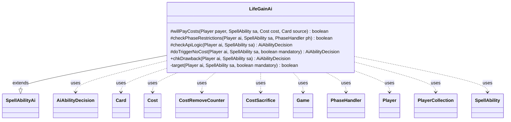

---
aliases:
  - LifeGainAi
tags:
  - java/class
  - module/forge-ai
  - pkg/forge/ai/ability
fqn: forge.ai.ability.LifeGainAi
package: forge.ai.ability
module: forge-ai
kind: Class
---

# LifeGainAi

**Package:** `forge.ai.ability` &nbsp; **Module:** `forge-ai` &nbsp; **Kind:** Class



## Relationships
**Extends:**
- [[forge.ai.SpellAbilityAi|SpellAbilityAi]]
**Uses:**
- [[forge.ai.AiAbilityDecision|AiAbilityDecision]]
- [[forge.game.Game|Game]]
- [[forge.game.card.Card|Card]]
- [[forge.game.cost.Cost|Cost]]
- [[forge.game.cost.CostRemoveCounter|CostRemoveCounter]]
- [[forge.game.cost.CostSacrifice|CostSacrifice]]
- [[forge.game.phase.PhaseHandler|PhaseHandler]]
- [[forge.game.player.Player|Player]]
- [[forge.game.player.PlayerCollection|PlayerCollection]]
- [[forge.game.spellability.SpellAbility|SpellAbility]]

## Design Description

LifeGainAi is the AI decision module for spell abilities whose effect gains (or grants) life, residing in the `forge.ai.ability` package. Extending `SpellAbilityAi`, it overrides the standard hooks—`willPayCosts`, `checkPhaseRestrictions`, `checkApiLogic`, and `doTriggerNoCost`—to govern whether and when the computer player should activate or trigger such an ability. It collaborates with game-state types like `Player`, `PhaseHandler`, `Game`, and `Cost` (notably `CostSacrifice` and `CostRemoveCounter`), returning an `AiAbilityDecision` that pairs a confidence score with a play verdict.

The design intent is timing- and threat-aware play: it gauges whether life is critical, defers non-urgent lifegain until main phase two or end of turn, and treats sacrifice costs as instant-speed responses to danger. Its private `target` helper encodes a priority cascade—target self for benefit, opponents when lifegain harms them, then allies—so mandatory triggers always resolve to a sensible recipient.

## Source
`forge-ai/src/main/java/forge/ai/ability/LifeGainAi.java`

```java
package forge.ai.ability;

import com.google.common.collect.Iterables;
import forge.ai.*;
import forge.game.Game;
import forge.game.ability.AbilityUtils;
import forge.game.card.Card;
import forge.game.cost.Cost;
import forge.game.cost.CostRemoveCounter;
import forge.game.cost.CostSacrifice;
import forge.game.phase.PhaseHandler;
import forge.game.phase.PhaseType;
import forge.game.player.Player;
import forge.game.player.PlayerCollection;
import forge.game.player.PlayerPredicates;
import forge.game.spellability.SpellAbility;
import forge.util.MyRandom;

public class LifeGainAi extends SpellAbilityAi {

    /*
     * (non-Javadoc)
     * 
     * @see forge.ai.SpellAbilityAi#willPayCosts(forge.game.player.Player,
     * forge.game.spellability.SpellAbility, forge.game.cost.Cost,
     * forge.game.card.Card)
     */
    @Override
    protected boolean willPayCosts(Player payer, SpellAbility sa, Cost cost, Card source) {
        final Game game = source.getGame();
        final PhaseHandler ph = game.getPhaseHandler();
        final int life = payer.getLife();

        boolean lifeCritical = life <= 5 || (ph.getPhase().isBefore(PhaseType.COMBAT_DAMAGE)
                && ComputerUtilCombat.lifeInDanger(payer, game.getCombat()));

        if (!lifeCritical) {
            // return super.willPayCosts(ai, sa, cost, source);
            if ("CriticalOnly".equals(sa.getParam("AILogic"))) {
                return false;
            }
            if (!ComputerUtilCost.checkSacrificeCost(payer, cost, source, sa, false)) {
                return false;
            }
            if (!ComputerUtilCost.checkLifeCost(payer, cost, source, 4, sa)) {
                return false;
            }

            if (!ComputerUtilCost.checkDiscardCost(payer, cost, source, sa)) {
                return false;
            }

            if (!ComputerUtilCost.checkRemoveCounterCost(cost, source, sa)) {
                return false;
            }
        } else {
            // don't sac possible blockers
            if (!ph.getPhase().equals(PhaseType.COMBAT_DECLARE_BLOCKERS)
                    || !game.getCombat().getDefenders().contains(payer)) {
                boolean skipCheck = false;
                // if it's a sac self cost and the effect source is not a
                // creature, skip this check
                // (e.g. Woodweaver's Puzzleknot)
                skipCheck |= ComputerUtilCost.isSacrificeSelfCost(cost) && !source.isCreature();

                if (!skipCheck) {
                    if (!ComputerUtilCost.checkSacrificeCost(payer, cost, source, sa,false)) {
                        return false;
                    }
                }
            }
        }

        return true;
    }

    @Override
    protected boolean checkPhaseRestrictions(final Player ai, final SpellAbility sa, final PhaseHandler ph) {
        final Game game = ai.getGame();
        final int life = ai.getLife();
        final String aiLogic = sa.getParamOrDefault("AILogic", "");
        boolean activateForCost = ComputerUtil.activateForCost(sa, ai);

        boolean lifeCritical = life <= 5;
        lifeCritical |= ph.getPhase().isBefore(PhaseType.COMBAT_DAMAGE)
                && ComputerUtilCombat.lifeInDanger(ai, game.getCombat());

        // When life is critical but there is no immediate danger, try to wait until declare blockers
        // before using the lifegain ability if it's an ability on a creature with a detrimental activation cost
        if (lifeCritical
                && sa.isAbility()
                && sa.getHostCard() != null && sa.getHostCard().isCreature()
                && (sa.getPayCosts().hasSpecificCostType(CostRemoveCounter.class) || sa.getPayCosts().hasSpecificCostType(CostSacrifice.class))) {
            if (!game.getStack().isEmpty()) {
                SpellAbility saTop = game.getStack().peekAbility();
                if (saTop.getTargets() != null && Iterables.contains(saTop.getTargets().getTargetPlayers(), ai)) {
                    return ComputerUtil.predictDamageFromSpell(saTop, ai) > 0;
                }
            }
            if (!ph.inCombat()) { return false; }
            if (!ph.is(PhaseType.COMBAT_DECLARE_BLOCKERS)) { return false; }
        }

        // Sacrificing in response to something dangerous is generally good in any phase
        boolean isSacCost = false;
        if (sa.getPayCosts() != null && sa.getPayCosts().hasSpecificCostType(CostSacrifice.class)) {
            isSacCost = true;
        }

        // Don't use lifegain before main 2 if possible
        if (!lifeCritical && ph.getPhase().isBefore(PhaseType.MAIN2) && !sa.hasParam("ActivationPhases")
                && !ComputerUtil.castSpellInMain1(ai, sa) && !aiLogic.contains("AnyPhase") && !isSacCost) {
            return false;
        }

        return lifeCritical || activateForCost
                || (ph.getNextTurn().equals(ai) && !ph.getPhase().isBefore(PhaseType.END_OF_TURN))
                || sa.hasParam("PlayerTurn") || isSorcerySpeed(sa, ai);
    }

    /*
     * (non-Javadoc)
     * 
     * @see forge.ai.SpellAbilityAi#checkApiLogic(forge.game.player.Player,
     * forge.game.spellability.SpellAbility)
     */
    @Override
    protected AiAbilityDecision checkApiLogic(Player ai, SpellAbility sa) {
        final Card source = sa.getHostCard();
        final String sourceName = ComputerUtilAbility.getAbilitySourceName(sa);

        final int life = ai.getLife();
        final String amountStr = sa.getParam("LifeAmount");
        int lifeAmount = 0;
        boolean activateForCost = ComputerUtil.activateForCost(sa, ai);
        if (sourceName.equals("Dawnglow Infusion")
                || (amountStr.equals("X") && sa.getSVar(amountStr).equals("Count$xPaid"))) {
            lifeAmount = ComputerUtilCost.setMaxXValue(sa, ai, sa.isTrigger());
        } else {
            lifeAmount = AbilityUtils.calculateAmount(source, amountStr, sa);
        }

        // Ugin AI: always use ultimate
        if (sourceName.equals("Ugin, the Spirit Dragon")) {
            // TODO: somehow link with DamageDealAi for cases where +1 = win
            return new AiAbilityDecision(100, AiPlayDecision.WillPlay);
        }

        // don't use it if no life to gain
        if (!activateForCost && (lifeAmount <= 0 || !ai.canGainLife())) {
            return new AiAbilityDecision(0, AiPlayDecision.CantPlayAi);
        }

        if (sa.usesTargeting() && !target(ai, sa, true)) {
            return new AiAbilityDecision(0, AiPlayDecision.TargetingFailed);
        }

        if (ComputerUtil.playImmediately(ai, sa)) {
            return new AiAbilityDecision(100, AiPlayDecision.WillPlay);
        }

        if (isSorcerySpeed(sa, ai)
                || sa.getSubAbility() != null || playReusable(ai, sa)) {
            return new AiAbilityDecision(100, AiPlayDecision.WillPlay);
        }

        if (sa.getPayCosts() != null && sa.getPayCosts().hasSpecificCostType(CostSacrifice.class)) {
            // sac costs should be performed at Instant speed when able
            return new AiAbilityDecision(100, AiPlayDecision.WillPlay);
        }

        // Save instant-speed life-gain unless it is really worth it
        final float value = 0.9f * lifeAmount / life;
        if (value < 0.2f) {
            return new AiAbilityDecision(0, AiPlayDecision.CantPlayAi);
        }
        if (MyRandom.getRandom().nextFloat() < value) {
            return new AiAbilityDecision(100, AiPlayDecision.WillPlay);
        }
        return new AiAbilityDecision(0, AiPlayDecision.CantPlayAi);
    }

    /**
     * <p>
     * gainLifeDoTriggerAINoCost.
     * </p>
     * @param sa
     *            a {@link forge.game.spellability.SpellAbility} object.
     * @param mandatory
     *            a boolean.
     *
     * @return a boolean.
     */
    @Override
    protected AiAbilityDecision doTriggerNoCost(final Player ai, final SpellAbility sa, final boolean mandatory) {
        // If the Target is gaining life, target self.
        // if the Target is modifying how much life is gained, this needs to be
        // handled better
        if (sa.usesTargeting()) {
            if (!target(ai, sa, mandatory)) {
                return new AiAbilityDecision(0, AiPlayDecision.TargetingFailed);
            }
        }

        final String amountStr = sa.getParam("LifeAmount");
        if (amountStr.equals("X")) {
            ComputerUtilCost.setMaxXValue(sa, ai, true);
        }

        return new AiAbilityDecision(100, AiPlayDecision.WillPlay);
    }
    
    @Override
    public AiAbilityDecision chkDrawback(Player ai, SpellAbility sa) {
    	return doTriggerNoCost(ai, sa, true);
    }

    private boolean target(Player ai, SpellAbility sa, boolean mandatory) {
        Card source = sa.getHostCard();
        sa.resetTargets();
        // TODO : add add even more logic into it
        // try to target opponents first if that would kill them

        PlayerCollection opps = ai.getOpponents().filter(PlayerPredicates.isTargetableBy(sa));
        PlayerCollection allies = ai.getAllies().filter(PlayerPredicates.isTargetableBy(sa));

        if (sa.canTarget(ai) && ComputerUtil.lifegainPositive(ai, source)) {
            sa.getTargets().add(ai);
        } else {
            boolean hasTgt = false;
            // check for Lifegain negative on opponents
            for (Player opp : opps) {
                if (ComputerUtil.lifegainNegative(opp, source)) {
                    sa.getTargets().add(opp);
                    hasTgt = true;
                    break;
                }
            }
            if (!hasTgt) {
                // lifegain on ally
                for (Player ally : allies) {
                    if (ComputerUtil.lifegainPositive(ally, source)) {
                        sa.getTargets().add(ally);
                        hasTgt = true;
                        break;
                    }
                }
            }
            if (!hasTgt && mandatory) {
                // need to target something but its neither negative against
                // opponents, nor positive against allies

                // hurting ally is probably better than healing opponent
                // look for Lifegain not Negative (case of lifegain negated)
                for (Player ally : allies) {
                    if (!ComputerUtil.lifegainNegative(ally, source)) {
                        sa.getTargets().add(ally);
                        hasTgt = true;
                        break;
                    }
                }
                if (!hasTgt) {
                    // same for opponent lifegain not positive
                    for (Player opp : opps) {
                        if (!ComputerUtil.lifegainPositive(opp, source)) {
                            sa.getTargets().add(opp);
                            hasTgt = true;
                            break;
                        }
                    }
                }

                // still no luck, try to target ally with most life
                if (!allies.isEmpty()) {
                    Player ally = allies.max(PlayerPredicates.compareByLife());
                    sa.getTargets().add(ally);
                    hasTgt = true;
                }
                // better heal opponent which most life then the one with the lowest
                if (!hasTgt) {
                    Player opp = opps.max(PlayerPredicates.compareByLife());
                    sa.getTargets().add(opp);
                    hasTgt = true;
                }
            }
            return hasTgt;
        }
        return true;
    }
}
```
