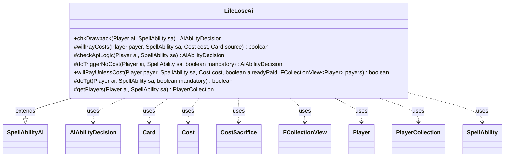

---
aliases:
  - LifeLoseAi
tags:
  - java/class
  - module/forge-ai
  - pkg/forge/ai/ability
fqn: forge.ai.ability.LifeLoseAi
package: forge.ai.ability
module: forge-ai
kind: Class
---

# LifeLoseAi

**Package:** `forge.ai.ability`   **Module:** `forge-ai`   **Kind:** Class



## Relationships
**Extends:**
- [[forge.ai.SpellAbilityAi|SpellAbilityAi]]
**Uses:**
- [[forge.ai.AiAbilityDecision|AiAbilityDecision]]
- [[forge.game.card.Card|Card]]
- [[forge.game.cost.Cost|Cost]]
- [[forge.game.cost.CostSacrifice|CostSacrifice]]
- [[forge.game.player.Player|Player]]
- [[forge.game.player.PlayerCollection|PlayerCollection]]
- [[forge.game.spellability.SpellAbility|SpellAbility]]
- [[forge.util.collect.FCollectionView|FCollectionView]]

## Design Description

LifeLoseAi is the AI decision-handler for spell abilities that cause a player to lose life, extending the `SpellAbilityAi` base class and plugging into Forge's ability-evaluation framework. It overrides the standard hooks—`checkApiLogic`, `chkDrawback`, `doTriggerNoCost`, `willPayCosts`, and `willPayUnlessCost`—to decide whether the computer player should cast, trigger, or pay for such effects, returning `AiAbilityDecision` verdicts that quantify desirability. It collaborates with `Player`/`PlayerCollection` to resolve and filter affected players, with `Cost`/`CostSacrifice` to evaluate payment trade-offs, and with `SpellAbility`/`Card` for context.

The design encodes tactical heuristics: it prioritizes life-loss that can immediately kill an opponent, resolves the "LifeAmount" parameter (including X-cost maximization), avoids self-damage when the AI's own life is threatened, and defers non-urgent activations until after combat or Main 2. The `doTgt` helper centralizes targeting preference—opponents first, allies or self only when a play is mandatory—keeping risk-aware selection logic in one reusable place.

## Source
`forge-ai/src/main/java/forge/ai/ability/LifeLoseAi.java`

```java
package forge.ai.ability;

import forge.ai.AiAbilityDecision;
import forge.ai.AiPlayDecision;
import forge.ai.ComputerUtil;
import forge.ai.ComputerUtilCost;
import forge.ai.SpellAbilityAi;
import forge.game.ability.AbilityUtils;
import forge.game.card.Card;
import forge.game.cost.Cost;
import forge.game.cost.CostSacrifice;
import forge.game.phase.PhaseType;
import forge.game.player.Player;
import forge.game.player.PlayerCollection;
import forge.game.player.PlayerPredicates;
import forge.game.spellability.SpellAbility;
import forge.util.collect.FCollectionView;

public class LifeLoseAi extends SpellAbilityAi {

    /*
     * (non-Javadoc)
     * 
     * @see forge.ai.SpellAbilityAi#chkAIDrawback(forge.game.spellability.
     * SpellAbility, forge.game.player.Player)
     */
    @Override
    public AiAbilityDecision chkDrawback(Player ai, SpellAbility sa) {
        final PlayerCollection tgtPlayers = getPlayers(ai, sa);

        final Card source = sa.getHostCard();
        final String amountStr = sa.getParam("LifeAmount");
        int amount = 0;
        if (amountStr.equals("X") && sa.getSVar(amountStr).equals("Count$xPaid")) {
            // something already set PayX
            SpellAbility root = sa.getRootAbility();
            if (root.getXManaCostPaid() != null) {
                amount = root.getXManaCostPaid();
            } else if (root.getPayCosts() != null && root.getPayCosts().hasXInAnyCostPart()) {
                // Set PayX here to maximum value.
                amount = ComputerUtilCost.setMaxXValue(sa, ai, sa.isTrigger());
                root.setXManaCostPaid(amount);
            }
        } else {
            amount = AbilityUtils.calculateAmount(source, amountStr, sa);
        }

        if (tgtPlayers.contains(ai) && amount > 0 && amount + 3 > ai.getLife()) {
            return new AiAbilityDecision(0, AiPlayDecision.CantPlayAi);
        }
        if (sa.usesTargeting()) {
            boolean result = doTgt(ai, sa, false);
            return result ? new AiAbilityDecision(100, AiPlayDecision.WillPlay) : new AiAbilityDecision(0, AiPlayDecision.CantPlayAi);
        }
        return new AiAbilityDecision(100, AiPlayDecision.WillPlay);
    }

    /*
     * (non-Javadoc)
     * 
     * @see forge.ai.SpellAbilityAi#willPayCosts(forge.game.player.Player,
     * forge.game.spellability.SpellAbility, forge.game.cost.Cost,
     * forge.game.card.Card)
     */
    @Override
    protected boolean willPayCosts(Player payer, SpellAbility sa, Cost cost, Card source) {
        final String amountStr = sa.getParam("LifeAmount");
        int amount = 0;

        if (amountStr.equals("X") && sa.getSVar(amountStr).equals("Count$xPaid")) {
            amount = ComputerUtilCost.setMaxXValue(sa, payer, sa.isTrigger());
        } else {
            amount = AbilityUtils.calculateAmount(source, amountStr, sa);
        }

        // special logic for checkLifeCost
        if (!ComputerUtilCost.checkLifeCost(payer, cost, source, amount, sa)) {
            return false;
        }

        // other cost as the same
        return super.willPayCosts(payer, sa, cost, source);
    }

    /*
     * (non-Javadoc)
     * 
     * @see forge.ai.SpellAbilityAi#checkApiLogic(forge.game.player.Player,
     * forge.game.spellability.SpellAbility)
     */
    @Override
    protected AiAbilityDecision checkApiLogic(Player ai, SpellAbility sa) {
        final Card source = sa.getHostCard();
        final String amountStr = sa.getParam("LifeAmount");
        final String aiLogic = sa.getParamOrDefault("AILogic", "");
        int amount = 0;

        if (sa.usesTargeting()) {
            if (!doTgt(ai, sa, false)) {
                return new AiAbilityDecision(0, AiPlayDecision.TargetingFailed);
            }
        }

        if (amountStr.equals("X") && sa.getSVar(amountStr).equals("Count$xPaid")) {
            amount = ComputerUtilCost.setMaxXValue(sa, ai, sa.isTrigger());
        } else {
            amount = AbilityUtils.calculateAmount(source, amountStr, sa);
        }

        if (amount <= 0) {
            return new AiAbilityDecision(0, AiPlayDecision.CantPlayAi);
        }

        if (ComputerUtil.playImmediately(ai, sa)) {
            return new AiAbilityDecision(100, AiPlayDecision.WillPlay);
        }

        final PlayerCollection tgtPlayers = getPlayers(ai, sa);
         // TODO: check against the amount we could obtain when multiple activations are possible
        PlayerCollection filteredPlayer = tgtPlayers
                .filter(PlayerPredicates.isOpponentOf(ai).and(PlayerPredicates.lifeLessOrEqualTo(amount)));
        // killing opponents asap
        if (!filteredPlayer.isEmpty()) {
            return new AiAbilityDecision(100, AiPlayDecision.WillPlay);
        }

        // Sacrificing a creature in response to something dangerous is generally good in any phase
        boolean isSacCost = false;
        if (sa.getPayCosts() != null && sa.getPayCosts().hasSpecificCostType(CostSacrifice.class)) {
            isSacCost = true;
        }

        // Don't use loselife before main 2 if possible
        if (ai.getGame().getPhaseHandler().getPhase().isBefore(PhaseType.MAIN2) && !sa.hasParam("ActivationPhases")
                && !ComputerUtil.castSpellInMain1(ai, sa) && !aiLogic.contains("AnyPhase") && !isSacCost) {
            return new AiAbilityDecision(0, AiPlayDecision.WaitForMain2);
        }

        // Don't tap creatures that may be able to block
        if (ComputerUtil.waitForBlocking(sa)) {
            return new AiAbilityDecision(0, AiPlayDecision.WaitForCombat);
        }

        if (isSorcerySpeed(sa, ai) || sa.hasParam("ActivationPhases") || playReusable(ai, sa)
                || ComputerUtil.activateForCost(sa, ai)) {
            return new AiAbilityDecision(100, AiPlayDecision.WillPlay);
        }

        return new AiAbilityDecision(0, AiPlayDecision.CantPlayAi);
    }

    /*
     * (non-Javadoc)
     * 
     * @see forge.ai.SpellAbilityAi#doTriggerAINoCost(forge.game.player.Player,
     * forge.game.spellability.SpellAbility, boolean)
     */
    @Override
    protected AiAbilityDecision doTriggerNoCost(final Player ai, final SpellAbility sa, final boolean mandatory) {
        if (sa.usesTargeting() && !doTgt(ai, sa, mandatory)) {
            return new AiAbilityDecision(0, AiPlayDecision.CantPlayAi);
        }

        if (mandatory) {
            return new AiAbilityDecision(50, AiPlayDecision.MandatoryPlay);
        }

        final Card source = sa.getHostCard();
        final String amountStr = sa.getParam("LifeAmount");
        int amount;
        if (amountStr.equals("X") && sa.getSVar(amountStr).equals("Count$xPaid")) {
            amount = ComputerUtilCost.setMaxXValue(sa, ai, true);
        } else {
            amount = AbilityUtils.calculateAmount(source, amountStr, sa);
        }

        // For cards like Foul Imp: ETB you lose life
        if (!getPlayers(ai, sa).contains(ai) || amount <= 0 || amount + 3 <= ai.getLife()) {
            return new AiAbilityDecision(100, AiPlayDecision.WillPlay);
        }
        return new AiAbilityDecision(0, AiPlayDecision.CantPlayAi);
    }

    @Override
    public boolean willPayUnlessCost(Player payer, SpellAbility sa, Cost cost, boolean alreadyPaid, FCollectionView<Player> payers) {
        if (!payer.canLoseLife() || payer.cantLoseForZeroOrLessLife()) {
            return false;
        }

        final Card source = sa.getHostCard();

        // Withercrown should be sacrificed early?
        if (source.canBeSacrificedBy(sa, true) && cost.hasOnlySpecificCostType(CostSacrifice.class)) {
            CostSacrifice costSac = cost.getCostPartByType(CostSacrifice.class);
            if (costSac.payCostFromSource()) {
                return true;
            }
        }
        int n = AbilityUtils.calculateAmount(source, sa.getParam("LifeAmount"), sa);
        // what should be the limit where AI stops letting it lose life?
        // TODO predict lose life modifier
        // also check if life loss would trigger life gain for Activating Player
        // and that resulting in another life loss
        if (payer.getLife() < 2 * n) {
            return true;
        }

        return super.willPayUnlessCost(payer, sa, cost, alreadyPaid, payers);
    }

    protected boolean doTgt(Player ai, SpellAbility sa, boolean mandatory) {
        sa.resetTargets();
        PlayerCollection opps = ai.getOpponents().filter(PlayerPredicates.isTargetableBy(sa));
        // try first to find Opponent that can lose life and lose the game
        if (!opps.isEmpty()) {
            for (Player opp : opps) {
                if (opp.canLoseLife() && !opp.cantLoseForZeroOrLessLife()) {
                    sa.getTargets().add(opp);
                    return true;
                }
            }
        }

        // do that only if needed
        if (mandatory) {
            if (!opps.isEmpty()) {
                // try another opponent even if it can't lose life
                sa.getTargets().add(opps.getFirst());
                return true;
            }
            // try hit ally instead of itself
            for (Player ally : ai.getAllies()) {
                if (sa.canTarget(ally)) {
                    sa.getTargets().add(ally);
                    return true;
                }
            }
            // need to hit itself
            if (sa.canTarget(ai)) {
                sa.getTargets().add(ai);
                return true;
            }
        }
        return false;
    }

    protected PlayerCollection getPlayers(Player ai, SpellAbility sa) {
        Iterable<Player> it;
        if (sa.usesTargeting() && !sa.hasParam("Defined")) {
            it = sa.getTargets().getTargetPlayers();
        } else {
            it = AbilityUtils.getDefinedPlayers(sa.getHostCard(), sa.getParam("Defined"), sa);
        }
        return new PlayerCollection(it);
    }
}
```

## Python
`forge/ai/ability/LifeLoseAi.py`

```python
from forge.ai.AiAbilityDecision import AiAbilityDecision
from forge.ai.AiPlayDecision import AiPlayDecision
from forge.ai.ComputerUtil import ComputerUtil
from forge.ai.ComputerUtilCost import ComputerUtilCost
from forge.ai.SpellAbilityAi import SpellAbilityAi
from forge.game.ability.AbilityUtils import AbilityUtils
from forge.game.card.Card import Card
from forge.game.cost.Cost import Cost
from forge.game.cost.CostSacrifice import CostSacrifice
from forge.game.phase.PhaseType import PhaseType
from forge.game.player.Player import Player
from forge.game.player.PlayerCollection import PlayerCollection
from forge.game.player.PlayerPredicates import PlayerPredicates
from forge.game.spellability.SpellAbility import SpellAbility
from forge.util.collect.FCollectionView import FCollectionView


class LifeLoseAi(SpellAbilityAi):

    """
    (non-Javadoc)

    @see forge.ai.SpellAbilityAi#chkAIDrawback(forge.game.spellability.
    SpellAbility, forge.game.player.Player)
    """
    def chkDrawback(self, ai: Player, sa: SpellAbility) -> AiAbilityDecision:
        tgtPlayers = self.getPlayers(ai, sa)

        source = sa.getHostCard()
        amountStr = sa.getParam("LifeAmount")
        amount = 0
        if amountStr == "X" and sa.getSVar(amountStr) == "Count$xPaid":
            # something already set PayX
            root = sa.getRootAbility()
            if root.getXManaCostPaid() is not None:
                amount = root.getXManaCostPaid()
            elif root.getPayCosts() is not None and root.getPayCosts().hasXInAnyCostPart():
                # Set PayX here to maximum value.
                amount = ComputerUtilCost.setMaxXValue(sa, ai, sa.isTrigger())
                root.setXManaCostPaid(amount)
        else:
            amount = AbilityUtils.calculateAmount(source, amountStr, sa)

        if tgtPlayers.contains(ai) and amount > 0 and amount + 3 > ai.getLife():
            return AiAbilityDecision(0, AiPlayDecision.CantPlayAi)
        if sa.usesTargeting():
            result = self.doTgt(ai, sa, False)
            return AiAbilityDecision(100, AiPlayDecision.WillPlay) if result else AiAbilityDecision(0, AiPlayDecision.CantPlayAi)
        return AiAbilityDecision(100, AiPlayDecision.WillPlay)

    """
    (non-Javadoc)

    @see forge.ai.SpellAbilityAi#willPayCosts(forge.game.player.Player,
    forge.game.spellability.SpellAbility, forge.game.cost.Cost,
    forge.game.card.Card)
    """
    def willPayCosts(self, payer: Player, sa: SpellAbility, cost: Cost, source: Card) -> bool:
        amountStr = sa.getParam("LifeAmount")
        amount = 0

        if amountStr == "X" and sa.getSVar(amountStr) == "Count$xPaid":
            amount = ComputerUtilCost.setMaxXValue(sa, payer, sa.isTrigger())
        else:
            amount = AbilityUtils.calculateAmount(source, amountStr, sa)

        # special logic for checkLifeCost
        if not ComputerUtilCost.checkLifeCost(payer, cost, source, amount, sa):
            return False

        # other cost as the same
        return super().willPayCosts(payer, sa, cost, source)

    """
    (non-Javadoc)

    @see forge.ai.SpellAbilityAi#checkApiLogic(forge.game.player.Player,
    forge.game.spellability.SpellAbility)
    """
    def checkApiLogic(self, ai: Player, sa: SpellAbility) -> AiAbilityDecision:
        source = sa.getHostCard()
        amountStr = sa.getParam("LifeAmount")
        aiLogic = sa.getParamOrDefault("AILogic", "")
        amount = 0

        if sa.usesTargeting():
            if not self.doTgt(ai, sa, False):
                return AiAbilityDecision(0, AiPlayDecision.TargetingFailed)

        if amountStr == "X" and sa.getSVar(amountStr) == "Count$xPaid":
            amount = ComputerUtilCost.setMaxXValue(sa, ai, sa.isTrigger())
        else:
            amount = AbilityUtils.calculateAmount(source, amountStr, sa)

        if amount <= 0:
            return AiAbilityDecision(0, AiPlayDecision.CantPlayAi)

        if ComputerUtil.playImmediately(ai, sa):
            return AiAbilityDecision(100, AiPlayDecision.WillPlay)

        tgtPlayers = self.getPlayers(ai, sa)
        # TODO: check against the amount we could obtain when multiple activations are possible
        filteredPlayer = tgtPlayers.filter(
            PlayerPredicates.isOpponentOf(ai).and_(PlayerPredicates.lifeLessOrEqualTo(amount)))
        # killing opponents asap
        if not filteredPlayer.isEmpty():
            return AiAbilityDecision(100, AiPlayDecision.WillPlay)

        # Sacrificing a creature in response to something dangerous is generally good in any phase
        isSacCost = False
        if sa.getPayCosts() is not None and sa.getPayCosts().hasSpecificCostType(CostSacrifice):
            isSacCost = True

        # Don't use loselife before main 2 if possible
        if (ai.getGame().getPhaseHandler().getPhase().isBefore(PhaseType.MAIN2) and not sa.hasParam("ActivationPhases")
                and not ComputerUtil.castSpellInMain1(ai, sa) and "AnyPhase" not in aiLogic and not isSacCost):
            return AiAbilityDecision(0, AiPlayDecision.WaitForMain2)

        # Don't tap creatures that may be able to block
        if ComputerUtil.waitForBlocking(sa):
            return AiAbilityDecision(0, AiPlayDecision.WaitForCombat)

        if (self.isSorcerySpeed(sa, ai) or sa.hasParam("ActivationPhases") or self.playReusable(ai, sa)
                or ComputerUtil.activateForCost(sa, ai)):
            return AiAbilityDecision(100, AiPlayDecision.WillPlay)

        return AiAbilityDecision(0, AiPlayDecision.CantPlayAi)

    """
    (non-Javadoc)

    @see forge.ai.SpellAbilityAi#doTriggerAINoCost(forge.game.player.Player,
    forge.game.spellability.SpellAbility, boolean)
    """
    def doTriggerNoCost(self, ai: Player, sa: SpellAbility, mandatory: bool) -> AiAbilityDecision:
        if sa.usesTargeting() and not self.doTgt(ai, sa, mandatory):
            return AiAbilityDecision(0, AiPlayDecision.CantPlayAi)

        if mandatory:
            return AiAbilityDecision(50, AiPlayDecision.MandatoryPlay)

        source = sa.getHostCard()
        amountStr = sa.getParam("LifeAmount")
        if amountStr == "X" and sa.getSVar(amountStr) == "Count$xPaid":
            amount = ComputerUtilCost.setMaxXValue(sa, ai, True)
        else:
            amount = AbilityUtils.calculateAmount(source, amountStr, sa)

        # For cards like Foul Imp: ETB you lose life
        if not self.getPlayers(ai, sa).contains(ai) or amount <= 0 or amount + 3 <= ai.getLife():
            return AiAbilityDecision(100, AiPlayDecision.WillPlay)
        return AiAbilityDecision(0, AiPlayDecision.CantPlayAi)

    def willPayUnlessCost(self, payer: Player, sa: SpellAbility, cost: Cost, alreadyPaid: bool, payers: FCollectionView[Player]) -> bool:
        if not payer.canLoseLife() or payer.cantLoseForZeroOrLessLife():
            return False

        source = sa.getHostCard()

        # Withercrown should be sacrificed early?
        if source.canBeSacrificedBy(sa, True) and cost.hasOnlySpecificCostType(CostSacrifice):
            costSac = cost.getCostPartByType(CostSacrifice)
            if costSac.payCostFromSource():
                return True
        n = AbilityUtils.calculateAmount(source, sa.getParam("LifeAmount"), sa)
        # what should be the limit where AI stops letting it lose life?
        # TODO predict lose life modifier
        # also check if life loss would trigger life gain for Activating Player
        # and that resulting in another life loss
        if payer.getLife() < 2 * n:
            return True

        return super().willPayUnlessCost(payer, sa, cost, alreadyPaid, payers)

    def doTgt(self, ai: Player, sa: SpellAbility, mandatory: bool) -> bool:
        sa.resetTargets()
        opps = ai.getOpponents().filter(PlayerPredicates.isTargetableBy(sa))
        # try first to find Opponent that can lose life and lose the game
        if not opps.isEmpty():
            for opp in opps:
                if opp.canLoseLife() and not opp.cantLoseForZeroOrLessLife():
                    sa.getTargets().add(opp)
                    return True

        # do that only if needed
        if mandatory:
            if not opps.isEmpty():
                # try another opponent even if it can't lose life
                sa.getTargets().add(opps.getFirst())
                return True
            # try hit ally instead of itself
            for ally in ai.getAllies():
                if sa.canTarget(ally):
                    sa.getTargets().add(ally)
                    return True
            # need to hit itself
            if sa.canTarget(ai):
                sa.getTargets().add(ai)
                return True
        return False

    def getPlayers(self, ai: Player, sa: SpellAbility) -> PlayerCollection:
        if sa.usesTargeting() and not sa.hasParam("Defined"):
            it = sa.getTargets().getTargetPlayers()
        else:
            it = AbilityUtils.getDefinedPlayers(sa.getHostCard(), sa.getParam("Defined"), sa)
        return PlayerCollection(it)
```
