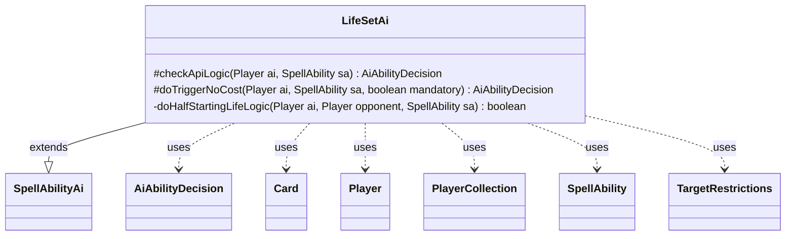

---
aliases:
  - LifeSetAi
tags:
  - java/class
  - module/forge-ai
  - pkg/forge/ai/ability
fqn: forge.ai.ability.LifeSetAi
package: forge.ai.ability
module: forge-ai
kind: Class
---

# LifeSetAi

**Package:** `forge.ai.ability` &nbsp; **Module:** `forge-ai` &nbsp; **Kind:** Class



## Relationships
**Extends:**
- [[forge.ai.SpellAbilityAi|SpellAbilityAi]]
**Uses:**
- [[forge.ai.AiAbilityDecision|AiAbilityDecision]]
- [[forge.game.card.Card|Card]]
- [[forge.game.player.Player|Player]]
- [[forge.game.player.PlayerCollection|PlayerCollection]]
- [[forge.game.spellability.SpellAbility|SpellAbility]]
- [[forge.game.spellability.TargetRestrictions|TargetRestrictions]]

## Design Description

LifeSetAi is the AI decision module for spell abilities that set a player's life total to a fixed amount. As a concrete subclass of `SpellAbilityAi`, it overrides `checkApiLogic` to evaluate whether the AI should voluntarily play such an ability and `doTriggerNoCost` to handle triggered or mandatory resolutions, returning an `AiAbilityDecision` paired with an `AiPlayDecision` and confidence score in each case. The core logic compares the AI's own life against the most life-rich targetable opponent (selected from a `PlayerCollection` via player predicates), then chooses a target through `TargetRestrictions`: it aims the effect at an opponent when it lowers their life, or at itself when the set value would raise its own dangerously low total.

Notable design intent includes phase-gating (avoiding the effect before Main 2), an emergency override that always activates when the AI is below three life, and specialized handling for cards like Torgaar (half-starting-life via the private `doHalfStartingLifeLogic` helper) and Eternity Vessel. Unhandled cases such as `Redistribute` are explicitly deferred with TODO-guarded fallbacks, reflecting an incremental, card-aware heuristic approach.

## Source
`forge-ai/src/main/java/forge/ai/ability/LifeSetAi.java`

```java
package forge.ai.ability;

import forge.ai.*;
import forge.game.ability.AbilityUtils;
import forge.game.card.Card;
import forge.game.card.CardPredicates;
import forge.game.card.CounterEnumType;
import forge.game.phase.PhaseType;
import forge.game.player.Player;
import forge.game.player.PlayerCollection;
import forge.game.player.PlayerPredicates;
import forge.game.spellability.SpellAbility;
import forge.game.spellability.TargetRestrictions;
import forge.game.zone.ZoneType;

public class LifeSetAi extends SpellAbilityAi {

    @Override
    protected AiAbilityDecision checkApiLogic(Player ai, SpellAbility sa) {
        final int myLife = ai.getLife();
        final PlayerCollection targetableOpps = ai.getOpponents().filter(PlayerPredicates.isTargetableBy(sa));
        final Player opponent = targetableOpps.max(PlayerPredicates.compareByLife());
        final int hlife = opponent == null ? 0 : opponent.getLife();
        final String amountStr = sa.getParam("LifeAmount");

        // Don't use setLife before main 2 if possible
        if (ai.getGame().getPhaseHandler().getPhase().isBefore(PhaseType.MAIN2)
                && !sa.hasParam("ActivationPhases")) {
            return new AiAbilityDecision(0, AiPlayDecision.CantPlayAi);
        }

        // TODO add AI logic for that
        if (sa.hasParam("Redistribute")) {
            return new AiAbilityDecision(0, AiPlayDecision.CantPlayAi);
        }

        // TODO handle proper calculation of X values based on Cost and what would be paid
        int amount;
        if (amountStr.equals("X") && sa.getSVar(amountStr).equals("Count$xPaid")) {
            amount = ComputerUtilCost.setMaxXValue(sa, ai, sa.isTrigger());
        } else {
            amount = AbilityUtils.calculateAmount(sa.getHostCard(), amountStr, sa);
        }

        final TargetRestrictions tgt = sa.getTargetRestrictions();
        if (tgt != null) {
            sa.resetTargets();
            if (tgt.canOnlyTgtOpponent()) {
                // if we can only target the human, and the Human's life
                // would go up, don't play it.
                // possibly add a combo here for Magister Sphinx and
                // Higedetsu's (sp?) Second Rite
                if (opponent == null || amount > hlife || !opponent.canLoseLife()) {
                    return new AiAbilityDecision(0, AiPlayDecision.CantPlayAi);
                }
                sa.getTargets().add(opponent);
            } else {
                if (amount > myLife && myLife <= 10 && ai.canGainLife()) {
                    sa.getTargets().add(ai);
                } else if (hlife > amount) {
                    sa.getTargets().add(opponent);
                } else if (amount > myLife && ai.canGainLife()) {
                    sa.getTargets().add(ai);
                } else {
                    return new AiAbilityDecision(0, AiPlayDecision.CantPlayAi);
                }
            }
        } else {
            if (sa.getParam("Defined").equals("Player")) {
                if (amount == 0) {
                    return new AiAbilityDecision(0, AiPlayDecision.CantPlayAi);
                } else if (myLife > amount) { // will decrease computer's life
                    if ((myLife < 5) || ((myLife - amount) > (hlife - amount))) {
                        return new AiAbilityDecision(0, AiPlayDecision.CantPlayAi);
                    }
                }
            }
            if (amount <= myLife) {
                return new AiAbilityDecision(0, AiPlayDecision.CantPlayAi);
            }
        }

        // if life is in danger, always activate
        if (myLife < 3 && amount > myLife && ai.canGainLife()) {
            return new AiAbilityDecision(100, AiPlayDecision.WillPlay);
        }

        return super.checkApiLogic(ai, sa);
    }

    @Override
    protected AiAbilityDecision doTriggerNoCost(Player ai, SpellAbility sa, boolean mandatory) {
        final int myLife = ai.getLife();
        final PlayerCollection targetableOpps = ai.getOpponents().filter(PlayerPredicates.isTargetableBy(sa));
        final Player opponent = targetableOpps.max(PlayerPredicates.compareByLife());
        final int hlife = opponent == null ? 0 : opponent.getLife();
        final Card source = sa.getHostCard();
        final String sourceName = ComputerUtilAbility.getAbilitySourceName(sa);

        // TODO add AI logic for that
        if (sa.hasParam("Redistribute")) {
            return mandatory ? new AiAbilityDecision(100, AiPlayDecision.WillPlay) : new AiAbilityDecision(0, AiPlayDecision.CantPlayAi);
        }

        final String amountStr = sa.getParam("LifeAmount");

        int amount;
        if (amountStr.equals("X") && sa.getSVar(amountStr).equals("Count$xPaid")) {
            amount = ComputerUtilCost.setMaxXValue(sa, ai, true);
        } else {
            amount = AbilityUtils.calculateAmount(source, amountStr, sa);
        }

        // special cases when amount can't be calculated without targeting first
        if (amount == 0 && "TargetedPlayer$StartingLife/HalfDown".equals(source.getSVar(amountStr))) {
            // e.g. Torgaar, Famine Incarnate
            boolean result = doHalfStartingLifeLogic(ai, opponent, sa);
            return result || mandatory ? new AiAbilityDecision(100, AiPlayDecision.WillPlay) : new AiAbilityDecision(0, AiPlayDecision.CantPlayAi);
        }

        if (sourceName.equals("Eternity Vessel")
                && (ai.getOpponents().getCardsIn(ZoneType.Battlefield).anyMatch(CardPredicates.nameEquals("Vampire Hexmage")) || (source.getCounters(CounterEnumType.CHARGE) == 0))) {
            return new AiAbilityDecision(0, AiPlayDecision.CantPlayAi);
        }

        // If the Target is gaining life, target self.
        // if the Target is modifying how much life is gained, this needs to be handled better
        final TargetRestrictions tgt = sa.getTargetRestrictions();
        if (tgt != null) {
            sa.resetTargets();
            if (tgt.canOnlyTgtOpponent()) {
                if (opponent == null) {
                    return new AiAbilityDecision(0, AiPlayDecision.CantPlayAi);
                }
                sa.getTargets().add(opponent);
            } else {
                if (amount > myLife && myLife <= 10) {
                    sa.getTargets().add(ai);
                } else if (hlife > amount) {
                    sa.getTargets().add(opponent);
                } else if (amount > myLife || mandatory) {
                    sa.getTargets().add(ai);
                } else {
                    return new AiAbilityDecision(0, AiPlayDecision.CantPlayAi);
                }
            }
        }

        return new AiAbilityDecision(100, AiPlayDecision.WillPlay);
    }

    private boolean doHalfStartingLifeLogic(Player ai, Player opponent, SpellAbility sa) {
        int aiAmount = ai.getStartingLife() / 2;
        int oppAmount = opponent == null ? 0 : opponent.getStartingLife() / 2;
        int aiLife = ai.getLife();
        int oppLife = opponent == null ? 0 : opponent.getLife();

        sa.resetTargets();

        final TargetRestrictions tgt = sa.getTargetRestrictions();
        if (tgt != null) {
            if (tgt.canOnlyTgtOpponent()) {
                if (oppLife > oppAmount) {
                    sa.getTargets().add(opponent);
                } else {
                    return false;
                }
            } else {
                if (aiAmount > ai.getLife() && aiLife < 5) {
                    sa.getTargets().add(ai);
                } else if (oppLife > oppAmount) {
                    sa.getTargets().add(opponent);
                } else if (aiAmount > aiLife) {
                    sa.getTargets().add(ai);
                } else {
                    return false;
                }
            }
        }

        return true;
    }

}
```
