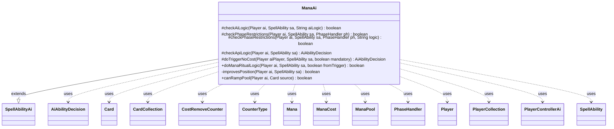

---
aliases:
  - ManaAi
tags:
  - java/class
  - module/forge-ai
  - pkg/forge/ai/ability
fqn: forge.ai.ability.ManaAi
package: forge.ai.ability
module: forge-ai
kind: Class
---

# ManaAi

**Package:** `forge.ai.ability`   **Module:** `forge-ai`   **Kind:** Class



## Relationships
**Extends:**
- [[forge.ai.SpellAbilityAi|SpellAbilityAi]]
**Uses:**
- [[forge.ai.AiAbilityDecision|AiAbilityDecision]]
- [[forge.ai.PlayerControllerAi|PlayerControllerAi]]
- [[forge.card.mana.ManaCost|ManaCost]]
- [[forge.game.card.Card|Card]]
- [[forge.game.card.CardCollection|CardCollection]]
- [[forge.game.card.CounterType|CounterType]]
- [[forge.game.cost.CostRemoveCounter|CostRemoveCounter]]
- [[forge.game.mana.Mana|Mana]]
- [[forge.game.mana.ManaPool|ManaPool]]
- [[forge.game.phase.PhaseHandler|PhaseHandler]]
- [[forge.game.player.Player|Player]]
- [[forge.game.player.PlayerCollection|PlayerCollection]]
- [[forge.game.spellability.SpellAbility|SpellAbility]]

## Design Description

ManaAi is the AI controller for mana-producing spell abilities, extending `SpellAbilityAi` to decide when and whether the computer should activate mana-adding effects such as Dark Ritual, Black Lotus, and counter-removal "battery" rituals. It overrides the framework's decision hooks — `checkAiLogic`, `checkPhaseRestrictions`, `checkApiLogic`, and `doTriggerNoCost` — to route abilities tagged with AILogic (e.g. "ManaRitual", "AtOppEOT", "Always") into specialized evaluation, returning `AiAbilityDecision` verdicts that signal play intent and confidence.

Its core design intent is avoiding wasted mana: `doManaRitualLogic` simulates the AI's hand against available mana sources to confirm a worthwhile spell could actually be cast before ritualizing, guarding against infinite recursion, instants, and Main-1 misplays. Helper methods `improvesPosition` and `canRampPool` collaborate with `ManaPool`, `Mana`, and `PhaseHandler` to keep mana open only when it survives end-of-phase emptying or enables a beneficial triggered ability.

## Source
`forge-ai/src/main/java/forge/ai/ability/ManaAi.java`

```java
package forge.ai.ability;

import forge.ai.*;
import forge.card.ColorSet;
import forge.card.MagicColor;
import forge.card.mana.ManaAtom;
import forge.card.mana.ManaCost;
import forge.game.CardTraitPredicates;
import forge.game.ability.AbilityUtils;
import forge.game.card.*;
import forge.game.cost.CostRemoveCounter;
import forge.game.keyword.Keyword;
import forge.game.mana.Mana;
import forge.game.mana.ManaPool;
import forge.game.phase.PhaseHandler;
import forge.game.phase.PhaseType;
import forge.game.player.Player;
import forge.game.player.PlayerCollection;
import forge.game.player.PlayerPredicates;
import forge.game.spellability.SpellAbility;
import forge.game.zone.ZoneType;
import forge.util.Aggregates;
import forge.util.IterableUtil;

import java.util.Arrays;
import java.util.List;

public class ManaAi extends SpellAbilityAi {

    /*
     * (non-Javadoc)
     * 
     * @see forge.ai.SpellAbilityAi#checkAiLogic(forge.game.player.Player,
     * forge.game.spellability.SpellAbility, java.lang.String)
     */
    @Override
    protected boolean checkAiLogic(Player ai, SpellAbility sa, String aiLogic) {
        if (aiLogic.startsWith("ManaRitual") || aiLogic.startsWith("BlackLotus")) {
            return doManaRitualLogic(ai, sa, false);
        } else if ("Always".equals(aiLogic)) {
            return true;
        }
        return super.checkAiLogic(ai, sa, aiLogic);
    }

    /*
     * (non-Javadoc)
     * 
     * @see
     * forge.ai.SpellAbilityAi#checkPhaseRestrictions(forge.game.player.Player,
     * forge.game.spellability.SpellAbility, forge.game.phase.PhaseHandler)
     */
    @Override
    protected boolean checkPhaseRestrictions(Player ai, SpellAbility sa, PhaseHandler ph) {
        if (improvesPosition(ai, sa)) {
            return true;
        }
        if (!ph.is(PhaseType.MAIN2)) {
            return false;
        }
        return super.checkPhaseRestrictions(ai, sa, ph);
    }

    /*
     * (non-Javadoc)
     * 
     * @see
     * forge.ai.SpellAbilityAi#checkPhaseRestrictions(forge.game.player.Player,
     * forge.game.spellability.SpellAbility, forge.game.phase.PhaseHandler,
     * java.lang.String)
     */
    @Override
    protected boolean checkPhaseRestrictions(Player ai, SpellAbility sa, PhaseHandler ph, String logic) {
        if (logic.startsWith("ManaRitual")) {
             return ph.is(PhaseType.MAIN2, ai) || ph.is(PhaseType.MAIN1, ai);
        }
        if ("AtOppEOT".equals(logic)) {
            return ph.is(PhaseType.END_OF_TURN) && ph.getNextTurn() == ai
                    && (!ai.getManaPool().hasBurn() || !ai.canLoseLife() || ai.cantLoseForZeroOrLessLife());
        }
        return super.checkPhaseRestrictions(ai, sa, ph, logic);
    }

    /*
     * (non-Javadoc)
     * 
     * @see forge.ai.SpellAbilityAi#checkApiLogic(forge.game.player.Player,
     * forge.game.spellability.SpellAbility)
     */
    @Override
    protected AiAbilityDecision checkApiLogic(Player ai, SpellAbility sa) {
        if (sa.hasParam("AILogic")) {
            return new AiAbilityDecision(100, AiPlayDecision.WillPlay); // handled elsewhere, does not meet the standard requirements
        }

        // TODO check if it would be worth it to keep mana open for opponents turn anyway
        if (ComputerUtil.activateForCost(sa, ai)) {
            return new AiAbilityDecision(100, AiPlayDecision.WillPlay);
        }

        if (sa.getPayCosts().hasNoManaCost() && sa.getPayCosts().isReusuableResource()
                && sa.getSubAbility() == null && (improvesPosition(ai, sa) || ComputerUtil.playImmediately(ai, sa))) {
            return new AiAbilityDecision(100, AiPlayDecision.WillPlay);
        }

        return new AiAbilityDecision(0, AiPlayDecision.CantPlayAi);
    }

    /**
     * @param aiPlayer
     *            the AI player.
     * @param sa
     *            a {@link forge.game.spellability.SpellAbility} object.
     * @param mandatory
     *            a boolean.
     * 
     * @return a boolean.
     */
    @Override
    protected AiAbilityDecision doTriggerNoCost(Player aiPlayer, SpellAbility sa, boolean mandatory) {
        final String logic = sa.getParamOrDefault("AILogic", "");
        if (logic.startsWith("ManaRitual")) {
            boolean result = doManaRitualLogic(aiPlayer, sa, true);
            return result ? new AiAbilityDecision(100, AiPlayDecision.WillPlay) : new AiAbilityDecision(0, AiPlayDecision.CantPlayAi);
        }

        return new AiAbilityDecision(100, AiPlayDecision.WillPlay);
    }
    
    // Dark Ritual and other similar instants/sorceries that add mana to mana pool
    public static boolean doManaRitualLogic(Player ai, SpellAbility sa, boolean fromTrigger) {
        final Card host = sa.getHostCard();
        final String logic = sa.getParamOrDefault("AILogic", "");

        if (sa.usesTargeting()) { // Rousing Refrain
            PlayerCollection targetableOpps = ai.getOpponents().filter(PlayerPredicates.isTargetableBy(sa));
            if (targetableOpps.isEmpty()) {
                return false;
            }
            Player mostCards = targetableOpps.max(PlayerPredicates.compareByZoneSize(ZoneType.Hand));
            sa.resetTargets();
            sa.getTargets().add(mostCards);
            if (fromTrigger) {
                return true;
            }
        }
        
        CardCollection manaSources = ComputerUtilMana.getAvailableManaSources(ai, true);
        int numManaSrcs = manaSources.size();
        int manaReceived = sa.hasParam("Amount") ? AbilityUtils.calculateAmount(host, sa.getParam("Amount"), sa) : 1;
        manaReceived *= sa.getParam("Produced").split(" ").length;

        int selfCost = sa.getRootAbility().getPayCosts().getCostMana() != null ? sa.getRootAbility().getPayCosts().getCostMana().getMana().getCMC() : 0;

        String produced = sa.getParam("Produced");
        byte producedColor = produced.equals("Any") ? MagicColor.ALL_COLORS : MagicColor.fromName(produced);

        int numCounters = 0;
        int manaSurplus = 0;
        if ("Count$xPaid".equals(host.getSVar("X")) && sa.getPayCosts().hasSpecificCostType(CostRemoveCounter.class)) {
            CounterType ctrType = sa.getPayCosts().getCostPartByType(CostRemoveCounter.class).counter;
            numCounters = host.getCounters(ctrType);
            manaReceived = numCounters;
            if (logic.startsWith("ManaRitualBattery.")) {
                manaSurplus = Integer.parseInt(logic.substring(18)); // adds an extra mana even if no counters removed
                manaReceived += manaSurplus;
            }
        }

        int searchCMC = numManaSrcs - selfCost + manaReceived;

        if ("X".equals(sa.getParam("Produced"))) {
            String x = host.getSVar("X");
            if ("Count$CardsInYourHand".equals(x) && host.isInZone(ZoneType.Hand)) {
                searchCMC--; // the spell in hand will be used
            } else if (x.startsWith("Count$ValidGraveyard Card.named") && host.isInZone(ZoneType.Graveyard)) {
                searchCMC--; // the spell in graveyard will be used
            }
        }

        if (searchCMC <= 0) {
            return false;
        }

        String restrictValid = sa.getParamOrDefault("RestrictValid", "Card");

        CardCollection cardList = new CardCollection();
        // TODO check other zones
        List<SpellAbility> all = ComputerUtilAbility.getSpellAbilities(ai.getCardsIn(ZoneType.Hand), ai);
        for (final SpellAbility testSa : ComputerUtilAbility.getOriginalAndAltCostAbilities(all, ai)) {
            ManaCost cost = testSa.getPayCosts().getTotalMana();
            boolean canPayWithAvailableColors = cost.canBePaidWithAvailable(ColorSet.fromNames(
                    ComputerUtilCost.getAvailableManaColors(ai, (List<Card>)null)).getColor());
            
            if (cost.getCMC() == 0 && cost.countX() == 0) {
                // no mana cost, no need to activate this SA then (additional mana not needed)
                continue;
            } else if (cost.getColorProfile() != 0 && !canPayWithAvailableColors) {
                // don't have one of each shard represented, may not be able to pay the cost
                continue;
            }

            if (ComputerUtilAbility.getAbilitySourceName(testSa).equals(ComputerUtilAbility.getAbilitySourceName(sa))
                    || testSa.hasParam("AINoRecursiveCheck")) {
                // prevent infinitely recursing mana ritual and other abilities with reentry
                continue;
            }

            SpellAbility testSaNoCost = testSa.copyWithNoManaCost();
            if (testSaNoCost == null) {
                continue;
            }
            testSaNoCost.setActivatingPlayer(ai);
            if (((PlayerControllerAi)ai.getController()).getAi().canPlaySa(testSaNoCost) == AiPlayDecision.WillPlay) {
                if (testSa.getHostCard().isPermanent() && !testSa.getHostCard().hasKeyword(Keyword.HASTE)
                    && !ai.getGame().getPhaseHandler().is(PhaseType.MAIN2)) {
                    // AI will waste a ritual in Main 1 unless the casted permanent is a haste creature
                    continue;
                }
                if (testSa.getHostCard().isInstant()) {
                    // AI is bad at choosing which instants are worth a Ritual
                    continue;
                }

                // the AI is willing to play the spell
                if (!cardList.contains(testSa.getHostCard())) {
                    cardList.add(testSa.getHostCard());
                }
            }
        }

        CardCollection castableSpells = CardLists.filter(cardList,
                Arrays.asList(
                        CardPredicates.restriction(restrictValid.split(","), ai, host, sa),
                        CardPredicates.lessCMC(searchCMC),
                        CardPredicates.isColorless().or(CardPredicates.isColor(producedColor))));

        if (logic.startsWith("ManaRitualBattery")) {
            // Don't remove more counters than would be needed to cast the more expensive thing we want to cast,
            // otherwise the AI grabs too many counters at once.
            int maxCtrs = Aggregates.max(castableSpells, Card::getCMC) - manaSurplus;
            sa.setXManaCostPaid(Math.min(numCounters, maxCtrs));
        }

        // TODO: this will probably still waste the card from time to time. Somehow improve detection of castable material.
        return castableSpells.size() > 0;
    }

    private boolean improvesPosition(Player ai, SpellAbility sa) {
        boolean activateForTrigger = (!ai.getManaPool().hasBurn() || !ai.canLoseLife() || ai.cantLoseForZeroOrLessLife()) &&
                IterableUtil.any(IterableUtil.filter(sa.getHostCard().getTriggers(), CardTraitPredicates.hasParam("AILogic", "ActivateOnce")),
                t -> sa.getHostCard().getAbilityActivatedThisTurn(t.getOverridingAbility()) == 0);

        PhaseHandler ph = ai.getGame().getPhaseHandler();
        // TODO if threatened use right away
        return ph.is(PhaseType.END_OF_TURN) && (ph.getNextTurn() == ai || ComputerUtilCard.willUntap(ai, sa.getHostCard()))
                && (activateForTrigger || canRampPool(ai, sa.getHostCard()));   
    }

    public static boolean canRampPool(Player ai, Card source) {
        ManaPool mp = ai.getManaPool();
        Mana test = null;
        if (mp.isEmpty()) {
            // TODO use color from ability
            test = new Mana((byte) ManaAtom.COLORLESS, source, null, ai);
            mp.addMana(test, false);
        }
        boolean lose = mp.willManaBeLostAtEndOfPhase();
        if (test != null) {
            mp.removeMana(test, false);
        }
        return !lose;
    }
}
```

## Python
`forge/ai/ability/ManaAi.py`

```python
from forge.ai.AiAbilityDecision import AiAbilityDecision
from forge.ai.AiPlayDecision import AiPlayDecision
from forge.ai.ComputerUtil import ComputerUtil
from forge.ai.ComputerUtilAbility import ComputerUtilAbility
from forge.ai.ComputerUtilCard import ComputerUtilCard
from forge.ai.ComputerUtilCost import ComputerUtilCost
from forge.ai.ComputerUtilMana import ComputerUtilMana
from forge.ai.PlayerControllerAi import PlayerControllerAi
from forge.ai.SpellAbilityAi import SpellAbilityAi
from forge.card.ColorSet import ColorSet
from forge.card.MagicColor import MagicColor
from forge.card.mana.ManaAtom import ManaAtom
from forge.card.mana.ManaCost import ManaCost
from forge.game.CardTraitPredicates import CardTraitPredicates
from forge.game.ability.AbilityUtils import AbilityUtils
from forge.game.card.Card import Card
from forge.game.card.CardCollection import CardCollection
from forge.game.card.CardLists import CardLists
from forge.game.card.CardPredicates import CardPredicates
from forge.game.card.CounterType import CounterType
from forge.game.cost.CostRemoveCounter import CostRemoveCounter
from forge.game.keyword.Keyword import Keyword
from forge.game.mana.Mana import Mana
from forge.game.mana.ManaPool import ManaPool
from forge.game.phase.PhaseHandler import PhaseHandler
from forge.game.phase.PhaseType import PhaseType
from forge.game.player.Player import Player
from forge.game.player.PlayerCollection import PlayerCollection
from forge.game.player.PlayerPredicates import PlayerPredicates
from forge.game.spellability.SpellAbility import SpellAbility
from forge.game.zone.ZoneType import ZoneType
from forge.util.Aggregates import Aggregates
from forge.util.IterableUtil import IterableUtil


class ManaAi(SpellAbilityAi):

    #
    # (non-Javadoc)
    #
    # @see forge.ai.SpellAbilityAi#checkAiLogic(forge.game.player.Player,
    # forge.game.spellability.SpellAbility, java.lang.String)
    #
    def checkAiLogic(self, ai: Player, sa: SpellAbility, aiLogic: str) -> bool:
        if aiLogic.startswith("ManaRitual") or aiLogic.startswith("BlackLotus"):
            return ManaAi.doManaRitualLogic(ai, sa, False)
        elif "Always" == aiLogic:
            return True
        return super().checkAiLogic(ai, sa, aiLogic)

    #
    # (non-Javadoc)
    #
    # @see
    # forge.ai.SpellAbilityAi#checkPhaseRestrictions(forge.game.player.Player,
    # forge.game.spellability.SpellAbility, forge.game.phase.PhaseHandler)
    #
    def checkPhaseRestrictions(self, ai: Player, sa: SpellAbility, ph: PhaseHandler, logic: str = None) -> bool:
        if logic is not None:
            #
            # (non-Javadoc)
            #
            # @see
            # forge.ai.SpellAbilityAi#checkPhaseRestrictions(forge.game.player.Player,
            # forge.game.spellability.SpellAbility, forge.game.phase.PhaseHandler,
            # java.lang.String)
            #
            if logic.startswith("ManaRitual"):
                return ph.is_(PhaseType.MAIN2, ai) or ph.is_(PhaseType.MAIN1, ai)
            if "AtOppEOT" == logic:
                return ph.is_(PhaseType.END_OF_TURN) and ph.getNextTurn() == ai \
                    and (not ai.getManaPool().hasBurn() or not ai.canLoseLife() or ai.cantLoseForZeroOrLessLife())
            return super().checkPhaseRestrictions(ai, sa, ph, logic)

        if self.improvesPosition(ai, sa):
            return True
        if not ph.is_(PhaseType.MAIN2):
            return False
        return super().checkPhaseRestrictions(ai, sa, ph)

    #
    # (non-Javadoc)
    #
    # @see forge.ai.SpellAbilityAi#checkApiLogic(forge.game.player.Player,
    # forge.game.spellability.SpellAbility)
    #
    def checkApiLogic(self, ai: Player, sa: SpellAbility) -> AiAbilityDecision:
        if sa.hasParam("AILogic"):
            return AiAbilityDecision(100, AiPlayDecision.WillPlay)  # handled elsewhere, does not meet the standard requirements

        # TODO check if it would be worth it to keep mana open for opponents turn anyway
        if ComputerUtil.activateForCost(sa, ai):
            return AiAbilityDecision(100, AiPlayDecision.WillPlay)

        if sa.getPayCosts().hasNoManaCost() and sa.getPayCosts().isReusuableResource() \
                and sa.getSubAbility() is None and (self.improvesPosition(ai, sa) or ComputerUtil.playImmediately(ai, sa)):
            return AiAbilityDecision(100, AiPlayDecision.WillPlay)

        return AiAbilityDecision(0, AiPlayDecision.CantPlayAi)

    #
    # @param aiPlayer
    #            the AI player.
    # @param sa
    #            a {@link forge.game.spellability.SpellAbility} object.
    # @param mandatory
    #            a boolean.
    #
    # @return a boolean.
    #
    def doTriggerNoCost(self, aiPlayer: Player, sa: SpellAbility, mandatory: bool) -> AiAbilityDecision:
        logic = sa.getParamOrDefault("AILogic", "")
        if logic.startswith("ManaRitual"):
            result = ManaAi.doManaRitualLogic(aiPlayer, sa, True)
            return AiAbilityDecision(100, AiPlayDecision.WillPlay) if result else AiAbilityDecision(0, AiPlayDecision.CantPlayAi)

        return AiAbilityDecision(100, AiPlayDecision.WillPlay)

    # Dark Ritual and other similar instants/sorceries that add mana to mana pool
    @staticmethod
    def doManaRitualLogic(ai: Player, sa: SpellAbility, fromTrigger: bool) -> bool:
        host = sa.getHostCard()
        logic = sa.getParamOrDefault("AILogic", "")

        if sa.usesTargeting():  # Rousing Refrain
            targetableOpps = ai.getOpponents().filter(PlayerPredicates.isTargetableBy(sa))
            if targetableOpps.isEmpty():
                return False
            mostCards = targetableOpps.max(PlayerPredicates.compareByZoneSize(ZoneType.Hand))
            sa.resetTargets()
            sa.getTargets().add(mostCards)
            if fromTrigger:
                return True

        manaSources = ComputerUtilMana.getAvailableManaSources(ai, True)
        numManaSrcs = manaSources.size()
        manaReceived = AbilityUtils.calculateAmount(host, sa.getParam("Amount"), sa) if sa.hasParam("Amount") else 1
        manaReceived *= len(sa.getParam("Produced").split(" "))

        selfCost = sa.getRootAbility().getPayCosts().getCostMana().getMana().getCMC() if sa.getRootAbility().getPayCosts().getCostMana() is not None else 0

        produced = sa.getParam("Produced")
        producedColor = MagicColor.ALL_COLORS if produced == "Any" else MagicColor.fromName(produced)

        numCounters = 0
        manaSurplus = 0
        if "Count$xPaid" == host.getSVar("X") and sa.getPayCosts().hasSpecificCostType(CostRemoveCounter):
            ctrType = sa.getPayCosts().getCostPartByType(CostRemoveCounter).counter
            numCounters = host.getCounters(ctrType)
            manaReceived = numCounters
            if logic.startswith("ManaRitualBattery."):
                manaSurplus = int(logic[18:])  # adds an extra mana even if no counters removed
                manaReceived += manaSurplus

        searchCMC = numManaSrcs - selfCost + manaReceived

        if "X" == sa.getParam("Produced"):
            x = host.getSVar("X")
            if "Count$CardsInYourHand" == x and host.isInZone(ZoneType.Hand):
                searchCMC -= 1  # the spell in hand will be used
            elif x.startswith("Count$ValidGraveyard Card.named") and host.isInZone(ZoneType.Graveyard):
                searchCMC -= 1  # the spell in graveyard will be used

        if searchCMC <= 0:
            return False

        restrictValid = sa.getParamOrDefault("RestrictValid", "Card")

        cardList = CardCollection()
        # TODO check other zones
        all = ComputerUtilAbility.getSpellAbilities(ai.getCardsIn(ZoneType.Hand), ai)
        for testSa in ComputerUtilAbility.getOriginalAndAltCostAbilities(all, ai):
            cost = testSa.getPayCosts().getTotalMana()
            canPayWithAvailableColors = cost.canBePaidWithAvailable(ColorSet.fromNames(
                ComputerUtilCost.getAvailableManaColors(ai, None)).getColor())

            if cost.getCMC() == 0 and cost.countX() == 0:
                # no mana cost, no need to activate this SA then (additional mana not needed)
                continue
            elif cost.getColorProfile() != 0 and not canPayWithAvailableColors:
                # don't have one of each shard represented, may not be able to pay the cost
                continue

            if ComputerUtilAbility.getAbilitySourceName(testSa) == ComputerUtilAbility.getAbilitySourceName(sa) \
                    or testSa.hasParam("AINoRecursiveCheck"):
                # prevent infinitely recursing mana ritual and other abilities with reentry
                continue

            testSaNoCost = testSa.copyWithNoManaCost()
            if testSaNoCost is None:
                continue
            testSaNoCost.setActivatingPlayer(ai)
            if PlayerControllerAi(ai.getController()).getAi().canPlaySa(testSaNoCost) == AiPlayDecision.WillPlay:
                if testSa.getHostCard().isPermanent() and not testSa.getHostCard().hasKeyword(Keyword.HASTE) \
                        and not ai.getGame().getPhaseHandler().is_(PhaseType.MAIN2):
                    # AI will waste a ritual in Main 1 unless the casted permanent is a haste creature
                    continue
                if testSa.getHostCard().isInstant():
                    # AI is bad at choosing which instants are worth a Ritual
                    continue

                # the AI is willing to play the spell
                if not cardList.contains(testSa.getHostCard()):
                    cardList.add(testSa.getHostCard())

        castableSpells = CardLists.filter(cardList,
            [
                CardPredicates.restriction(restrictValid.split(","), ai, host, sa),
                CardPredicates.lessCMC(searchCMC),
                CardPredicates.isColorless().or_(CardPredicates.isColor(producedColor)),
            ])

        if logic.startswith("ManaRitualBattery"):
            # Don't remove more counters than would be needed to cast the more expensive thing we want to cast,
            # otherwise the AI grabs too many counters at once.
            maxCtrs = Aggregates.max(castableSpells, Card.getCMC) - manaSurplus
            sa.setXManaCostPaid(min(numCounters, maxCtrs))

        # TODO: this will probably still waste the card from time to time. Somehow improve detection of castable material.
        return castableSpells.size() > 0

    def improvesPosition(self, ai: Player, sa: SpellAbility) -> bool:
        activateForTrigger = (not ai.getManaPool().hasBurn() or not ai.canLoseLife() or ai.cantLoseForZeroOrLessLife()) and \
            IterableUtil.any(IterableUtil.filter(sa.getHostCard().getTriggers(), CardTraitPredicates.hasParam("AILogic", "ActivateOnce")),
                             lambda t: sa.getHostCard().getAbilityActivatedThisTurn(t.getOverridingAbility()) == 0)

        ph = ai.getGame().getPhaseHandler()
        # TODO if threatened use right away
        return ph.is_(PhaseType.END_OF_TURN) and (ph.getNextTurn() == ai or ComputerUtilCard.willUntap(ai, sa.getHostCard())) \
            and (activateForTrigger or ManaAi.canRampPool(ai, sa.getHostCard()))

    @staticmethod
    def canRampPool(ai: Player, source: Card) -> bool:
        mp = ai.getManaPool()
        test = None
        if mp.isEmpty():
            # TODO use color from ability
            test = Mana(ManaAtom.COLORLESS, source, None, ai)
            mp.addMana(test, False)
        lose = mp.willManaBeLostAtEndOfPhase()
        if test is not None:
            mp.removeMana(test, False)
        return not lose
```
