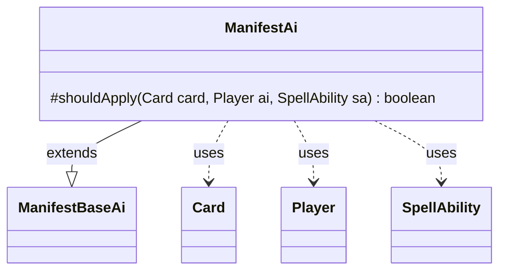

---
aliases:
  - ManifestAi
tags:
  - java/class
  - module/forge-ai
  - pkg/forge/ai/ability
fqn: forge.ai.ability.ManifestAi
package: forge.ai.ability
module: forge-ai
kind: Class
---

# ManifestAi

**Package:** `forge.ai.ability` &nbsp; **Module:** `forge-ai` &nbsp; **Kind:** Class



## Relationships
**Extends:**
- [[forge.ai.ability.ManifestBaseAi|ManifestBaseAi]]
**Uses:**
- [[forge.game.card.Card|Card]]
- [[forge.game.player.Player|Player]]
- [[forge.game.spellability.SpellAbility|SpellAbility]]

## Design Description

ManifestAi is the AI decision component for the "manifest" mechanic, determining whether the computer player should manifest a given card face-down. As a concrete subclass of ManifestBaseAi, it supplies the abstract `shouldApply` hook, leaving the broader manifest-ability evaluation and execution to its parent while focusing solely on per-card suitability checks. It collaborates with Card, Player, and SpellAbility to reason about a candidate, using CardCopyService to build a lightweight last-known-information copy that is turned face-down and flagged as manifested so it can probe for replacement effects (e.g., Grafdigger's Cage) that would block the creature from entering the battlefield.

The design intent is conservative, value-preserving play: when the card is visible to the AI it avoids manifesting non-permanents, X-cost cards, creatures with non-positive toughness, and cards whose entry triggers or replacements would be wasted face-down—manifesting only when doing so is genuinely advantageous.

## Source
`forge-ai/src/main/java/forge/ai/ability/ManifestAi.java`

```java
package forge.ai.ability;

import forge.ai.ComputerUtil;
import forge.game.card.Card;
import forge.game.card.CardCopyService;
import forge.game.player.Player;
import forge.game.spellability.SpellAbility;

public class ManifestAi extends ManifestBaseAi {

    @Override
    protected boolean shouldApply(final Card card, final Player ai, final SpellAbility sa) {
        // check to ensure that there are no replacement effects that prevent creatures ETBing from library
        // (e.g. Grafdigger's Cage)
        Card topCopy = CardCopyService.getLKICopy(card);
        topCopy.turnFaceDownNoUpdate();
        topCopy.setManifested(sa);

        if (ComputerUtil.isETBprevented(topCopy)) {
            return false;
        }

        if (card.getView().canBeShownTo(ai.getView())) {
            // try to avoid manifest a non Permanent
            if (!card.isPermanent())
                return false;

            // do not manifest a card with X in its cost
            if (card.getManaCost().countX() > 0)
                return false;

            // try to avoid manifesting a creature with zero or less toughness
            if (card.isCreature() && card.getNetToughness() <= 0)
                return false;

            // card has ETBTrigger or ETBReplacement
            if (card.hasETBTrigger(false) || card.hasETBReplacement()) {
                return false;
            }
        }
        return true;
    }
}
```
