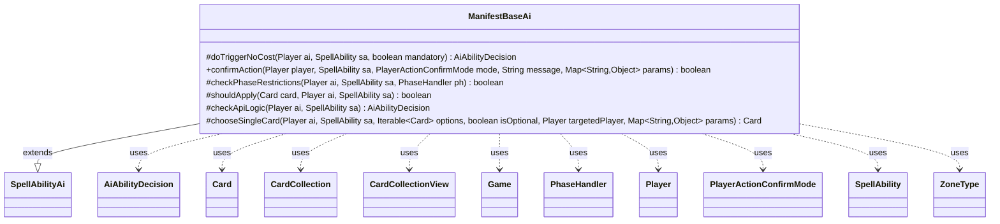

---
aliases:
  - ManifestBaseAi
tags:
  - java/class
  - module/forge-ai
  - pkg/forge/ai/ability
fqn: forge.ai.ability.ManifestBaseAi
package: forge.ai.ability
module: forge-ai
kind: Class
---

# ManifestBaseAi

**Package:** `forge.ai.ability` &nbsp; **Module:** `forge-ai` &nbsp; **Kind:** Class



## Relationships
**Extends:**
- [[forge.ai.SpellAbilityAi|SpellAbilityAi]]
**Uses:**
- [[forge.ai.AiAbilityDecision|AiAbilityDecision]]
- [[forge.game.Game|Game]]
- [[forge.game.card.Card|Card]]
- [[forge.game.card.CardCollection|CardCollection]]
- [[forge.game.card.CardCollectionView|CardCollectionView]]
- [[forge.game.phase.PhaseHandler|PhaseHandler]]
- [[forge.game.player.Player|Player]]
- [[forge.game.player.PlayerActionConfirmMode|PlayerActionConfirmMode]]
- [[forge.game.spellability.SpellAbility|SpellAbility]]
- [[forge.game.zone.ZoneType|ZoneType]]

## Design Description

ManifestBaseAi is an abstract AI strategy base for spell abilities that manifest cards (placing them face-down as 2/2 creatures). Extending `SpellAbilityAi`, it overrides the engine's standard decision hooks—`doTriggerNoCost`, `confirmAction`, `checkPhaseRestrictions`, `checkApiLogic`, and `chooseSingleCard`—to encode when and how the computer player should manifest. It collaborates with core game types (`Player`, `SpellAbility`, `Card`, `CardCollection`, `Game`, `PhaseHandler`, `ZoneType`) and returns `AiAbilityDecision` verdicts to the engine.

Its design intent is timing and target discernment: it prefers sorcery-speed plays on the AI's own turn unless a creature would be buffed, holds manifests on the opponent's turn until attackers can be ambushed, avoids self-milling when the library runs low, and validates X-cost availability. The deferred abstract `shouldApply` hook lets concrete subclasses define what makes a candidate card worth manifesting, which `chooseSingleCard` uses to filter options and pick the best one.

## Source
`forge-ai/src/main/java/forge/ai/ability/ManifestBaseAi.java`

```java
package forge.ai.ability;

import com.google.common.collect.Iterables;
import forge.ai.*;
import forge.game.Game;
import forge.game.card.Card;
import forge.game.card.CardCollection;
import forge.game.card.CardCollectionView;
import forge.game.card.CardLists;
import forge.game.phase.PhaseHandler;
import forge.game.phase.PhaseType;
import forge.game.player.Player;
import forge.game.player.PlayerActionConfirmMode;
import forge.game.spellability.SpellAbility;
import forge.game.zone.ZoneType;
import forge.util.MyRandom;

import java.util.Map;

/**
 * Created by friarsol on 1/23/15.
 */
public abstract class ManifestBaseAi extends SpellAbilityAi {

    @Override
    protected AiAbilityDecision doTriggerNoCost(Player ai, SpellAbility sa, boolean mandatory) {
        // Manifest doesn't have any "Pay X to manifest X triggers"

        return new AiAbilityDecision(100, AiPlayDecision.WillPlay);
    }
    /* (non-Javadoc)
     * @see forge.card.ability.SpellAbilityAi#confirmAction(forge.game.player.Player, forge.card.spellability.SpellAbility, forge.game.player.PlayerActionConfirmMode, java.lang.String)
     */
    @Override
    public boolean confirmAction(Player player, SpellAbility sa, PlayerActionConfirmMode mode, String message, Map<String, Object> params) {
        return true;
    }

    /**
     * Checks if the AI will play a SpellAbility based on its phase restrictions
     */
    @Override
    protected boolean checkPhaseRestrictions(final Player ai, final SpellAbility sa, final PhaseHandler ph) {
        // Only manifest things on your turn if sorcery speed, or would pump one of my creatures
        if (ph.isPlayerTurn(ai)) {
            if (ph.getPhase().isBefore(PhaseType.MAIN2)
                    && !sa.hasParam("ActivationPhases")
                    && !ComputerUtil.castSpellInMain1(ai, sa)) {
                boolean buff = false;
                for (Card c : ai.getCardsIn(ZoneType.Battlefield)) {
                    if ("Creature".equals(c.getSVar("BuffedBy"))) {
                        buff = true;
                    }
                }
                if (!buff) {
                    return false;
                }
            } else if (!isSorcerySpeed(sa, ai)) {
                return false;
            }
        } else {
            // try to ambush attackers
            if (ph.getPhase().isBefore(PhaseType.COMBAT_DECLARE_ATTACKERS)) {
                return false;
            }
        }

        if (sa.getSVar("X").equals("Count$xPaid")) {
            // Handle either Manifest X cards, or Manifest 1 card and give it X P1P1s
            int x = ComputerUtilCost.setMaxXValue(sa, ai, sa.isTrigger());
            if (x <= 0) {
                return false;
            }
        }

        return true;
    }

    abstract protected boolean shouldApply(final Card card, final Player ai, final SpellAbility sa);

    @Override
    protected AiAbilityDecision checkApiLogic(final Player ai, final SpellAbility sa) {
        final Game game = ai.getGame();
        final Card host = sa.getHostCard();

        if (sa.hasParam("Choices") || sa.hasParam("ChoiceZone")) {
            ZoneType choiceZone = ZoneType.Hand;
            if (sa.hasParam("ChoiceZone")) {
                choiceZone = ZoneType.smartValueOf(sa.getParam("ChoiceZone"));
            }
            CardCollection choices = new CardCollection(game.getCardsIn(choiceZone));
            if (sa.hasParam("Choices")) {
                choices = CardLists.getValidCards(choices, sa.getParam("Choices"), ai, host, sa);
            }
            if (choices.isEmpty()) {
                return new AiAbilityDecision(0, AiPlayDecision.CantPlaySa);
            }
        } else if ("TopOfLibrary".equals(sa.getParamOrDefault("Defined", "TopOfLibrary"))) {
            // Library is empty, no Manifest
            final CardCollectionView library = ai.getCardsIn(ZoneType.Library);
            if (library.isEmpty())
                return new AiAbilityDecision(0, AiPlayDecision.CantPlayAi);

            // try not to mill himself with Manifest
            if (library.size() < 5 && !ai.isCardInPlay("Laboratory Maniac")) {
                return new AiAbilityDecision(0, AiPlayDecision.CantPlayAi);
            }

            if (!shouldApply(library.getFirst(), ai, sa)) {
                return new AiAbilityDecision(0, AiPlayDecision.CantPlayAi);
            }
        }
        // TODO Probably should be a little more discerning on playing during OPPs turn
        if (playReusable(ai, sa)) {
            return new AiAbilityDecision(100, AiPlayDecision.WillPlay);
        }
        if (game.getPhaseHandler().is(PhaseType.COMBAT_DECLARE_ATTACKERS)) {
            // Add blockers?
            return new AiAbilityDecision(100, AiPlayDecision.AddBoardPresence);
        }
        if (sa.isAbility()) {
            return new AiAbilityDecision(100, AiPlayDecision.WillPlay);
        }

        if (MyRandom.getRandom().nextFloat() < .8) {
            // 80% chance to play a Manifest spell
            return new AiAbilityDecision(100, AiPlayDecision.WillPlay);
        }
        return new AiAbilityDecision(0, AiPlayDecision.CantPlayAi);
    }

    @Override
    protected Card chooseSingleCard(final Player ai, final SpellAbility sa, Iterable<Card> options, boolean isOptional, Player targetedPlayer, Map<String, Object> params) {
        if (Iterables.size(options) > 1 || isOptional) {
            CardCollection filtered = CardLists.filter(options, input -> shouldApply(input, ai, sa));
            if (!filtered.isEmpty()) {
                return ComputerUtilCard.getBestAI(filtered);
            }
            if (isOptional) {
                return null;
            }
        }
        return Iterables.getFirst(options, null);
    }
}
```
