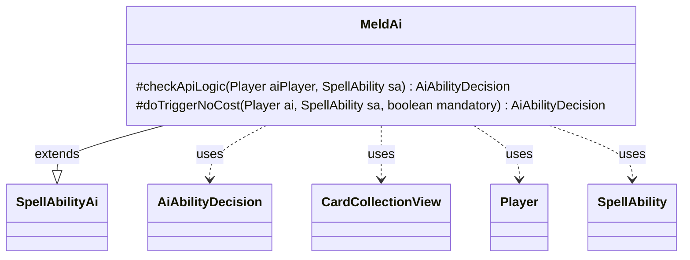

---
aliases:
  - MeldAi
tags:
  - java/class
  - module/forge-ai
  - pkg/forge/ai/ability
fqn: forge.ai.ability.MeldAi
package: forge.ai.ability
module: forge-ai
kind: Class
---

# MeldAi

**Package:** `forge.ai.ability`   **Module:** `forge-ai`   **Kind:** Class



## Relationships
**Extends:**
- [[forge.ai.SpellAbilityAi|SpellAbilityAi]]
**Uses:**
- [[forge.ai.AiAbilityDecision|AiAbilityDecision]]
- [[forge.game.card.CardCollectionView|CardCollectionView]]
- [[forge.game.player.Player|Player]]
- [[forge.game.spellability.SpellAbility|SpellAbility]]

## Design Description

The MeldAi class provides the AI decision logic for executing the Meld mechanic, where two specific cards combine into a single melded permanent. Extending `SpellAbilityAi`, it overrides the engine's standard hooks—`checkApiLogic` for voluntary play evaluation and `doTriggerNoCost` for mandatory triggered resolution—and returns its verdicts as `AiAbilityDecision` values keyed to `AiPlayDecision` outcomes.

Its core responsibility is verifying meld feasibility: it scans the AI player's battlefield (`CardCollectionView`) for both the named Primary and Secondary cards under that player's ownership, and only commits (a confidence of 100, `WillPlay`) when both halves are present and the ability's host card is the Primary piece. Absent the required pieces it reports `MissingNeededCards` or `CantPlayAi`. The unconditional `doTriggerNoCost` reflects that a mandatory meld is always worth resolving.

## Source
`forge-ai/src/main/java/forge/ai/ability/MeldAi.java`

```java
package forge.ai.ability;

import forge.ai.AiAbilityDecision;
import forge.ai.AiPlayDecision;
import forge.ai.SpellAbilityAi;
import forge.game.card.CardCollectionView;
import forge.game.card.CardPredicates;
import forge.game.player.Player;
import forge.game.spellability.SpellAbility;
import forge.game.zone.ZoneType;

public class MeldAi extends SpellAbilityAi {
    @Override
    protected AiAbilityDecision checkApiLogic(Player aiPlayer, SpellAbility sa) {
        String primaryMeld = sa.getParam("Primary");
        String secondaryMeld = sa.getParam("Secondary");
        
        CardCollectionView cardsOTB = aiPlayer.getCardsIn(ZoneType.Battlefield);
        if (cardsOTB.isEmpty()) {
            return new AiAbilityDecision(0, AiPlayDecision.MissingNeededCards);
        }

        boolean hasPrimaryMeld = cardsOTB.anyMatch(CardPredicates.nameEquals(primaryMeld).and(CardPredicates.isOwner(aiPlayer)));
        boolean hasSecondaryMeld = cardsOTB.anyMatch(CardPredicates.nameEquals(secondaryMeld).and(CardPredicates.isOwner(aiPlayer)));
        if (hasPrimaryMeld && hasSecondaryMeld && sa.getHostCard().getName().equals(primaryMeld)) {
            return new AiAbilityDecision(100, AiPlayDecision.WillPlay);
        } else {
            return new AiAbilityDecision(0, AiPlayDecision.CantPlayAi);
        }
    }
    
    @Override
    protected AiAbilityDecision doTriggerNoCost(Player ai, SpellAbility sa, boolean mandatory) {
        return new AiAbilityDecision(100, AiPlayDecision.WillPlay);
    }
}
```

## Python
`forge/ai/ability/MeldAi.py`

```python
from forge.ai.AiAbilityDecision import AiAbilityDecision
from forge.ai.AiPlayDecision import AiPlayDecision
from forge.ai.SpellAbilityAi import SpellAbilityAi
from forge.game.card.CardCollectionView import CardCollectionView
from forge.game.card.CardPredicates import CardPredicates
from forge.game.player.Player import Player
from forge.game.spellability.SpellAbility import SpellAbility
from forge.game.zone.ZoneType import ZoneType


class MeldAi(SpellAbilityAi):
    def checkApiLogic(self, aiPlayer: Player, sa: SpellAbility) -> AiAbilityDecision:
        primaryMeld = sa.getParam("Primary")
        secondaryMeld = sa.getParam("Secondary")

        cardsOTB = aiPlayer.getCardsIn(ZoneType.Battlefield)
        if cardsOTB.isEmpty():
            return AiAbilityDecision(0, AiPlayDecision.MissingNeededCards)

        hasPrimaryMeld = cardsOTB.anyMatch(CardPredicates.nameEquals(primaryMeld).and_(CardPredicates.isOwner(aiPlayer)))
        hasSecondaryMeld = cardsOTB.anyMatch(CardPredicates.nameEquals(secondaryMeld).and_(CardPredicates.isOwner(aiPlayer)))
        if hasPrimaryMeld and hasSecondaryMeld and sa.getHostCard().getName() == primaryMeld:
            return AiAbilityDecision(100, AiPlayDecision.WillPlay)
        else:
            return AiAbilityDecision(0, AiPlayDecision.CantPlayAi)

    def doTriggerNoCost(self, ai: Player, sa: SpellAbility, mandatory: bool) -> AiAbilityDecision:
        return AiAbilityDecision(100, AiPlayDecision.WillPlay)
```
