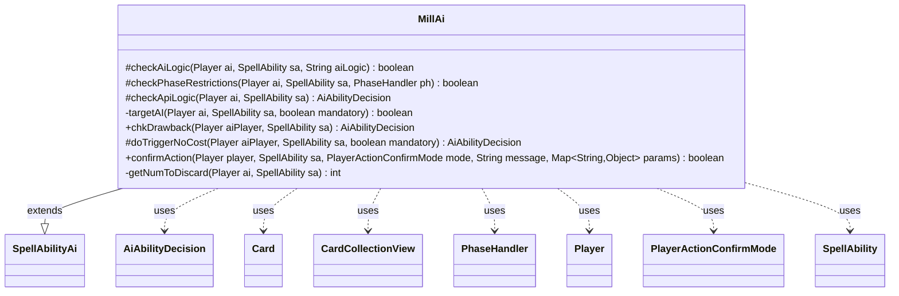

---
aliases:
  - MillAi
tags:
  - java/class
  - module/forge-ai
  - pkg/forge/ai/ability
fqn: forge.ai.ability.MillAi
package: forge.ai.ability
module: forge-ai
kind: Class
---

# MillAi

**Package:** `forge.ai.ability`   **Module:** `forge-ai`   **Kind:** Class



## Relationships
**Extends:**
- [[forge.ai.SpellAbilityAi|SpellAbilityAi]]
**Uses:**
- [[forge.ai.AiAbilityDecision|AiAbilityDecision]]
- [[forge.game.card.Card|Card]]
- [[forge.game.card.CardCollectionView|CardCollectionView]]
- [[forge.game.phase.PhaseHandler|PhaseHandler]]
- [[forge.game.player.Player|Player]]
- [[forge.game.player.PlayerActionConfirmMode|PlayerActionConfirmMode]]
- [[forge.game.spellability.SpellAbility|SpellAbility]]

## Design Description

MillAi supplies the AI decision logic for "mill" effects — spell abilities that move cards from a library to the graveyard. As a concrete subclass of `SpellAbilityAi`, it overrides the framework's decision hooks (`checkAiLogic`, `checkPhaseRestrictions`, `checkApiLogic`, `doTriggerNoCost`, `chkDrawback`, and `confirmAction`) to tell the engine whether and when the computer should activate a given milling ability, returning `AiAbilityDecision` verdicts that encode both a confidence score and an `AiPlayDecision`.

Its central responsibility is target selection: the private `targetAI` helper iterates the AI's opponents, computes how many cards each ability would mill (via `AbilityUtils`), and prefers the player nearest to being decked, falling back to self-targeting only when mandatory. Supporting logic guards against self-mill on small libraries, restricts timing by phase (self-mill at the opponent's end step, tap-cost creatures held for combat), and sizes X-cost payments through `getNumToDiscard`. It collaborates with `Player`, `Card`, `CardCollectionView`, and `PhaseHandler` purely as a read-only advisor, leaving execution to the game engine. Numerous TODOs reveal the milling heuristics are intentionally conservative and incomplete.

## Source
`forge-ai/src/main/java/forge/ai/ability/MillAi.java`

```java
package forge.ai.ability;

import com.google.common.collect.Lists;
import com.google.common.collect.Maps;
import forge.ai.*;
import forge.game.ability.AbilityUtils;
import forge.game.card.Card;
import forge.game.card.CardCollectionView;
import forge.game.card.CardLists;
import forge.game.card.CardPredicates;
import forge.game.phase.PhaseHandler;
import forge.game.phase.PhaseType;
import forge.game.player.Player;
import forge.game.player.PlayerActionConfirmMode;
import forge.game.player.PlayerPredicates;
import forge.game.spellability.SpellAbility;
import forge.game.zone.ZoneType;

import java.util.Collections;
import java.util.List;
import java.util.Map;

public class MillAi extends SpellAbilityAi {

    @Override
    protected boolean checkAiLogic(final Player ai, final SpellAbility sa, final String aiLogic) {
        if (aiLogic.equals("LilianaMill")) {
            // TODO convert to AICheckSVar
            // Only mill if a "Raise Dead" target is available, in case of control decks with few creatures
            return CardLists.filter(ai.getCardsIn(ZoneType.Graveyard), CardPredicates.CREATURES).size() >= 1;
        }
        return true;
    }
    
    @Override
    protected boolean checkPhaseRestrictions(final Player ai, final SpellAbility sa, final PhaseHandler ph) {
        if ("ExileAndPlayUntilEOT".equals(sa.getParam("AILogic"))) {
            return ph.is(PhaseType.MAIN1) && ph.isPlayerTurn(ai); // try to maximize the chance of being able to play the card this turn
        } else if ("ExileAndPlayOrDealDamage".equals(sa.getParam("AILogic"))) {
            return (ph.is(PhaseType.MAIN1) || ph.is(PhaseType.MAIN2)) && ph.isPlayerTurn(ai); // Chandra, Torch of Defiance and similar
        }
        if (!sa.isPwAbility()) { // Planeswalker abilities are only activated at sorcery speed
            if ("You".equals(sa.getParam("Defined")) && !(!isSorcerySpeed(sa, ai) && ph.is(PhaseType.END_OF_TURN)
                    && ph.getNextTurn().equals(ai))) {
                return false; // only self-mill at opponent EOT
            }
        }
        if (sa.getHostCard().isCreature() && sa.getPayCosts().hasTapCost()) {
            // creatures with a tap cost to mill (e.g. Doorkeeper) should be activated at the opponent's end step
            // because they are also potentially useful for combat
            return ph.is(PhaseType.END_OF_TURN) && ph.getNextTurn().equals(ai);
        }
        return !ph.getPhase().isBefore(PhaseType.MAIN2) || sa.hasParam("ActivationPhases")
                || ComputerUtil.castSpellInMain1(ai, sa);
    }

    @Override
    protected AiAbilityDecision checkApiLogic(final Player ai, final SpellAbility sa) {
        /*
         * TODO:
         * - logic in targetAI looks dodgy
         * - decide whether to self-mill (eg. delirium, dredge, bad top card)
         * - interrupt opponent's top card (eg. Brainstorm, good top card)
         * - check for Laboratory Maniac effect (needs to check for actual
         * effect due to possibility of "lose abilities" effect)
         */

        if (("You".equals(sa.getParam("Defined")) || "Player".equals(sa.getParam("Defined")))
                && ai.getCardsIn(ZoneType.Library).size() < 10) {
            // prevent self and each player mill when library is small
            return new AiAbilityDecision(0, AiPlayDecision.CantPlayAi);
        }
        
        if (sa.usesTargeting() && !targetAI(ai, sa, false)) {
            return new AiAbilityDecision(0, AiPlayDecision.TargetingFailed);
        }

        if (sa.hasParam("NumCards") && (sa.getParam("NumCards").equals("X") || sa.getParam("NumCards").equals("Z"))
                && sa.getSVar("X").startsWith("Count$xPaid")) {
            // Set PayX here to maximum value.
            final int cardsToDiscard = getNumToDiscard(ai, sa);
            sa.setXManaCostPaid(cardsToDiscard);
            if (cardsToDiscard <= 0) {
                return new AiAbilityDecision(0, AiPlayDecision.CantAffordX);
            }
        }
        return new AiAbilityDecision(100, AiPlayDecision.WillPlay);
    }

    private boolean targetAI(final Player ai, final SpellAbility sa, final boolean mandatory) {
        final Card source = sa.getHostCard();

        if (sa.usesTargeting()) {
            sa.resetTargets();
            final Map<Player, Integer> list = Maps.newHashMap();
            for (final Player o : ai.getOpponents()) {
                if (!sa.canTarget(o)) {
                    continue;
                }

                int numCards;
                if (sa.hasParam("NumCards")) {
                    // need to set as target for some calculate
                    sa.getTargets().add(o);
                    numCards = AbilityUtils.calculateAmount(sa.getHostCard(), sa.getParam("NumCards"), sa);
                    sa.getTargets().remove(o);
                } else {
                    numCards = 1;
                }

                // if it would mill none, try other one
                if (numCards <= 0) {
                    if (sa.hasParam("NumCards") && (sa.getParam("NumCards").equals("X") || sa.getParam("NumCards").equals("Z"))) {
                        if (source.getSVar("X").startsWith("Count$xPaid")) {
                            // Spell is PayX based
                        } else if (source.getSVar("X").startsWith("Remembered$ChromaSource")) {
                            // Cards like Sanity Grinding
                        } else {
                            continue;
                        }
                    } else {
                        continue;
                    }
                }

                final CardCollectionView pLibrary = o.getCardsIn(ZoneType.Library);
                if (pLibrary.isEmpty()) {
                    continue;
                }

                // if that player can be milled, select this one.
                if (numCards >= pLibrary.size()) {
                    sa.getTargets().add(o);
                    return true;
                }

                list.put(o, numCards);
            }

            // can't target opponent?
            if (list.isEmpty()) {
                if (mandatory && !sa.isTargetNumberValid() && sa.canTarget(ai)) {
                    sa.getTargets().add(ai);
                    return true;
                }
                // TODO Obscure case when you know what your top card is so you might?
                // want to mill yourself here
                return sa.isTargetNumberValid();
            }

            // select Player which would cause the most damage
            Map.Entry<Player, Integer> max = Collections.max(list.entrySet(), Map.Entry.comparingByValue());

            sa.getTargets().add(max.getKey());
        }
        return true;
    }

    @Override
    public AiAbilityDecision chkDrawback(Player aiPlayer, SpellAbility sa) {
        return targetAI(aiPlayer, sa, true) ? new AiAbilityDecision(100, AiPlayDecision.WillPlay) : new AiAbilityDecision(0, AiPlayDecision.CantPlayAi);
    }

    @Override
    protected AiAbilityDecision doTriggerNoCost(Player aiPlayer, SpellAbility sa, boolean mandatory) {
        if (!targetAI(aiPlayer, sa, mandatory)) {
            return new AiAbilityDecision(0, AiPlayDecision.CantPlayAi);
        }

        if (sa.hasParam("NumCards") && (sa.getParam("NumCards").equals("X") && sa.getSVar("X").equals("Count$xPaid"))) {
            // Set PayX here to maximum value.
            sa.setXManaCostPaid(getNumToDiscard(aiPlayer, sa));
        }

        return new AiAbilityDecision(100, AiPlayDecision.WillPlay);
    }
    /* (non-Javadoc)
     * @see forge.card.ability.SpellAbilityAi#confirmAction(forge.game.player.Player, forge.card.spellability.SpellAbility, forge.game.player.PlayerActionConfirmMode, java.lang.String)
     */
    @Override
    public boolean confirmAction(Player player, SpellAbility sa, PlayerActionConfirmMode mode, String message, Map<String, Object> params) {
        if ("TimmerianFiends".equals(sa.getParam("AILogic"))) {
            return SpecialCardAi.TimmerianFiends.consider(player, sa);
        }

        return true;
    }

    /*
     * return num of cards to discard
     */
    private int getNumToDiscard(final Player ai, final SpellAbility sa) {
        // need list of affected players
        List<Player> list = Lists.newArrayList();
        if (sa.usesTargeting()) {
            list.addAll(Lists.newArrayList(sa.getTargets().getTargetPlayers()));
        } else {
            list.addAll(AbilityUtils.getDefinedPlayers(sa.getHostCard(), sa.getParam("Defined"), sa));
        }

        // get targeted or defined Player with largest library 
        final Player m = Collections.max(list, PlayerPredicates.compareByZoneSize(ZoneType.Library));

        int cardsToDiscard =  m.getCardsIn(ZoneType.Library).size();

        // if ai is in affected list too, try to not mill himself
        if (list.contains(ai)) {
            cardsToDiscard = Math.min(ai.getCardsIn(ZoneType.Library).size() - 5, cardsToDiscard);
        }

        return Math.min(ComputerUtilCost.setMaxXValue(sa, ai, sa.isTrigger()), cardsToDiscard);
    }
}
```

## Python
`forge/ai/ability/MillAi.py`

```python
from forge.ai.SpellAbilityAi import SpellAbilityAi
from forge.ai.AiAbilityDecision import AiAbilityDecision
from forge.ai.AiPlayDecision import AiPlayDecision
from forge.ai.ComputerUtil import ComputerUtil
from forge.ai.ComputerUtilCost import ComputerUtilCost
from forge.ai.SpecialCardAi import SpecialCardAi
from forge.game.ability.AbilityUtils import AbilityUtils
from forge.game.card.Card import Card
from forge.game.card.CardCollectionView import CardCollectionView
from forge.game.card.CardLists import CardLists
from forge.game.card.CardPredicates import CardPredicates
from forge.game.phase.PhaseHandler import PhaseHandler
from forge.game.phase.PhaseType import PhaseType
from forge.game.player.Player import Player
from forge.game.player.PlayerActionConfirmMode import PlayerActionConfirmMode
from forge.game.player.PlayerPredicates import PlayerPredicates
from forge.game.spellability.SpellAbility import SpellAbility
from forge.game.zone.ZoneType import ZoneType


class MillAi(SpellAbilityAi):

    def checkAiLogic(self, ai: Player, sa: SpellAbility, aiLogic: str) -> bool:
        if aiLogic == "LilianaMill":
            # TODO convert to AICheckSVar
            # Only mill if a "Raise Dead" target is available, in case of control decks with few creatures
            return CardLists.filter(ai.getCardsIn(ZoneType.Graveyard), CardPredicates.CREATURES).size() >= 1
        return True

    def checkPhaseRestrictions(self, ai: Player, sa: SpellAbility, ph: PhaseHandler) -> bool:
        if "ExileAndPlayUntilEOT" == sa.getParam("AILogic"):
            return ph.is_(PhaseType.MAIN1) and ph.isPlayerTurn(ai)  # try to maximize the chance of being able to play the card this turn
        elif "ExileAndPlayOrDealDamage" == sa.getParam("AILogic"):
            return (ph.is_(PhaseType.MAIN1) or ph.is_(PhaseType.MAIN2)) and ph.isPlayerTurn(ai)  # Chandra, Torch of Defiance and similar
        if not sa.isPwAbility():  # Planeswalker abilities are only activated at sorcery speed
            if "You" == sa.getParam("Defined") and not (not self.isSorcerySpeed(sa, ai) and ph.is_(PhaseType.END_OF_TURN)
                    and ph.getNextTurn() == ai):
                return False  # only self-mill at opponent EOT
        if sa.getHostCard().isCreature() and sa.getPayCosts().hasTapCost():
            # creatures with a tap cost to mill (e.g. Doorkeeper) should be activated at the opponent's end step
            # because they are also potentially useful for combat
            return ph.is_(PhaseType.END_OF_TURN) and ph.getNextTurn() == ai
        return not ph.getPhase().isBefore(PhaseType.MAIN2) or sa.hasParam("ActivationPhases") \
                or ComputerUtil.castSpellInMain1(ai, sa)

    def checkApiLogic(self, ai: Player, sa: SpellAbility) -> AiAbilityDecision:
        #
        # TODO:
        # - logic in targetAI looks dodgy
        # - decide whether to self-mill (eg. delirium, dredge, bad top card)
        # - interrupt opponent's top card (eg. Brainstorm, good top card)
        # - check for Laboratory Maniac effect (needs to check for actual
        # effect due to possibility of "lose abilities" effect)
        #

        if (("You" == sa.getParam("Defined") or "Player" == sa.getParam("Defined"))
                and ai.getCardsIn(ZoneType.Library).size() < 10):
            # prevent self and each player mill when library is small
            return AiAbilityDecision(0, AiPlayDecision.CantPlayAi)

        if sa.usesTargeting() and not self.targetAI(ai, sa, False):
            return AiAbilityDecision(0, AiPlayDecision.TargetingFailed)

        if (sa.hasParam("NumCards") and (sa.getParam("NumCards") == "X" or sa.getParam("NumCards") == "Z")
                and sa.getSVar("X").startswith("Count$xPaid")):
            # Set PayX here to maximum value.
            cardsToDiscard = self.getNumToDiscard(ai, sa)
            sa.setXManaCostPaid(cardsToDiscard)
            if cardsToDiscard <= 0:
                return AiAbilityDecision(0, AiPlayDecision.CantAffordX)
        return AiAbilityDecision(100, AiPlayDecision.WillPlay)

    def targetAI(self, ai: Player, sa: SpellAbility, mandatory: bool) -> bool:
        source = sa.getHostCard()

        if sa.usesTargeting():
            sa.resetTargets()
            list: dict[Player, int] = {}
            for o in ai.getOpponents():
                if not sa.canTarget(o):
                    continue

                if sa.hasParam("NumCards"):
                    # need to set as target for some calculate
                    sa.getTargets().add(o)
                    numCards = AbilityUtils.calculateAmount(sa.getHostCard(), sa.getParam("NumCards"), sa)
                    sa.getTargets().remove(o)
                else:
                    numCards = 1

                # if it would mill none, try other one
                if numCards <= 0:
                    if sa.hasParam("NumCards") and (sa.getParam("NumCards") == "X" or sa.getParam("NumCards") == "Z"):
                        if source.getSVar("X").startswith("Count$xPaid"):
                            # Spell is PayX based
                            pass
                        elif source.getSVar("X").startswith("Remembered$ChromaSource"):
                            # Cards like Sanity Grinding
                            pass
                        else:
                            continue
                    else:
                        continue

                pLibrary = o.getCardsIn(ZoneType.Library)
                if pLibrary.isEmpty():
                    continue

                # if that player can be milled, select this one.
                if numCards >= pLibrary.size():
                    sa.getTargets().add(o)
                    return True

                list[o] = numCards

            # can't target opponent?
            if not list:
                if mandatory and not sa.isTargetNumberValid() and sa.canTarget(ai):
                    sa.getTargets().add(ai)
                    return True
                # TODO Obscure case when you know what your top card is so you might?
                # want to mill yourself here
                return sa.isTargetNumberValid()

            # select Player which would cause the most damage
            max_entry = max(list.items(), key=lambda e: e[1])

            sa.getTargets().add(max_entry[0])
        return True

    def chkDrawback(self, aiPlayer: Player, sa: SpellAbility) -> AiAbilityDecision:
        return AiAbilityDecision(100, AiPlayDecision.WillPlay) if self.targetAI(aiPlayer, sa, True) else AiAbilityDecision(0, AiPlayDecision.CantPlayAi)

    def doTriggerNoCost(self, aiPlayer: Player, sa: SpellAbility, mandatory: bool) -> AiAbilityDecision:
        if not self.targetAI(aiPlayer, sa, mandatory):
            return AiAbilityDecision(0, AiPlayDecision.CantPlayAi)

        if sa.hasParam("NumCards") and (sa.getParam("NumCards") == "X" and sa.getSVar("X") == "Count$xPaid"):
            # Set PayX here to maximum value.
            sa.setXManaCostPaid(self.getNumToDiscard(aiPlayer, sa))

        return AiAbilityDecision(100, AiPlayDecision.WillPlay)

    # (non-Javadoc)
    # @see forge.card.ability.SpellAbilityAi#confirmAction(forge.game.player.Player, forge.card.spellability.SpellAbility, forge.game.player.PlayerActionConfirmMode, java.lang.String)
    def confirmAction(self, player: Player, sa: SpellAbility, mode: PlayerActionConfirmMode, message: str, params: dict[str, object]) -> bool:
        if "TimmerianFiends" == sa.getParam("AILogic"):
            return SpecialCardAi.TimmerianFiends.consider(player, sa)

        return True

    #
    # return num of cards to discard
    #
    def getNumToDiscard(self, ai: Player, sa: SpellAbility) -> int:
        # need list of affected players
        list: list[Player] = []
        if sa.usesTargeting():
            list.extend(sa.getTargets().getTargetPlayers())
        else:
            list.extend(AbilityUtils.getDefinedPlayers(sa.getHostCard(), sa.getParam("Defined"), sa))

        # get targeted or defined Player with largest library
        m = max(list, key=lambda p: p.getCardsIn(ZoneType.Library).size())

        cardsToDiscard = m.getCardsIn(ZoneType.Library).size()

        # if ai is in affected list too, try to not mill himself
        if ai in list:
            cardsToDiscard = min(ai.getCardsIn(ZoneType.Library).size() - 5, cardsToDiscard)

        return min(ComputerUtilCost.setMaxXValue(sa, ai, sa.isTrigger()), cardsToDiscard)
```
