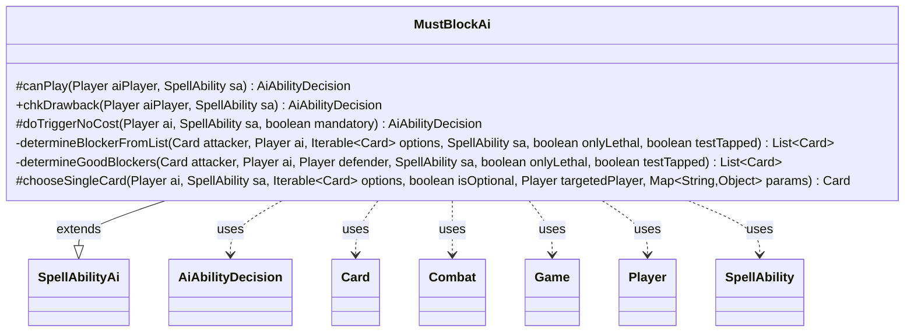

---
aliases:
  - MustBlockAi
tags:
  - java/class
  - module/forge-ai
  - pkg/forge/ai/ability
fqn: forge.ai.ability.MustBlockAi
package: forge.ai.ability
module: forge-ai
kind: Class
---

# MustBlockAi

**Package:** `forge.ai.ability`   **Module:** `forge-ai`   **Kind:** Class



## Relationships
**Extends:**
- [[forge.ai.SpellAbilityAi|SpellAbilityAi]]
**Uses:**
- [[forge.ai.AiAbilityDecision|AiAbilityDecision]]
- [[forge.game.Game|Game]]
- [[forge.game.card.Card|Card]]
- [[forge.game.combat.Combat|Combat]]
- [[forge.game.player.Player|Player]]
- [[forge.game.spellability.SpellAbility|SpellAbility]]

## Design Description

MustBlockAi is the forge-ai decision handler for "must block" effects (such as Provoke and "target creature blocks CARDNAME"), determining whether and how the AI should employ an ability that forces an opponent's creature to block a given attacker. Extending SpellAbilityAi, it overrides the standard hooks—canPlay, chkDrawback, doTriggerNoCost, and chooseSingleCard—and collaborates with Card, Combat, Game, Player, and SpellAbility, returning AiAbilityDecision verdicts.

Its core logic lives in the private helpers determineGoodBlockers and determineBlockerFromList, which filter a defender's creatures to those that can legally block yet would not destroy the attacker and (when onlyLethal) would themselves die—so the AI provokes blocks that trade favorably. Notable design intent includes limiting activations to one creature per card to avoid overextending, declining provokes that would prevent otherwise-lethal damage, and bowing out of unsupported "DefinedAttacker" cases the AI cannot yet evaluate.

## Source
`forge-ai/src/main/java/forge/ai/ability/MustBlockAi.java`

```java
package forge.ai.ability;

import com.google.common.collect.Iterables;
import forge.ai.*;
import forge.game.Game;
import forge.game.ability.AbilityUtils;
import forge.game.card.Card;
import forge.game.card.CardLists;
import forge.game.card.CardUtil;
import forge.game.combat.Combat;
import forge.game.combat.CombatUtil;
import forge.game.keyword.Keyword;
import forge.game.player.Player;
import forge.game.spellability.SpellAbility;

import java.util.List;
import java.util.Map;

public class MustBlockAi extends SpellAbilityAi {

    @Override
    protected AiAbilityDecision canPlay(Player aiPlayer, SpellAbility sa) {
        final Card source = sa.getHostCard();
        final Game game = aiPlayer.getGame();
        final Combat combat = game.getCombat();
        final boolean onlyLethal = !"AllowNonLethal".equals(sa.getParam("AILogic"));

        if (combat == null || !combat.isAttacking(source)) {
            return new AiAbilityDecision(0, AiPlayDecision.CantPlayAi);
        }
        if (source.getAbilityActivatedThisTurn().getActivators(sa).contains(aiPlayer)) {
            // The AI can meaningfully do it only to one creature per card yet, trying to do it to multiple cards
            // may result in overextending and losing the attacker
            return new AiAbilityDecision(0, AiPlayDecision.CantPlayAi);
        }

        final List<Card> list = determineGoodBlockers(source, aiPlayer, combat.getDefenderPlayerByAttacker(source), sa, onlyLethal,false);

        if (!list.isEmpty()) {
            final Card blocker = ComputerUtilCard.getBestCreatureAI(list);
            sa.getTargets().add(blocker);
            return new AiAbilityDecision(100, AiPlayDecision.WillPlay);
        }

        return new AiAbilityDecision(0, AiPlayDecision.CantPlayAi);
    }

    @Override
    public AiAbilityDecision chkDrawback(Player aiPlayer, SpellAbility sa) {
        if (sa.hasParam("DefinedAttacker")) {
            // The AI can't handle "target creature blocks another target creature" abilities yet
            return new AiAbilityDecision(0, AiPlayDecision.CantPlayAi);
        }

        // Otherwise it's a standard targeted "target creature blocks CARDNAME" ability, so use the main canPlayAI code path
        return canPlay(aiPlayer, sa);
    }

    @Override
    protected AiAbilityDecision doTriggerNoCost(final Player ai, SpellAbility sa, boolean mandatory) {
        final Card source = sa.getHostCard();

        Card attacker = source;
        if (sa.hasParam("DefinedAttacker")) {
            final List<Card> cards = AbilityUtils.getDefinedCards(source, sa.getParam("DefinedAttacker"), sa);
            if (cards.isEmpty()) {
                return new AiAbilityDecision(0, AiPlayDecision.CantPlayAi);
            }

            attacker = cards.get(0);
        }

        boolean chance = false;

        if (sa.usesTargeting()) {
            List<Card> list = determineGoodBlockers(attacker, ai, ai.getWeakestOpponent(), sa, true, true);
            if (list.isEmpty() && mandatory) {
                list = CardUtil.getValidCardsToTarget(sa);
            }
            final Card blocker = ComputerUtilCard.getBestCreatureAI(list);
            if (blocker == null) {
                if (sa.isTargetNumberValid()) {
                    return new AiAbilityDecision(100, AiPlayDecision.WillPlay);
                } else {
                    return new AiAbilityDecision(0, AiPlayDecision.TargetingFailed);
                }
            }

            if (!mandatory && sa.isKeyword(Keyword.PROVOKE) && blocker.isTapped()) {
                // Don't provoke if the attack is potentially lethal
                Combat combat = ai.getGame().getCombat();
                if (combat != null) {
                    Player defender = combat.getDefenderPlayerByAttacker(source);
                    if (defender != null && combat.getAttackingPlayer().equals(ai)
                            && defender.canLoseLife() && !defender.cantLoseForZeroOrLessLife()
                            && ComputerUtilCombat.lifeThatWouldRemain(defender, combat) <= 0) {
                        return new AiAbilityDecision(0, AiPlayDecision.CantPlayAi);
                    }
                }
            }

            sa.getTargets().add(blocker);
            chance = true;
        } else if (sa.hasParam("Choices")) {
            // currently choice is attacked player
            return new AiAbilityDecision(100, AiPlayDecision.WillPlay);
        } else {
            return new AiAbilityDecision(0, AiPlayDecision.CantPlayAi);
        }

        if (chance) {
            return new AiAbilityDecision(100, AiPlayDecision.WillPlay);
        }

        return new AiAbilityDecision(0, AiPlayDecision.StopRunawayActivations);
    }

    private List<Card> determineBlockerFromList(final Card attacker, final Player ai, Iterable<Card> options, SpellAbility sa,
            final boolean onlyLethal, final boolean testTapped) {
        List<Card> list = CardLists.filter(options, c -> {
            if (!CombatUtil.canBlock(attacker, c, testTapped)) {
                return false;
            }
            if (ComputerUtilCombat.canDestroyAttacker(ai, attacker, c, null, false)) {
                return false;
            }
            if (onlyLethal && !ComputerUtilCombat.canDestroyBlocker(ai, c, attacker, null, false)) {
                return false;
            }
            return true;
        });

        return list;
    }

    private List<Card> determineGoodBlockers(final Card attacker, final Player ai, Player defender, SpellAbility sa,
            final boolean onlyLethal, final boolean testTapped) {
        List<Card> list = defender.getCreaturesInPlay();

        if (sa.usesTargeting()) {
            list = CardLists.getTargetableCards(list, sa);
        }
        return determineBlockerFromList(attacker, ai, list, sa, onlyLethal, testTapped);
    }

    @Override
    protected Card chooseSingleCard(Player ai, SpellAbility sa, Iterable<Card> options, boolean isOptional,
            Player targetedPlayer, Map<String, Object> params) {
        final Card host = sa.getHostCard();

        Card attacker = host;

        if (sa.hasParam("DefinedAttacker")) {
            List<Card> attackers = AbilityUtils.getDefinedCards(host, sa.getParam("DefinedAttacker"), sa);
            attacker = Iterables.getFirst(attackers, null);
        }
        if (attacker == null) {
            return Iterables.getFirst(options, null);
        }

        List<Card> better = determineBlockerFromList(attacker, ai, options, sa, false, false);

        if (!better.isEmpty()) {
            return Iterables.getFirst(better, null);
        }

        return Iterables.getFirst(options, null);
    }
}
```

## Python
`forge/ai/ability/MustBlockAi.py`

```python
from forge.ai.SpellAbilityAi import SpellAbilityAi
from forge.ai.AiAbilityDecision import AiAbilityDecision
from forge.ai.AiPlayDecision import AiPlayDecision
from forge.ai.ComputerUtilCard import ComputerUtilCard
from forge.ai.ComputerUtilCombat import ComputerUtilCombat
from forge.game.Game import Game
from forge.game.ability.AbilityUtils import AbilityUtils
from forge.game.card.Card import Card
from forge.game.card.CardLists import CardLists
from forge.game.card.CardUtil import CardUtil
from forge.game.combat.Combat import Combat
from forge.game.combat.CombatUtil import CombatUtil
from forge.game.keyword.Keyword import Keyword
from forge.game.player.Player import Player
from forge.game.spellability.SpellAbility import SpellAbility

from typing import Iterable, List, Map


class MustBlockAi(SpellAbilityAi):

    def canPlay(self, aiPlayer: Player, sa: SpellAbility) -> AiAbilityDecision:
        source = sa.getHostCard()
        game = aiPlayer.getGame()
        combat = game.getCombat()
        onlyLethal = "AllowNonLethal" != sa.getParam("AILogic")

        if combat is None or not combat.isAttacking(source):
            return AiAbilityDecision(0, AiPlayDecision.CantPlayAi)
        if aiPlayer in source.getAbilityActivatedThisTurn().getActivators(sa):
            # The AI can meaningfully do it only to one creature per card yet, trying to do it to multiple cards
            # may result in overextending and losing the attacker
            return AiAbilityDecision(0, AiPlayDecision.CantPlayAi)

        list = self.determineGoodBlockers(source, aiPlayer, combat.getDefenderPlayerByAttacker(source), sa, onlyLethal, False)

        if list:
            blocker = ComputerUtilCard.getBestCreatureAI(list)
            sa.getTargets().add(blocker)
            return AiAbilityDecision(100, AiPlayDecision.WillPlay)

        return AiAbilityDecision(0, AiPlayDecision.CantPlayAi)

    def chkDrawback(self, aiPlayer: Player, sa: SpellAbility) -> AiAbilityDecision:
        if sa.hasParam("DefinedAttacker"):
            # The AI can't handle "target creature blocks another target creature" abilities yet
            return AiAbilityDecision(0, AiPlayDecision.CantPlayAi)

        # Otherwise it's a standard targeted "target creature blocks CARDNAME" ability, so use the main canPlayAI code path
        return self.canPlay(aiPlayer, sa)

    def doTriggerNoCost(self, ai: Player, sa: SpellAbility, mandatory: bool) -> AiAbilityDecision:
        source = sa.getHostCard()

        attacker = source
        if sa.hasParam("DefinedAttacker"):
            cards = AbilityUtils.getDefinedCards(source, sa.getParam("DefinedAttacker"), sa)
            if not cards:
                return AiAbilityDecision(0, AiPlayDecision.CantPlayAi)

            attacker = cards[0]

        chance = False

        if sa.usesTargeting():
            list = self.determineGoodBlockers(attacker, ai, ai.getWeakestOpponent(), sa, True, True)
            if not list and mandatory:
                list = CardUtil.getValidCardsToTarget(sa)
            blocker = ComputerUtilCard.getBestCreatureAI(list)
            if blocker is None:
                if sa.isTargetNumberValid():
                    return AiAbilityDecision(100, AiPlayDecision.WillPlay)
                else:
                    return AiAbilityDecision(0, AiPlayDecision.TargetingFailed)

            if not mandatory and sa.isKeyword(Keyword.PROVOKE) and blocker.isTapped():
                # Don't provoke if the attack is potentially lethal
                combat = ai.getGame().getCombat()
                if combat is not None:
                    defender = combat.getDefenderPlayerByAttacker(source)
                    if (defender is not None and combat.getAttackingPlayer() == ai
                            and defender.canLoseLife() and not defender.cantLoseForZeroOrLessLife()
                            and ComputerUtilCombat.lifeThatWouldRemain(defender, combat) <= 0):
                        return AiAbilityDecision(0, AiPlayDecision.CantPlayAi)

            sa.getTargets().add(blocker)
            chance = True
        elif sa.hasParam("Choices"):
            # currently choice is attacked player
            return AiAbilityDecision(100, AiPlayDecision.WillPlay)
        else:
            return AiAbilityDecision(0, AiPlayDecision.CantPlayAi)

        if chance:
            return AiAbilityDecision(100, AiPlayDecision.WillPlay)

        return AiAbilityDecision(0, AiPlayDecision.StopRunawayActivations)

    def determineBlockerFromList(self, attacker: Card, ai: Player, options: Iterable[Card], sa: SpellAbility,
            onlyLethal: bool, testTapped: bool) -> List[Card]:
        def predicate(c):
            if not CombatUtil.canBlock(attacker, c, testTapped):
                return False
            if ComputerUtilCombat.canDestroyAttacker(ai, attacker, c, None, False):
                return False
            if onlyLethal and not ComputerUtilCombat.canDestroyBlocker(ai, c, attacker, None, False):
                return False
            return True

        list = CardLists.filter(options, predicate)

        return list

    def determineGoodBlockers(self, attacker: Card, ai: Player, defender: Player, sa: SpellAbility,
            onlyLethal: bool, testTapped: bool) -> List[Card]:
        list = defender.getCreaturesInPlay()

        if sa.usesTargeting():
            list = CardLists.getTargetableCards(list, sa)
        return self.determineBlockerFromList(attacker, ai, list, sa, onlyLethal, testTapped)

    def chooseSingleCard(self, ai: Player, sa: SpellAbility, options: Iterable[Card], isOptional: bool,
            targetedPlayer: Player, params: Map[str, object]) -> Card:
        host = sa.getHostCard()

        attacker = host

        if sa.hasParam("DefinedAttacker"):
            attackers = AbilityUtils.getDefinedCards(host, sa.getParam("DefinedAttacker"), sa)
            attacker = Iterables.getFirst(attackers, None)
        if attacker is None:
            return Iterables.getFirst(options, None)

        better = self.determineBlockerFromList(attacker, ai, options, sa, False, False)

        if better:
            return Iterables.getFirst(better, None)

        return Iterables.getFirst(options, None)
```
