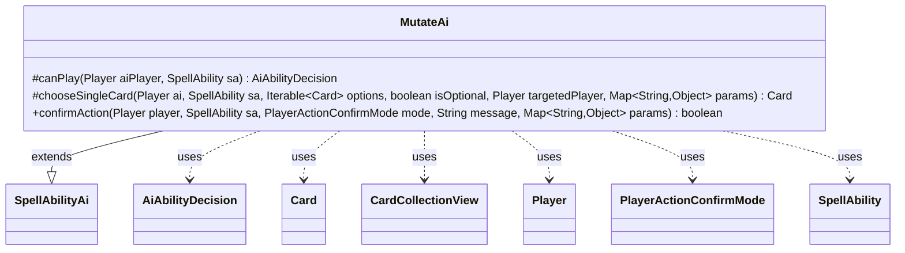

---
aliases:
  - MutateAi
tags:
  - java/class
  - module/forge-ai
  - pkg/forge/ai/ability
fqn: forge.ai.ability.MutateAi
package: forge.ai.ability
module: forge-ai
kind: Class
---

# MutateAi

**Package:** `forge.ai.ability` &nbsp; **Module:** `forge-ai` &nbsp; **Kind:** Class



## Relationships
**Extends:**
- [[forge.ai.SpellAbilityAi|SpellAbilityAi]]
**Uses:**
- [[forge.ai.AiAbilityDecision|AiAbilityDecision]]
- [[forge.game.card.Card|Card]]
- [[forge.game.card.CardCollectionView|CardCollectionView]]
- [[forge.game.player.Player|Player]]
- [[forge.game.player.PlayerActionConfirmMode|PlayerActionConfirmMode]]
- [[forge.game.spellability.SpellAbility|SpellAbility]]

## Design Description

MutateAi supplies the AI decision logic for casting Mutate spells, concentrating the engine's heuristics for *when* and *how* a computer player should mutate a creature. As a concrete subclass of `SpellAbilityAi`, it overrides three hooks: `canPlay` selects a target by gathering the AI's creatures, discarding ones that are useless to mutate onto (Defenders, can't-attack/block creatures, otherwise dead weight), and committing the best survivor via `ComputerUtilCard.getBestCreatureAI`; `chooseSingleCard` decides which card ends up on top of the merged pile, favoring the highest base power or toughness; and `confirmAction` unconditionally accepts.

It collaborates with the game model (`Card`, `CardCollectionView`, `Player`, `SpellAbility`) and returns scored `AiAbilityDecision` results to the AI framework. The code is deliberately conservative and self-documented as provisional—TODO comments flag the rudimentary evaluation and invite context-aware improvements—reflecting a working-but-minimal placeholder rather than fully tuned strategy.

## Source
`forge-ai/src/main/java/forge/ai/ability/MutateAi.java`

```java
package forge.ai.ability;

import forge.ai.*;
import forge.game.card.Card;
import forge.game.card.CardCollectionView;
import forge.game.card.CardLists;
import forge.game.card.CardPredicates;
import forge.game.keyword.Keyword;
import forge.game.player.Player;
import forge.game.player.PlayerActionConfirmMode;
import forge.game.spellability.SpellAbility;

import java.util.Map;
import java.util.function.Predicate;

public class MutateAi extends SpellAbilityAi {
    @Override
    protected AiAbilityDecision canPlay(Player aiPlayer, SpellAbility sa) {
        CardCollectionView mutateTgts = CardLists.getTargetableCards(aiPlayer.getCreaturesInPlay(), sa);
        mutateTgts = ComputerUtil.getSafeTargets(aiPlayer, sa, mutateTgts);

        // Filter out some abilities that are useless
        // TODO: add other stuff useless for Mutate here
        mutateTgts = CardLists.filter(mutateTgts, Predicate.not(
                CardPredicates.hasKeyword(Keyword.DEFENDER)
                        .or(CardPredicates.hasKeyword("CARDNAME can't attack."))
                        .or(CardPredicates.hasKeyword("CARDNAME can't block."))
                        .or(card -> ComputerUtilCard.isUselessCreature(aiPlayer, card))
                )
        );

        if (mutateTgts.isEmpty()) {
            return new AiAbilityDecision(0, AiPlayDecision.CantPlayAi);
        }

        // Choose the best target
        // TODO: maybe, instead of the standard evaluator, this could inspect the abilities and decide
        // which are better in context, but that's a bit complicated for the time being (not sure if necessary?).
        Card mutateTgt = ComputerUtilCard.getBestCreatureAI(mutateTgts);
        sa.getTargets().add(mutateTgt);

        return new AiAbilityDecision(100, AiPlayDecision.WillPlay);
    }

    @Override
    protected Card chooseSingleCard(Player ai, SpellAbility sa, Iterable<Card> options, boolean isOptional, Player targetedPlayer, Map<String, Object> params) {
        // Decide which card goes on top here. Pretty rudimentary, feel free to improve.
        Card choice = null;

        for (Card c : options) {
            if (choice == null || c.getBasePower() > choice.getBasePower() || c.getBaseToughness() > choice.getBaseToughness()) {
                choice = c;
            }
        }

        return choice;
    }

    @Override
    public boolean confirmAction(Player player, SpellAbility sa, PlayerActionConfirmMode mode, String message, Map<String, Object> params) {
        return true;
    }
}
```
