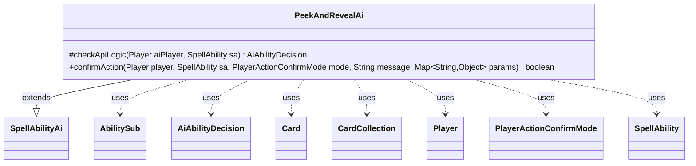

---
aliases:
  - PeekAndRevealAi
tags:
  - java/class
  - module/forge-ai
  - pkg/forge/ai/ability
fqn: forge.ai.ability.PeekAndRevealAi
package: forge.ai.ability
module: forge-ai
kind: Class
---

# PeekAndRevealAi

**Package:** `forge.ai.ability` &nbsp; **Module:** `forge-ai` &nbsp; **Kind:** Class



## Relationships
**Extends:**
- [[forge.ai.SpellAbilityAi|SpellAbilityAi]]
**Uses:**
- [[forge.ai.AiAbilityDecision|AiAbilityDecision]]
- [[forge.game.card.Card|Card]]
- [[forge.game.card.CardCollection|CardCollection]]
- [[forge.game.player.Player|Player]]
- [[forge.game.player.PlayerActionConfirmMode|PlayerActionConfirmMode]]
- [[forge.game.spellability.AbilitySub|AbilitySub]]
- [[forge.game.spellability.SpellAbility|SpellAbility]]

## Design Description

PeekAndRevealAi is the forge-ai decision layer for the "PeekAndReveal" spell ability, extending `SpellAbilityAi` to teach the computer how and when to play effects that look at and optionally reveal cards from a library. Its `checkApiLogic` override governs castability: it honors timing hints (e.g. an AILogic of "Main2" defers play until the second main phase), selects a preferred opponent as the target and library owner when the ability uses targeting, refuses to play against an empty library, and validates that an X-based PeekAmount can be paid via `ComputerUtilCost` before committing.

The `confirmAction` override handles in-resolution choices, using the revealed `CardCollection` to gate "InstantOrSorcery" logic and otherwise delegating to the sub-ability's drawback evaluation through `SpellApiToAi`. The design keeps behavior data-driven through SVar/parameter lookups and composes with chained `AbilitySub` drawbacks rather than hard-coding effects.

## Source
`forge-ai/src/main/java/forge/ai/ability/PeekAndRevealAi.java`

```java
package forge.ai.ability;

import forge.ai.*;
import forge.game.card.Card;
import forge.game.card.CardCollection;
import forge.game.phase.PhaseType;
import forge.game.player.Player;
import forge.game.player.PlayerActionConfirmMode;
import forge.game.spellability.AbilitySub;
import forge.game.spellability.SpellAbility;
import forge.game.zone.ZoneType;

import java.util.Map;

/** 
 * TODO: Write javadoc for this type.
 *
 */
public class PeekAndRevealAi extends SpellAbilityAi {

    /* (non-Javadoc)
     * @see forge.card.abilityfactory.SpellAiLogic#canPlayAI(forge.game.player.Player, forge.card.spellability.SpellAbility)
     */
    @Override
    protected AiAbilityDecision checkApiLogic(Player aiPlayer, SpellAbility sa) {
        String logic = sa.getParamOrDefault("AILogic", "");
        if ("Main2".equals(logic)) {
            if (aiPlayer.getGame().getPhaseHandler().getPhase().isBefore(PhaseType.MAIN2)) {
                return new AiAbilityDecision(0, AiPlayDecision.CantPlayAi);
            }
        }
        // So far this only appears on Triggers, but will expand
        // once things get converted from Dig + NoMove
        Player opp = AiAttackController.choosePreferredDefenderPlayer(aiPlayer);
        Player libraryOwner = aiPlayer;

        if (sa.usesTargeting()) {
            sa.resetTargets();
            //todo: evaluate valid targets
            if (!sa.canTarget(opp)) {
                return new AiAbilityDecision(0, AiPlayDecision.CantPlayAi);
            }
            sa.getTargets().add(opp);
            libraryOwner = opp;
        }

        if (libraryOwner.getCardsIn(ZoneType.Library).isEmpty()) {
            return new AiAbilityDecision(0, AiPlayDecision.CantPlayAi);
        }

        if ("X".equals(sa.getParam("PeekAmount")) && sa.getSVar("X").equals("Count$xPaid")) {
            int xPay = ComputerUtilCost.setMaxXValue(sa, aiPlayer, sa.isTrigger());
            if (xPay == 0) {
                return new AiAbilityDecision(0, AiPlayDecision.CantPlayAi);
            }
            sa.getRootAbility().setXManaCostPaid(xPay);
        }

        return new AiAbilityDecision(100, AiPlayDecision.WillPlay);
    }

    /* (non-Javadoc)
     * @see forge.card.ability.SpellAbilityAi#confirmAction(forge.game.player.Player, forge.card.spellability.SpellAbility, forge.game.player.PlayerActionConfirmMode, java.lang.String)
     */
    @Override
    public boolean confirmAction(Player player, SpellAbility sa, PlayerActionConfirmMode mode, String message, Map<String, Object> params) {
        if ("InstantOrSorcery".equals(sa.getParam("AILogic"))) {
            CardCollection revealed = (CardCollection) params.get("Revealed");
            for (Card c : revealed) {
                if (!c.isInstant() && !c.isSorcery()) {
                    return false;
                }
            }
        }

        AbilitySub subAb = sa.getSubAbility();
        return subAb != null && SpellApiToAi.Converter.get(subAb).chkDrawbackWithSubs(player, subAb).willingToPlay();
    }

}
```

## Python
`forge/ai/ability/PeekAndRevealAi.py`

```python
from forge.ai.SpellAbilityAi import SpellAbilityAi
from forge.ai.AiAbilityDecision import AiAbilityDecision
from forge.ai.AiPlayDecision import AiPlayDecision
from forge.ai.AiAttackController import AiAttackController
from forge.ai.ComputerUtilCost import ComputerUtilCost
from forge.ai.SpellApiToAi import SpellApiToAi
from forge.game.card.Card import Card
from forge.game.card.CardCollection import CardCollection
from forge.game.phase.PhaseType import PhaseType
from forge.game.player.Player import Player
from forge.game.player.PlayerActionConfirmMode import PlayerActionConfirmMode
from forge.game.spellability.AbilitySub import AbilitySub
from forge.game.spellability.SpellAbility import SpellAbility
from forge.game.zone.ZoneType import ZoneType


# TODO: Write javadoc for this type.
#
class PeekAndRevealAi(SpellAbilityAi):

    # (non-Javadoc)
    # @see forge.card.abilityfactory.SpellAiLogic#canPlayAI(forge.game.player.Player, forge.card.spellability.SpellAbility)
    def checkApiLogic(self, aiPlayer: Player, sa: SpellAbility) -> AiAbilityDecision:
        logic = sa.getParamOrDefault("AILogic", "")
        if "Main2" == logic:
            if aiPlayer.getGame().getPhaseHandler().getPhase().isBefore(PhaseType.MAIN2):
                return AiAbilityDecision(0, AiPlayDecision.CantPlayAi)
        # So far this only appears on Triggers, but will expand
        # once things get converted from Dig + NoMove
        opp = AiAttackController.choosePreferredDefenderPlayer(aiPlayer)
        libraryOwner = aiPlayer

        if sa.usesTargeting():
            sa.resetTargets()
            # todo: evaluate valid targets
            if not sa.canTarget(opp):
                return AiAbilityDecision(0, AiPlayDecision.CantPlayAi)
            sa.getTargets().add(opp)
            libraryOwner = opp

        if libraryOwner.getCardsIn(ZoneType.Library).isEmpty():
            return AiAbilityDecision(0, AiPlayDecision.CantPlayAi)

        if "X" == sa.getParam("PeekAmount") and sa.getSVar("X") == "Count$xPaid":
            xPay = ComputerUtilCost.setMaxXValue(sa, aiPlayer, sa.isTrigger())
            if xPay == 0:
                return AiAbilityDecision(0, AiPlayDecision.CantPlayAi)
            sa.getRootAbility().setXManaCostPaid(xPay)

        return AiAbilityDecision(100, AiPlayDecision.WillPlay)

    # (non-Javadoc)
    # @see forge.card.ability.SpellAbilityAi#confirmAction(forge.game.player.Player, forge.card.spellability.SpellAbility, forge.game.player.PlayerActionConfirmMode, java.lang.String)
    def confirmAction(self, player: Player, sa: SpellAbility, mode: PlayerActionConfirmMode, message: str, params: dict[str, object]) -> bool:
        if "InstantOrSorcery" == sa.getParam("AILogic"):
            revealed = params.get("Revealed")
            for c in revealed:
                if not c.isInstant() and not c.isSorcery():
                    return False

        subAb = sa.getSubAbility()
        return subAb is not None and SpellApiToAi.Converter.get(subAb).chkDrawbackWithSubs(player, subAb).willingToPlay()
```
