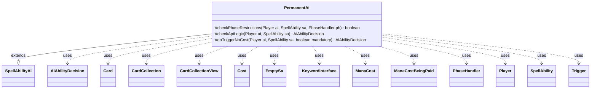

---
aliases:
  - PermanentAi
tags:
  - java/class
  - module/forge-ai
  - pkg/forge/ai/ability
fqn: forge.ai.ability.PermanentAi
package: forge.ai.ability
module: forge-ai
kind: Class
---

# PermanentAi

**Package:** `forge.ai.ability`   **Module:** `forge-ai`   **Kind:** Class



## Relationships
**Extends:**
- [[forge.ai.SpellAbilityAi|SpellAbilityAi]]
**Uses:**
- [[forge.ai.AiAbilityDecision|AiAbilityDecision]]
- [[forge.card.mana.ManaCost|ManaCost]]
- [[forge.game.card.Card|Card]]
- [[forge.game.card.CardCollection|CardCollection]]
- [[forge.game.card.CardCollectionView|CardCollectionView]]
- [[forge.game.cost.Cost|Cost]]
- [[forge.game.keyword.KeywordInterface|KeywordInterface]]
- [[forge.game.mana.ManaCostBeingPaid|ManaCostBeingPaid]]
- [[forge.game.phase.PhaseHandler|PhaseHandler]]
- [[forge.game.player.Player|Player]]
- [[forge.game.spellability.SpellAbility|SpellAbility]]
- [[forge.game.spellability.SpellAbility.EmptySa|EmptySa]]
- [[forge.game.trigger.Trigger|Trigger]]

## Design Description

The PermanentAi class implements the Forge AI's decision logic for casting permanent spells, extending the SpellAbilityAi base class by overriding its template hooks—checkPhaseRestrictions, checkApiLogic, and doTriggerNoCost—to determine whether and how the computer player should play a given permanent. It collaborates with the Player, SpellAbility, Card, and PhaseHandler types to evaluate game state, returning an AiAbilityDecision that scores the play.

Its design intent centers on encoding nuanced casting heuristics: deferring non-urgent plays to Main2, respecting the legend and World-enchantment rules, optimizing X and multikicker mana payments, verifying affordability of upkeep sacrifice costs via a synthesized EmptySa, and honoring per-card AICastPreference and AILogic SVar hints. This data-driven approach lets card scripts steer AI behavior—life thresholds, controlled-copy limits, zone and mana-source constraints—without modifying the class itself.

## Source
`forge-ai/src/main/java/forge/ai/ability/PermanentAi.java`

```java
package forge.ai.ability;

import forge.ai.*;
import forge.card.CardStateName;
import forge.card.CardType.Supertype;
import forge.card.mana.ManaCost;
import forge.game.ability.AbilityUtils;
import forge.game.ability.ApiType;
import forge.game.card.*;
import forge.game.cost.Cost;
import forge.game.keyword.Keyword;
import forge.game.keyword.KeywordInterface;
import forge.game.mana.ManaCostBeingPaid;
import forge.game.phase.PhaseHandler;
import forge.game.phase.PhaseType;
import forge.game.player.Player;
import forge.game.spellability.SpellAbility;
import forge.game.trigger.Trigger;
import forge.game.trigger.TriggerType;
import forge.game.zone.ZoneType;
import org.apache.commons.lang3.StringUtils;

public class PermanentAi extends SpellAbilityAi {

    /**
     * Checks if the AI will play a SpellAbility based on its phase restrictions
     */
    @Override
    protected boolean checkPhaseRestrictions(final Player ai, final SpellAbility sa, final PhaseHandler ph) {
        final Card card = sa.getHostCard();

        if (card.hasKeyword("MayFlashSac") && !ai.canCastSorcery()) {
            // AiPlayDecision.AnotherTime
            return false;
        }

        // Wait for Main2 if possible
        return !ph.is(PhaseType.MAIN1) || !ph.isPlayerTurn(ai) || sa.hasParam("WithoutManaCost") || ComputerUtil.castPermanentInMain1(ai, sa);
    }

    /**
     * The rest of the logic not covered by the canPlayAI template is defined
     * here
     */
    @Override
    protected AiAbilityDecision checkApiLogic(final Player ai, final SpellAbility sa) {
        final Card source = sa.getHostCard();

        // check on legendary
        if (!source.ignoreLegendRule() && ai.isCardInPlay(source.getName())) {
            // TODO check the risk we'd lose the effect with bad timing
            // TODO Technically we're not checking if same card in play is also legendary, but this is a good enough approximation
            if (!source.hasSVar("AILegendaryException")) {
                return new AiAbilityDecision(0, AiPlayDecision.WouldDestroyLegend);
            } else {
                String specialRule = source.getSVar("AILegendaryException");
                if ("TwoCopiesAllowed".equals(specialRule)) {
                    // One extra copy allowed on the battlefield, e.g. Brothers Yamazaki
                    if (CardLists.count(ai.getCardsIn(ZoneType.Battlefield), CardPredicates.nameEquals(source.getName())) > 1) {
                        return new AiAbilityDecision(0, AiPlayDecision.WouldDestroyLegend);
                    }
                } else if ("AlwaysAllowed".equals(specialRule)) {
                    // Nothing to do here, check for Legendary is disabled
                } else {
                    // Unknown hint, assume two copies not allowed
                    return new AiAbilityDecision(0, AiPlayDecision.WouldDestroyLegend);
                }
            }
        }

        if (source.getType().hasSupertype(Supertype.World)) {
            CardCollection list = CardLists.getType(ai.getCardsIn(ZoneType.Battlefield), "World");
            if (!list.isEmpty()) {
                return new AiAbilityDecision(0, AiPlayDecision.WouldDestroyWorldEnchantment);
            }
        }

        ManaCost mana = sa.getPayCosts().getTotalMana();
        if (mana.countX() > 0) {
            final int xPay = ComputerUtilCost.setMaxXValue(sa, ai, false);
            if (source.hasConverge()) {
                int nColors = ComputerUtilMana.getConvergeCount(sa, ai);
                for (int i = 1; i <= xPay; i++) {
                    sa.setXManaCostPaid(i);
                    int newColors = ComputerUtilMana.getConvergeCount(sa, ai);
                    if (newColors > nColors) {
                        nColors = newColors;
                    } else {
                        sa.setXManaCostPaid(i - 1);
                        break;
                    }
                }
            } else if (xPay <= 0) {
                return new AiAbilityDecision(0, AiPlayDecision.CantAffordX);
            }
        } else if (mana.isZero()) {
            // if mana is zero, but card mana cost does have X, then something is wrong
            ManaCost cardCost = source.getManaCost();
            if (cardCost != null && cardCost.countX() > 0) {
                return new AiAbilityDecision(0, AiPlayDecision.CostNotAcceptable);
            }
        }

        if ("SacToReduceCost".equals(sa.getParam("AILogic"))) {
            // reset X to better calculate
            sa.setXManaCostPaid(0);
            ManaCostBeingPaid paidCost = ComputerUtilMana.calculateManaCost(sa.getPayCosts(), sa, ai, true, 0, false);

            int generic = paidCost.getGenericManaAmount();
            // Set PayX here to maximum value.
            int xPay = ComputerUtilCost.setMaxXValue(sa, ai, false);
            // currently cards with SacToReduceCost reduce by 2 generic
            xPay = Math.min(xPay, generic / 2);
            sa.setXManaCostPaid(xPay);
        }

        if ("ChaliceOfTheVoid".equals(source.getSVar("AICurseEffect"))) {
            int maxX = sa.getXManaCostPaid(); // as set above
            CardCollection otherChalices = CardLists.filter(ai.getGame().getCardsIn(ZoneType.Battlefield), CardPredicates.nameEquals("Chalice of the Void"));
            outer: for (int i = 0; i <= maxX; i++) {
                for (Card chalice : otherChalices) {
                    if (chalice.getCounters(CounterEnumType.CHARGE) == i) {
                        continue outer; // already disabled, no point in adding another one
                    }
                }
                // assume the AI knows the deck lists of its opponents and if we see a card in a certain zone except for the library or hand,
                // it likely won't be cast unless it's bounced back (ideally, this should also somehow account for hidden information such as face down cards in exile)
                final int manaValue = i;
                CardCollection aiCards = CardLists.filter(ai.getAllCards(), card -> (card.isInZone(ZoneType.Library) || !card.isInZone(ZoneType.Hand))
                        && card.getState(CardStateName.Original).getManaCost() != null
                        && card.getState(CardStateName.Original).getManaCost().getCMC() == manaValue);
                CardCollection oppCards = CardLists.filter(ai.getStrongestOpponent().getAllCards(), card -> (card.isInZone(ZoneType.Library) || !card.isInZone(ZoneType.Hand))
                        && card.getState(CardStateName.Original).getManaCost() != null
                        && card.getState(CardStateName.Original).getManaCost().getCMC() == manaValue);
                if (manaValue == 0) {
                    aiCards = CardLists.filter(aiCards, CardPredicates.NON_LANDS);
                    oppCards = CardLists.filter(oppCards, CardPredicates.NON_LANDS);
                    // also filter out other Chalices in our own deck
                    aiCards = CardLists.filter(aiCards, CardPredicates.nameNotEquals("Chalice of the Void"));
                }
                if (oppCards.size() > 3 && oppCards.size() >= aiCards.size() * 2) {
                    sa.setXManaCostPaid(manaValue);
                    return new AiAbilityDecision(100, AiPlayDecision.WillPlay);
                }
            }
            return new AiAbilityDecision(0, AiPlayDecision.CantPlayAi);
        }

        for (KeywordInterface ki : source.getKeywords(Keyword.MULTIKICKER)) {
            String o = ki.getOriginal();
            String costStr = o.split(":")[1];
            final Cost cost = new Cost(costStr, false);
            if (!cost.hasManaCost()) {
                continue;
            }
            final ManaCost mkCost = cost.getTotalMana();

            ManaCost mCost = sa.getPayCosts().getTotalMana();
            boolean isZeroCost = mCost.isZero();
            for (int i = 0; i < 10; i++) {
                mCost = ManaCost.combine(mCost, mkCost);
                ManaCostBeingPaid mcbp = new ManaCostBeingPaid(mCost);
                if (!ComputerUtilMana.canPayManaCost(mcbp, sa, ai, false)) {
                    sa.setOptionalKeywordAmount(ki, i);
                    break;
                }
                sa.setOptionalKeywordAmount(ki, i + 1);
            }
            if (isZeroCost && sa.getOptionalKeywordAmount(ki) == 0) {
                sa.clearOptionalKeywordAmount();
                // Bail if the card cost was {0} and no multikicker was paid (e.g. Everflowing Chalice).
                // TODO: update this if there's ever a card where it makes sense to play it for {0} with no multikicker
                return new AiAbilityDecision(0, AiPlayDecision.CostNotAcceptable);
            }
        }

        // don't play cards without being able to pay the upkeep for
        boolean hasUpkeepCost = false;
        Cost upkeepCost = new Cost("0", true);
        for (Trigger t : source.getTriggers()) {
            if (!TriggerType.Phase.equals(t.getMode())) {
                continue;
            }
            if (!"Upkeep".equals(t.getParam("Phase"))) {
                continue;
            }
            SpellAbility ab = t.ensureAbility();
            if (ab == null) {
                continue;
            }

            if (ApiType.Sacrifice.equals(ab.getApi())) {
                if (!ab.hasParam("UnlessCost")) {
                    continue;
                }
                hasUpkeepCost = true;
                upkeepCost.add(AbilityUtils.calculateUnlessCost(ab, ab.getParam("UnlessCost"), true));
            }
        }

        if (hasUpkeepCost) {
            final SpellAbility emptyAbility = new SpellAbility.EmptySa(source, ai);
            emptyAbility.setPayCosts(upkeepCost);
            emptyAbility.setTargetRestrictions(sa.getTargetRestrictions());
            emptyAbility.setCardState(sa.getCardState());
            emptyAbility.setActivatingPlayer(ai);

            if (!ComputerUtilCost.canPayCost(emptyAbility, ai, true)) {
                return new AiAbilityDecision(0, AiPlayDecision.CantAfford);
            }
        }

        // check for specific AI preferences
        if (source.hasSVar("AICastPreference")) {
            String pref = source.getSVar("AICastPreference");
            String[] groups = StringUtils.split(pref, "|");
            boolean dontCast = false;
            for (String group : groups) {
                String[] elems = StringUtils.split(group.trim(), '$');
                String param = elems[0].trim();
                String value = elems[1].trim();

                if (param.equals("MustHaveInHand")) {
                    // Only cast if another card is present in hand (e.g. Illusions of Grandeur followed by Donate)
                    boolean hasCard = ai.getCardsIn(ZoneType.Hand).anyMatch(CardPredicates.nameEquals(value));
                    if (!hasCard) {
                        dontCast = true;
                    }
                } else if (param.startsWith("MaxControlled")) {
                    // Only cast unless there are X or more cards like this on the battlefield under AI control already,
                    CardCollectionView valid = param.contains("Globally") ? ai.getGame().getCardsIn(ZoneType.Battlefield)
                            : ai.getCardsIn(ZoneType.Battlefield);
                    CardCollection ctrld = CardLists.filter(valid, CardPredicates.nameEquals(source.getName()));

                    int numControlled = 0;
                    if (param.endsWith("WithoutOppAuras")) {
                        // Check that the permanent does not have any auras attached to it by the opponent (this assumes that if
                        // the opponent cast an aura on the opposing permanent, it's not with good intentions, and thus it might
                        // be better to have a pristine copy of the card - might not always be a correct assumption, but sounds
                        // like a reasonable default for some cards).
                        for (Card c : ctrld) {
                            if (c.getEnchantedBy().isEmpty()) {
                                numControlled++;
                            } else {
                                for (Card att : c.getEnchantedBy()) {
                                    if (!att.getController().isOpponentOf(ai)) {
                                        numControlled++;
                                    }
                                }
                            }
                        }
                    } else {
                        numControlled = ctrld.size();
                    }

                    if (numControlled >= Integer.parseInt(value)) {
                        dontCast = true;
                    }
                } else if (param.equals("NumManaSources")) {
                    // Only cast if there are X or more mana sources controlled by the AI
                    CardCollection m = ComputerUtilMana.getAvailableManaSources(ai, true);
                    if (m.size() < Integer.parseInt(value)) {
                        dontCast = true;
                    }
                } else if (param.equals("NumManaSourcesNextTurn")) {
                    // Only cast if there are X or more mana sources controlled by the AI *or*
                    // if there are X-1 mana sources in play but the AI has an extra land in hand
                    CardCollection m = ComputerUtilMana.getAvailableManaSources(ai, true);
                    int extraMana = CardLists.count(ai.getCardsIn(ZoneType.Hand), CardPredicates.LANDS) > 0 ? 1 : 0;
                    if (source.getName().equals("Illusions of Grandeur")) {
                        // TODO: this is currently hardcoded for specific Illusions-Donate cost reduction spells, need to make this generic.
                        extraMana += Math.min(3, CardLists.filter(ai.getCardsIn(ZoneType.Battlefield), CardPredicates.nameEquals("Sapphire Medallion").or(CardPredicates.nameEquals("Helm of Awakening"))).size()) * 2; // each cost-reduction spell accounts for {1} in both Illusions and Donate
                    }
                    if (m.size() + extraMana < Integer.parseInt(value)) {
                        dontCast = true;
                    }
                } else if (param.equals("NeverCastIfLifeBelow")) {
                    // Do not cast this spell if AI life is below a certain threshold
                    if (ai.getLife() < Integer.parseInt(value)) {
                        dontCast = true;
                    }
                } else if (param.equals("NeverCastIfLifeAbove")) {
                    // Do not cast this spell if AI life is below a certain threshold
                    if (ai.getLife() > Integer.parseInt(value)) {
                        dontCast = true;
                    }
                } else if (param.equals("AlwaysCastIfLifeBelow")) {
                    if (ai.getLife() < Integer.parseInt(value)) {
                        dontCast = false;
                        break; // disregard other preferences, always cast as a last resort
                    }
                } else if (param.equals("AlwaysCastIfLifeAbove")) {
                    if (ai.getLife() > Integer.parseInt(value)) {
                        dontCast = false;
                        break; // disregard other preferences, always cast as a last resort
                    }
                } else if (param.equals("OnlyFromZone")) {
                    if (!source.getZone().getZoneType().toString().equals(value)) {
                        dontCast = true;
                        break; // limit casting to a specific zone only
                    }
                }
            }

            if (dontCast) {
                return new AiAbilityDecision(0, AiPlayDecision.CantPlayAi);
            }
        }

        return new AiAbilityDecision(100, AiPlayDecision.WillPlay);
    }

    @Override
    protected AiAbilityDecision doTriggerNoCost(Player ai, SpellAbility sa, boolean mandatory) {
        if (mandatory) {
            return new AiAbilityDecision(50, AiPlayDecision.MandatoryPlay);
        }
        if (!sa.metConditions()) {
            return new AiAbilityDecision(0, AiPlayDecision.CantPlayAi);
        }

        if (sa.hasParam("AILogic") && !checkAiLogic(ai, sa, sa.getParam("AILogic"))) {
            return new AiAbilityDecision(0, AiPlayDecision.CantPlayAi);
        }
        final Cost cost = sa.getPayCosts();
        if (cost != null && !willPayCosts(ai, sa, cost, sa.getHostCard())) {
            return new AiAbilityDecision(0, AiPlayDecision.CantPlayAi);
        }
        if (!checkPhaseRestrictions(ai, sa, ai.getGame().getPhaseHandler())) {
            return new AiAbilityDecision(0, AiPlayDecision.CantPlayAi);
        }
        return checkApiLogic(ai, sa);
     }
}
```

## Python
`forge/ai/ability/PermanentAi.py`

```python
from forge.ai.SpellAbilityAi import SpellAbilityAi
from forge.ai.AiAbilityDecision import AiAbilityDecision
from forge.ai.AiPlayDecision import AiPlayDecision
from forge.ai.ComputerUtil import ComputerUtil
from forge.ai.ComputerUtilCost import ComputerUtilCost
from forge.ai.ComputerUtilMana import ComputerUtilMana
from forge.card.CardStateName import CardStateName
from forge.card.CardType.Supertype import Supertype
from forge.card.mana.ManaCost import ManaCost
from forge.game.ability.AbilityUtils import AbilityUtils
from forge.game.ability.ApiType import ApiType
from forge.game.card.Card import Card
from forge.game.card.CardCollection import CardCollection
from forge.game.card.CardCollectionView import CardCollectionView
from forge.game.card.CardLists import CardLists
from forge.game.card.CardPredicates import CardPredicates
from forge.game.card.CounterEnumType import CounterEnumType
from forge.game.cost.Cost import Cost
from forge.game.keyword.Keyword import Keyword
from forge.game.keyword.KeywordInterface import KeywordInterface
from forge.game.mana.ManaCostBeingPaid import ManaCostBeingPaid
from forge.game.phase.PhaseHandler import PhaseHandler
from forge.game.phase.PhaseType import PhaseType
from forge.game.player.Player import Player
from forge.game.spellability.SpellAbility import SpellAbility
from forge.game.spellability.SpellAbility.EmptySa import EmptySa
from forge.game.trigger.Trigger import Trigger
from forge.game.trigger.TriggerType import TriggerType
from forge.game.zone.ZoneType import ZoneType


class PermanentAi(SpellAbilityAi):

    def checkPhaseRestrictions(self, ai: Player, sa: SpellAbility, ph: PhaseHandler) -> bool:
        """Checks if the AI will play a SpellAbility based on its phase restrictions"""
        card = sa.getHostCard()

        if card.hasKeyword("MayFlashSac") and not ai.canCastSorcery():
            # AiPlayDecision.AnotherTime
            return False

        # Wait for Main2 if possible
        return (not ph.is_(PhaseType.MAIN1) or not ph.isPlayerTurn(ai)
                or sa.hasParam("WithoutManaCost") or ComputerUtil.castPermanentInMain1(ai, sa))

    def checkApiLogic(self, ai: Player, sa: SpellAbility) -> AiAbilityDecision:
        """The rest of the logic not covered by the canPlayAI template is defined here"""
        source = sa.getHostCard()

        # check on legendary
        if not source.ignoreLegendRule() and ai.isCardInPlay(source.getName()):
            # TODO check the risk we'd lose the effect with bad timing
            # TODO Technically we're not checking if same card in play is also legendary, but this is a good enough approximation
            if not source.hasSVar("AILegendaryException"):
                return AiAbilityDecision(0, AiPlayDecision.WouldDestroyLegend)
            else:
                specialRule = source.getSVar("AILegendaryException")
                if "TwoCopiesAllowed" == specialRule:
                    # One extra copy allowed on the battlefield, e.g. Brothers Yamazaki
                    if CardLists.count(ai.getCardsIn(ZoneType.Battlefield), CardPredicates.nameEquals(source.getName())) > 1:
                        return AiAbilityDecision(0, AiPlayDecision.WouldDestroyLegend)
                elif "AlwaysAllowed" == specialRule:
                    # Nothing to do here, check for Legendary is disabled
                    pass
                else:
                    # Unknown hint, assume two copies not allowed
                    return AiAbilityDecision(0, AiPlayDecision.WouldDestroyLegend)

        if source.getType().hasSupertype(Supertype.World):
            list_ = CardLists.getType(ai.getCardsIn(ZoneType.Battlefield), "World")
            if not list_.isEmpty():
                return AiAbilityDecision(0, AiPlayDecision.WouldDestroyWorldEnchantment)

        mana = sa.getPayCosts().getTotalMana()
        if mana.countX() > 0:
            xPay = ComputerUtilCost.setMaxXValue(sa, ai, False)
            if source.hasConverge():
                nColors = ComputerUtilMana.getConvergeCount(sa, ai)
                for i in range(1, xPay + 1):
                    sa.setXManaCostPaid(i)
                    newColors = ComputerUtilMana.getConvergeCount(sa, ai)
                    if newColors > nColors:
                        nColors = newColors
                    else:
                        sa.setXManaCostPaid(i - 1)
                        break
            elif xPay <= 0:
                return AiAbilityDecision(0, AiPlayDecision.CantAffordX)
        elif mana.isZero():
            # if mana is zero, but card mana cost does have X, then something is wrong
            cardCost = source.getManaCost()
            if cardCost is not None and cardCost.countX() > 0:
                return AiAbilityDecision(0, AiPlayDecision.CostNotAcceptable)

        if "SacToReduceCost" == sa.getParam("AILogic"):
            # reset X to better calculate
            sa.setXManaCostPaid(0)
            paidCost = ComputerUtilMana.calculateManaCost(sa.getPayCosts(), sa, ai, True, 0, False)

            generic = paidCost.getGenericManaAmount()
            # Set PayX here to maximum value.
            xPay = ComputerUtilCost.setMaxXValue(sa, ai, False)
            # currently cards with SacToReduceCost reduce by 2 generic
            xPay = min(xPay, generic // 2)
            sa.setXManaCostPaid(xPay)

        if "ChaliceOfTheVoid" == source.getSVar("AICurseEffect"):
            maxX = sa.getXManaCostPaid()  # as set above
            otherChalices = CardLists.filter(ai.getGame().getCardsIn(ZoneType.Battlefield), CardPredicates.nameEquals("Chalice of the Void"))
            for i in range(0, maxX + 1):
                already_disabled = False
                for chalice in otherChalices:
                    if chalice.getCounters(CounterEnumType.CHARGE) == i:
                        already_disabled = True  # already disabled, no point in adding another one
                        break
                if already_disabled:
                    continue
                # assume the AI knows the deck lists of its opponents and if we see a card in a certain zone except for the library or hand,
                # it likely won't be cast unless it's bounced back (ideally, this should also somehow account for hidden information such as face down cards in exile)
                manaValue = i
                aiCards = CardLists.filter(ai.getAllCards(), lambda card: (card.isInZone(ZoneType.Library) or not card.isInZone(ZoneType.Hand))
                        and card.getState(CardStateName.Original).getManaCost() is not None
                        and card.getState(CardStateName.Original).getManaCost().getCMC() == manaValue)
                oppCards = CardLists.filter(ai.getStrongestOpponent().getAllCards(), lambda card: (card.isInZone(ZoneType.Library) or not card.isInZone(ZoneType.Hand))
                        and card.getState(CardStateName.Original).getManaCost() is not None
                        and card.getState(CardStateName.Original).getManaCost().getCMC() == manaValue)
                if manaValue == 0:
                    aiCards = CardLists.filter(aiCards, CardPredicates.NON_LANDS)
                    oppCards = CardLists.filter(oppCards, CardPredicates.NON_LANDS)
                    # also filter out other Chalices in our own deck
                    aiCards = CardLists.filter(aiCards, CardPredicates.nameNotEquals("Chalice of the Void"))
                if oppCards.size() > 3 and oppCards.size() >= aiCards.size() * 2:
                    sa.setXManaCostPaid(manaValue)
                    return AiAbilityDecision(100, AiPlayDecision.WillPlay)
            return AiAbilityDecision(0, AiPlayDecision.CantPlayAi)

        for ki in source.getKeywords(Keyword.MULTIKICKER):
            o = ki.getOriginal()
            costStr = o.split(":")[1]
            cost = Cost(costStr, False)
            if not cost.hasManaCost():
                continue
            mkCost = cost.getTotalMana()

            mCost = sa.getPayCosts().getTotalMana()
            isZeroCost = mCost.isZero()
            for i in range(0, 10):
                mCost = ManaCost.combine(mCost, mkCost)
                mcbp = ManaCostBeingPaid(mCost)
                if not ComputerUtilMana.canPayManaCost(mcbp, sa, ai, False):
                    sa.setOptionalKeywordAmount(ki, i)
                    break
                sa.setOptionalKeywordAmount(ki, i + 1)
            if isZeroCost and sa.getOptionalKeywordAmount(ki) == 0:
                sa.clearOptionalKeywordAmount()
                # Bail if the card cost was {0} and no multikicker was paid (e.g. Everflowing Chalice).
                # TODO: update this if there's ever a card where it makes sense to play it for {0} with no multikicker
                return AiAbilityDecision(0, AiPlayDecision.CostNotAcceptable)

        # don't play cards without being able to pay the upkeep for
        hasUpkeepCost = False
        upkeepCost = Cost("0", True)
        for t in source.getTriggers():
            if not TriggerType.Phase == t.getMode():
                continue
            if not "Upkeep" == t.getParam("Phase"):
                continue
            ab = t.ensureAbility()
            if ab is None:
                continue

            if ApiType.Sacrifice == ab.getApi():
                if not ab.hasParam("UnlessCost"):
                    continue
                hasUpkeepCost = True
                upkeepCost.add(AbilityUtils.calculateUnlessCost(ab, ab.getParam("UnlessCost"), True))

        if hasUpkeepCost:
            emptyAbility = EmptySa(source, ai)
            emptyAbility.setPayCosts(upkeepCost)
            emptyAbility.setTargetRestrictions(sa.getTargetRestrictions())
            emptyAbility.setCardState(sa.getCardState())
            emptyAbility.setActivatingPlayer(ai)

            if not ComputerUtilCost.canPayCost(emptyAbility, ai, True):
                return AiAbilityDecision(0, AiPlayDecision.CantAfford)

        # check for specific AI preferences
        if source.hasSVar("AICastPreference"):
            pref = source.getSVar("AICastPreference")
            groups = [g for g in pref.split("|") if g]
            dontCast = False
            for group in groups:
                elems = [e for e in group.strip().split('$') if e]
                param = elems[0].strip()
                value = elems[1].strip()

                if param == "MustHaveInHand":
                    # Only cast if another card is present in hand (e.g. Illusions of Grandeur followed by Donate)
                    hasCard = ai.getCardsIn(ZoneType.Hand).anyMatch(CardPredicates.nameEquals(value))
                    if not hasCard:
                        dontCast = True
                elif param.startswith("MaxControlled"):
                    # Only cast unless there are X or more cards like this on the battlefield under AI control already,
                    valid = ai.getGame().getCardsIn(ZoneType.Battlefield) if "Globally" in param \
                        else ai.getCardsIn(ZoneType.Battlefield)
                    ctrld = CardLists.filter(valid, CardPredicates.nameEquals(source.getName()))

                    numControlled = 0
                    if param.endswith("WithoutOppAuras"):
                        # Check that the permanent does not have any auras attached to it by the opponent (this assumes that if
                        # the opponent cast an aura on the opposing permanent, it's not with good intentions, and thus it might
                        # be better to have a pristine copy of the card - might not always be a correct assumption, but sounds
                        # like a reasonable default for some cards).
                        for c in ctrld:
                            if c.getEnchantedBy().isEmpty():
                                numControlled += 1
                            else:
                                for att in c.getEnchantedBy():
                                    if not att.getController().isOpponentOf(ai):
                                        numControlled += 1
                    else:
                        numControlled = ctrld.size()

                    if numControlled >= int(value):
                        dontCast = True
                elif param == "NumManaSources":
                    # Only cast if there are X or more mana sources controlled by the AI
                    m = ComputerUtilMana.getAvailableManaSources(ai, True)
                    if m.size() < int(value):
                        dontCast = True
                elif param == "NumManaSourcesNextTurn":
                    # Only cast if there are X or more mana sources controlled by the AI *or*
                    # if there are X-1 mana sources in play but the AI has an extra land in hand
                    m = ComputerUtilMana.getAvailableManaSources(ai, True)
                    extraMana = 1 if CardLists.count(ai.getCardsIn(ZoneType.Hand), CardPredicates.LANDS) > 0 else 0
                    if source.getName() == "Illusions of Grandeur":
                        # TODO: this is currently hardcoded for specific Illusions-Donate cost reduction spells, need to make this generic.
                        extraMana += min(3, CardLists.filter(ai.getCardsIn(ZoneType.Battlefield), CardPredicates.nameEquals("Sapphire Medallion").or_(CardPredicates.nameEquals("Helm of Awakening"))).size()) * 2  # each cost-reduction spell accounts for {1} in both Illusions and Donate
                    if m.size() + extraMana < int(value):
                        dontCast = True
                elif param == "NeverCastIfLifeBelow":
                    # Do not cast this spell if AI life is below a certain threshold
                    if ai.getLife() < int(value):
                        dontCast = True
                elif param == "NeverCastIfLifeAbove":
                    # Do not cast this spell if AI life is below a certain threshold
                    if ai.getLife() > int(value):
                        dontCast = True
                elif param == "AlwaysCastIfLifeBelow":
                    if ai.getLife() < int(value):
                        dontCast = False
                        break  # disregard other preferences, always cast as a last resort
                elif param == "AlwaysCastIfLifeAbove":
                    if ai.getLife() > int(value):
                        dontCast = False
                        break  # disregard other preferences, always cast as a last resort
                elif param == "OnlyFromZone":
                    if not source.getZone().getZoneType().toString() == value:
                        dontCast = True
                        break  # limit casting to a specific zone only

            if dontCast:
                return AiAbilityDecision(0, AiPlayDecision.CantPlayAi)

        return AiAbilityDecision(100, AiPlayDecision.WillPlay)

    def doTriggerNoCost(self, ai: Player, sa: SpellAbility, mandatory: bool) -> AiAbilityDecision:
        if mandatory:
            return AiAbilityDecision(50, AiPlayDecision.MandatoryPlay)
        if not sa.metConditions():
            return AiAbilityDecision(0, AiPlayDecision.CantPlayAi)

        if sa.hasParam("AILogic") and not self.checkAiLogic(ai, sa, sa.getParam("AILogic")):
            return AiAbilityDecision(0, AiPlayDecision.CantPlayAi)
        cost = sa.getPayCosts()
        if cost is not None and not self.willPayCosts(ai, sa, cost, sa.getHostCard()):
            return AiAbilityDecision(0, AiPlayDecision.CantPlayAi)
        if not self.checkPhaseRestrictions(ai, sa, ai.getGame().getPhaseHandler()):
            return AiAbilityDecision(0, AiPlayDecision.CantPlayAi)
        return self.checkApiLogic(ai, sa)
```
