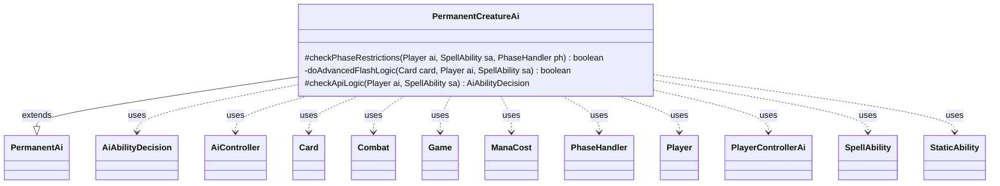

---
aliases:
  - PermanentCreatureAi
tags:
  - java/class
  - module/forge-ai
  - pkg/forge/ai/ability
fqn: forge.ai.ability.PermanentCreatureAi
package: forge.ai.ability
module: forge-ai
kind: Class
---

# PermanentCreatureAi

**Package:** `forge.ai.ability`   **Module:** `forge-ai`   **Kind:** Class



## Relationships
**Extends:**
- [[forge.ai.ability.PermanentAi|PermanentAi]]
**Uses:**
- [[forge.ai.AiAbilityDecision|AiAbilityDecision]]
- [[forge.ai.AiController|AiController]]
- [[forge.ai.PlayerControllerAi|PlayerControllerAi]]
- [[forge.card.mana.ManaCost|ManaCost]]
- [[forge.game.Game|Game]]
- [[forge.game.card.Card|Card]]
- [[forge.game.combat.Combat|Combat]]
- [[forge.game.phase.PhaseHandler|PhaseHandler]]
- [[forge.game.player.Player|Player]]
- [[forge.game.spellability.SpellAbility|SpellAbility]]
- [[forge.game.staticability.StaticAbility|StaticAbility]]

## Design Description

`PermanentCreatureAi` is the AI decision handler for casting creature spells, extending `PermanentAi` to specialize the generic permanent-casting logic for creatures. It overrides `checkPhaseRestrictions` to govern *when* the AI commits a creature to the stack—handling Dash (cast only to attack), Blitz (avoid Main2), Ball Lightning-style "leave play" creatures, and flash timing—and overrides `checkApiLogic` to veto casts that would yield a non-positive-toughness creature once static effects apply, unless an ETB trigger, X cost, counters, or a guarding SVar justify it.

The notable design intent is its profile-driven flash heuristic (`doAdvancedFlashLogic`): rather than hard rules, it weighs board state (valuable blockers, lethal danger, mana-pool loss, imminent discard) against tunable `AiProps` probabilities to decide whether to hold a flash creature for surprise blocks, ETB responses, or end-of-turn casts. It collaborates with the game model (`Game`, `PhaseHandler`, `Combat`, `StaticAbility`), the `SpellAbility`/`Card` being evaluated, and the `AiController` reached through `PlayerControllerAi`, returning its verdicts as `AiAbilityDecision` values.

## Source
`forge-ai/src/main/java/forge/ai/ability/PermanentCreatureAi.java`

```java
package forge.ai.ability;

import forge.ai.*;
import forge.card.mana.ManaCost;
import forge.game.Game;
import forge.game.ability.ApiType;
import forge.game.card.Card;
import forge.game.card.CardCopyService;
import forge.game.card.CardLists;
import forge.game.combat.Combat;
import forge.game.keyword.Keyword;
import forge.game.phase.PhaseHandler;
import forge.game.phase.PhaseType;
import forge.game.player.Player;
import forge.game.spellability.SpellAbility;
import forge.game.staticability.StaticAbility;
import forge.game.staticability.StaticAbilityMode;
import forge.game.zone.ZoneType;
import forge.util.MyRandom;
import org.apache.commons.lang3.StringUtils;

/**
 * AbilityFactory for Creature Spells.
 *
 */
public class PermanentCreatureAi extends PermanentAi {

    /**
     * Checks if the AI will play a SpellAbility based on its phase restrictions
     */
    @Override
    protected boolean checkPhaseRestrictions(final Player ai, final SpellAbility sa, final PhaseHandler ph) {
        final Card card = sa.getHostCard();
        final Game game = ai.getGame();

        if (sa.isDash()) {
            //only checks that the dashed creature will attack
            if (ph.isPlayerTurn(ai) && ph.getPhase().isBefore(PhaseType.COMBAT_DECLARE_ATTACKERS)) {
                if (game.getReplacementHandler().wouldPhaseBeSkipped(ai, PhaseType.COMBAT_BEGIN))
                    return false;
                if (ComputerUtilCost.canPayCost(sa.getHostCard().getSpellPermanent(), ai, false)) {
                    //do not dash if creature can be played normally
                    return false;
                }
                Card dashed = CardCopyService.getLKICopy(sa.getHostCard());
                dashed.setSickness(false);
                return ComputerUtilCard.doesSpecifiedCreatureAttackAI(ai, dashed);
            } else {
                return false;
            }
        }

        // Blitz Keyword: avoid casting in Main2
        if (sa.isBlitz() && ph.getPhase().isAfter(PhaseType.MAIN1)) {
            return false;
        }

        // Prevent the computer from summoning Ball Lightning type creatures
        // after attacking
        if (card.hasSVar("EndOfTurnLeavePlay")
                && (!ph.isPlayerTurn(ai) || ph.getPhase().isAfter(PhaseType.COMBAT_DECLARE_ATTACKERS)
                || game.getReplacementHandler().wouldPhaseBeSkipped(ai, PhaseType.COMBAT_BEGIN))) {
            // AiPlayDecision.AnotherTime
            return false;
        }

        // Flash logic
        boolean advancedFlash = AiProfileUtil.getBoolProperty(ai, AiProps.FLASH_ENABLE_ADVANCED_LOGIC);
        if (card.hasKeyword(Keyword.FLASH) || (!ai.canCastSorcery() && sa.canCastTiming(ai) && !sa.isCastFromPlayEffect())) {
            if (advancedFlash) {
                return doAdvancedFlashLogic(card, ai, sa);
            }
            // save cards with flash for surprise blocking
            if ((ai.isUnlimitedHandSize() || ai.getCardsIn(ZoneType.Hand).size() <= ai.getMaxHandSize()
                    || ph.getPhase().isBefore(PhaseType.END_OF_TURN))
                    && ai.getManaPool().totalMana() <= 0
                    && (ph.isPlayerTurn(ai) || ph.getPhase().isBefore(PhaseType.COMBAT_DECLARE_ATTACKERS))
                    && !card.hasETBTrigger(true) && !card.hasSVar("AmbushAI")
                    && game.getStack().isEmpty()
                    && !ComputerUtil.castPermanentInMain1(ai, sa)) {
                // AiPlayDecision.AnotherTime;
                return false;
            }
        }

        return super.checkPhaseRestrictions(ai, sa, ph);
    }

    private boolean doAdvancedFlashLogic(Card card, final Player ai, SpellAbility sa) {
        Game game = ai.getGame();
        PhaseHandler ph = game.getPhaseHandler();
        Combat combat = game.getCombat();
        AiController aic = ((PlayerControllerAi)ai.getController()).getAi();

        boolean isOppTurn = ph.getPlayerTurn().isOpponentOf(ai);
        boolean isOwnEOT = ph.is(PhaseType.END_OF_TURN, ai);
        boolean isEOTBeforeMyTurn = ph.is(PhaseType.END_OF_TURN) && ph.getNextTurn().equals(ai);
        boolean isMyDeclareBlockers = ph.is(PhaseType.COMBAT_DECLARE_BLOCKERS, ai) && ph.inCombat();
        boolean isOppDeclareAttackers = ph.is(PhaseType.COMBAT_DECLARE_ATTACKERS) && isOppTurn && ph.inCombat();
        boolean isMyMain1OrLater = ph.is(PhaseType.MAIN1, ai) || (ph.getPhase().isAfter(PhaseType.MAIN1) && ph.getPlayerTurn().equals(ai));
        boolean canRespondToStack = false;
        if (!game.getStack().isEmpty()) {
            SpellAbility peekSa = game.getStack().peekAbility();
            Player activator = peekSa.getActivatingPlayer();
            if (activator != null && activator.isOpponentOf(ai) && peekSa.getApi() != ApiType.DestroyAll
                    && peekSa.getApi() != ApiType.DamageAll) {
                canRespondToStack = true;
            }
        }

        boolean hasETBTrigger = card.hasETBTrigger(true);
        boolean hasAmbushAI = card.hasSVar("AmbushAI");
        boolean defOnlyAmbushAI = hasAmbushAI && "BlockOnly".equals(card.getSVar("AmbushAI"));
        boolean loseFloatMana = ai.getManaPool().totalMana() > 0 && !ManaAi.canRampPool(ai, card);
        boolean willDiscardNow = isOwnEOT && !ai.isUnlimitedHandSize() && ai.getCardsIn(ZoneType.Hand).size() > ai.getMaxHandSize();
        boolean willDieNow = combat != null && ComputerUtilCombat.lifeInSeriousDanger(ai, combat);
        boolean wantToCastInMain1 = ph.is(PhaseType.MAIN1, ai) && ComputerUtil.castPermanentInMain1(ai, sa);
        boolean isCommander = card.isCommander();

        // figure out if the card might be a valuable blocker
        boolean valuableBlocker = false;
        if (combat != null && combat.getDefendingPlayers().contains(ai)) {
            // Currently we use a rather simplistic assumption that if we're behind on creature count on board,
            // a flashed in creature might prove to be good as an additional defender
            int numUntappedPotentialBlockers = CardLists.filter(ai.getCreaturesInPlay(),
                    card1 -> card1.isUntapped() && !ComputerUtilCard.isUselessCreature(ai, card1)
            ).size();

            if (combat.getAttackersOf(ai).size() > numUntappedPotentialBlockers) {
                valuableBlocker = true;
            }
        }

        int chanceToObeyAmbushAI = AiProfileUtil.getIntProperty(ai, AiProps.FLASH_CHANCE_TO_OBEY_AMBUSHAI);
        int chanceToAddBlocker = AiProfileUtil.getIntProperty(ai, AiProps.FLASH_CHANCE_TO_CAST_AS_VALUABLE_BLOCKER);
        int chanceToCastForETB = AiProfileUtil.getIntProperty(ai, AiProps.FLASH_CHANCE_TO_CAST_DUE_TO_ETB_EFFECTS);
        int chanceToRespondToStack = AiProfileUtil.getIntProperty(ai, AiProps.FLASH_CHANCE_TO_RESPOND_TO_STACK_WITH_ETB);
        int chanceToProcETBBeforeMain1 = AiProfileUtil.getIntProperty(ai, AiProps.FLASH_CHANCE_TO_CAST_FOR_ETB_BEFORE_MAIN1);
        boolean canCastAtOppTurn = true;
        for (Card c : ai.getGame().getCardsIn(ZoneType.Battlefield)) {
            for (StaticAbility s : c.getStaticAbilities()) {
                if (s.checkMode(StaticAbilityMode.CantBeCast) && StringUtils.contains(s.getParam("Activator"), "NonActive")
                        && (!s.getParam("Activator").startsWith("You") || c.getController().equals(ai))) {
                    canCastAtOppTurn = false;
                    break;
                }
            }
        }

        if (loseFloatMana || willDiscardNow || willDieNow) {
            // Will lose mana in pool or about to discard a card in cleanup or about to die in combat, so use this opportunity
            return true;
        } else if (isCommander && isMyMain1OrLater) {
            // Don't hold out specifically if this card is a commander, since otherwise it leads to stupid AI choices
            return true;
        } else if (wantToCastInMain1) {
            // Would rather cast it in Main 1 or as soon as possible anyway, so go for it
            return isMyMain1OrLater;
        } else if (hasAmbushAI && MyRandom.percentTrue(chanceToObeyAmbushAI)) {
            // Is an ambusher, so try to hold for declare blockers in combat where the AI defends, if possible
            return defOnlyAmbushAI && canCastAtOppTurn ? isOppDeclareAttackers : (isOppDeclareAttackers || isMyDeclareBlockers);
        } else if (valuableBlocker && isOppDeclareAttackers && MyRandom.percentTrue(chanceToAddBlocker)) {
            // Might serve as a valuable blocker in a combat where we are behind on untapped blockers
            return true;
        } else if (hasETBTrigger && MyRandom.percentTrue(chanceToCastForETB)) {
            // Instant speed is good when a card has an ETB trigger, but prolly don't cast in own turn before Main 1 not
            // to mana lock the AI or lose the chance to consider other options. Try to utilize it as a response to stack
            // if possible.
            return isMyMain1OrLater || isOppTurn || MyRandom.percentTrue(chanceToProcETBBeforeMain1);
        } else if (hasETBTrigger && canRespondToStack && MyRandom.percentTrue(chanceToRespondToStack)) {
            // Try to do something meaningful in response to an opposing effect on stack. Note that this is currently
            // too random to likely be meaningful, serious improvement might be needed.
            return canCastAtOppTurn || ph.getPlayerTurn().equals(ai);
        } else {
            // Doesn't have a ETB trigger and doesn't seem to be good as an ambusher, try to surprise the opp before my turn
            // TODO: maybe implement a way to reserve mana for this
            return canCastAtOppTurn ? isEOTBeforeMyTurn : isOwnEOT;
        }
    }

    @Override
    protected AiAbilityDecision checkApiLogic(Player ai, SpellAbility sa) {
        AiAbilityDecision decision = super.checkApiLogic(ai, sa);
        if (!decision.willingToPlay()) {
            return decision;
        }

        final Card card = sa.getHostCard();
        final ManaCost mana = card.getManaCost();
        final Game game = ai.getGame();

        /*
         * Checks if the creature will have non-positive toughness after
         * applying static effects. Exceptions: 1. has "etbCounter" keyword (eg.
         * Endless One) 2. paid non-zero for X cost 3. has ETB trigger 4. has
         * ETB replacement 5. has NoZeroToughnessAI svar (eg. Veteran Warleader)
         * 
         * 1. and 2. should probably be merged and applied on the card after
         * checking for effects like Doubling Season for getNetToughness to see
         * the true value. 3. currently allows the AI to suicide creatures as
         * long as it has an ETB. Maybe it should check if said ETB is actually
         * worth it. Not sure what 4. is for. 5. needs to be updated to ensure
         * that the net toughness is still positive after static effects.
         */
        // AiPlayDecision.WouldBecomeZeroToughnessCreature
        if (card.hasStartOfKeyword("etbCounter") || mana.countX() != 0
                || card.hasETBTrigger(false) || card.hasETBReplacement() || card.hasSVar("NoZeroToughnessAI")) {
                return decision;
        }

        final Card copy = CardCopyService.getLKICopy(card);
        ComputerUtilCard.applyStaticContPT(game, copy, null);
        if (copy.getNetToughness() > 0) {
            return decision;
        }

        return new AiAbilityDecision(0, AiPlayDecision.WouldBecomeZeroToughnessCreature);
    }
}
```

## Python
`forge/ai/ability/PermanentCreatureAi.py`

```python
from forge.ai.ability.PermanentAi import PermanentAi
from forge.ai.AiAbilityDecision import AiAbilityDecision
from forge.ai.AiController import AiController
from forge.ai.PlayerControllerAi import PlayerControllerAi
from forge.card.mana.ManaCost import ManaCost
from forge.game.Game import Game
from forge.game.ability.ApiType import ApiType
from forge.game.card.Card import Card
from forge.game.card.CardCopyService import CardCopyService
from forge.game.card.CardLists import CardLists
from forge.game.combat.Combat import Combat
from forge.game.keyword.Keyword import Keyword
from forge.game.phase.PhaseHandler import PhaseHandler
from forge.game.phase.PhaseType import PhaseType
from forge.game.player.Player import Player
from forge.game.spellability.SpellAbility import SpellAbility
from forge.game.staticability.StaticAbility import StaticAbility
from forge.game.staticability.StaticAbilityMode import StaticAbilityMode
from forge.game.zone.ZoneType import ZoneType
from forge.util.MyRandom import MyRandom

from forge.ai.AiProfileUtil import AiProfileUtil
from forge.ai.AiProps import AiProps
from forge.ai.AiPlayDecision import AiPlayDecision
from forge.ai.ComputerUtil import ComputerUtil
from forge.ai.ComputerUtilCard import ComputerUtilCard
from forge.ai.ComputerUtilCombat import ComputerUtilCombat
from forge.ai.ComputerUtilCost import ComputerUtilCost
from forge.ai.ManaAi import ManaAi

from org.apache.commons.lang3 import StringUtils


class PermanentCreatureAi(PermanentAi):
    """AbilityFactory for Creature Spells."""

    def checkPhaseRestrictions(self, ai: Player, sa: SpellAbility, ph: PhaseHandler) -> bool:
        """Checks if the AI will play a SpellAbility based on its phase restrictions"""
        card = sa.getHostCard()
        game = ai.getGame()

        if sa.isDash():
            # only checks that the dashed creature will attack
            if ph.isPlayerTurn(ai) and ph.getPhase().isBefore(PhaseType.COMBAT_DECLARE_ATTACKERS):
                if game.getReplacementHandler().wouldPhaseBeSkipped(ai, PhaseType.COMBAT_BEGIN):
                    return False
                if ComputerUtilCost.canPayCost(sa.getHostCard().getSpellPermanent(), ai, False):
                    # do not dash if creature can be played normally
                    return False
                dashed = CardCopyService.getLKICopy(sa.getHostCard())
                dashed.setSickness(False)
                return ComputerUtilCard.doesSpecifiedCreatureAttackAI(ai, dashed)
            else:
                return False

        # Blitz Keyword: avoid casting in Main2
        if sa.isBlitz() and ph.getPhase().isAfter(PhaseType.MAIN1):
            return False

        # Prevent the computer from summoning Ball Lightning type creatures
        # after attacking
        if card.hasSVar("EndOfTurnLeavePlay") \
                and (not ph.isPlayerTurn(ai) or ph.getPhase().isAfter(PhaseType.COMBAT_DECLARE_ATTACKERS)
                     or game.getReplacementHandler().wouldPhaseBeSkipped(ai, PhaseType.COMBAT_BEGIN)):
            # AiPlayDecision.AnotherTime
            return False

        # Flash logic
        advancedFlash = AiProfileUtil.getBoolProperty(ai, AiProps.FLASH_ENABLE_ADVANCED_LOGIC)
        if card.hasKeyword(Keyword.FLASH) or (not ai.canCastSorcery() and sa.canCastTiming(ai) and not sa.isCastFromPlayEffect()):
            if advancedFlash:
                return self.doAdvancedFlashLogic(card, ai, sa)
            # save cards with flash for surprise blocking
            if (ai.isUnlimitedHandSize() or ai.getCardsIn(ZoneType.Hand).size() <= ai.getMaxHandSize()
                    or ph.getPhase().isBefore(PhaseType.END_OF_TURN)) \
                    and ai.getManaPool().totalMana() <= 0 \
                    and (ph.isPlayerTurn(ai) or ph.getPhase().isBefore(PhaseType.COMBAT_DECLARE_ATTACKERS)) \
                    and not card.hasETBTrigger(True) and not card.hasSVar("AmbushAI") \
                    and game.getStack().isEmpty() \
                    and not ComputerUtil.castPermanentInMain1(ai, sa):
                # AiPlayDecision.AnotherTime;
                return False

        return super().checkPhaseRestrictions(ai, sa, ph)

    def doAdvancedFlashLogic(self, card: Card, ai: Player, sa: SpellAbility) -> bool:
        game = ai.getGame()
        ph = game.getPhaseHandler()
        combat = game.getCombat()
        aic = ai.getController().getAi()

        isOppTurn = ph.getPlayerTurn().isOpponentOf(ai)
        isOwnEOT = ph.is_(PhaseType.END_OF_TURN, ai)
        isEOTBeforeMyTurn = ph.is_(PhaseType.END_OF_TURN) and ph.getNextTurn().equals(ai)
        isMyDeclareBlockers = ph.is_(PhaseType.COMBAT_DECLARE_BLOCKERS, ai) and ph.inCombat()
        isOppDeclareAttackers = ph.is_(PhaseType.COMBAT_DECLARE_ATTACKERS) and isOppTurn and ph.inCombat()
        isMyMain1OrLater = ph.is_(PhaseType.MAIN1, ai) or (ph.getPhase().isAfter(PhaseType.MAIN1) and ph.getPlayerTurn().equals(ai))
        canRespondToStack = False
        if not game.getStack().isEmpty():
            peekSa = game.getStack().peekAbility()
            activator = peekSa.getActivatingPlayer()
            if activator is not None and activator.isOpponentOf(ai) and peekSa.getApi() != ApiType.DestroyAll \
                    and peekSa.getApi() != ApiType.DamageAll:
                canRespondToStack = True

        hasETBTrigger = card.hasETBTrigger(True)
        hasAmbushAI = card.hasSVar("AmbushAI")
        defOnlyAmbushAI = hasAmbushAI and "BlockOnly" == card.getSVar("AmbushAI")
        loseFloatMana = ai.getManaPool().totalMana() > 0 and not ManaAi.canRampPool(ai, card)
        willDiscardNow = isOwnEOT and not ai.isUnlimitedHandSize() and ai.getCardsIn(ZoneType.Hand).size() > ai.getMaxHandSize()
        willDieNow = combat is not None and ComputerUtilCombat.lifeInSeriousDanger(ai, combat)
        wantToCastInMain1 = ph.is_(PhaseType.MAIN1, ai) and ComputerUtil.castPermanentInMain1(ai, sa)
        isCommander = card.isCommander()

        # figure out if the card might be a valuable blocker
        valuableBlocker = False
        if combat is not None and combat.getDefendingPlayers().contains(ai):
            # Currently we use a rather simplistic assumption that if we're behind on creature count on board,
            # a flashed in creature might prove to be good as an additional defender
            numUntappedPotentialBlockers = CardLists.filter(
                ai.getCreaturesInPlay(),
                lambda card1: card1.isUntapped() and not ComputerUtilCard.isUselessCreature(ai, card1)
            ).size()

            if combat.getAttackersOf(ai).size() > numUntappedPotentialBlockers:
                valuableBlocker = True

        chanceToObeyAmbushAI = AiProfileUtil.getIntProperty(ai, AiProps.FLASH_CHANCE_TO_OBEY_AMBUSHAI)
        chanceToAddBlocker = AiProfileUtil.getIntProperty(ai, AiProps.FLASH_CHANCE_TO_CAST_AS_VALUABLE_BLOCKER)
        chanceToCastForETB = AiProfileUtil.getIntProperty(ai, AiProps.FLASH_CHANCE_TO_CAST_DUE_TO_ETB_EFFECTS)
        chanceToRespondToStack = AiProfileUtil.getIntProperty(ai, AiProps.FLASH_CHANCE_TO_RESPOND_TO_STACK_WITH_ETB)
        chanceToProcETBBeforeMain1 = AiProfileUtil.getIntProperty(ai, AiProps.FLASH_CHANCE_TO_CAST_FOR_ETB_BEFORE_MAIN1)
        canCastAtOppTurn = True
        for c in ai.getGame().getCardsIn(ZoneType.Battlefield):
            for s in c.getStaticAbilities():
                if s.checkMode(StaticAbilityMode.CantBeCast) and StringUtils.contains(s.getParam("Activator"), "NonActive") \
                        and (not s.getParam("Activator").startswith("You") or c.getController().equals(ai)):
                    canCastAtOppTurn = False
                    break

        if loseFloatMana or willDiscardNow or willDieNow:
            # Will lose mana in pool or about to discard a card in cleanup or about to die in combat, so use this opportunity
            return True
        elif isCommander and isMyMain1OrLater:
            # Don't hold out specifically if this card is a commander, since otherwise it leads to stupid AI choices
            return True
        elif wantToCastInMain1:
            # Would rather cast it in Main 1 or as soon as possible anyway, so go for it
            return isMyMain1OrLater
        elif hasAmbushAI and MyRandom.percentTrue(chanceToObeyAmbushAI):
            # Is an ambusher, so try to hold for declare blockers in combat where the AI defends, if possible
            return (isOppDeclareAttackers if (defOnlyAmbushAI and canCastAtOppTurn)
                    else (isOppDeclareAttackers or isMyDeclareBlockers))
        elif valuableBlocker and isOppDeclareAttackers and MyRandom.percentTrue(chanceToAddBlocker):
            # Might serve as a valuable blocker in a combat where we are behind on untapped blockers
            return True
        elif hasETBTrigger and MyRandom.percentTrue(chanceToCastForETB):
            # Instant speed is good when a card has an ETB trigger, but prolly don't cast in own turn before Main 1 not
            # to mana lock the AI or lose the chance to consider other options. Try to utilize it as a response to stack
            # if possible.
            return isMyMain1OrLater or isOppTurn or MyRandom.percentTrue(chanceToProcETBBeforeMain1)
        elif hasETBTrigger and canRespondToStack and MyRandom.percentTrue(chanceToRespondToStack):
            # Try to do something meaningful in response to an opposing effect on stack. Note that this is currently
            # too random to likely be meaningful, serious improvement might be needed.
            return canCastAtOppTurn or ph.getPlayerTurn().equals(ai)
        else:
            # Doesn't have a ETB trigger and doesn't seem to be good as an ambusher, try to surprise the opp before my turn
            # TODO: maybe implement a way to reserve mana for this
            return isEOTBeforeMyTurn if canCastAtOppTurn else isOwnEOT

    def checkApiLogic(self, ai: Player, sa: SpellAbility) -> AiAbilityDecision:
        decision = super().checkApiLogic(ai, sa)
        if not decision.willingToPlay():
            return decision

        card = sa.getHostCard()
        mana = card.getManaCost()
        game = ai.getGame()

        #
        # Checks if the creature will have non-positive toughness after
        # applying static effects. Exceptions: 1. has "etbCounter" keyword (eg.
        # Endless One) 2. paid non-zero for X cost 3. has ETB trigger 4. has
        # ETB replacement 5. has NoZeroToughnessAI svar (eg. Veteran Warleader)
        #
        # 1. and 2. should probably be merged and applied on the card after
        # checking for effects like Doubling Season for getNetToughness to see
        # the true value. 3. currently allows the AI to suicide creatures as
        # long as it has an ETB. Maybe it should check if said ETB is actually
        # worth it. Not sure what 4. is for. 5. needs to be updated to ensure
        # that the net toughness is still positive after static effects.
        #
        # AiPlayDecision.WouldBecomeZeroToughnessCreature
        if card.hasStartOfKeyword("etbCounter") or mana.countX() != 0 \
                or card.hasETBTrigger(False) or card.hasETBReplacement() or card.hasSVar("NoZeroToughnessAI"):
            return decision

        copy = CardCopyService.getLKICopy(card)
        ComputerUtilCard.applyStaticContPT(game, copy, None)
        if copy.getNetToughness() > 0:
            return decision

        return AiAbilityDecision(0, AiPlayDecision.WouldBecomeZeroToughnessCreature)
```
