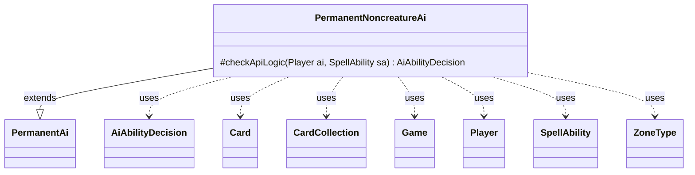

---
aliases:
  - PermanentNoncreatureAi
tags:
  - java/class
  - module/forge-ai
  - pkg/forge/ai/ability
fqn: forge.ai.ability.PermanentNoncreatureAi
package: forge.ai.ability
module: forge-ai
kind: Class
---

# PermanentNoncreatureAi

**Package:** `forge.ai.ability` &nbsp; **Module:** `forge-ai` &nbsp; **Kind:** Class



## Relationships
**Extends:**
- [[forge.ai.ability.PermanentAi|PermanentAi]]
**Uses:**
- [[forge.ai.AiAbilityDecision|AiAbilityDecision]]
- [[forge.game.Game|Game]]
- [[forge.game.card.Card|Card]]
- [[forge.game.card.CardCollection|CardCollection]]
- [[forge.game.player.Player|Player]]
- [[forge.game.spellability.SpellAbility|SpellAbility]]
- [[forge.game.zone.ZoneType|ZoneType]]

## Design Description

PermanentNoncreatureAi specializes the AI decision logic for casting noncreature permanent spells, slotting into Forge's ability-AI hierarchy by extending `PermanentAi` and overriding `checkApiLogic` to refine the engine's play decision. It first defers to the superclass; if that already declines, it returns immediately, otherwise it layers on a targeting-validity check. The notable design intent is special handling for "exile until leaves play" enchantments (the `OblivionRing` SVar pattern): it reconstructs the linked `TrigExile` ability, resolves the relevant origin `ZoneType`, and gathers targetable `Card`s into a `CardCollection`, narrowing to opponent-controlled permanents for cards like Suspension Field and Detention Sphere. If no legal target exists, it aborts with an `AiAbilityDecision` reporting `TargetingFailed`, preventing the AI from wasting a spell that would fizzle on resolution.

## Source
`forge-ai/src/main/java/forge/ai/ability/PermanentNoncreatureAi.java`

```java
package forge.ai.ability;

import forge.ai.AiAbilityDecision;
import forge.ai.AiPlayDecision;
import forge.ai.ComputerUtilAbility;
import forge.game.Game;
import forge.game.ability.AbilityFactory;
import forge.game.card.Card;
import forge.game.card.CardCollection;
import forge.game.card.CardLists;
import forge.game.player.Player;
import forge.game.spellability.SpellAbility;
import forge.game.zone.ZoneType;

/** 
 * AbilityFactory for Creature Spells.
 *
 */
public class PermanentNoncreatureAi extends PermanentAi {

    /**
     * The rest of the logic not covered by the canPlayAI template is defined
     * here
     */
    @Override
    protected AiAbilityDecision checkApiLogic(final Player ai, final SpellAbility sa) {
        AiAbilityDecision decision = super.checkApiLogic(ai, sa);
        if (!decision.willingToPlay()) {
            return decision;
        }

        final Card host = sa.getHostCard();
        final String sourceName = ComputerUtilAbility.getAbilitySourceName(sa);
        final Game game = ai.getGame();

        // Check for valid targets before casting
        if (host.hasSVar("OblivionRing")) {
            // TODO: only the "may" case wouldn't fail checkETBEffects - replace with NeedsToPlay SVar?
            SpellAbility effectExile = AbilityFactory.getAbility(host.getSVar("TrigExile"), host);
            final ZoneType origin = ZoneType.listValueOf(effectExile.getParamOrDefault("Origin", "Battlefield")).get(0);
            effectExile.setActivatingPlayer(ai);
            CardCollection targets = CardLists.getTargetableCards(game.getCardsIn(origin), effectExile);
            if (sourceName.equals("Suspension Field")
                    || sourceName.equals("Detention Sphere")) {
                // existing "exile until leaves" enchantments only target opponent's permanents
                targets = CardLists.filterControlledBy(targets, ai.getOpponents());
            }
            if (targets.isEmpty()) {
                return new AiAbilityDecision(0, AiPlayDecision.TargetingFailed);
            }
        }
        return decision;
    }
}
```
