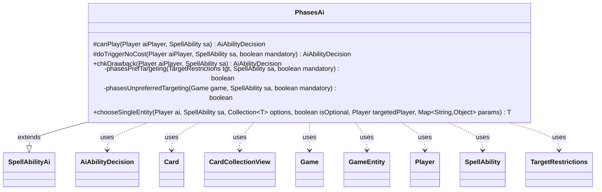

---
aliases:
  - PhasesAi
tags:
  - java/class
  - module/forge-ai
  - pkg/forge/ai/ability
fqn: forge.ai.ability.PhasesAi
package: forge.ai.ability
module: forge-ai
kind: Class
---

# PhasesAi

**Package:** `forge.ai.ability`   **Module:** `forge-ai`   **Kind:** Class



## Relationships
**Extends:**
- [[forge.ai.SpellAbilityAi|SpellAbilityAi]]
**Uses:**
- [[forge.ai.AiAbilityDecision|AiAbilityDecision]]
- [[forge.game.Game|Game]]
- [[forge.game.GameEntity|GameEntity]]
- [[forge.game.card.Card|Card]]
- [[forge.game.card.CardCollectionView|CardCollectionView]]
- [[forge.game.player.Player|Player]]
- [[forge.game.spellability.SpellAbility|SpellAbility]]
- [[forge.game.spellability.TargetRestrictions|TargetRestrictions]]

## Design Description

PhasesAi is the AI decision module for spell abilities that phase permanents in or out of the game. Extending the abstract `SpellAbilityAi` base, it overrides the engine's standard hooks—`canPlay`, `doTriggerNoCost`, and `chkDrawback`—to decide whether and how the computer player should invoke a phasing effect, returning an `AiAbilityDecision` weighted by play desirability. It inspects each `SpellAbility`'s `TargetRestrictions` and host `Card`, defaulting to self-protection (phasing out a threatened source) when the effect is untargeted, and otherwise delegating to private targeting helpers.

Its collaboration with `Game`, `Player`, and `CardCollectionView` is concentrated in target selection: `phasesUnpreferredTargeting` scans the battlefield to phase out an opponent's strongest creature or, failing that, the AI's weakest. Notably, `phasesPrefTargeting` is stubbed to return false (its intended threat-evaluation logic survives only as comments), so the class is an acknowledged work-in-progress, with `chooseSingleEntity` likewise applying a coarse confirm-everything heuristic gated by the `DontPhaseOut` AILogic flag.

## Source
`forge-ai/src/main/java/forge/ai/ability/PhasesAi.java`

```java
package forge.ai.ability;

import forge.ai.*;
import forge.game.Game;
import forge.game.GameEntity;
import forge.game.ability.AbilityUtils;
import forge.game.card.Card;
import forge.game.card.CardCollectionView;
import forge.game.card.CardLists;
import forge.game.card.CardPredicates;
import forge.game.player.Player;
import forge.game.spellability.SpellAbility;
import forge.game.spellability.TargetRestrictions;
import forge.game.zone.ZoneType;

import java.util.Collection;
import java.util.List;
import java.util.Map;
import java.util.function.Predicate;

public class PhasesAi extends SpellAbilityAi {
    @Override
    protected AiAbilityDecision canPlay(Player aiPlayer, SpellAbility sa) {
        // This still needs to be fleshed out
        final TargetRestrictions tgt = sa.getTargetRestrictions();
        final Card source = sa.getHostCard();

        List<Card> tgtCards;
        if (tgt == null) {
            tgtCards = AbilityUtils.getDefinedCards(source, sa.getParam("Defined"), sa);
            if (tgtCards.contains(source)) {
                // Protect it from something
                final boolean isThreatened = ComputerUtil.predictThreatenedObjects(aiPlayer, null, true).contains(source);
                if (isThreatened) {
                    return new AiAbilityDecision(100, AiPlayDecision.WillPlay);
                }
                return new AiAbilityDecision(0, AiPlayDecision.CantPlayAi);
            }

            return new AiAbilityDecision(0, AiPlayDecision.CantPlayAi);
        } else {
            if (!phasesPrefTargeting(tgt, sa, false)) {
                return new AiAbilityDecision(0, AiPlayDecision.CantPlayAi);
            }
        }

        return new AiAbilityDecision(100, AiPlayDecision.WillPlay);
    }

    @Override
    protected AiAbilityDecision doTriggerNoCost(Player aiPlayer, SpellAbility sa, boolean mandatory) {
        final TargetRestrictions tgt = sa.getTargetRestrictions();

        if (tgt == null) {
            if (mandatory) {
                return new AiAbilityDecision(50, AiPlayDecision.MandatoryPlay);
            } else {
                return new AiAbilityDecision(0, AiPlayDecision.CantPlayAi);
            }
        }

        if (phasesPrefTargeting(tgt, sa, mandatory)) {
            return new AiAbilityDecision(100, AiPlayDecision.WillPlay);
        } else if (mandatory) {
            // not enough preferred targets, but mandatory so keep going:
            if (sa.isTargetNumberValid()) {
                return new AiAbilityDecision(100, AiPlayDecision.WillPlay);
            } else {
                // no valid targets, but mandatory so try to find something
                if (phasesUnpreferredTargeting(aiPlayer.getGame(), sa, mandatory)) {
                    return new AiAbilityDecision(100, AiPlayDecision.WillPlay);
                } else {
                    sa.resetTargets();
                    return new AiAbilityDecision(0, AiPlayDecision.CantPlayAi);
                }
            }
        }

        return new AiAbilityDecision(0, AiPlayDecision.CantPlayAi);
    }

    @Override
    public AiAbilityDecision chkDrawback(Player aiPlayer, SpellAbility sa) {
        final TargetRestrictions tgt = sa.getTargetRestrictions();

        if (tgt != null) {
            if (!phasesPrefTargeting(tgt, sa, false)) {
                return new AiAbilityDecision(0, AiPlayDecision.TargetingFailed);
            }
        }

        return new AiAbilityDecision(100, AiPlayDecision.WillPlay);
    }

    private boolean phasesPrefTargeting(final TargetRestrictions tgt, final SpellAbility sa,
            final boolean mandatory) {
        // Card source = sa.getHostCard();

        // List<Card> phaseList =
        // AllZoneUtil.getCardsIn(Zone.Battlefield).getTargetableCards(source)
        // .getValidCards(tgt.getValidTgts(), source.getController(), source);

        // List<Card> aiPhaseList =
        // phaseList.getController(AllZone.getComputerPlayer());

        // If Something in the Phase List might die from a bad combat, or a
        // spell on the stack save it

        // List<Card> humanPhaseList =
        // phaseList.getController(AllZone.getHumanPlayer());

        // If something in the Human List is causing issues, phase it out

        return false;
    }

    private boolean phasesUnpreferredTargeting(final Game game, final SpellAbility sa, final boolean mandatory) {
        final Card source = sa.getHostCard();

        CardCollectionView list = CardLists.getTargetableCards(game.getCardsIn(ZoneType.Battlefield), sa);

        // in general, if it's our own creature, choose the weakest one, if it's the opponent's creature,
        // choose the strongest one
        if (!list.isEmpty()) {
            Predicate<Card> isController = CardPredicates.isController(source.getController());
            CardCollectionView oppList = CardLists.filter(list, isController.negate());
            sa.resetTargets();
            sa.getTargets().add(!oppList.isEmpty() ? ComputerUtilCard.getBestAI(oppList) : ComputerUtilCard.getWorstAI(list));
            return true;
        }

        return false;
    }

    @Override
    public <T extends GameEntity> T chooseSingleEntity(Player ai, SpellAbility sa, Collection<T> options, boolean isOptional, Player targetedPlayer, Map<String, Object> params) {
        // TODO: improve the selection logic, e.g. for cards like Change of Plans. Currently will
        //  confirm everything unless AILogic is "DontPhaseOut", in which case it'll confirm nothing.
        if ("DontPhaseOut".equals(sa.getParam("AILogic"))) {
            return null;
        }

        return super.chooseSingleEntity(ai, sa, options, isOptional, targetedPlayer, params);
    }
}
```

## Python
`forge/ai/ability/PhasesAi.py`

```python
from forge.ai.SpellAbilityAi import SpellAbilityAi
from forge.ai.AiAbilityDecision import AiAbilityDecision
from forge.ai.AiPlayDecision import AiPlayDecision
from forge.ai.ComputerUtil import ComputerUtil
from forge.ai.ComputerUtilCard import ComputerUtilCard
from forge.game.Game import Game
from forge.game.GameEntity import GameEntity
from forge.game.ability.AbilityUtils import AbilityUtils
from forge.game.card.Card import Card
from forge.game.card.CardCollectionView import CardCollectionView
from forge.game.card.CardLists import CardLists
from forge.game.card.CardPredicates import CardPredicates
from forge.game.player.Player import Player
from forge.game.spellability.SpellAbility import SpellAbility
from forge.game.spellability.TargetRestrictions import TargetRestrictions
from forge.game.zone.ZoneType import ZoneType

from typing import Collection, List, Map, TypeVar

T = TypeVar("T", bound=GameEntity)


class PhasesAi(SpellAbilityAi):
    def canPlay(self, aiPlayer: Player, sa: SpellAbility) -> AiAbilityDecision:
        # This still needs to be fleshed out
        tgt = sa.getTargetRestrictions()
        source = sa.getHostCard()

        if tgt is None:
            tgtCards = AbilityUtils.getDefinedCards(source, sa.getParam("Defined"), sa)
            if source in tgtCards:
                # Protect it from something
                isThreatened = source in ComputerUtil.predictThreatenedObjects(aiPlayer, None, True)
                if isThreatened:
                    return AiAbilityDecision(100, AiPlayDecision.WillPlay)
                return AiAbilityDecision(0, AiPlayDecision.CantPlayAi)

            return AiAbilityDecision(0, AiPlayDecision.CantPlayAi)
        else:
            if not self.phasesPrefTargeting(tgt, sa, False):
                return AiAbilityDecision(0, AiPlayDecision.CantPlayAi)

        return AiAbilityDecision(100, AiPlayDecision.WillPlay)

    def doTriggerNoCost(self, aiPlayer: Player, sa: SpellAbility, mandatory: bool) -> AiAbilityDecision:
        tgt = sa.getTargetRestrictions()

        if tgt is None:
            if mandatory:
                return AiAbilityDecision(50, AiPlayDecision.MandatoryPlay)
            else:
                return AiAbilityDecision(0, AiPlayDecision.CantPlayAi)

        if self.phasesPrefTargeting(tgt, sa, mandatory):
            return AiAbilityDecision(100, AiPlayDecision.WillPlay)
        elif mandatory:
            # not enough preferred targets, but mandatory so keep going:
            if sa.isTargetNumberValid():
                return AiAbilityDecision(100, AiPlayDecision.WillPlay)
            else:
                # no valid targets, but mandatory so try to find something
                if self.phasesUnpreferredTargeting(aiPlayer.getGame(), sa, mandatory):
                    return AiAbilityDecision(100, AiPlayDecision.WillPlay)
                else:
                    sa.resetTargets()
                    return AiAbilityDecision(0, AiPlayDecision.CantPlayAi)

        return AiAbilityDecision(0, AiPlayDecision.CantPlayAi)

    def chkDrawback(self, aiPlayer: Player, sa: SpellAbility) -> AiAbilityDecision:
        tgt = sa.getTargetRestrictions()

        if tgt is not None:
            if not self.phasesPrefTargeting(tgt, sa, False):
                return AiAbilityDecision(0, AiPlayDecision.TargetingFailed)

        return AiAbilityDecision(100, AiPlayDecision.WillPlay)

    def phasesPrefTargeting(self, tgt: TargetRestrictions, sa: SpellAbility, mandatory: bool) -> bool:
        # Card source = sa.getHostCard();

        # List<Card> phaseList =
        # AllZoneUtil.getCardsIn(Zone.Battlefield).getTargetableCards(source)
        # .getValidCards(tgt.getValidTgts(), source.getController(), source);

        # List<Card> aiPhaseList =
        # phaseList.getController(AllZone.getComputerPlayer());

        # If Something in the Phase List might die from a bad combat, or a
        # spell on the stack save it

        # List<Card> humanPhaseList =
        # phaseList.getController(AllZone.getHumanPlayer());

        # If something in the Human List is causing issues, phase it out

        return False

    def phasesUnpreferredTargeting(self, game: Game, sa: SpellAbility, mandatory: bool) -> bool:
        source = sa.getHostCard()

        list = CardLists.getTargetableCards(game.getCardsIn(ZoneType.Battlefield), sa)

        # in general, if it's our own creature, choose the weakest one, if it's the opponent's creature,
        # choose the strongest one
        if not list.isEmpty():
            isController = CardPredicates.isController(source.getController())
            oppList = CardLists.filter(list, isController.negate())
            sa.resetTargets()
            sa.getTargets().add(ComputerUtilCard.getBestAI(oppList) if not oppList.isEmpty() else ComputerUtilCard.getWorstAI(list))
            return True

        return False

    def chooseSingleEntity(self, ai: Player, sa: SpellAbility, options: Collection[T], isOptional: bool, targetedPlayer: Player, params: Map[str, object]) -> T:
        # TODO: improve the selection logic, e.g. for cards like Change of Plans. Currently will
        #  confirm everything unless AILogic is "DontPhaseOut", in which case it'll confirm nothing.
        if "DontPhaseOut" == sa.getParam("AILogic"):
            return None

        return super().chooseSingleEntity(ai, sa, options, isOptional, targetedPlayer, params)
```
