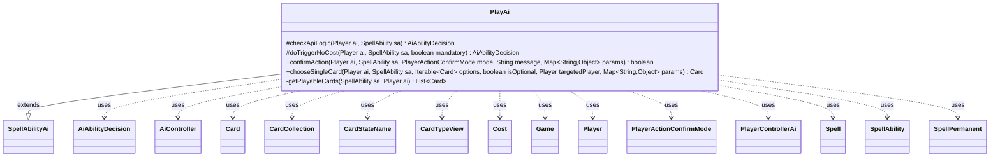

---
aliases:
  - PlayAi
tags:
  - java/class
  - module/forge-ai
  - pkg/forge/ai/ability
fqn: forge.ai.ability.PlayAi
package: forge.ai.ability
module: forge-ai
kind: Class
---

# PlayAi

**Package:** `forge.ai.ability`   **Module:** `forge-ai`   **Kind:** Class



## Relationships
**Extends:**
- [[forge.ai.SpellAbilityAi|SpellAbilityAi]]
**Uses:**
- [[forge.ai.AiAbilityDecision|AiAbilityDecision]]
- [[forge.ai.AiController|AiController]]
- [[forge.ai.PlayerControllerAi|PlayerControllerAi]]
- [[forge.card.CardStateName|CardStateName]]
- [[forge.card.CardTypeView|CardTypeView]]
- [[forge.game.Game|Game]]
- [[forge.game.card.Card|Card]]
- [[forge.game.card.CardCollection|CardCollection]]
- [[forge.game.cost.Cost|Cost]]
- [[forge.game.player.Player|Player]]
- [[forge.game.player.PlayerActionConfirmMode|PlayerActionConfirmMode]]
- [[forge.game.spellability.Spell|Spell]]
- [[forge.game.spellability.SpellAbility|SpellAbility]]
- [[forge.game.spellability.SpellPermanent|SpellPermanent]]

## Design Description

PlayAi is the AI decision module for the "Play" spell-ability API, governing how the computer evaluates and executes effects that let it cast or play cards from non-standard sources (hideaway exiles, defined card sets, or replayed spells). Extending the `SpellAbilityAi` base, it overrides the framework's hook methods—`checkApiLogic` and `doTriggerNoCost` to judge whether playing is worthwhile, `chooseSingleCard` to select the best target, and `confirmAction` to auto-approve prompts—returning `AiAbilityDecision`/`AiPlayDecision` verdicts the engine consumes.

Its design centers on branching `AILogic` parameters (ReplaySpell, NeedsChosenCard, WithTotalCMC, plus a MoJhoSto variant), each with tailored heuristics, while `getPlayableCards` filters candidates by targeting, validity, and zone constraints. Collaborating with `AiController`/`PlayerControllerAi` for evaluation and `ComputerUtilCard`/`ComputerUtilCost` for scoring and affordability, it deliberately guards against fragile cases—skipping non-permanent hideaway spells and X-cost instants under `WithoutManaCost`—to avoid illegal or low-value plays.

## Source
`forge-ai/src/main/java/forge/ai/ability/PlayAi.java`

```java
package forge.ai.ability;

import forge.ai.*;
import forge.card.CardStateName;
import forge.card.CardTypeView;
import forge.game.Game;
import forge.game.GameType;
import forge.game.ability.AbilityUtils;
import forge.game.card.*;
import forge.game.cost.Cost;
import forge.game.keyword.Keyword;
import forge.game.player.Player;
import forge.game.player.PlayerActionConfirmMode;
import forge.game.spellability.Spell;
import forge.game.spellability.SpellAbility;
import forge.game.spellability.SpellAbilityPredicates;
import forge.game.spellability.SpellPermanent;
import forge.game.zone.ZoneType;
import forge.util.IterableUtil;
import forge.util.MyRandom;

import java.util.List;
import java.util.Map;
import java.util.stream.Collectors;

public class PlayAi extends SpellAbilityAi {

    @Override
    protected AiAbilityDecision checkApiLogic(final Player ai, final SpellAbility sa) {
        final String logic = sa.getParamOrDefault("AILogic", "");

        final Game game = ai.getGame();
        final Card source = sa.getHostCard();
        // don't use this as a response (ReplaySpell logic is an exception, might be called from a subability
        // while the trigger is on stack)
        if (!game.getStack().isEmpty() && !"ReplaySpell".equals(logic)) {
            return new AiAbilityDecision(0, AiPlayDecision.CantPlayAi);
        }

        if (game.getRules().hasAppliedVariant(GameType.MoJhoSto) && source.getName().equals("Jhoira of the Ghitu Avatar")) {
            // Additional logic for MoJhoSto:
            // Do not activate Jhoira too early, usually there are few good targets
            AiController aic = ((PlayerControllerAi)ai.getController()).getAi();
            int numLandsForJhoira = aic.getIntProperty(AiProps.MOJHOSTO_NUM_LANDS_TO_ACTIVATE_JHOIRA);
            int chanceToActivateInst = 100 - aic.getIntProperty(AiProps.MOJHOSTO_CHANCE_TO_USE_JHOIRA_COPY_INSTANT);
            if (ai.getLandsInPlay().size() < numLandsForJhoira) {
                return new AiAbilityDecision(0, AiPlayDecision.CantPlayAi);
            }
            // Don't spam activate the Instant copying ability all the time to give the AI a chance to use other abilities
            // Can probably be improved, but as random as MoJhoSto already is, probably not a huge deal for now
            if ("Instant".equals(sa.getParam("AnySupportedCard")) && MyRandom.percentTrue(chanceToActivateInst)) {
                return new AiAbilityDecision(0, AiPlayDecision.CantPlayAi);
            }
            return new AiAbilityDecision(100, AiPlayDecision.WillPlay);
        }

        List<Card> cards = getPlayableCards(sa, ai);
        if (cards.isEmpty()) {
            return new AiAbilityDecision(0, AiPlayDecision.MissingNeededCards);
        }

        if ("ReplaySpell".equals(logic)) {
            if (ComputerUtil.targetPlayableSpellCard(ai, cards, sa, sa.hasParam("WithoutManaCost"), false)) {
                return new AiAbilityDecision(100, AiPlayDecision.WillPlay);
            } else {
                return new AiAbilityDecision(0, AiPlayDecision.TargetingFailed);
            }
        } else if (logic.startsWith("NeedsChosenCard")) {
            int minCMC = 0;
            if (sa.getPayCosts().getCostMana() != null) {
                minCMC = sa.getPayCosts().getTotalMana().getCMC();
            }
            cards = CardLists.filter(cards, CardPredicates.greaterCMC(minCMC));
            if (chooseSingleCard(ai, sa, cards, sa.hasParam("Optional"), null, null) != null) {
                return new AiAbilityDecision(100, AiPlayDecision.WillPlay);
            } else {
                return new AiAbilityDecision(0, AiPlayDecision.MissingNeededCards);
            }
        } else if ("WithTotalCMC".equals(logic)) {
            // Try to play only when there are more than three playable cards.
            if (cards.size() < 3)
                return new AiAbilityDecision(0, AiPlayDecision.CantPlayAi);
            if (sa.costHasManaX()) {
                int amount = ComputerUtilCost.setMaxXValue(sa, ai, sa.isTrigger());
                if (amount < ComputerUtilCard.getBestAI(cards).getCMC())
                    return new AiAbilityDecision(0, AiPlayDecision.CantPlayAi);
                int totalCMC = 0;
                for (Card c : cards) {
                    totalCMC += c.getCMC();
                }
                if (amount > totalCMC)
                    amount = totalCMC;
                sa.setXManaCostPaid(amount);
            }
        }

        if (source != null && source.hasKeyword(Keyword.HIDEAWAY) && source.hasExiledCard()) {
            // AI is not very good at playing non-permanent spells this way, at least yet
            // (might be possible to enable it for Sorceries in Main1/Main2 if target is available,
            // but definitely not for most Instants)
            Card rem = source.getExiledCards().getFirst();
            CardTypeView t = rem.getState(CardStateName.Original).getType();

            if (t.isPermanent() && !t.isLand()) {
                return new AiAbilityDecision(100, AiPlayDecision.WillPlay);
            } else {
                return new AiAbilityDecision(0, AiPlayDecision.CantPlayAi);
            }
        }

        return new AiAbilityDecision(100, AiPlayDecision.WillPlay);
    }

    /**
     * <p>
     * doTriggerAINoCost
     * </p>
     * @param sa
     *            a {@link forge.game.spellability.SpellAbility} object.
     * @param mandatory
     *            a boolean.
     *
     * @return a boolean.
     */
    @Override
    protected AiAbilityDecision doTriggerNoCost(final Player ai, final SpellAbility sa, final boolean mandatory) {
        if (sa.usesTargeting()) {
            if (!sa.hasParam("AILogic")) {
                return new AiAbilityDecision(0, AiPlayDecision.CantPlayAi);
            }

            if ("ReplaySpell".equals(sa.getParam("AILogic"))) {
                boolean result = ComputerUtil.targetPlayableSpellCard(ai, getPlayableCards(sa, ai), sa, sa.hasParam("WithoutManaCost"), mandatory);
                return result ? new AiAbilityDecision(100, AiPlayDecision.WillPlay) : new AiAbilityDecision(0, AiPlayDecision.CantPlayAi);
            }

            return checkApiLogic(ai, sa);
        }

        return new AiAbilityDecision(100, AiPlayDecision.WillPlay);
    }

    @Override
    public boolean confirmAction(Player ai, SpellAbility sa, PlayerActionConfirmMode mode, String message, Map<String, Object> params) {
        return true;
    }

    /* (non-Javadoc)
     * @see forge.card.ability.SpellAbilityAi#chooseSingleCard(forge.game.player.Player, forge.card.spellability.SpellAbility, java.util.List, boolean)
     */
    @Override
    public Card chooseSingleCard(final Player ai, final SpellAbility sa, Iterable<Card> options,
            final boolean isOptional, Player targetedPlayer, Map<String, Object> params) {
        final CardStateName state;
        if (sa.hasParam("CastTransformed")) {
            state = CardStateName.Backside;
            options.forEach(c -> c.changeToState(CardStateName.Backside));
        } else {
            state = CardStateName.Original; 
        }

        List<Card> tgtCards = CardLists.filter(options, c -> {
            // TODO needs to be aligned for MDFC along with getAbilityToPlay so the knowledge
            // of which spell was the reason for the choice can be used there
            for (SpellAbility s : AbilityUtils.getSpellsFromPlayEffect(c, ai, state, false)) {
                if (!sa.matchesValidParam("ValidSA", s)) {
                    continue;
                }
                if (s.isLandAbility()) {
                    // might want to run some checks here but it's rare anyway
                    return true;
                }
                Spell spell = (Spell) s;
                if (params != null && params.containsKey("CMCLimit")) {
                    Integer cmcLimit = (Integer) params.get("CMCLimit");
                    if (spell.getPayCosts().getTotalMana().getCMC() > cmcLimit)
                        continue;
                }
                if (sa.hasParam("WithoutManaCost")) {
                    // Try to avoid casting instants and sorceries with X in their cost, since X will be assumed to be 0.
                    if (!(spell instanceof SpellPermanent)) {
                        if (spell.costHasManaX()) {
                            continue;
                        }
                    }

                    spell = (Spell) spell.copyWithNoManaCost();
                } else if (sa.hasParam("PlayCost")) {
                    Cost abCost;
                    if ("ManaCost".equals(sa.getParam("PlayCost"))) {
                        abCost = new Cost(c.getManaCost(), false);
                    } else {
                        abCost = new Cost(sa.getParam("PlayCost"), false);
                    }

                    spell = (Spell) spell.copyWithManaCostReplaced(spell.getActivatingPlayer(), abCost);
                }
                if (AiPlayDecision.WillPlay == ((PlayerControllerAi)ai.getController()).getAi().canPlayFromEffectAI(spell, !(isOptional || sa.hasParam("Optional")), true)) {
                    // Before accepting, see if the spell has a valid number of targets (it should at this point).
                    // Proceeding past this point if the spell is not correctly targeted will result
                    // in "Failed to add to stack" error and the card disappearing from the game completely.
                    if (!spell.isTargetNumberValid() || !ComputerUtilCost.canPayCost(spell, ai, true)) {
                        // if we won't be able to pay the cost, don't choose the card
                        return false;
                    }
                    return true;
                }
            }
            return false;
        });

        if (sa.hasParam("CastTransformed")) {
            options.forEach(c -> c.changeToState(CardStateName.Original));
        }

        final Card best = ComputerUtilCard.getBestAI(tgtCards);
        if (sa.usesTargeting() && !sa.isTargetNumberValid()) {
            sa.getTargets().add(best);
        }
        return best;
    }

    private static List<Card> getPlayableCards(SpellAbility sa, Player ai) {
        List<Card> cards = null;
        final Card source = sa.getHostCard();

        if (sa.usesTargeting()) {
            cards = CardUtil.getValidCardsToTarget(sa);
        } else if (!sa.hasParam("Valid")) {
            cards = AbilityUtils.getDefinedCards(source, sa.getParam("Defined"), sa);
        }

        if (cards != null & sa.hasParam("ValidSA")) {
            final String valid[] = sa.getParam("ValidSA").split(",");
            final List<Card> invalid = cards.stream().filter(c -> !IterableUtil.any(AbilityUtils.getBasicSpellsFromPlayEffect(c, ai), SpellAbilityPredicates.isValid(valid, ai, source, sa))).collect(Collectors.toList());
            if (!invalid.isEmpty())
                cards.removeAll(invalid);
        }

        // Ensure that if a ValidZone is specified, there's at least something to choose from in that zone.
        if (sa.hasParam("ValidZone")) {
            cards = new CardCollection(AbilityUtils.filterListByType(ai.getGame().getCardsIn(ZoneType.listValueOf(sa.getParam("ValidZone"))),
                    sa.getParam("Valid"), sa));
        }
        // exclude own card
        cards.remove(source);
        return cards;
    }

}
```

## Python
`forge/ai/ability/PlayAi.py`

```python
from forge.ai.AiAbilityDecision import AiAbilityDecision
from forge.ai.AiPlayDecision import AiPlayDecision
from forge.ai.AiController import AiController
from forge.ai.AiProps import AiProps
from forge.ai.ComputerUtil import ComputerUtil
from forge.ai.ComputerUtilCard import ComputerUtilCard
from forge.ai.ComputerUtilCost import ComputerUtilCost
from forge.ai.PlayerControllerAi import PlayerControllerAi
from forge.ai.SpellAbilityAi import SpellAbilityAi
from forge.card.CardStateName import CardStateName
from forge.card.CardTypeView import CardTypeView
from forge.game.Game import Game
from forge.game.GameType import GameType
from forge.game.ability.AbilityUtils import AbilityUtils
from forge.game.card.Card import Card
from forge.game.card.CardCollection import CardCollection
from forge.game.card.CardLists import CardLists
from forge.game.card.CardPredicates import CardPredicates
from forge.game.card.CardUtil import CardUtil
from forge.game.cost.Cost import Cost
from forge.game.keyword.Keyword import Keyword
from forge.game.player.Player import Player
from forge.game.player.PlayerActionConfirmMode import PlayerActionConfirmMode
from forge.game.spellability.Spell import Spell
from forge.game.spellability.SpellAbility import SpellAbility
from forge.game.spellability.SpellAbilityPredicates import SpellAbilityPredicates
from forge.game.spellability.SpellPermanent import SpellPermanent
from forge.game.zone.ZoneType import ZoneType
from forge.util.IterableUtil import IterableUtil
from forge.util.MyRandom import MyRandom


class PlayAi(SpellAbilityAi):

    def checkApiLogic(self, ai: Player, sa: SpellAbility) -> AiAbilityDecision:
        logic = sa.getParamOrDefault("AILogic", "")

        game = ai.getGame()
        source = sa.getHostCard()
        # don't use this as a response (ReplaySpell logic is an exception, might be called from a subability
        # while the trigger is on stack)
        if not game.getStack().isEmpty() and not "ReplaySpell" == logic:
            return AiAbilityDecision(0, AiPlayDecision.CantPlayAi)

        if game.getRules().hasAppliedVariant(GameType.MoJhoSto) and source.getName() == "Jhoira of the Ghitu Avatar":
            # Additional logic for MoJhoSto:
            # Do not activate Jhoira too early, usually there are few good targets
            aic = ai.getController().getAi()
            numLandsForJhoira = aic.getIntProperty(AiProps.MOJHOSTO_NUM_LANDS_TO_ACTIVATE_JHOIRA)
            chanceToActivateInst = 100 - aic.getIntProperty(AiProps.MOJHOSTO_CHANCE_TO_USE_JHOIRA_COPY_INSTANT)
            if ai.getLandsInPlay().size() < numLandsForJhoira:
                return AiAbilityDecision(0, AiPlayDecision.CantPlayAi)
            # Don't spam activate the Instant copying ability all the time to give the AI a chance to use other abilities
            # Can probably be improved, but as random as MoJhoSto already is, probably not a huge deal for now
            if "Instant" == sa.getParam("AnySupportedCard") and MyRandom.percentTrue(chanceToActivateInst):
                return AiAbilityDecision(0, AiPlayDecision.CantPlayAi)
            return AiAbilityDecision(100, AiPlayDecision.WillPlay)

        cards = self.getPlayableCards(sa, ai)
        if cards.isEmpty():
            return AiAbilityDecision(0, AiPlayDecision.MissingNeededCards)

        if "ReplaySpell" == logic:
            if ComputerUtil.targetPlayableSpellCard(ai, cards, sa, sa.hasParam("WithoutManaCost"), False):
                return AiAbilityDecision(100, AiPlayDecision.WillPlay)
            else:
                return AiAbilityDecision(0, AiPlayDecision.TargetingFailed)
        elif logic.startswith("NeedsChosenCard"):
            minCMC = 0
            if sa.getPayCosts().getCostMana() is not None:
                minCMC = sa.getPayCosts().getTotalMana().getCMC()
            cards = CardLists.filter(cards, CardPredicates.greaterCMC(minCMC))
            if self.chooseSingleCard(ai, sa, cards, sa.hasParam("Optional"), None, None) is not None:
                return AiAbilityDecision(100, AiPlayDecision.WillPlay)
            else:
                return AiAbilityDecision(0, AiPlayDecision.MissingNeededCards)
        elif "WithTotalCMC" == logic:
            # Try to play only when there are more than three playable cards.
            if cards.size() < 3:
                return AiAbilityDecision(0, AiPlayDecision.CantPlayAi)
            if sa.costHasManaX():
                amount = ComputerUtilCost.setMaxXValue(sa, ai, sa.isTrigger())
                if amount < ComputerUtilCard.getBestAI(cards).getCMC():
                    return AiAbilityDecision(0, AiPlayDecision.CantPlayAi)
                totalCMC = 0
                for c in cards:
                    totalCMC += c.getCMC()
                if amount > totalCMC:
                    amount = totalCMC
                sa.setXManaCostPaid(amount)

        if source is not None and source.hasKeyword(Keyword.HIDEAWAY) and source.hasExiledCard():
            # AI is not very good at playing non-permanent spells this way, at least yet
            # (might be possible to enable it for Sorceries in Main1/Main2 if target is available,
            # but definitely not for most Instants)
            rem = source.getExiledCards().getFirst()
            t = rem.getState(CardStateName.Original).getType()

            if t.isPermanent() and not t.isLand():
                return AiAbilityDecision(100, AiPlayDecision.WillPlay)
            else:
                return AiAbilityDecision(0, AiPlayDecision.CantPlayAi)

        return AiAbilityDecision(100, AiPlayDecision.WillPlay)

    def doTriggerNoCost(self, ai: Player, sa: SpellAbility, mandatory: bool) -> AiAbilityDecision:
        if sa.usesTargeting():
            if not sa.hasParam("AILogic"):
                return AiAbilityDecision(0, AiPlayDecision.CantPlayAi)

            if "ReplaySpell" == sa.getParam("AILogic"):
                result = ComputerUtil.targetPlayableSpellCard(ai, self.getPlayableCards(sa, ai), sa, sa.hasParam("WithoutManaCost"), mandatory)
                return AiAbilityDecision(100, AiPlayDecision.WillPlay) if result else AiAbilityDecision(0, AiPlayDecision.CantPlayAi)

            return self.checkApiLogic(ai, sa)

        return AiAbilityDecision(100, AiPlayDecision.WillPlay)

    def confirmAction(self, ai: Player, sa: SpellAbility, mode: PlayerActionConfirmMode, message: str, params: dict[str, object]) -> bool:
        return True

    def chooseSingleCard(self, ai: Player, sa: SpellAbility, options, isOptional: bool, targetedPlayer: Player, params: dict[str, object]) -> Card:
        if sa.hasParam("CastTransformed"):
            state = CardStateName.Backside
            for c in options:
                c.changeToState(CardStateName.Backside)
        else:
            state = CardStateName.Original

        def predicate(c):
            # TODO needs to be aligned for MDFC along with getAbilityToPlay so the knowledge
            # of which spell was the reason for the choice can be used there
            for s in AbilityUtils.getSpellsFromPlayEffect(c, ai, state, False):
                if not sa.matchesValidParam("ValidSA", s):
                    continue
                if s.isLandAbility():
                    # might want to run some checks here but it's rare anyway
                    return True
                spell = s
                if params is not None and "CMCLimit" in params:
                    cmcLimit = params.get("CMCLimit")
                    if spell.getPayCosts().getTotalMana().getCMC() > cmcLimit:
                        continue
                if sa.hasParam("WithoutManaCost"):
                    # Try to avoid casting instants and sorceries with X in their cost, since X will be assumed to be 0.
                    if not isinstance(spell, SpellPermanent):
                        if spell.costHasManaX():
                            continue

                    spell = spell.copyWithNoManaCost()
                elif sa.hasParam("PlayCost"):
                    if "ManaCost" == sa.getParam("PlayCost"):
                        abCost = Cost(c.getManaCost(), False)
                    else:
                        abCost = Cost(sa.getParam("PlayCost"), False)

                    spell = spell.copyWithManaCostReplaced(spell.getActivatingPlayer(), abCost)
                if AiPlayDecision.WillPlay == ai.getController().getAi().canPlayFromEffectAI(spell, not (isOptional or sa.hasParam("Optional")), True):
                    # Before accepting, see if the spell has a valid number of targets (it should at this point).
                    # Proceeding past this point if the spell is not correctly targeted will result
                    # in "Failed to add to stack" error and the card disappearing from the game completely.
                    if not spell.isTargetNumberValid() or not ComputerUtilCost.canPayCost(spell, ai, True):
                        # if we won't be able to pay the cost, don't choose the card
                        return False
                    return True
            return False

        tgtCards = CardLists.filter(options, predicate)

        if sa.hasParam("CastTransformed"):
            for c in options:
                c.changeToState(CardStateName.Original)

        best = ComputerUtilCard.getBestAI(tgtCards)
        if sa.usesTargeting() and not sa.isTargetNumberValid():
            sa.getTargets().add(best)
        return best

    @staticmethod
    def getPlayableCards(sa: SpellAbility, ai: Player) -> list[Card]:
        cards = None
        source = sa.getHostCard()

        if sa.usesTargeting():
            cards = CardUtil.getValidCardsToTarget(sa)
        elif not sa.hasParam("Valid"):
            cards = AbilityUtils.getDefinedCards(source, sa.getParam("Defined"), sa)

        if cards is not None and sa.hasParam("ValidSA"):
            valid = sa.getParam("ValidSA").split(",")
            invalid = [c for c in cards if not IterableUtil.any(AbilityUtils.getBasicSpellsFromPlayEffect(c, ai), SpellAbilityPredicates.isValid(valid, ai, source, sa))]
            if invalid:
                cards.removeAll(invalid)

        # Ensure that if a ValidZone is specified, there's at least something to choose from in that zone.
        if sa.hasParam("ValidZone"):
            cards = CardCollection(AbilityUtils.filterListByType(ai.getGame().getCardsIn(ZoneType.listValueOf(sa.getParam("ValidZone"))),
                    sa.getParam("Valid"), sa))
        # exclude own card
        cards.remove(source)
        return cards
```
