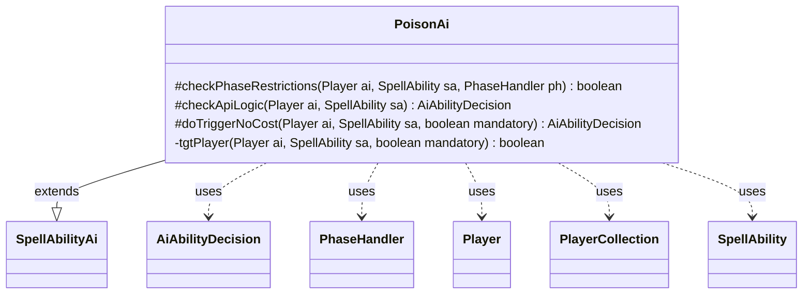

---
aliases:
  - PoisonAi
tags:
  - java/class
  - module/forge-ai
  - pkg/forge/ai/ability
fqn: forge.ai.ability.PoisonAi
package: forge.ai.ability
module: forge-ai
kind: Class
---

# PoisonAi

**Package:** `forge.ai.ability`   **Module:** `forge-ai`   **Kind:** Class



## Relationships
**Extends:**
- [[forge.ai.SpellAbilityAi|SpellAbilityAi]]
**Uses:**
- [[forge.ai.AiAbilityDecision|AiAbilityDecision]]
- [[forge.game.phase.PhaseHandler|PhaseHandler]]
- [[forge.game.player.Player|Player]]
- [[forge.game.player.PlayerCollection|PlayerCollection]]
- [[forge.game.spellability.SpellAbility|SpellAbility]]

## Design Description

PoisonAi is the AI decision component for spell abilities that inflict poison counters, extending `SpellAbilityAi` to override the engine's hooks for when and how the computer player employs such effects. `checkPhaseRestrictions` defers activation until the second main phase (unless explicit activation phases are set), and `checkApiLogic` declines to act when creatures should be held back for blocking, otherwise committing to play once a valid target is found. Its core intent lives in the private `tgtPlayer` helper, which encodes the heuristic of preferring opponents who can actually be killed by poison—filtering out players immune to loss-by-poison or unable to receive counters—then choosing the most poisoned victim to finish off.

For mandatory triggers, `doTriggerNoCost` and `tgtPlayer` gracefully degrade, redirecting unavoidable targeting onto unaffected allies or the AI itself to minimize self-harm. It collaborates with `Player`/`PlayerCollection` (via `PlayerPredicates`) for candidate selection and returns `AiAbilityDecision` verdicts that quantify the engine's confidence in each choice.

## Source
`forge-ai/src/main/java/forge/ai/ability/PoisonAi.java`

```java
package forge.ai.ability;

import forge.ai.AiAbilityDecision;
import forge.ai.AiPlayDecision;
import forge.ai.ComputerUtil;
import forge.ai.SpellAbilityAi;
import forge.game.ability.AbilityUtils;
import forge.game.card.CounterEnumType;
import forge.game.phase.PhaseHandler;
import forge.game.phase.PhaseType;
import forge.game.player.GameLossReason;
import forge.game.player.Player;
import forge.game.player.PlayerCollection;
import forge.game.player.PlayerPredicates;
import forge.game.spellability.SpellAbility;

public class PoisonAi extends SpellAbilityAi {

    /*
     * (non-Javadoc)
     * 
     * @see
     * forge.ai.SpellAbilityAi#checkPhaseRestrictions(forge.game.player.Player,
     * forge.game.spellability.SpellAbility, forge.game.phase.PhaseHandler)
     */
    @Override
    protected boolean checkPhaseRestrictions(final Player ai, final SpellAbility sa, final PhaseHandler ph) {
        return !ph.getPhase().isBefore(PhaseType.MAIN2) || sa.hasParam("ActivationPhases");
    }

    /*
     * (non-Javadoc)
     * 
     * @see forge.ai.SpellAbilityAi#checkApiLogic(forge.game.player.Player,
     * forge.game.spellability.SpellAbility)
     */
    @Override
    protected AiAbilityDecision checkApiLogic(Player ai, SpellAbility sa) {
        // Don't tap creatures that may be able to block
        if (ComputerUtil.waitForBlocking(sa)) {
            return new AiAbilityDecision(0, AiPlayDecision.WaitForCombat);
        }

        if (sa.usesTargeting()) {
            sa.resetTargets();
            if (tgtPlayer(ai, sa, true)) {
                return new AiAbilityDecision(100, AiPlayDecision.WillPlay);
            } else {
                return new AiAbilityDecision(0, AiPlayDecision.TargetingFailed);
            }
        }

        return new AiAbilityDecision(100, AiPlayDecision.WillPlay);
    }

    /*
     * (non-Javadoc)
     * 
     * @see forge.ai.SpellAbilityAi#doTriggerAINoCost(forge.game.player.Player,
     * forge.game.spellability.SpellAbility, boolean)
     */
    @Override
    protected AiAbilityDecision doTriggerNoCost(Player ai, SpellAbility sa, boolean mandatory) {
        boolean result;
        if (sa.usesTargeting()) {
            result = tgtPlayer(ai, sa, mandatory);
        } else if (mandatory || !ai.canReceiveCounters(CounterEnumType.POISON)) {
            // mandatory or ai is uneffected
            result = true;
        } else {
            // currently there are no optional Trigger
            final PlayerCollection players = AbilityUtils.getDefinedPlayers(sa.getHostCard(), sa.getParam("Defined"), sa);
            if (players.isEmpty()) {
                result = false;
            } else if (!players.contains(ai)) {
                result = true;
            } else {
                Player max = players.max(PlayerPredicates.compareByPoison());
                result = ai.getPoisonCounters() != max.getPoisonCounters();
            }
        }
        return result ? new AiAbilityDecision(100, AiPlayDecision.WillPlay) : new AiAbilityDecision(0, AiPlayDecision.CantPlayAi);
    }

    private boolean tgtPlayer(Player ai, SpellAbility sa, boolean mandatory) {
        PlayerCollection tgts = ai.getOpponents().filter(PlayerPredicates.isTargetableBy(sa));
        if (!tgts.isEmpty()) {
            // try to select a opponent that can lose through poison counters
            PlayerCollection betterTgts = tgts.filter(input -> {
                if (input.cantLoseCheck(GameLossReason.Poisoned)) {
                    return false;
                } else if (!input.canReceiveCounters(CounterEnumType.POISON)) {
                    return false;
                }
                return true;
            });

            if (!betterTgts.isEmpty()) {
                tgts = betterTgts;
            } else if (mandatory) {
                // no better choice but better than hitting himself
                sa.getTargets().add(tgts.getFirst());
                return true;
            }
        }

        // no opponent can be killed with that
        if (tgts.isEmpty()) {
            if (mandatory) {
                // AI is uneffected
                if (ai.canBeTargetedBy(sa) && !ai.canReceiveCounters(CounterEnumType.POISON)) {
                    sa.getTargets().add(ai);
                    return true;
                }
                // need to target something, try to target allies
                PlayerCollection allies = ai.getAllies().filter(PlayerPredicates.isTargetableBy(sa));
                if (!allies.isEmpty()) {
                    // some ally would be unaffected
                    PlayerCollection betterAllies = allies.filter(input -> {
                        if (input.cantLoseCheck(GameLossReason.Poisoned)) {
                            return true;
                        }
                        return !input.canReceiveCounters(CounterEnumType.POISON);
                    });
                    if (!betterAllies.isEmpty()) {
                        allies = betterAllies;
                    }

                    Player min = allies.min(PlayerPredicates.compareByPoison());
                    sa.getTargets().add(min);
                    return true;
                } else if (ai.canBeTargetedBy(sa)) {
                    // need to target himself
                    sa.getTargets().add(ai);
                    return true;
                }
            }
            return false;
        }

        // find player with max poison to kill
        Player max = tgts.max(PlayerPredicates.compareByPoison());
        sa.getTargets().add(max);
        return true;
    }
}
```

## Python
`forge/ai/ability/PoisonAi.py`

```python
from forge.ai.AiAbilityDecision import AiAbilityDecision
from forge.ai.AiPlayDecision import AiPlayDecision
from forge.ai.ComputerUtil import ComputerUtil
from forge.ai.SpellAbilityAi import SpellAbilityAi
from forge.game.ability.AbilityUtils import AbilityUtils
from forge.game.card.CounterEnumType import CounterEnumType
from forge.game.phase.PhaseHandler import PhaseHandler
from forge.game.phase.PhaseType import PhaseType
from forge.game.player.GameLossReason import GameLossReason
from forge.game.player.Player import Player
from forge.game.player.PlayerCollection import PlayerCollection
from forge.game.player.PlayerPredicates import PlayerPredicates
from forge.game.spellability.SpellAbility import SpellAbility


class PoisonAi(SpellAbilityAi):

    # (non-Javadoc)
    #
    # @see
    # forge.ai.SpellAbilityAi#checkPhaseRestrictions(forge.game.player.Player,
    # forge.game.spellability.SpellAbility, forge.game.phase.PhaseHandler)
    def checkPhaseRestrictions(self, ai: Player, sa: SpellAbility, ph: PhaseHandler) -> bool:
        return not ph.getPhase().isBefore(PhaseType.MAIN2) or sa.hasParam("ActivationPhases")

    # (non-Javadoc)
    #
    # @see forge.ai.SpellAbilityAi#checkApiLogic(forge.game.player.Player,
    # forge.game.spellability.SpellAbility)
    def checkApiLogic(self, ai: Player, sa: SpellAbility) -> AiAbilityDecision:
        # Don't tap creatures that may be able to block
        if ComputerUtil.waitForBlocking(sa):
            return AiAbilityDecision(0, AiPlayDecision.WaitForCombat)

        if sa.usesTargeting():
            sa.resetTargets()
            if self.tgtPlayer(ai, sa, True):
                return AiAbilityDecision(100, AiPlayDecision.WillPlay)
            else:
                return AiAbilityDecision(0, AiPlayDecision.TargetingFailed)

        return AiAbilityDecision(100, AiPlayDecision.WillPlay)

    # (non-Javadoc)
    #
    # @see forge.ai.SpellAbilityAi#doTriggerAINoCost(forge.game.player.Player,
    # forge.game.spellability.SpellAbility, boolean)
    def doTriggerNoCost(self, ai: Player, sa: SpellAbility, mandatory: bool) -> AiAbilityDecision:
        if sa.usesTargeting():
            result = self.tgtPlayer(ai, sa, mandatory)
        elif mandatory or not ai.canReceiveCounters(CounterEnumType.POISON):
            # mandatory or ai is uneffected
            result = True
        else:
            # currently there are no optional Trigger
            players = AbilityUtils.getDefinedPlayers(sa.getHostCard(), sa.getParam("Defined"), sa)
            if players.isEmpty():
                result = False
            elif not players.contains(ai):
                result = True
            else:
                max = players.max(PlayerPredicates.compareByPoison())
                result = ai.getPoisonCounters() != max.getPoisonCounters()
        return AiAbilityDecision(100, AiPlayDecision.WillPlay) if result else AiAbilityDecision(0, AiPlayDecision.CantPlayAi)

    def tgtPlayer(self, ai: Player, sa: SpellAbility, mandatory: bool) -> bool:
        tgts = ai.getOpponents().filter(PlayerPredicates.isTargetableBy(sa))
        if not tgts.isEmpty():
            # try to select a opponent that can lose through poison counters
            def betterFilter(input):
                if input.cantLoseCheck(GameLossReason.Poisoned):
                    return False
                elif not input.canReceiveCounters(CounterEnumType.POISON):
                    return False
                return True

            betterTgts = tgts.filter(betterFilter)

            if not betterTgts.isEmpty():
                tgts = betterTgts
            elif mandatory:
                # no better choice but better than hitting himself
                sa.getTargets().add(tgts.getFirst())
                return True

        # no opponent can be killed with that
        if tgts.isEmpty():
            if mandatory:
                # AI is uneffected
                if ai.canBeTargetedBy(sa) and not ai.canReceiveCounters(CounterEnumType.POISON):
                    sa.getTargets().add(ai)
                    return True
                # need to target something, try to target allies
                allies = ai.getAllies().filter(PlayerPredicates.isTargetableBy(sa))
                if not allies.isEmpty():
                    # some ally would be unaffected
                    def betterAllyFilter(input):
                        if input.cantLoseCheck(GameLossReason.Poisoned):
                            return True
                        return not input.canReceiveCounters(CounterEnumType.POISON)

                    betterAllies = allies.filter(betterAllyFilter)
                    if not betterAllies.isEmpty():
                        allies = betterAllies

                    min = allies.min(PlayerPredicates.compareByPoison())
                    sa.getTargets().add(min)
                    return True
                elif ai.canBeTargetedBy(sa):
                    # need to target himself
                    sa.getTargets().add(ai)
                    return True
            return False

        # find player with max poison to kill
        max = tgts.max(PlayerPredicates.compareByPoison())
        sa.getTargets().add(max)
        return True
```
