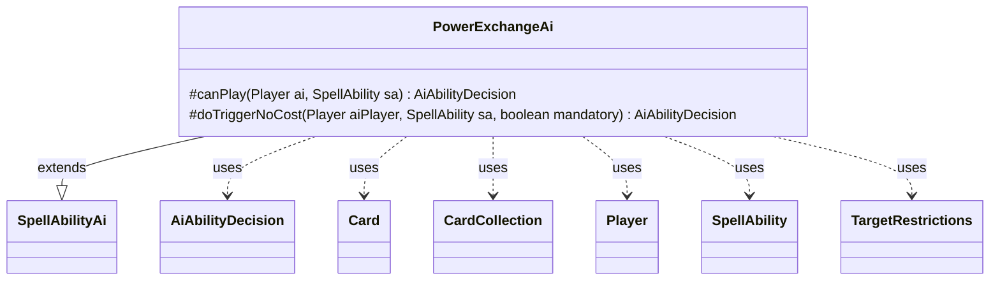

---
aliases:
  - PowerExchangeAi
tags:
  - java/class
  - module/forge-ai
  - pkg/forge/ai/ability
fqn: forge.ai.ability.PowerExchangeAi
package: forge.ai.ability
module: forge-ai
kind: Class
---

# PowerExchangeAi

**Package:** `forge.ai.ability`   **Module:** `forge-ai`   **Kind:** Class



## Relationships
**Extends:**
- [[forge.ai.SpellAbilityAi|SpellAbilityAi]]
**Uses:**
- [[forge.ai.AiAbilityDecision|AiAbilityDecision]]
- [[forge.game.card.Card|Card]]
- [[forge.game.card.CardCollection|CardCollection]]
- [[forge.game.player.Player|Player]]
- [[forge.game.spellability.SpellAbility|SpellAbility]]
- [[forge.game.spellability.TargetRestrictions|TargetRestrictions]]

## Design Description

PowerExchangeAi supplies the AI's decision logic for resolving a "power exchange" effect, where the power values of two creatures are swapped. As a concrete subclass of `SpellAbilityAi`, it overrides `canPlay` to evaluate whether the computer should cast or activate the ability and `doTriggerNoCost` to handle triggered, often mandatory, invocations. It collaborates with `Card`, `CardCollection`, and `TargetRestrictions` to enumerate and filter legal targets on the battlefield, returning its choice through an `AiAbilityDecision`.

The design intent is selective targeting: it picks the strongest opponent creature as one endpoint and the AI's own strongest creature as the other, then commits only when the swap is clearly favorable—either mandatory or yielding at least a 40-point creature-evaluation advantage. Otherwise it declines with `CantPlayAi`, ensuring the AI avoids strengthening its opponents through an unprofitable exchange.

## Source
`forge-ai/src/main/java/forge/ai/ability/PowerExchangeAi.java`

```java
package forge.ai.ability;

import forge.ai.AiAbilityDecision;
import forge.ai.AiPlayDecision;
import forge.ai.ComputerUtilCard;
import forge.ai.SpellAbilityAi;
import forge.game.ability.AbilityUtils;
import forge.game.card.Card;
import forge.game.card.CardCollection;
import forge.game.card.CardLists;
import forge.game.player.Player;
import forge.game.spellability.SpellAbility;
import forge.game.spellability.TargetRestrictions;
import forge.game.zone.ZoneType;

import java.util.List;

public class PowerExchangeAi extends SpellAbilityAi {

/* (non-Javadoc)
 * @see forge.card.abilityfactory.SpellAiLogic#canPlayAI(forge.game.player.Player, java.util.Map, forge.card.spellability.SpellAbility)
 */
    @Override
    protected AiAbilityDecision canPlay(Player ai, final SpellAbility sa) {
        Card c1 = null;
        Card c2 = null;
        final TargetRestrictions tgt = sa.getTargetRestrictions();
        sa.resetTargets();

        List<Card> list =
                CardLists.getValidCards(ai.getGame().getCardsIn(ZoneType.Battlefield), tgt.getValidTgts(), ai, sa.getHostCard(), sa);
        list = CardLists.filter(list, c -> c.canBeTargetedBy(sa) && c.getController() != ai);
        CardLists.sortByPowerDesc(list);
        c1 = list.isEmpty() ? null : list.get(0);
        if (sa.hasParam("Defined")) {
            c2 = AbilityUtils.getDefinedCards(sa.getHostCard(), sa.getParam("Defined"), sa).get(0);
        }
        else if (sa.getMinTargets() > 1) {
            CardCollection list2 = CardLists.getValidCards(ai.getCardsIn(ZoneType.Battlefield), tgt.getValidTgts(), ai, sa.getHostCard(), sa);
            CardLists.sortByPowerDesc(list2);
            c2 = list2.isEmpty() ? null : list2.get(0);
            sa.getTargets().add(c2);
        }
        if (c1 == null || c2 == null) {
            return new AiAbilityDecision(0, AiPlayDecision.CantPlayAi);
        }
        if (sa.isMandatory() || ComputerUtilCard.evaluateCreature(c1) > ComputerUtilCard.evaluateCreature(c2) + 40) {
            sa.getTargets().add(c1);
            return new AiAbilityDecision(100, AiPlayDecision.WillPlay);
        }
        return new AiAbilityDecision(0, AiPlayDecision.CantPlayAi);
    }

    /* (non-Javadoc)
     * @see forge.card.abilityfactory.SpellAiLogic#doTriggerAINoCost(forge.game.player.Player, java.util.Map, forge.card.spellability.SpellAbility, boolean)
     */
    @Override
    protected AiAbilityDecision doTriggerNoCost(Player aiPlayer, SpellAbility sa, boolean mandatory) {
        if (!sa.usesTargeting()) {
            if (mandatory) {
                return new AiAbilityDecision(100, AiPlayDecision.WillPlay);
            }
        } else {
            return canPlay(aiPlayer, sa);
        }
        return new AiAbilityDecision(100, AiPlayDecision.WillPlay);
    }
}
```

## Python
`forge/ai/ability/PowerExchangeAi.py`

```python
from forge.ai.AiAbilityDecision import AiAbilityDecision
from forge.ai.AiPlayDecision import AiPlayDecision
from forge.ai.ComputerUtilCard import ComputerUtilCard
from forge.ai.SpellAbilityAi import SpellAbilityAi
from forge.game.ability.AbilityUtils import AbilityUtils
from forge.game.card.Card import Card
from forge.game.card.CardCollection import CardCollection
from forge.game.card.CardLists import CardLists
from forge.game.player.Player import Player
from forge.game.spellability.SpellAbility import SpellAbility
from forge.game.spellability.TargetRestrictions import TargetRestrictions
from forge.game.zone.ZoneType import ZoneType


class PowerExchangeAi(SpellAbilityAi):

    # (non-Javadoc)
    # @see forge.card.abilityfactory.SpellAiLogic#canPlayAI(forge.game.player.Player, java.util.Map, forge.card.spellability.SpellAbility)
    def canPlay(self, ai: Player, sa: SpellAbility) -> AiAbilityDecision:
        c1 = None
        c2 = None
        tgt = sa.getTargetRestrictions()
        sa.resetTargets()

        list = CardLists.getValidCards(ai.getGame().getCardsIn(ZoneType.Battlefield), tgt.getValidTgts(), ai, sa.getHostCard(), sa)
        list = CardLists.filter(list, lambda c: c.canBeTargetedBy(sa) and c.getController() != ai)
        CardLists.sortByPowerDesc(list)
        c1 = None if len(list) == 0 else list[0]
        if sa.hasParam("Defined"):
            c2 = AbilityUtils.getDefinedCards(sa.getHostCard(), sa.getParam("Defined"), sa).get(0)
        elif sa.getMinTargets() > 1:
            list2 = CardLists.getValidCards(ai.getCardsIn(ZoneType.Battlefield), tgt.getValidTgts(), ai, sa.getHostCard(), sa)
            CardLists.sortByPowerDesc(list2)
            c2 = None if len(list2) == 0 else list2[0]
            sa.getTargets().add(c2)
        if c1 is None or c2 is None:
            return AiAbilityDecision(0, AiPlayDecision.CantPlayAi)
        if sa.isMandatory() or ComputerUtilCard.evaluateCreature(c1) > ComputerUtilCard.evaluateCreature(c2) + 40:
            sa.getTargets().add(c1)
            return AiAbilityDecision(100, AiPlayDecision.WillPlay)
        return AiAbilityDecision(0, AiPlayDecision.CantPlayAi)

    # (non-Javadoc)
    # @see forge.card.abilityfactory.SpellAiLogic#doTriggerAINoCost(forge.game.player.Player, java.util.Map, forge.card.spellability.SpellAbility, boolean)
    def doTriggerNoCost(self, aiPlayer: Player, sa: SpellAbility, mandatory: bool) -> AiAbilityDecision:
        if not sa.usesTargeting():
            if mandatory:
                return AiAbilityDecision(100, AiPlayDecision.WillPlay)
        else:
            return self.canPlay(aiPlayer, sa)
        return AiAbilityDecision(100, AiPlayDecision.WillPlay)
```
