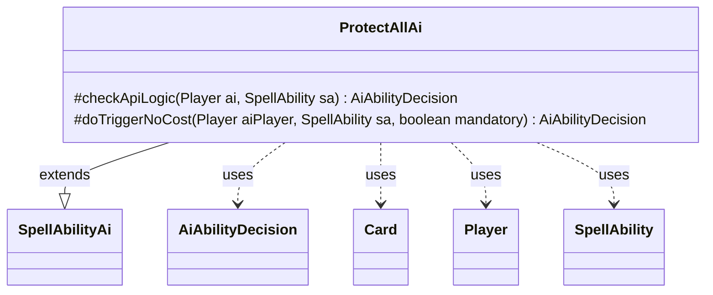

---
aliases:
  - ProtectAllAi
tags:
  - java/class
  - module/forge-ai
  - pkg/forge/ai/ability
fqn: forge.ai.ability.ProtectAllAi
package: forge.ai.ability
module: forge-ai
kind: Class
---

# ProtectAllAi

**Package:** `forge.ai.ability` &nbsp; **Module:** `forge-ai` &nbsp; **Kind:** Class



## Relationships
**Extends:**
- [[forge.ai.SpellAbilityAi|SpellAbilityAi]]
**Uses:**
- [[forge.ai.AiAbilityDecision|AiAbilityDecision]]
- [[forge.game.card.Card|Card]]
- [[forge.game.player.Player|Player]]
- [[forge.game.spellability.SpellAbility|SpellAbility]]

## Design Description

ProtectAllAi supplies the AI decision logic for spell abilities using the "ProtectAll" API, which grants protection to a group of permanents. As a concrete subclass of `SpellAbilityAi`, it overrides the two hooks the AI framework invokes when evaluating whether the computer player should use such an ability, returning `AiAbilityDecision` verdicts built from `AiPlayDecision` codes. `checkApiLogic`, governing voluntary activation, currently declines in all cases (returning `CantPlayAi`), reflecting that the engine has no proactive heuristic for casting these effects. `doTriggerNoCost`, by contrast, unconditionally returns `WillPlay` with maximum confidence, so when the ability fires as a free or mandatory trigger the AI always resolves it. The class collaborates with `Player`, `SpellAbility`, and `Card` (via the host card and in-play checks) to inspect game state, embodying a conservative design that defers protection effects to forced contexts rather than initiating them.

## Source
`forge-ai/src/main/java/forge/ai/ability/ProtectAllAi.java`

```java
package forge.ai.ability;

import forge.ai.AiAbilityDecision;
import forge.ai.AiPlayDecision;
import forge.ai.SpellAbilityAi;
import forge.game.card.Card;
import forge.game.player.Player;
import forge.game.spellability.SpellAbility;

public class ProtectAllAi extends SpellAbilityAi {

    @Override
    protected AiAbilityDecision checkApiLogic(Player ai, SpellAbility sa) {
        final Card hostCard = sa.getHostCard();
        // if there is no target and host card isn't in play, don't activate
        if (!sa.usesTargeting() && !hostCard.isInPlay()) {
            return new AiAbilityDecision(0, AiPlayDecision.CantPlayAi);
        }

        return new AiAbilityDecision(0, AiPlayDecision.CantPlayAi);
    }

    @Override
    protected AiAbilityDecision doTriggerNoCost(Player aiPlayer, SpellAbility sa, boolean mandatory) {
        return new AiAbilityDecision(100, AiPlayDecision.WillPlay);
    }
}
```
