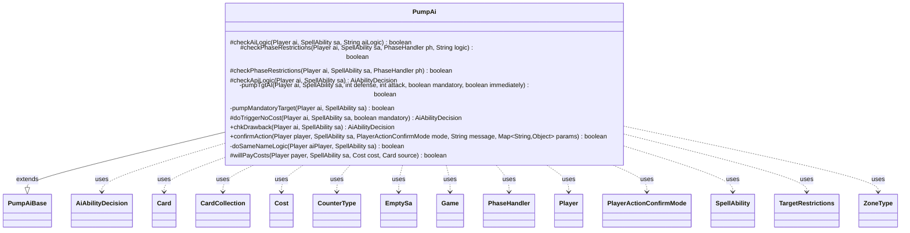

---
aliases:
  - PumpAi
tags:
  - java/class
  - module/forge-ai
  - pkg/forge/ai/ability
fqn: forge.ai.ability.PumpAi
package: forge.ai.ability
module: forge-ai
kind: Class
---

# PumpAi

**Package:** `forge.ai.ability`   **Module:** `forge-ai`   **Kind:** Class



## Relationships
**Extends:**
- [[forge.ai.ability.PumpAiBase|PumpAiBase]]
**Uses:**
- [[forge.ai.AiAbilityDecision|AiAbilityDecision]]
- [[forge.game.Game|Game]]
- [[forge.game.card.Card|Card]]
- [[forge.game.card.CardCollection|CardCollection]]
- [[forge.game.card.CounterType|CounterType]]
- [[forge.game.cost.Cost|Cost]]
- [[forge.game.phase.PhaseHandler|PhaseHandler]]
- [[forge.game.player.Player|Player]]
- [[forge.game.player.PlayerActionConfirmMode|PlayerActionConfirmMode]]
- [[forge.game.spellability.SpellAbility|SpellAbility]]
- [[forge.game.spellability.SpellAbility.EmptySa|EmptySa]]
- [[forge.game.spellability.TargetRestrictions|TargetRestrictions]]
- [[forge.game.zone.ZoneType|ZoneType]]

## Design Description

PumpAi is the AI decision-making handler for "pump"-type spell abilities—effects that modify a creature's power/toughness or grant keywords. Extending PumpAiBase, it overrides the standard AI evaluation hooks (checkAiLogic, checkPhaseRestrictions, checkApiLogic, doTriggerNoCost, chkDrawback, willPayCosts, confirmAction) to decide whether and how the computer player should cast such an ability, returning AiAbilityDecision verdicts that encode both willingness and reasoning.

Its core responsibility is target selection: the private pumpTgtAI and pumpMandatoryTarget helpers choose creatures (or players) to buff or curse, favoring the AI's own attackers/blockers and opponents' threats while avoiding self-destructive pumps. The class encodes extensive special-case behavior—dispatching named AILogic strategies (MoveCounter, Aristocrat, Fight, SwitchPT, SameName) to SpecialAiLogic, SpecialCardAi, and FightAi—and enforces timing intent by restricting instant-speed pumps to combat. It collaborates closely with Player, SpellAbility, Card/CardCollection, PhaseHandler, and Cost to model the game state driving each decision.

## Source
`forge-ai/src/main/java/forge/ai/ability/PumpAi.java`

```java
package forge.ai.ability;

import com.google.common.collect.Lists;
import com.google.common.collect.Maps;
import forge.ai.*;
import forge.game.Game;
import forge.game.ability.AbilityUtils;
import forge.game.ability.ApiType;
import forge.game.card.*;
import forge.game.cost.Cost;
import forge.game.keyword.Keyword;
import forge.game.phase.PhaseHandler;
import forge.game.phase.PhaseType;
import forge.game.player.Player;
import forge.game.player.PlayerActionConfirmMode;
import forge.game.spellability.SpellAbility;
import forge.game.spellability.TargetRestrictions;
import forge.game.zone.ZoneType;
import org.apache.commons.lang3.StringUtils;

import java.util.*;

public class PumpAi extends PumpAiBase {

    @Override
    protected boolean checkAiLogic(final Player ai, final SpellAbility sa, final String aiLogic) {
        if ("MoveCounter".equals(aiLogic)) {
            final Game game = ai.getGame();
            List<Card> tgtCards = CardLists.filter(game.getCardsIn(ZoneType.Battlefield),
                    CardPredicates.isTargetableBy(sa));
            if (tgtCards.isEmpty()) {
                return false;
            }
            SpellAbility moveSA = null;
            SpellAbility sub = sa.getSubAbility();
            while (sub != null) {
                if (ApiType.MoveCounter.equals(sub.getApi())) {
                    moveSA = sub;
                    break;
                }
                sub = sub.getSubAbility();
            }

            if (moveSA == null) {
                System.err.println("MoveCounter AiLogic without MoveCounter SubAbility!");
                return false;
            }
        } else if ("Aristocrat".equals(aiLogic)) {
            return SpecialAiLogic.doAristocratLogic(ai, sa);
        } else if (aiLogic.startsWith("AristocratCounters")) {
            return SpecialAiLogic.doAristocratWithCountersLogic(ai, sa).willingToPlay();
        } else if (aiLogic.equals("SwitchPT")) {
            // Some more AI would be even better, but this is a good start to prevent spamming
            if (sa.isActivatedAbility() && sa.getActivationsThisTurn() > 0 && !sa.usesTargeting()) {
                // Will prevent flipping back and forth
                return false;
            }
        }

        return super.checkAiLogic(ai, sa, aiLogic);
    }

    @Override
    protected boolean checkPhaseRestrictions(final Player ai, final SpellAbility sa, final PhaseHandler ph,
                                             final String logic) {
        // special Phase check for various AI logics
        if (logic.equals("MoveCounter")) {
            if (ph.inCombat() && ph.getPlayerTurn().isOpponentOf(ai)) {
                return true;
            }

            return isSorcerySpeed(sa, ai) || (ph.getNextTurn().equals(ai) && !ph.getPhase().isBefore(PhaseType.END_OF_TURN));
        } else if (logic.equals("Aristocrat")) {
            final boolean isThreatened = ComputerUtil.predictThreatenedObjects(ai, null, true).contains(sa.getHostCard());
            if (!ph.is(PhaseType.COMBAT_DECLARE_BLOCKERS) && !isThreatened) {
                return false;
            }
        } else if (logic.equals("SwitchPT")) {
            // Some more AI would be even better, but this is a good start to prevent spamming
            if (ph.getPhase().isAfter(PhaseType.COMBAT_FIRST_STRIKE_DAMAGE) || !ph.inCombat()) {
                return false;
            }
        }
        return super.checkPhaseRestrictions(ai, sa, ph);
    }

    @Override
    protected boolean checkPhaseRestrictions(final Player ai, final SpellAbility sa, final PhaseHandler ph) {
        final Game game = ai.getGame();
        boolean main1Preferred = "Main1IfAble".equals(sa.getParam("AILogic")) && ph.is(PhaseType.MAIN1, ai);
        if (game.getStack().isEmpty() && sa.getPayCosts().hasTapCost()) {
            if (ph.getPhase().isBefore(PhaseType.COMBAT_DECLARE_ATTACKERS) && ph.isPlayerTurn(ai)) {
                return false;
            }
            if (ph.getPhase().isBefore(PhaseType.COMBAT_BEGIN) && ph.getPlayerTurn().isOpponentOf(ai)) {
                return false;
            }
        }
        if (game.getStack().isEmpty() && (ph.getPhase().isBefore(PhaseType.COMBAT_BEGIN)
                || ph.getPhase().isAfter(PhaseType.COMBAT_DECLARE_BLOCKERS))) {
            // Instant-speed pumps should not be cast outside of combat when the
            // stack is empty
            return sa.isCurse() || isSorcerySpeed(sa, ai) || main1Preferred;
        }
        return true;
    }

    @Override
    protected AiAbilityDecision checkApiLogic(Player ai, SpellAbility sa) {
        final Game game = ai.getGame();
        final Card source = sa.getHostCard();
        final SpellAbility root = sa.getRootAbility();
        final List<String> keywords = sa.hasParam("KW") ? Arrays.asList(sa.getParam("KW").split(" & "))
                : Lists.newArrayList();
        final String numDefense = sa.getParamOrDefault("NumDef", "");
        final String numAttack = sa.getParamOrDefault("NumAtt", "");

        final String aiLogic = sa.getParamOrDefault("AILogic", "");

        final boolean isFight = "Fight".equals(aiLogic) || "PowerDmg".equals(aiLogic);
        final boolean isBerserk = "Berserk".equals(aiLogic);

        if ("Pummeler".equals(aiLogic)) {
            return SpecialCardAi.ElectrostaticPummeler.consider(ai, sa);
        } else if (aiLogic.startsWith("AristocratCounters")) {
            // the preconditions to this are already tested in checkAiLogic
            return new AiAbilityDecision(100, AiPlayDecision.WillPlay);
        } else if ("GideonBlackblade".equals(aiLogic)) {
            return SpecialCardAi.GideonBlackblade.consider(ai, sa);
        } else if ("MoveCounter".equals(aiLogic)) {
            final SpellAbility moveSA = sa.findSubAbilityByType(ApiType.MoveCounter);

            if (moveSA == null) {
                return new AiAbilityDecision(0, AiPlayDecision.CantPlayAi);
            }

            final String counterType = moveSA.getParam("CounterType");
            final String amountStr = moveSA.getParamOrDefault("CounterNum", "1");
            final CounterType cType = "Any".equals(counterType) ? null : CounterType.getType(counterType);

            final PhaseHandler ph = game.getPhaseHandler();
            if (ph.inCombat() && ph.getPlayerTurn().isOpponentOf(ai)) {
                CardCollection attr = ph.getCombat().getAttackers();
                attr = CardLists.getTargetableCards(attr, sa);

                if (cType != null) {
                    attr = CardLists.filter(attr, CardPredicates.hasCounter(cType));
                    if (attr.isEmpty()) {
                        return new AiAbilityDecision(0, AiPlayDecision.TargetingFailed);
                    }
                    CardCollection best = CardLists.filter(attr, card -> {
                        int amount = 0;
                        if (StringUtils.isNumeric(amountStr)) {
                            amount = AbilityUtils.calculateAmount(source, amountStr, moveSA);
                        } else if (source.hasSVar(amountStr)) {
                            if ("Count$ChosenNumber".equals(source.getSVar(amountStr))) {
                                amount = card.getCounters(cType);
                            }
                        }

                        int i = card.getCounters(cType);
                        if (i < amount) {
                            return false;
                        }

                        final Card srcCardCpy = CardCopyService.getLKICopy(card);
                        // can't use subtract on Copy
                        srcCardCpy.setCounters(cType, srcCardCpy.getCounters(cType) - amount);

                        if (cType.is(CounterEnumType.P1P1) && srcCardCpy.getNetToughness() <= 0) {
                            return srcCardCpy.getCounters(cType) > 0 || !card.hasKeyword(Keyword.UNDYING)
                                    || card.isToken();
                        }
                        return false;
                    });

                    if (best.isEmpty()) {
                        best = attr;
                    }

                    final Card card = ComputerUtilCard.getBestCreatureAI(best);
                    sa.getTargets().add(card);
                    return new AiAbilityDecision(100, AiPlayDecision.WillPlay);
                }
            } else {
                final boolean sameCtrl = moveSA.getTargetRestrictions().isSameController();

                List<Card> list = CardLists.getTargetableCards(game.getCardsIn(ZoneType.Battlefield), sa);
                if (cType != null) {
                    list = CardLists.filter(list, CardPredicates.hasCounter(cType));
                    if (list.isEmpty()) {
                        return new AiAbilityDecision(0, AiPlayDecision.TargetingFailed);
                    }
                    List<Card> oppList = CardLists.filterControlledBy(list, ai.getOpponents());
                    if (!oppList.isEmpty() && !sameCtrl) {
                        List<Card> best = CardLists.filter(oppList, card -> {
                            int amount = 0;
                            if (StringUtils.isNumeric(amountStr)) {
                                amount = AbilityUtils.calculateAmount(source, amountStr, moveSA);
                            } else if (source.hasSVar(amountStr)) {
                                if ("Count$ChosenNumber".equals(source.getSVar(amountStr))) {
                                    amount = card.getCounters(cType);
                                }
                            }

                            int i = card.getCounters(cType);
                            if (i < amount) {
                                return false;
                            }

                            final Card srcCardCpy = CardCopyService.getLKICopy(card);
                            // can't use subtract on Copy
                            srcCardCpy.setCounters(cType, srcCardCpy.getCounters(cType) - amount);

                            if (cType.is(CounterEnumType.P1P1) && srcCardCpy.getNetToughness() <= 0) {
                                return srcCardCpy.getCounters(cType) > 0 || !card.hasKeyword(Keyword.UNDYING)
                                        || card.isToken();
                            }
                            return true;
                        });

                        if (best.isEmpty()) {
                            best = oppList;
                        }

                        final Card card = ComputerUtilCard.getBestCreatureAI(best);
                        sa.getTargets().add(card);
                        return new AiAbilityDecision(100, AiPlayDecision.WillPlay);
                    }
                }

            }
        } else if (aiLogic.startsWith("Donate")) {
            // Donate step 1 - try to target an opponent, preferably one who does not have a donate target yet
            return SpecialCardAi.Donate.considerTargetingOpponent(ai, sa);
        } else if (aiLogic.equals("InfernoOfTheStarMounts")) {
            int numRedMana = ComputerUtilMana.determineLeftoverMana(new SpellAbility.EmptySa(source), ai, "R", false);
            int currentPower = source.getNetPower();
            if (currentPower < 20 && currentPower + numRedMana >= 20) {
                return new AiAbilityDecision(100, AiPlayDecision.WillPlay);
            }
        }

        if (!game.getStack().isEmpty() && !sa.isCurse() && !isFight) {
            return ComputerUtilCard.canPumpAgainstRemoval(ai, sa);
        }

        if (sa.hasParam("ConditionActivationLimit")) {
            final int sacActivations = Integer.parseInt(sa.getParam("ConditionActivationLimit").substring(2));
            final int activations = sa.getActivationsThisTurn();
            // don't risk sacrificing a creature just to pump it
            if (activations >= sacActivations - 1) {
                return new AiAbilityDecision(0, AiPlayDecision.ConditionsNotMet);
            }
        }

        if (sa.getSVar("X").equals("Count$xPaid")) {
            root.setXManaCostPaid(null);
        }

        int defense;
        if (numDefense.contains("X") && sa.getSVar("X").equals("Count$xPaid")) {
            defense = ComputerUtilCost.setMaxXValue(sa, ai, sa.isTrigger());
            if (numDefense.equals("-X")) {
                defense = -defense;
            }
        } else {
            defense = AbilityUtils.calculateAmount(sa.getHostCard(), numDefense, sa);
            if (numDefense.contains("X") && sa.getSVar("X").equals("Count$CardsInYourHand") && source.isInZone(ZoneType.Hand)) {
                defense--; // the card will be spent casting the spell, so actual toughness is 1 less
            }
        }

        int attack;
        if (numAttack.contains("X") && sa.getSVar("X").equals("Count$xPaid")) {
            if (root.getXManaCostPaid() == null) {
                final int xPay = ComputerUtilCost.setMaxXValue(root, ai, sa.isTrigger());
                root.setXManaCostPaid(xPay);
                attack = xPay;
            } else {
                attack = root.getXManaCostPaid();
            }
        } else {
            // TODO add Double
            attack = AbilityUtils.calculateAmount(sa.getHostCard(), numAttack, sa);
            if (numAttack.contains("X") && sa.getSVar("X").equals("Count$CardsInYourHand") && source.isInZone(ZoneType.Hand)) {
                attack--; // the card will be spent casting the spell, so actual power is 1 less
            }
        }

        if ((numDefense.contains("X") && defense == 0) || (numAttack.contains("X") && attack == 0 && !isBerserk)) {
            return new AiAbilityDecision(0, AiPlayDecision.CantPlayAi);
        }

        if (!sa.usesTargeting()) {
            final List<Card> cards = AbilityUtils.getDefinedCards(sa.getHostCard(), sa.getParam("Defined"), sa);

            if (cards.isEmpty()) {
                return new AiAbilityDecision(0, AiPlayDecision.MissingNeededCards);
            }

            // when this happens we need to expand AI to consider if its ok for everything?
            for (final Card card : cards) {
                if (sa.isCurse()) {
                    if (!card.getController().isOpponentOf(ai)) {
                        continue;
                    }

                    if (!containsUsefulKeyword(ai, keywords, card, sa, attack)) {
                        continue;
                    }

                    return new AiAbilityDecision(100, AiPlayDecision.WillPlay);
                }
                if (!card.getController().isOpponentOf(ai)) {
                    if (ComputerUtilCard.shouldPumpCard(ai, sa, card, defense, attack, keywords, false)) {
                        return new AiAbilityDecision(100, AiPlayDecision.WillPlay);
                    }
                    if (containsUsefulKeyword(ai, keywords, card, sa, attack)) {
                        if (game.getPhaseHandler().is(PhaseType.MAIN1) && isSorcerySpeed(sa, ai) ||
                                game.getPhaseHandler().is(PhaseType.COMBAT_DECLARE_ATTACKERS, ai) ||
                                game.getPhaseHandler().is(PhaseType.COMBAT_BEGIN, ai)) {
                            Card pumped = ComputerUtilCard.getPumpedCreature(ai, sa, card, 0, 0, keywords);
                            if (ComputerUtilCard.doesSpecifiedCreatureAttackAI(ai, pumped)) {
                                // If the AI can attack with the pumped creature, then it is worth playing
                                return new AiAbilityDecision(100, AiPlayDecision.WillPlay);
                            }
                            return new AiAbilityDecision(0, AiPlayDecision.DoesntImpactCombat);
                        }

                        return new AiAbilityDecision(100, AiPlayDecision.WillPlay);
                    }
                    if (grantsUsefulExtraBlockOpts(ai, sa, card, keywords)) {
                        return new AiAbilityDecision(100, AiPlayDecision.WillPlay);
                    }
                }
            }
            return new AiAbilityDecision(0, AiPlayDecision.CantPlayAi);
        }

        if (pumpTgtAI(ai, sa, defense, attack, false, false)) {
            return new AiAbilityDecision(100, AiPlayDecision.WillPlay);
        }

        return new AiAbilityDecision(0, AiPlayDecision.TargetingFailed);
    }

    private boolean pumpTgtAI(final Player ai, final SpellAbility sa, final int defense, final int attack, final boolean mandatory,
                              boolean immediately) {
        final List<String> keywords = sa.hasParam("KW") ? Arrays.asList(sa.getParam("KW").split(" & "))
                : Lists.newArrayList();
        final Game game = ai.getGame();
        final Card source = sa.getHostCard();
        final boolean isFight = "Fight".equals(sa.getParam("AILogic")) || "PowerDmg".equals(sa.getParam("AILogic"));

        immediately = immediately || ComputerUtil.playImmediately(ai, sa);

        if (!mandatory
                && !immediately
                && (game.getPhaseHandler().getPhase().isAfter(PhaseType.COMBAT_DECLARE_BLOCKERS) && !"AnyPhase".equals(sa.getParam("AILogic")))
                && !(sa.isCurse() && defense < 0)
                && !containsNonCombatKeyword(keywords)
                && !"UntilYourNextTurn".equals(sa.getParam("Duration"))
                && !"ReplaySpell".equals(sa.getParam("AILogic"))
                && !isFight) {
            return false;
        }

        final TargetRestrictions tgt = sa.getTargetRestrictions();
        sa.resetTargets();

        if ("PowerStruggle".equals(sa.getParam("AILogic"))) {
            return SpecialCardAi.PowerStruggle.considerFirstTarget(ai, sa);
        }

        if (sa.hasParam("TargetingPlayer") && sa.getActivatingPlayer().equals(ai) && !sa.isTrigger()) {
            Player targetingPlayer = AbilityUtils.getDefinedPlayers(source, sa.getParam("TargetingPlayer"), sa).get(0);
            sa.setTargetingPlayer(targetingPlayer);
            if (CardLists.getTargetableCards(ai.getGame().getCardsIn(sa.getTargetRestrictions().getZone()), sa).isEmpty()) {
                return false;
            }
            return true;
        }

        CardCollection list;
        if (sa.hasParam("AILogic")) {
            if (sa.getParam("AILogic").equals("HighestPower") || sa.getParam("AILogic").equals("ContinuousBonus")) {
                list = CardLists.getValidCards(CardLists.filter(game.getCardsIn(ZoneType.Battlefield), CardPredicates.CREATURES), tgt.getValidTgts(), ai, source, sa);
                list = CardLists.getTargetableCards(list, sa);
                CardLists.sortByPowerDesc(list);

                if (list.contains(source) && source.hasKeyword("You may choose not to untap CARDNAME during your untap step.") && sa.getPayCosts().hasTapCost()) {
                    list.remove(source); // don't tap a card that will be tapped as a part of the cost and won't untap normally.
                }

                // Try not to kill own creatures with this pump
                CardCollection canDieToPump = new CardCollection();
                for (Card c : list) {
                    if (c.isCreature() && c.getController() == ai
                            && c.getNetToughness() - c.getTempToughnessBoost() + defense <= 0) {
                        canDieToPump.add(c);
                    }
                    // Also, don't pump itself if the SA involves a sacrifice self cost
                    if (sa.getHostCard().equals(c) && ComputerUtilCost.isSacrificeSelfCost(sa.getPayCosts())) {
                        canDieToPump.add(c);
                    }
                }
                list.removeAll(canDieToPump);

                // Generally, don't pump anything that your opponents control
                if ("ContinuousBonus".equals(sa.getParam("AILogic"))) {
                    // TODO: make it possible for the AI to use this logic to kill opposing creatures
                    // when a toughness debuff is applied
                    list = CardLists.filter(list, CardPredicates.isController(ai));
                }

                if (!list.isEmpty()) {
                    sa.getTargets().add(list.get(0));
                    return true;
                }
                return false;
            } else if (sa.getParam("AILogic").equals("SameName")) {
                return doSameNameLogic(ai, sa);
            } else if (sa.getParam("AILogic").equals("SacOneEach")) {
                // each player sacrifices one permanent, e.g. Vaevictis, Asmadi the Dire - grab the worst for allied and
                // the best for opponents
                return SacrificeAi.doSacOneEachLogic(ai, sa).willingToPlay();
            } else if (sa.getParam("AILogic").equals("Destroy")) {
                List<Card> tgts = CardLists.getTargetableCards(game.getCardsIn(ZoneType.Battlefield), sa);
                if (tgts.isEmpty()) {
                    return false;
                }

                List<Card> alliedTgts = CardLists.filter(tgts, CardPredicates.isControlledByAnyOf(ai.getAllies()).or(CardPredicates.isController(ai)));
                List<Card> oppTgts = CardLists.filter(tgts, CardPredicates.isControlledByAnyOf(ai.getOpponents()));

                Card destroyTgt = null;
                if (!oppTgts.isEmpty()) {
                    destroyTgt = ComputerUtilCard.getBestAI(oppTgts);
                } else {
                    // TODO: somehow limit this so that the AI doesn't always destroy own stuff when able?
                    destroyTgt = ComputerUtilCard.getWorstAI(alliedTgts);
                }

                if (destroyTgt != null) {
                    sa.getTargets().add(destroyTgt);
                    return true;
                }

                return false;
            }

            if (isFight) {
                return FightAi.canFight(ai, sa, attack, defense).willingToPlay();
            }
        }

        if (sa.isCurse()) {
            for (final Player opp : ai.getOpponents()) {
                if (sa.canTarget(opp)) {
                    sa.getTargets().add(opp);
                    return true;
                }
            }
            list = getCurseCreatures(ai, sa, defense, attack, keywords);
        } else {
            if (sa.canTarget(ai)) {
                sa.getTargets().add(ai);
                return true;
            }
            if (tgt.canTgtCreature()) {
                list = getPumpCreatures(ai, sa, defense, attack, keywords, immediately);
            } else {
                ZoneType zone = tgt.getZone().get(0);
                list = CardLists.getTargetableCards(game.getCardsIn(zone), sa);
            }
        }

        if (game.getStack().isEmpty() && sa.getPayCosts().hasTapCost()) {
            if (game.getPhaseHandler().getPhase().isBefore(PhaseType.COMBAT_DECLARE_ATTACKERS)
                    && game.getPhaseHandler().isPlayerTurn(ai)) {
                list.remove(source);
            }
            if (game.getPhaseHandler().getPhase().isBefore(PhaseType.COMBAT_DECLARE_BLOCKERS)
                    && game.getPhaseHandler().getPlayerTurn().isOpponentOf(ai)) {
                list.remove(source);
            }
        }

        // Filter AI-specific targets if provided
        list = ComputerUtil.filterAITgts(sa, ai, list, true);

        if (list.isEmpty() && (mandatory || ComputerUtil.activateForCost(sa, ai))) {
            return pumpMandatoryTarget(ai, sa);
        }

        if (!sa.isCurse()) {
            // Don't target cards that will die.
            list = ComputerUtil.getSafeTargets(ai, sa, list);
        }

        if ("BetterCreatureThanSource".equals(sa.getParam("AILogic"))) {
            // Don't target cards that are not better in value than the targeting card
            final int sourceValue = ComputerUtilCard.evaluateCreature(source);
            list = CardLists.filter(list, card -> card.isCreature() && ComputerUtilCard.evaluateCreature(card) > sourceValue + 30);
        }

        if ("ReplaySpell".equals(sa.getParam("AILogic"))) {
            if (!ComputerUtil.targetPlayableSpellCard(ai, list, sa, false, mandatory)) {
                return false;
            }
        }

        while (sa.canAddMoreTarget()) {
            Card t = null;
            // boolean goodt = false;

            list = CardLists.canSubsequentlyTarget(list, sa);

            if (list.isEmpty()) {
                if (!sa.isMinTargetChosen() || sa.isZeroTargets()) {
                    if (mandatory || ComputerUtil.activateForCost(sa, ai)) {
                        return pumpMandatoryTarget(ai, sa);
                    }

                    sa.resetTargets();
                    return false;
                } else {
                    // TODO is this good enough? for up to amounts?
                    break;
                }
            }

            t = ComputerUtilCard.getBestAI(list);
            //option to hold removal instead only applies for single targeted removal
            if (!immediately && sa.getMaxTargets() == 1 && sa.isCurse() && defense < 0) {
                if (!ComputerUtilCard.useRemovalNow(sa, t, -defense, ZoneType.Graveyard)
                        && !ComputerUtil.activateForCost(sa, ai)) {
                    return false;
                }
            }
            sa.getTargets().add(t);
            list.remove(t);
        }

        return true;
    }

    private boolean pumpMandatoryTarget(final Player ai, final SpellAbility sa) {
        List<Card> list = CardUtil.getValidCardsToTarget(sa);

        if (list.size() < sa.getMinTargets()) {
            sa.resetTargets();
            return false;
        }

        CardCollection pref;
        CardCollection forced;

        if (sa.isCurse()) {
            pref = CardLists.filterControlledBy(list, ai.getOpponents());
            forced = CardLists.filterControlledBy(list, ai.getYourTeam());
        } else {
            pref = CardLists.filterControlledBy(list, ai.getYourTeam());
            forced = CardLists.filterControlledBy(list, ai.getOpponents());
        }

        while (sa.canAddMoreTarget()) {
            if (pref.isEmpty()) {
                break;
            }

            Card c = ComputerUtilCard.getBestAI(pref);
            pref.remove(c);
            sa.getTargets().add(c);
        }

        while (!sa.isMinTargetChosen()) {
            if (forced.isEmpty()) {
                break;
            }

            Card c;
            if (CardLists.getNotType(forced, "Creature").isEmpty()) {
                c = ComputerUtilCard.getWorstCreatureAI(forced);
            } else {
                c = ComputerUtilCard.getCheapestPermanentAI(forced, sa, false);
            }

            forced.remove(c);
            sa.getTargets().add(c);
        }

        if (!sa.isMinTargetChosen()) {
            sa.resetTargets();
            return false;
        }

        return true;
    }

    @Override
    protected AiAbilityDecision doTriggerNoCost(Player ai, SpellAbility sa, boolean mandatory) {
        final SpellAbility root = sa.getRootAbility();
        final String numDefense = sa.getParamOrDefault("NumDef", "");
        final String numAttack = sa.getParamOrDefault("NumAtt", "");

        if (sa.getSVar("X").equals("Count$xPaid")) {
            sa.setXManaCostPaid(null);
        }

        int defense;
        if (numDefense.contains("X") && sa.getSVar("X").equals("Count$xPaid")) {
            // Set PayX here to maximum value.
            if (root.getXManaCostPaid() == null) {
                defense = ComputerUtilCost.setMaxXValue(root, ai, true);
            } else {
                defense = root.getXManaCostPaid();
            }
        } else {
            defense = AbilityUtils.calculateAmount(sa.getHostCard(), numDefense, sa);
        }

        int attack;
        if (numAttack.contains("X") && sa.getSVar("X").equals("Count$xPaid")) {
            // Set PayX here to maximum value.
            if (root.getXManaCostPaid() == null) {
                attack = ComputerUtilCost.setMaxXValue(root, ai, true);
            } else {
                attack = root.getXManaCostPaid();
            }
        } else {
            attack = AbilityUtils.calculateAmount(sa.getHostCard(), numAttack, sa);
        }

        if (!sa.usesTargeting()) {
            if (mandatory) {
                return new AiAbilityDecision(100, AiPlayDecision.WillPlay);
            }
            return new AiAbilityDecision(0, AiPlayDecision.CantPlayAi);
        }

        if (pumpTgtAI(ai, sa, defense, attack, mandatory, true)) {
            return new AiAbilityDecision(100, AiPlayDecision.WillPlay);
        }

        return new AiAbilityDecision(0, AiPlayDecision.CantPlayAi);
    }

    @Override
    public AiAbilityDecision chkDrawback(Player ai, SpellAbility sa) {
        final SpellAbility root = sa.getRootAbility();
        final Card source = sa.getHostCard();

        final String numDefense = sa.getParamOrDefault("NumDef", "");
        final String numAttack = sa.getParamOrDefault("NumAtt", "");

        if (numDefense.equals("-X") && sa.getSVar("X").equals("Count$ChosenNumber")) {
            int energy = ai.getCounters(CounterEnumType.ENERGY);
            for (SpellAbility s : source.getSpellAbilities()) {
                if ("PayEnergy".equals(s.getParam("AILogic"))) {
                    energy += AbilityUtils.calculateAmount(source, s.getParam("CounterNum"), sa);
                    break;
                }
            }
            int minus = 0;
            for (; energy > 0; energy--) {
                if (pumpTgtAI(ai, sa, -energy, -energy, false, true)) {
                    minus = sa.getTargetCard().getNetToughness();
                    if (minus > energy || minus < 1) {
                        continue; // in case the calculation gets messed up somewhere
                    }
                    root.setSVar("EnergyToPay", "Number$" + minus);
                    return new AiAbilityDecision(100, AiPlayDecision.WillPlay);
                }
            }
            return new AiAbilityDecision(0, AiPlayDecision.CantPlayAi);
        }

        int attack;
        if (numAttack.contains("X") && sa.getSVar("X").equals("Count$xPaid")) {
            if (root.getXManaCostPaid() == null) {
                attack = ComputerUtilCost.setMaxXValue(sa, ai, sa.isTrigger());
                root.setXManaCostPaid(attack);
            } else {
                attack = root.getXManaCostPaid();
            }
        } else {
            attack = AbilityUtils.calculateAmount(sa.getHostCard(), numAttack, sa);
        }

        int defense;
        if (numDefense.contains("X") && sa.getSVar("X").equals("Count$xPaid")) {
            if (root.getXManaCostPaid() == null) {
                defense = ComputerUtilCost.setMaxXValue(sa, ai, sa.isTrigger());
                root.setXManaCostPaid(defense);
            } else {
                defense = root.getXManaCostPaid();
            }
        } else {
            defense = AbilityUtils.calculateAmount(sa.getHostCard(), numDefense, sa);
        }

        if (sa.usesTargeting()) {
            if (pumpTgtAI(ai, sa, defense, attack, false, true)) {
                return new AiAbilityDecision(100, AiPlayDecision.WillPlay);
            }
            return new AiAbilityDecision(0, AiPlayDecision.TargetingFailed);
        }

        if (source.isCreature()) {
            if (!source.hasKeyword(Keyword.INDESTRUCTIBLE) && source.getNetToughness() + defense <= source.getDamage()) {
                return new AiAbilityDecision(0, AiPlayDecision.CantPlayAi);
            }
            if (source.getNetToughness() + defense > 0) {
                return new AiAbilityDecision(100, AiPlayDecision.WillPlay);
            }
            return new AiAbilityDecision(0, AiPlayDecision.CantPlayAi);
        }

        return new AiAbilityDecision(100, AiPlayDecision.WillPlay);
    }

    @Override
    public boolean confirmAction(Player player, SpellAbility sa, PlayerActionConfirmMode mode, String message, Map<String, Object> params) {
        //TODO Add logic here if necessary but I think the AI won't cast
        //the spell in the first place if it would curse its own creature
        //and the pump isn't mandatory
        return true;
    }

    private boolean doSameNameLogic(Player aiPlayer, SpellAbility sa) {
        final Game game = aiPlayer.getGame();
        final Card source = sa.getHostCard();
        final TargetRestrictions tgt = sa.getTargetRestrictions();
        final ZoneType origin = ZoneType.listValueOf(sa.getSubAbility().getParam("Origin")).get(0);
        CardCollection list = CardLists.getValidCards(game.getCardsIn(origin), tgt.getValidTgts(), aiPlayer,
                source, sa);
        list = CardLists.filterControlledBy(list, aiPlayer.getOpponents());
        if (list.isEmpty()) {
            return false; // no valid targets
        }

        Map<Player, Map.Entry<String, Integer>> data = Maps.newHashMap();

        // need to filter for the opponents first
        for (final Player opp : aiPlayer.getOpponents()) {
            CardCollection oppList = CardLists.filterControlledBy(list, opp);

            // no cards
            if (oppList.isEmpty()) {
                continue;
            }

            // Compute value for each possible target
            Map<String, Integer> values = ComputerUtilCard.evaluateCreatureListByName(oppList);

            // reject if none of them can be targeted
            oppList = CardLists.filter(oppList, CardPredicates.isTargetableBy(sa));
            // none can be targeted
            if (oppList.isEmpty()) {
                continue;
            }

            List<String> toRemove = Lists.newArrayList();
            for (final String name : values.keySet()) {
                if (!oppList.anyMatch(CardPredicates.nameEquals(name))) {
                    toRemove.add(name);
                }
            }
            values.keySet().removeAll(toRemove);

            data.put(opp, Collections.max(values.entrySet(), Map.Entry.comparingByValue()));
        }

        if (!data.isEmpty()) {
            Map.Entry<Player, Map.Entry<String, Integer>> max = Collections.max(data.entrySet(), Comparator.comparingInt(o -> o.getValue().getValue()));

            // filter list again by the opponent and a creature of the wanted name that can be targeted
            list = CardLists.filter(CardLists.filterControlledBy(list, max.getKey()),
                    CardPredicates.nameEquals(max.getValue().getKey()), CardPredicates.isTargetableBy(sa));

            // list should contain only one element or zero
            sa.resetTargets();
            for (Card c : list) {
                sa.getTargets().add(c);
                return true;
            }
        }

        return false;
    }

    @Override
    protected boolean willPayCosts(final Player payer, final SpellAbility sa, final Cost cost, final Card source) {
        if (!ComputerUtilCost.checkExileFromGraveCost(cost, payer, sa)) {
            return false;
        }

        return super.willPayCosts(payer,sa, cost, source);
    }
}
```

## Python
`forge/ai/ability/PumpAi.py`

````python
package forge.ai.ability ΓÇö here is the Python port:

```python
import sys

from forge.ai.ability.PumpAiBase import PumpAiBase
from forge.ai.AiAbilityDecision import AiAbilityDecision
from forge.ai.AiPlayDecision import AiPlayDecision
from forge.ai.ComputerUtil import ComputerUtil
from forge.ai.ComputerUtilCard import ComputerUtilCard
from forge.ai.ComputerUtilCost import ComputerUtilCost
from forge.ai.ComputerUtilMana import ComputerUtilMana
from forge.ai.SpecialAiLogic import SpecialAiLogic
from forge.ai.SpecialCardAi import SpecialCardAi
from forge.ai.ability.FightAi import FightAi
from forge.ai.ability.SacrificeAi import SacrificeAi
from forge.game.Game import Game
from forge.game.ability.AbilityUtils import AbilityUtils
from forge.game.ability.ApiType import ApiType
from forge.game.card.Card import Card
from forge.game.card.CardCollection import CardCollection
from forge.game.card.CardCopyService import CardCopyService
from forge.game.card.CardLists import CardLists
from forge.game.card.CardPredicates import CardPredicates
from forge.game.card.CardUtil import CardUtil
from forge.game.card.CounterEnumType import CounterEnumType
from forge.game.card.CounterType import CounterType
from forge.game.cost.Cost import Cost
from forge.game.keyword.Keyword import Keyword
from forge.game.phase.PhaseHandler import PhaseHandler
from forge.game.phase.PhaseType import PhaseType
from forge.game.player.Player import Player
from forge.game.player.PlayerActionConfirmMode import PlayerActionConfirmMode
from forge.game.spellability.SpellAbility import SpellAbility
from forge.game.spellability.SpellAbility.EmptySa import EmptySa
from forge.game.spellability.TargetRestrictions import TargetRestrictions
from forge.game.zone.ZoneType import ZoneType
from org.apache.commons.lang3.StringUtils import StringUtils


class PumpAi(PumpAiBase):

    def checkAiLogic(self, ai, sa, aiLogic):
        if "MoveCounter" == aiLogic:
            game = ai.getGame()
            tgtCards = CardLists.filter(game.getCardsIn(ZoneType.Battlefield),
                                        CardPredicates.isTargetableBy(sa))
            if tgtCards.isEmpty():
                return False
            moveSA = None
            sub = sa.getSubAbility()
            while sub is not None:
                if ApiType.MoveCounter == sub.getApi():
                    moveSA = sub
                    break
                sub = sub.getSubAbility()

            if moveSA is None:
                print("MoveCounter AiLogic without MoveCounter SubAbility!", file=sys.stderr)
                return False
        elif "Aristocrat" == aiLogic:
            return SpecialAiLogic.doAristocratLogic(ai, sa)
        elif aiLogic.startswith("AristocratCounters"):
            return SpecialAiLogic.doAristocratWithCountersLogic(ai, sa).willingToPlay()
        elif aiLogic == "SwitchPT":
            # Some more AI would be even better, but this is a good start to prevent spamming
            if sa.isActivatedAbility() and sa.getActivationsThisTurn() > 0 and not sa.usesTargeting():
                # Will prevent flipping back and forth
                return False

        return super().checkAiLogic(ai, sa, aiLogic)

    def checkPhaseRestrictions(self, ai, sa, ph, logic=None):
        if logic is not None:
            # special Phase check for various AI logics
            if logic == "MoveCounter":
                if ph.inCombat() and ph.getPlayerTurn().isOpponentOf(ai):
                    return True

                return self.isSorcerySpeed(sa, ai) or (ph.getNextTurn().equals(ai) and not ph.getPhase().isBefore(PhaseType.END_OF_TURN))
            elif logic == "Aristocrat":
                isThreatened = ComputerUtil.predictThreatenedObjects(ai, None, True).contains(sa.getHostCard())
                if not getattr(ph, "is")(PhaseType.COMBAT_DECLARE_BLOCKERS) and not isThreatened:
                    return False
            elif logic == "SwitchPT":
                # Some more AI would be even better, but this is a good start to prevent spamming
                if ph.getPhase().isAfter(PhaseType.COMBAT_FIRST_STRIKE_DAMAGE) or not ph.inCombat():
                    return False
            return super().checkPhaseRestrictions(ai, sa, ph)

        game = ai.getGame()
        main1Preferred = "Main1IfAble" == sa.getParam("AILogic") and getattr(ph, "is")(PhaseType.MAIN1, ai)
        if game.getStack().isEmpty() and sa.getPayCosts().hasTapCost():
            if ph.getPhase().isBefore(PhaseType.COMBAT_DECLARE_ATTACKERS) and ph.isPlayerTurn(ai):
                return False
            if ph.getPhase().isBefore(PhaseType.COMBAT_BEGIN) and ph.getPlayerTurn().isOpponentOf(ai):
                return False
        if game.getStack().isEmpty() and (ph.getPhase().isBefore(PhaseType.COMBAT_BEGIN)
                                          or ph.getPhase().isAfter(PhaseType.COMBAT_DECLARE_BLOCKERS)):
            # Instant-speed pumps should not be cast outside of combat when the
            # stack is empty
            return sa.isCurse() or self.isSorcerySpeed(sa, ai) or main1Preferred
        return True

    def checkApiLogic(self, ai, sa):
        game = ai.getGame()
        source = sa.getHostCard()
        root = sa.getRootAbility()
        keywords = sa.getParam("KW").split(" & ") if sa.hasParam("KW") else []
        numDefense = sa.getParamOrDefault("NumDef", "")
        numAttack = sa.getParamOrDefault("NumAtt", "")

        aiLogic = sa.getParamOrDefault("AILogic", "")

        isFight = "Fight" == aiLogic or "PowerDmg" == aiLogic
        isBerserk = "Berserk" == aiLogic

        if "Pummeler" == aiLogic:
            return SpecialCardAi.ElectrostaticPummeler.consider(ai, sa)
        elif aiLogic.startswith("AristocratCounters"):
            # the preconditions to this are already tested in checkAiLogic
            return AiAbilityDecision(100, AiPlayDecision.WillPlay)
        elif "GideonBlackblade" == aiLogic:
            return SpecialCardAi.GideonBlackblade.consider(ai, sa)
        elif "MoveCounter" == aiLogic:
            moveSA = sa.findSubAbilityByType(ApiType.MoveCounter)

            if moveSA is None:
                return AiAbilityDecision(0, AiPlayDecision.CantPlayAi)

            counterType = moveSA.getParam("CounterType")
            amountStr = moveSA.getParamOrDefault("CounterNum", "1")
            cType = None if "Any" == counterType else CounterType.getType(counterType)

            ph = game.getPhaseHandler()
            if ph.inCombat() and ph.getPlayerTurn().isOpponentOf(ai):
                attr = ph.getCombat().getAttackers()
                attr = CardLists.getTargetableCards(attr, sa)

                if cType is not None:
                    attr = CardLists.filter(attr, CardPredicates.hasCounter(cType))
                    if attr.isEmpty():
                        return AiAbilityDecision(0, AiPlayDecision.TargetingFailed)

                    def _bestFilter(card):
                        amount = 0
                        if StringUtils.isNumeric(amountStr):
                            amount = AbilityUtils.calculateAmount(source, amountStr, moveSA)
                        elif source.hasSVar(amountStr):
                            if "Count$ChosenNumber" == source.getSVar(amountStr):
                                amount = card.getCounters(cType)

                        i = card.getCounters(cType)
                        if i < amount:
                            return False

                        srcCardCpy = CardCopyService.getLKICopy(card)
                        # can't use subtract on Copy
                        srcCardCpy.setCounters(cType, srcCardCpy.getCounters(cType) - amount)

                        if getattr(cType, "is")(CounterEnumType.P1P1) and srcCardCpy.getNetToughness() <= 0:
                            return srcCardCpy.getCounters(cType) > 0 or not card.hasKeyword(Keyword.UNDYING) \
                                or card.isToken()
                        return False

                    best = CardLists.filter(attr, _bestFilter)

                    if best.isEmpty():
                        best = attr

                    card = ComputerUtilCard.getBestCreatureAI(best)
                    sa.getTargets().add(card)
                    return AiAbilityDecision(100, AiPlayDecision.WillPlay)
            else:
                sameCtrl = moveSA.getTargetRestrictions().isSameController()

                lst = CardLists.getTargetableCards(game.getCardsIn(ZoneType.Battlefield), sa)
                if cType is not None:
                    lst = CardLists.filter(lst, CardPredicates.hasCounter(cType))
                    if lst.isEmpty():
                        return AiAbilityDecision(0, AiPlayDecision.TargetingFailed)
                    oppList = CardLists.filterControlledBy(lst, ai.getOpponents())
                    if not oppList.isEmpty() and not sameCtrl:
                        def _oppFilter(card):
                            amount = 0
                            if StringUtils.isNumeric(amountStr):
                                amount = AbilityUtils.calculateAmount(source, amountStr, moveSA)
                            elif source.hasSVar(amountStr):
                                if "Count$ChosenNumber" == source.getSVar(amountStr):
                                    amount = card.getCounters(cType)

                            i = card.getCounters(cType)
                            if i < amount:
                                return False

                            srcCardCpy = CardCopyService.getLKICopy(card)
                            # can't use subtract on Copy
                            srcCardCpy.setCounters(cType, srcCardCpy.getCounters(cType) - amount)

                            if getattr(cType, "is")(CounterEnumType.P1P1) and srcCardCpy.getNetToughness() <= 0:
                                return srcCardCpy.getCounters(cType) > 0 or not card.hasKeyword(Keyword.UNDYING) \
                                    or card.isToken()
                            return True

                        best = CardLists.filter(oppList, _oppFilter)

                        if best.isEmpty():
                            best = oppList

                        card = ComputerUtilCard.getBestCreatureAI(best)
                        sa.getTargets().add(card)
                        return AiAbilityDecision(100, AiPlayDecision.WillPlay)

        elif aiLogic.startswith("Donate"):
            # Donate step 1 - try to target an opponent, preferably one who does not have a donate target yet
            return SpecialCardAi.Donate.considerTargetingOpponent(ai, sa)
        elif aiLogic == "InfernoOfTheStarMounts":
            numRedMana = ComputerUtilMana.determineLeftoverMana(EmptySa(source), ai, "R", False)
            currentPower = source.getNetPower()
            if currentPower < 20 and currentPower + numRedMana >= 20:
                return AiAbilityDecision(100, AiPlayDecision.WillPlay)

        if not game.getStack().isEmpty() and not sa.isCurse() and not isFight:
            return ComputerUtilCard.canPumpAgainstRemoval(ai, sa)

        if sa.hasParam("ConditionActivationLimit"):
            sacActivations = int(sa.getParam("ConditionActivationLimit")[2:])
            activations = sa.getActivationsThisTurn()
            # don't risk sacrificing a creature just to pump it
            if activations >= sacActivations - 1:
                return AiAbilityDecision(0, AiPlayDecision.ConditionsNotMet)

        if sa.getSVar("X") == "Count$xPaid":
            root.setXManaCostPaid(None)

        if "X" in numDefense and sa.getSVar("X") == "Count$xPaid":
            defense = ComputerUtilCost.setMaxXValue(sa, ai, sa.isTrigger())
            if numDefense == "-X":
                defense = -defense
        else:
            defense = AbilityUtils.calculateAmount(sa.getHostCard(), numDefense, sa)
            if "X" in numDefense and sa.getSVar("X") == "Count$CardsInYourHand" and source.isInZone(ZoneType.Hand):
                defense -= 1  # the card will be spent casting the spell, so actual toughness is 1 less

        if "X" in numAttack and sa.getSVar("X") == "Count$xPaid":
            if root.getXManaCostPaid() is None:
                xPay = ComputerUtilCost.setMaxXValue(root, ai, sa.isTrigger())
                root.setXManaCostPaid(xPay)
                attack = xPay
            else:
                attack = root.getXManaCostPaid()
        else:
            # TODO add Double
            attack = AbilityUtils.calculateAmount(sa.getHostCard(), numAttack, sa)
            if "X" in numAttack and sa.getSVar("X") == "Count$CardsInYourHand" and source.isInZone(ZoneType.Hand):
                attack -= 1  # the card will be spent casting the spell, so actual power is 1 less

        if ("X" in numDefense and defense == 0) or ("X" in numAttack and attack == 0 and not isBerserk):
            return AiAbilityDecision(0, AiPlayDecision.CantPlayAi)

        if not sa.usesTargeting():
            cards = AbilityUtils.getDefinedCards(sa.getHostCard(), sa.getParam("Defined"), sa)

            if cards.isEmpty():
                return AiAbilityDecision(0, AiPlayDecision.MissingNeededCards)

            # when this happens we need to expand AI to consider if its ok for everything?
            for card in cards:
                if sa.isCurse():
                    if not card.getController().isOpponentOf(ai):
                        continue

                    if not self.containsUsefulKeyword(ai, keywords, card, sa, attack):
                        continue

                    return AiAbilityDecision(100, AiPlayDecision.WillPlay)
                if not card.getController().isOpponentOf(ai):
                    if ComputerUtilCard.shouldPumpCard(ai, sa, card, defense, attack, keywords, False):
                        return AiAbilityDecision(100, AiPlayDecision.WillPlay)
                    if self.containsUsefulKeyword(ai, keywords, card, sa, attack):
                        if (getattr(game.getPhaseHandler(), "is")(PhaseType.MAIN1) and self.isSorcerySpeed(sa, ai)) or \
                                getattr(game.getPhaseHandler(), "is")(PhaseType.COMBAT_DECLARE_ATTACKERS, ai) or \
                                getattr(game.getPhaseHandler(), "is")(PhaseType.COMBAT_BEGIN, ai):
                            pumped = ComputerUtilCard.getPumpedCreature(ai, sa, card, 0, 0, keywords)
                            if ComputerUtilCard.doesSpecifiedCreatureAttackAI(ai, pumped):
                                # If the AI can attack with the pumped creature, then it is worth playing
                                return AiAbilityDecision(100, AiPlayDecision.WillPlay)
                            return AiAbilityDecision(0, AiPlayDecision.DoesntImpactCombat)

                        return AiAbilityDecision(100, AiPlayDecision.WillPlay)
                    if self.grantsUsefulExtraBlockOpts(ai, sa, card, keywords):
                        return AiAbilityDecision(100, AiPlayDecision.WillPlay)
            return AiAbilityDecision(0, AiPlayDecision.CantPlayAi)

        if self.pumpTgtAI(ai, sa, defense, attack, False, False):
            return AiAbilityDecision(100, AiPlayDecision.WillPlay)

        return AiAbilityDecision(0, AiPlayDecision.TargetingFailed)

    def pumpTgtAI(self, ai, sa, defense, attack, mandatory, immediately):
        keywords = sa.getParam("KW").split(" & ") if sa.hasParam("KW") else []
        game = ai.getGame()
        source = sa.getHostCard()
        isFight = "Fight" == sa.getParam("AILogic") or "PowerDmg" == sa.getParam("AILogic")

        immediately = immediately or ComputerUtil.playImmediately(ai, sa)

        if (not mandatory
                and not immediately
                and (game.getPhaseHandler().getPhase().isAfter(PhaseType.COMBAT_DECLARE_BLOCKERS) and "AnyPhase" != sa.getParam("AILogic"))
                and not (sa.isCurse() and defense < 0)
                and not self.containsNonCombatKeyword(keywords)
                and "UntilYourNextTurn" != sa.getParam("Duration")
                and "ReplaySpell" != sa.getParam("AILogic")
                and not isFight):
            return False

        tgt = sa.getTargetRestrictions()
        sa.resetTargets()

        if "PowerStruggle" == sa.getParam("AILogic"):
            return SpecialCardAi.PowerStruggle.considerFirstTarget(ai, sa)

        if sa.hasParam("TargetingPlayer") and sa.getActivatingPlayer().equals(ai) and not sa.isTrigger():
            targetingPlayer = AbilityUtils.getDefinedPlayers(source, sa.getParam("TargetingPlayer"), sa).get(0)
            sa.setTargetingPlayer(targetingPlayer)
            if CardLists.getTargetableCards(ai.getGame().getCardsIn(sa.getTargetRestrictions().getZone()), sa).isEmpty():
                return False
            return True

        if sa.hasParam("AILogic"):
            if sa.getParam("AILogic") == "HighestPower" or sa.getParam("AILogic") == "ContinuousBonus":
                lst = CardLists.getValidCards(CardLists.filter(game.getCardsIn(ZoneType.Battlefield), CardPredicates.CREATURES), tgt.getValidTgts(), ai, source, sa)
                lst = CardLists.getTargetableCards(lst, sa)
                CardLists.sortByPowerDesc(lst)

                if lst.contains(source) and source.hasKeyword("You may choose not to untap CARDNAME during your untap step.") and sa.getPayCosts().hasTapCost():
                    lst.remove(source)  # don't tap a card that will be tapped as a part of the cost and won't untap normally.

                # Try not to kill own creatures with this pump
                canDieToPump = CardCollection()
                for c in lst:
                    if c.isCreature() and c.getController() == ai \
                            and c.getNetToughness() - c.getTempToughnessBoost() + defense <= 0:
                        canDieToPump.add(c)
                    # Also, don't pump itself if the SA involves a sacrifice self cost
                    if sa.getHostCard().equals(c) and ComputerUtilCost.isSacrificeSelfCost(sa.getPayCosts()):
                        canDieToPump.add(c)
                lst.removeAll(canDieToPump)

                # Generally, don't pump anything that your opponents control
                if "ContinuousBonus" == sa.getParam("AILogic"):
                    # TODO: make it possible for the AI to use this logic to kill opposing creatures
                    # when a toughness debuff is applied
                    lst = CardLists.filter(lst, CardPredicates.isController(ai))

                if not lst.isEmpty():
                    sa.getTargets().add(lst.get(0))
                    return True
                return False
            elif sa.getParam("AILogic") == "SameName":
                return self.doSameNameLogic(ai, sa)
            elif sa.getParam("AILogic") == "SacOneEach":
                # each player sacrifices one permanent, e.g. Vaevictis, Asmadi the Dire - grab the worst for allied and
                # the best for opponents
                return SacrificeAi.doSacOneEachLogic(ai, sa).willingToPlay()
            elif sa.getParam("AILogic") == "Destroy":
                tgts = CardLists.getTargetableCards(game.getCardsIn(ZoneType.Battlefield), sa)
                if tgts.isEmpty():
                    return False

                alliedTgts = CardLists.filter(tgts, getattr(CardPredicates.isControlledByAnyOf(ai.getAllies()), "or")(CardPredicates.isController(ai)))
                oppTgts = CardLists.filter(tgts, CardPredicates.isControlledByAnyOf(ai.getOpponents()))

                destroyTgt = None
                if not oppTgts.isEmpty():
                    destroyTgt = ComputerUtilCard.getBestAI(oppTgts)
                else:
                    # TODO: somehow limit this so that the AI doesn't always destroy own stuff when able?
                    destroyTgt = ComputerUtilCard.getWorstAI(alliedTgts)

                if destroyTgt is not None:
                    sa.getTargets().add(destroyTgt)
                    return True

                return False

            if isFight:
                return FightAi.canFight(ai, sa, attack, defense).willingToPlay()

        if sa.isCurse():
            for opp in ai.getOpponents():
                if sa.canTarget(opp):
                    sa.getTargets().add(opp)
                    return True
            lst = self.getCurseCreatures(ai, sa, defense, attack, keywords)
        else:
            if sa.canTarget(ai):
                sa.getTargets().add(ai)
                return True
            if tgt.canTgtCreature():
                lst = self.getPumpCreatures(ai, sa, defense, attack, keywords, immediately)
            else:
                zone = tgt.getZone().get(0)
                lst = CardLists.getTargetableCards(game.getCardsIn(zone), sa)

        if game.getStack().isEmpty() and sa.getPayCosts().hasTapCost():
            if game.getPhaseHandler().getPhase().isBefore(PhaseType.COMBAT_DECLARE_ATTACKERS) \
                    and game.getPhaseHandler().isPlayerTurn(ai):
                lst.remove(source)
            if game.getPhaseHandler().getPhase().isBefore(PhaseType.COMBAT_DECLARE_BLOCKERS) \
                    and game.getPhaseHandler().getPlayerTurn().isOpponentOf(ai):
                lst.remove(source)

        # Filter AI-specific targets if provided
        lst = ComputerUtil.filterAITgts(sa, ai, lst, True)

        if lst.isEmpty() and (mandatory or ComputerUtil.activateForCost(sa, ai)):
            return self.pumpMandatoryTarget(ai, sa)

        if not sa.isCurse():
            # Don't target cards that will die.
            lst = ComputerUtil.getSafeTargets(ai, sa, lst)

        if "BetterCreatureThanSource" == sa.getParam("AILogic"):
            # Don't target cards that are not better in value than the targeting card
            sourceValue = ComputerUtilCard.evaluateCreature(source)
            lst = CardLists.filter(lst, lambda card: card.isCreature() and ComputerUtilCard.evaluateCreature(card) > sourceValue + 30)

        if "ReplaySpell" == sa.getParam("AILogic"):
            if not ComputerUtil.targetPlayableSpellCard(ai, lst, sa, False, mandatory):
                return False

        while sa.canAddMoreTarget():
            t = None
            # boolean goodt = false;

            lst = CardLists.canSubsequentlyTarget(lst, sa)

            if lst.isEmpty():
                if not sa.isMinTargetChosen() or sa.isZeroTargets():
                    if mandatory or ComputerUtil.activateForCost(sa, ai):
                        return self.pumpMandatoryTarget(ai, sa)

                    sa.resetTargets()
                    return False
                else:
                    # TODO is this good enough? for up to amounts?
                    break

            t = ComputerUtilCard.getBestAI(lst)
            # option to hold removal instead only applies for single targeted removal
            if not immediately and sa.getMaxTargets() == 1 and sa.isCurse() and defense < 0:
                if not ComputerUtilCard.useRemovalNow(sa, t, -defense, ZoneType.Graveyard) \
                        and not ComputerUtil.activateForCost(sa, ai):
                    return False
            sa.getTargets().add(t)
            lst.remove(t)

        return True

    def pumpMandatoryTarget(self, ai, sa):
        lst = CardUtil.getValidCardsToTarget(sa)

        if lst.size() < sa.getMinTargets():
            sa.resetTargets()
            return False

        if sa.isCurse():
            pref = CardLists.filterControlledBy(lst, ai.getOpponents())
            forced = CardLists.filterControlledBy(lst, ai.getYourTeam())
        else:
            pref = CardLists.filterControlledBy(lst, ai.getYourTeam())
            forced = CardLists.filterControlledBy(lst, ai.getOpponents())

        while sa.canAddMoreTarget():
            if pref.isEmpty():
                break

            c = ComputerUtilCard.getBestAI(pref)
            pref.remove(c)
            sa.getTargets().add(c)

        while not sa.isMinTargetChosen():
            if forced.isEmpty():
                break

            if CardLists.getNotType(forced, "Creature").isEmpty():
                c = ComputerUtilCard.getWorstCreatureAI(forced)
            else:
                c = ComputerUtilCard.getCheapestPermanentAI(forced, sa, False)

            forced.remove(c)
            sa.getTargets().add(c)

        if not sa.isMinTargetChosen():
            sa.resetTargets()
            return False

        return True

    def doTriggerNoCost(self, ai, sa, mandatory):
        root = sa.getRootAbility()
        numDefense = sa.getParamOrDefault("NumDef", "")
        numAttack = sa.getParamOrDefault("NumAtt", "")

        if sa.getSVar("X") == "Count$xPaid":
            sa.setXManaCostPaid(None)

        if "X" in numDefense and sa.getSVar("X") == "Count$xPaid":
            # Set PayX here to maximum value.
            if root.getXManaCostPaid() is None:
                defense = ComputerUtilCost.setMaxXValue(root, ai, True)
            else:
                defense = root.getXManaCostPaid()
        else:
            defense = AbilityUtils.calculateAmount(sa.getHostCard(), numDefense, sa)

        if "X" in numAttack and sa.getSVar("X") == "Count$xPaid":
            # Set PayX here to maximum value.
            if root.getXManaCostPaid() is None:
                attack = ComputerUtilCost.setMaxXValue(root, ai, True)
            else:
                attack = root.getXManaCostPaid()
        else:
            attack = AbilityUtils.calculateAmount(sa.getHostCard(), numAttack, sa)

        if not sa.usesTargeting():
            if mandatory:
                return AiAbilityDecision(100, AiPlayDecision.WillPlay)
            return AiAbilityDecision(0, AiPlayDecision.CantPlayAi)

        if self.pumpTgtAI(ai, sa, defense, attack, mandatory, True):
            return AiAbilityDecision(100, AiPlayDecision.WillPlay)

        return AiAbilityDecision(0, AiPlayDecision.CantPlayAi)

    def chkDrawback(self, ai, sa):
        root = sa.getRootAbility()
        source = sa.getHostCard()

        numDefense = sa.getParamOrDefault("NumDef", "")
        numAttack = sa.getParamOrDefault("NumAtt", "")

        if numDefense == "-X" and sa.getSVar("X") == "Count$ChosenNumber":
            energy = ai.getCounters(CounterEnumType.ENERGY)
            for s in source.getSpellAbilities():
                if "PayEnergy" == s.getParam("AILogic"):
                    energy += AbilityUtils.calculateAmount(source, s.getParam("CounterNum"), sa)
                    break
            minus = 0
            while energy > 0:
                if self.pumpTgtAI(ai, sa, -energy, -energy, False, True):
                    minus = sa.getTargetCard().getNetToughness()
                    if minus > energy or minus < 1:
                        energy -= 1
                        continue  # in case the calculation gets messed up somewhere
                    root.setSVar("EnergyToPay", "Number$" + str(minus))
                    return AiAbilityDecision(100, AiPlayDecision.WillPlay)
                energy -= 1
            return AiAbilityDecision(0, AiPlayDecision.CantPlayAi)

        if "X" in numAttack and sa.getSVar("X") == "Count$xPaid":
            if root.getXManaCostPaid() is None:
                attack = ComputerUtilCost.setMaxXValue(sa, ai, sa.isTrigger())
                root.setXManaCostPaid(attack)
            else:
                attack = root.getXManaCostPaid()
        else:
            attack = AbilityUtils.calculateAmount(sa.getHostCard(), numAttack, sa)

        if "X" in numDefense and sa.getSVar("X") == "Count$xPaid":
            if root.getXManaCostPaid() is None:
                defense = ComputerUtilCost.setMaxXValue(sa, ai, sa.isTrigger())
                root.setXManaCostPaid(defense)
            else:
                defense = root.getXManaCostPaid()
        else:
            defense = AbilityUtils.calculateAmount(sa.getHostCard(), numDefense, sa)

        if sa.usesTargeting():
            if self.pumpTgtAI(ai, sa, defense, attack, False, True):
                return AiAbilityDecision(100, AiPlayDecision.WillPlay)
            return AiAbilityDecision(0, AiPlayDecision.TargetingFailed)

        if source.isCreature():
            if not source.hasKeyword(Keyword.INDESTRUCTIBLE) and source.getNetToughness() + defense <= source.getDamage():
                return AiAbilityDecision(0, AiPlayDecision.CantPlayAi)
            if source.getNetToughness() + defense > 0:
                return AiAbilityDecision(100, AiPlayDecision.WillPlay)
            return AiAbilityDecision(0, AiPlayDecision.CantPlayAi)

        return AiAbilityDecision(100, AiPlayDecision.WillPlay)

    def confirmAction(self, player, sa, mode, message, params):
        # TODO Add logic here if necessary but I think the AI won't cast
        # the spell in the first place if it would curse its own creature
        # and the pump isn't mandatory
        return True

    def doSameNameLogic(self, aiPlayer, sa):
        game = aiPlayer.getGame()
        source = sa.getHostCard()
        tgt = sa.getTargetRestrictions()
        origin = ZoneType.listValueOf(sa.getSubAbility().getParam("Origin")).get(0)
        lst = CardLists.getValidCards(game.getCardsIn(origin), tgt.getValidTgts(), aiPlayer,
                                      source, sa)
        lst = CardLists.filterControlledBy(lst, aiPlayer.getOpponents())
        if lst.isEmpty():
            return False  # no valid targets

        data = {}

        # need to filter for the opponents first
        for opp in aiPlayer.getOpponents():
            oppList = CardLists.filterControlledBy(lst, opp)

            # no cards
            if oppList.isEmpty():
                continue

            # Compute value for each possible target
            values = ComputerUtilCard.evaluateCreatureListByName(oppList)

            # reject if none of them can be targeted
            oppList = CardLists.filter(oppList, CardPredicates.isTargetableBy(sa))
            # none can be targeted
            if oppList.isEmpty():
                continue

            toRemove = []
            for name in tuple(values.keys()):
                if not oppList.anyMatch(CardPredicates.nameEquals(name)):
                    toRemove.append(name)
            for name in toRemove:
                del values[name]

            data[opp] = max(values.items(), key=lambda e: e[1])

        if data:
            maxEntry = max(data.items(), key=lambda o: o[1][1])

            # filter list again by the opponent and a creature of the wanted name that can be targeted
            lst = CardLists.filter(CardLists.filterControlledBy(lst, maxEntry[0]),
                                   CardPredicates.nameEquals(maxEntry[1][0]), CardPredicates.isTargetableBy(sa))

            # list should contain only one element or zero
            sa.resetTargets()
            for c in lst:
                sa.getTargets().add(c)
                return True

        return False

    def willPayCosts(self, payer, sa, cost, source):
        if not ComputerUtilCost.checkExileFromGraveCost(cost, payer, sa):
            return False

        return super().willPayCosts(payer, sa, cost, source)
````
