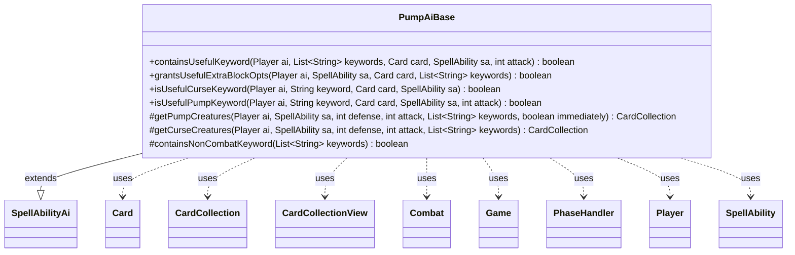

---
aliases:
  - PumpAiBase
tags:
  - java/class
  - module/forge-ai
  - pkg/forge/ai/ability
fqn: forge.ai.ability.PumpAiBase
package: forge.ai.ability
module: forge-ai
kind: Class
---

# PumpAiBase

**Package:** `forge.ai.ability`   **Module:** `forge-ai`   **Kind:** Class



## Relationships
**Extends:**
- [[forge.ai.SpellAbilityAi|SpellAbilityAi]]
**Uses:**
- [[forge.game.Game|Game]]
- [[forge.game.card.Card|Card]]
- [[forge.game.card.CardCollection|CardCollection]]
- [[forge.game.card.CardCollectionView|CardCollectionView]]
- [[forge.game.combat.Combat|Combat]]
- [[forge.game.phase.PhaseHandler|PhaseHandler]]
- [[forge.game.player.Player|Player]]
- [[forge.game.spellability.SpellAbility|SpellAbility]]

## Design Description

PumpAiBase is an abstract AI helper that centralizes the decision logic for "pump" and "curse" effects—spells and abilities that temporarily modify creatures' power, toughness, or keywords. Extending `SpellAbilityAi`, it serves as a shared base for the concrete pump/curse ability handlers, supplying protected routines that gather candidate creatures (`getPumpCreatures`, `getCurseCreatures`) and public predicates that judge whether a granted keyword is actually worth applying in the current game state.

Its design intent is heavily combat- and timing-aware: most evaluations consult the `Game`, `Combat`, and `PhaseHandler` to reason about whose turn it is, the current `PhaseType`, and attacker/blocker matchups, so buffs are spent only when they meaningfully affect combat. The large keyword-dispatch chains in `isUsefulPumpKeyword` and `isUsefulCurseKeyword` encode per-keyword heuristics (evasion, deathtouch, trample, removal-by-shrink, etc.), collaborating with `Card`, `CardCollection`, and `Player` to keep the AI from wasting effects.

## Source
`forge-ai/src/main/java/forge/ai/ability/PumpAiBase.java`

```java
package forge.ai.ability;

import forge.ai.*;
import forge.card.MagicColor;
import forge.game.Game;
import forge.game.ability.AbilityUtils;
import forge.game.card.*;
import forge.game.combat.Combat;
import forge.game.combat.CombatUtil;
import forge.game.keyword.Keyword;
import forge.game.phase.PhaseHandler;
import forge.game.phase.PhaseType;
import forge.game.player.Player;
import forge.game.spellability.SpellAbility;
import forge.game.zone.ZoneType;

import java.util.List;
import java.util.function.Predicate;

public abstract class PumpAiBase extends SpellAbilityAi {

    public boolean containsUsefulKeyword(final Player ai, final List<String> keywords, final Card card, final SpellAbility sa, final int attack) {
        for (final String keyword : keywords) {
            if (!sa.isCurse() && isUsefulPumpKeyword(ai, keyword, card, sa, attack)) {
                return true;
            }
            if (sa.isCurse() && isUsefulCurseKeyword(ai, keyword, card, sa)) {
                return true;
            }
        }
        return false;
    }

    public boolean grantsUsefulExtraBlockOpts(final Player ai, final SpellAbility sa, final Card card, List<String> keywords) {
        PhaseHandler ph = ai.getGame().getPhaseHandler();
        Card pumped = ComputerUtilCard.getPumpedCreature(ai, sa, card, 0, 0, keywords);

        if (ph.isPlayerTurn(ai) || !ph.getPhase().equals(PhaseType.COMBAT_DECLARE_ATTACKERS)) {
            return false;
        }

        int canBlockNum = 1 + card.canBlockAdditional();
        int canBlockNumPumped = canBlockNum; // PumpedCreature doesn't return a meaningful value of canBlockAdditional, so we'll use sa params below

        if (sa.hasParam("CanBlockAny")) {
            canBlockNumPumped = Integer.MAX_VALUE;
        } else if (sa.hasParam("CanBlockAmount")) {
            canBlockNumPumped += AbilityUtils.calculateAmount(pumped, sa.getParam("CanBlockAmount"), sa);
        }

        int possibleBlockNum = 0;
        int possibleBlockNumPumped = 0;

        for (Card attacker : ai.getGame().getCombat().getAttackers()) {
            if (CombatUtil.canBlock(attacker, card)) {
                possibleBlockNum++;
                if (possibleBlockNum > canBlockNum) {
                    possibleBlockNum = canBlockNum;
                    break;
                }
            }
        }
        for (Card attacker : ai.getGame().getCombat().getAttackers()) {
            if (CombatUtil.canBlock(attacker, pumped)) {
                possibleBlockNumPumped++;
                if (possibleBlockNumPumped > canBlockNumPumped) {
                    possibleBlockNumPumped = canBlockNumPumped;
                    break;
                }
            }
        }

        return possibleBlockNumPumped > possibleBlockNum;
    }

    /**
     * Checks if is useful keyword.
     * 
     * @param keyword
     *            the keyword
     * @param card
     *            the card
     * @param sa SpellAbility
     * @return true, if is useful keyword
     */
    public boolean isUsefulCurseKeyword(final Player ai, final String keyword, final Card card, final SpellAbility sa) {
        final Game game = ai.getGame();
        final Combat combat = game.getCombat();
        final PhaseHandler ph = game.getPhaseHandler();
        //int attack = getNumAttack(sa);
        //int defense = getNumDefense(sa);
        if (!CardUtil.isStackingKeyword(keyword) && card.hasKeyword(keyword)) {
            return false;
        } else if (keyword.equals("Defender") || keyword.endsWith("CARDNAME can't attack.")) {
            return ph.isPlayerTurn(card.getController()) && CombatUtil.canAttack(card, ai)
                    && (card.getNetCombatDamage() > 0)
                    && !ph.getPhase().isAfter(PhaseType.COMBAT_DECLARE_ATTACKERS);
        } else if (keyword.endsWith("CARDNAME can't attack or block.")) {
            if ("UntilYourNextTurn".equals(sa.getParam("Duration"))) {
                return CombatUtil.canAttack(card, ai) || CombatUtil.canBlock(card, true);
            }
            if (!ph.isPlayerTurn(ai)) {
                return card.getNetCombatDamage() > 0
                        && !ph.getPhase().isAfter(PhaseType.COMBAT_DECLARE_ATTACKERS)
                        && CombatUtil.canAttack(card, ai);
            } else {
                if (ph.getPhase().isAfter(PhaseType.COMBAT_DECLARE_BLOCKERS)
                        || ph.getPhase().isBefore(PhaseType.MAIN1)) {
                    return false;
                }

                List<Card> attackers = CardLists.filter(ai.getCreaturesInPlay(), c -> {
                    if (c.equals(sa.getHostCard()) && sa.getPayCosts().hasTapCost()
                            && (combat == null || !combat.isAttacking(c))) {
                        return false;
                    }
                    return (combat != null && combat.isAttacking(c)) || CombatUtil.canAttack(c, card.getController());
                });
                return CombatUtil.canBlockAtLeastOne(card, attackers);
            }
        } else if (keyword.endsWith("CARDNAME can't block.")) {
            if (!ph.isPlayerTurn(ai) || ph.getPhase().isAfter(PhaseType.COMBAT_DECLARE_BLOCKERS)
                    || ph.getPhase().isBefore(PhaseType.MAIN1)) {
                return false;
            }

            List<Card> attackers = CardLists.filter(ai.getCreaturesInPlay(), c -> {
                if (c.equals(sa.getHostCard()) && sa.getPayCosts().hasTapCost()
                        && (combat == null || !combat.isAttacking(c))) {
                    return false;
                }
                // the cards controller needs to be the one attacked
                return (combat != null && combat.isAttacking(c) && card.getController().equals(combat.getDefenderPlayerByAttacker(c))) ||
                        CombatUtil.canAttack(c, card.getController());
            });
            return CombatUtil.canBlockAtLeastOne(card, attackers);
        } else if (keyword.endsWith("This card doesn't untap during your next untap step.")) {
            return !ph.getPhase().isBefore(PhaseType.MAIN2) && !card.isUntapped() && ph.isPlayerTurn(ai)
                    && card.canUntap(card.getController(), true);
        } else if (keyword.endsWith("Prevent all combat damage that would be dealt by CARDNAME.")
                || keyword.endsWith("Prevent all damage that would be dealt by CARDNAME.")) {
            if (ph.isPlayerTurn(ai) && (!(CombatUtil.canBlock(card) || combat != null && combat.isBlocking(card))
                    || card.getNetCombatDamage() <= 0
                    || ph.getPhase().isAfter(PhaseType.COMBAT_DECLARE_BLOCKERS)
                    || ph.getPhase().isBefore(PhaseType.MAIN1)
                    || CardLists.getNotKeyword(ai.getCreaturesInPlay(), Keyword.DEFENDER).isEmpty())) {
                return false;
            }
            return ph.isPlayerTurn(ai) || (combat != null && combat.isAttacking(card) && card.getNetCombatDamage() > 0);
        } else return true;
    }

    /**
     * Checks if is useful keyword.
     * 
     * @param keyword
     *            the keyword
     * @param card
     *            the card
     * @param sa SpellAbility
     * @return true, if is useful keyword
     */
    public boolean isUsefulPumpKeyword(final Player ai, final String keyword, final Card card, final SpellAbility sa, final int attack) {
        final Game game = ai.getGame();
        final Combat combat = game.getCombat();
        final PhaseHandler ph = game.getPhaseHandler();
        final Player opp = AiAttackController.choosePreferredDefenderPlayer(ai);
        final int newPower = card.getNetCombatDamage() + attack;
        //int defense = getNumDefense(sa);
        if (!CardUtil.isStackingKeyword(keyword) && card.hasKeyword(keyword)) {
            return false;
        }

        final boolean evasive = keyword.endsWith("Shadow");
        // give evasive keywords to creatures that can or do attack
        if (evasive) {
            return !ph.isPlayerTurn(opp) && ((combat != null && combat.isAttacking(card)) || CombatUtil.canAttack(card, opp))
                    && !ph.getPhase().isAfter(PhaseType.COMBAT_DECLARE_ATTACKERS)
                    && newPower > 0
                    && opp.getCreaturesInPlay().anyMatch(CardPredicates.possibleBlockers(card));
        } else if (keyword.endsWith("Flying")) {
            CardCollectionView attackingFlyer = CardCollection.EMPTY;
            if (combat != null) {
                attackingFlyer = CardLists.getKeyword(combat.getAttackers(), Keyword.FLYING);
            }

            if (ph.isPlayerTurn(opp)
                    && ph.getPhase() == PhaseType.COMBAT_DECLARE_ATTACKERS
                    && !attackingFlyer.isEmpty()
                    && !card.hasKeyword(Keyword.REACH)
                    && CombatUtil.canBlock(card)
                    && ComputerUtilCombat.lifeInDanger(ai, game.getCombat())) {
                return true;
            }
            Predicate<Card> flyingOrReach = CardPredicates.hasKeyword(Keyword.FLYING).or(CardPredicates.hasKeyword(Keyword.REACH));
            if (ph.isPlayerTurn(opp) && combat != null
                    && !attackingFlyer.isEmpty()
                    && CombatUtil.canBlock(card)) {
                // Use defensively to destroy the opposing Flying creature when possible, or to block with an indestructible
                // creature buffed with Flying
                for (Card c : attackingFlyer) {
                    if (!ComputerUtilCombat.combatantCantBeDestroyed(c.getController(), c)
                            && (card.getNetPower() >= c.getNetToughness() && card.getNetToughness() > c.getNetPower()
                            || ComputerUtilCombat.combatantCantBeDestroyed(ai, card))) {
                        return true;
                    }
                }
            }
            return !ph.isPlayerTurn(opp) && ((combat != null && combat.isAttacking(card)) || CombatUtil.canAttack(card, opp))
                    && !ph.getPhase().isAfter(PhaseType.COMBAT_DECLARE_ATTACKERS)
                    && newPower > 0
                    && CardLists.filter(opp.getCreaturesInPlay(), CardPredicates.possibleBlockers(card))
                        .anyMatch(flyingOrReach.negate());
        } else if (keyword.endsWith("Horsemanship")) {
            if (ph.isPlayerTurn(opp)
                    && ph.getPhase().equals(PhaseType.COMBAT_DECLARE_ATTACKERS)
                    && !CardLists.getKeyword(game.getCombat().getAttackers(), Keyword.HORSEMANSHIP).isEmpty()
                    && CombatUtil.canBlock(card)
                    && ComputerUtilCombat.lifeInDanger(ai, game.getCombat())) {
                return true;
            }
            return !ph.isPlayerTurn(opp) && ((combat != null && combat.isAttacking(card)) || CombatUtil.canAttack(card, opp))
                    && !ph.getPhase().isAfter(PhaseType.COMBAT_DECLARE_ATTACKERS)
                    && newPower > 0
                    && !CardLists.getNotKeyword(CardLists.filter(opp.getCreaturesInPlay(), CardPredicates.possibleBlockers(card)),
                    Keyword.HORSEMANSHIP).isEmpty();
        } else if (keyword.endsWith("Intimidate")) {
            return !ph.isPlayerTurn(opp) && ((combat != null && combat.isAttacking(card)) || CombatUtil.canAttack(card, opp))
                    && !ph.getPhase().isAfter(PhaseType.COMBAT_DECLARE_ATTACKERS)
                    && newPower > 0
                    && !CardLists.getNotType(CardLists.filter(
                    opp.getCreaturesInPlay(), CardPredicates.possibleBlockers(card)), "Artifact").isEmpty();
        } else if (keyword.endsWith("Fear")) {
            return !ph.isPlayerTurn(opp) && ((combat != null && combat.isAttacking(card)) || CombatUtil.canAttack(card, opp))
                    && !ph.getPhase().isAfter(PhaseType.COMBAT_DECLARE_ATTACKERS)
                    && newPower > 0
                    && !CardLists.getNotColor(CardLists.getNotType(CardLists.filter(
                    opp.getCreaturesInPlay(), CardPredicates.possibleBlockers(card)), "Artifact"), MagicColor.BLACK).isEmpty();
        } else if (keyword.endsWith("Haste")) {
            return CombatUtil.isAttackerSick(card, opp) && !ph.isPlayerTurn(opp) && !card.isTapped()
                    && newPower > 0
                    && !ph.getPhase().isAfter(PhaseType.COMBAT_DECLARE_ATTACKERS)
                    && ComputerUtilCombat.canAttackNextTurn(card);
        } else if (keyword.endsWith("Indestructible")) {
            // Predicting threatened objects in relevant non-combat situations happens elsewhere,
            // so we are only worrying about combat relevance of Indestructible at this point.
            return combat != null
                    && ((combat.isBlocked(card) || combat.isBlocking(card))
                    && ComputerUtilCombat.combatantWouldBeDestroyed(ai, card, combat));
        } else if (keyword.endsWith("Deathtouch")) {
            if (ph.isPlayerTurn(opp) && ph.getPhase().equals(PhaseType.COMBAT_DECLARE_ATTACKERS)) {
                List<Card> attackers = combat.getAttackers();
                for (Card attacker : attackers) {
                    if (CombatUtil.canBlock(attacker, card, combat)
                            && !ComputerUtilCombat.canDestroyAttacker(ai, attacker, card, combat, false)) {
                        return true;
                    }
                }
            } else if (ph.isPlayerTurn(ai) && ph.getPhase().isBefore(PhaseType.COMBAT_DECLARE_ATTACKERS)
                    && CombatUtil.canAttack(card, opp)) {
                List<Card> blockers = opp.getCreaturesInPlay();
                for (Card blocker : blockers) {
                    if (CombatUtil.canBlock(card, blocker, combat)
                            && !ComputerUtilCombat.canDestroyBlocker(ai, blocker, card, combat, false)) {
                        return true;
                    }
                }
            }
            return false;
        } else if (keyword.startsWith("Bushido")) {
            return !ph.isPlayerTurn(opp) && ((combat != null && combat.isAttacking(card)) || CombatUtil.canAttack(card, opp))
                    && !ph.getPhase().isAfter(PhaseType.COMBAT_DECLARE_BLOCKERS)
                    && !opp.getCreaturesInPlay().isEmpty()
                    && opp.getCreaturesInPlay().anyMatch(CardPredicates.possibleBlockers(card));
        } else if (keyword.equals("First Strike")) {
            if (card.hasDoubleStrike()) {
                return false;
            }
            if (combat != null && combat.isBlocked(card) && !combat.getBlockers(card).isEmpty()) {
                Card blocker = combat.getBlockers(card).get(0);
                if (ComputerUtilCombat.canDestroyAttacker(ai, card, blocker, combat, true) 
                        && !ComputerUtilCombat.canDestroyAttacker(ai, card, blocker, combat, false))
                	return true;
                if (!ComputerUtilCombat.canDestroyBlocker(ai, blocker, card, combat, true) 
                        && ComputerUtilCombat.canDestroyBlocker(ai, blocker, card, combat, false))
                	return true;
            }
            if (combat != null && combat.isBlocking(card) && !combat.getAttackersBlockedBy(card).isEmpty()) {
                Card attacker = combat.getAttackersBlockedBy(card).get(0);
                if (!ComputerUtilCombat.canDestroyAttacker(ai, attacker, card, combat, true) 
                        && ComputerUtilCombat.canDestroyAttacker(ai, attacker, card, combat, false))
                	return true;
                return ComputerUtilCombat.canDestroyBlocker(ai, card, attacker, combat, true)
                        && !ComputerUtilCombat.canDestroyBlocker(ai, card, attacker, combat, false);
            }
            return false;
        } else if (keyword.equals("Double Strike")) {
            return !ph.isPlayerTurn(opp) && ((combat != null && combat.isAttacking(card)) || CombatUtil.canAttack(card, opp))
                    && newPower > 0
                    && !ph.getPhase().isAfter(PhaseType.COMBAT_DECLARE_BLOCKERS);
        } else if (keyword.startsWith("Rampage")) {
            return !ph.isPlayerTurn(opp) && ((combat != null && combat.isAttacking(card)) || CombatUtil.canAttack(card, opp))
                    && newPower > 0
                    && !ph.getPhase().isAfter(PhaseType.COMBAT_DECLARE_ATTACKERS)
                    && CardLists.filter(opp.getCreaturesInPlay(), CardPredicates.possibleBlockers(card)).size() >= 2;
        } else if (keyword.startsWith("Flanking")) {
            return !ph.isPlayerTurn(opp) && ((combat != null && combat.isAttacking(card)) || CombatUtil.canAttack(card, opp))
                    && newPower > 0
                    && !ph.getPhase().isAfter(PhaseType.COMBAT_DECLARE_ATTACKERS)
                    && !CardLists.getNotKeyword(CardLists.filter(opp.getCreaturesInPlay(), CardPredicates.possibleBlockers(card)),
                    Keyword.FLANKING).isEmpty();
        } else if (keyword.startsWith("Trample")) {
            return !ph.isPlayerTurn(opp) && ((combat != null && combat.isAttacking(card)) || CombatUtil.canAttack(card, opp))
                    && CombatUtil.canBeBlocked(card, null, opp)
                    && !ph.getPhase().isAfter(PhaseType.COMBAT_DECLARE_ATTACKERS)
                    && newPower > 1
                    && opp.getCreaturesInPlay().anyMatch(CardPredicates.possibleBlockers(card));
        } else if (keyword.equals("Infect")) {
            if (newPower <= 0) {
                return false;
            }
            if (combat != null && combat.isBlocking(card) && !card.hasKeyword(Keyword.WITHER)) {
                return true;
            }
            return !ph.isPlayerTurn(opp) && ((combat != null && combat.isAttacking(card)) || CombatUtil.canAttack(card, opp))
                    && !ph.getPhase().isAfter(PhaseType.COMBAT_DECLARE_BLOCKERS);
        } else if (keyword.endsWith("Wither")) {
            if (newPower <= 0 || card.isWitherDamage()) {
                return false;
            }
            return combat != null && (combat.isBlocking(card) || (combat.isAttacking(card) && combat.isBlocked(card)));
        } else if (keyword.equals("Lifelink")) {
            if (newPower <= 0 || ai.canGainLife()) {
                return false;
            }
            return combat != null && (combat.isAttacking(card) || combat.isBlocking(card));
        } else if (keyword.equals("Vigilance")) {
            return !ph.isPlayerTurn(opp) && CombatUtil.canAttack(card, opp)
                    && newPower > 0
                    && !ph.getPhase().isAfter(PhaseType.COMBAT_DECLARE_ATTACKERS)
                    && !CardLists.getNotKeyword(opp.getCreaturesInPlay(), Keyword.DEFENDER).isEmpty();
        } else if (keyword.equals("Reach")) {
            return !ph.isPlayerTurn(ai)
                    && ph.getPhase().equals(PhaseType.COMBAT_DECLARE_ATTACKERS)
                    && !CardLists.getKeyword(game.getCombat().getAttackers(), Keyword.FLYING).isEmpty()
                    && !card.hasKeyword(Keyword.FLYING)
                    && CombatUtil.canBlock(card);
        } else if (keyword.equals("Shroud") || keyword.equals("Hexproof")) {
            return ComputerUtil.predictThreatenedObjects(sa.getActivatingPlayer(), sa).contains(card);
        } else if (keyword.equals("Persist")) {
            return card.getBaseToughness() > 1 && !card.hasKeyword(Keyword.UNDYING);
        } else if (keyword.startsWith("Landwalk:")) {
            return !ph.isPlayerTurn(opp) && ((combat != null && combat.isAttacking(card)) || CombatUtil.canAttack(card, opp))
                    && !ph.getPhase().isAfter(PhaseType.COMBAT_DECLARE_ATTACKERS)
                    && newPower > 0
                    && !CardLists.getType(opp.getLandsInPlay(), keyword.split(":")[1]).isEmpty()
                    && opp.getCreaturesInPlay().anyMatch(CardPredicates.possibleBlockers(card));
        } else if (keyword.equals("Prevent all combat damage that would be dealt to CARDNAME.")) {
            return combat != null && (combat.isBlocking(card) || combat.isBlocked(card));
        } else if (keyword.equals("Menace")) {
            return combat != null && combat.isAttacking(card);
        }
        return true;
    }

    /**
     * <p>
     * getPumpCreatures.
     * </p>
     * 
     * @return a {@link forge.CardList} object.
     */
    protected CardCollection getPumpCreatures(final Player ai, final SpellAbility sa, final int defense, final int attack,
            final List<String> keywords, final boolean immediately) {
        CardCollection list = CardLists.getTargetableCards(ai.getCreaturesInPlay(), sa);
        list = CardLists.filter(list, c -> ComputerUtilCard.shouldPumpCard(ai, sa, c, defense, attack, keywords, immediately));
        return list;
    }

    /**
     * <p>
     * getCurseCreatures.
     * </p>
     * 
     * @param sa
     *            a {@link forge.game.spellability.SpellAbility} object.
     * @param defense
     *            a int.
     * @param attack
     *            a int.
     * @return a {@link forge.CardList} object.
     */
    protected CardCollection getCurseCreatures(final Player ai, final SpellAbility sa, final int defense, final int attack, final List<String> keywords) {
        CardCollection list = ai.getOpponents().getCardsIn(ZoneType.Battlefield);
        final Game game = ai.getGame();
        final Combat combat = game.getCombat();
        list = CardLists.getTargetableCards(list, sa);

        if (list.isEmpty()) {
            return list;
        }

        if (defense < 0) { // with spells that give -X/-X, compi will try to destroy a creature
            list = CardLists.filter(list, c -> {
                if (c.getSVar("Targeting").equals("Dies") || c.getNetToughness() <= -defense) {
                    return true; // can kill indestructible creatures
                }
                return ComputerUtilCombat.getDamageToKill(c, false) <= -defense && !c.hasKeyword(Keyword.INDESTRUCTIBLE);
            }); // leaves all creatures that will be destroyed
        } // -X/-X end
        else if (attack < 0 && !game.getReplacementHandler().isPreventCombatDamageThisTurn()) {
            // spells that give -X/0
            if (game.getPhaseHandler().isPlayerTurn(ai)) {
                if (game.getPhaseHandler().getPhase().isBefore(PhaseType.COMBAT_BEGIN)) {
                    // TODO: Curse creatures that will block AI's creatures, if AI is going to attack.
                    list = new CardCollection();
                } else {
                    list = new CardCollection();
                }
            } else if (game.getPhaseHandler().getPhase().isBefore(PhaseType.COMBAT_DECLARE_BLOCKERS)) {
                // Human active, only curse attacking creatures
                list = CardLists.filter(list, c -> {
                    if (combat == null || !combat.isAttacking(c)) {
                        return false;
                    }
                    if (c.getNetPower() > 0 && ai.getLife() < 5) {
                        return true;
                    }
                    //Don't waste a -7/-0 spell on a 1/1 creature
                    return c.getNetPower() + attack > -2 || c.getNetPower() > 3;
                });
            } else {
                list = new CardCollection();
            }
        } // -X/0 end
        else if (!keywords.isEmpty()) {
            // If the keyword can prevent a creature from attacking, see if there's some kind of viable prioritization
            if (keywords.contains("CARDNAME can't attack.") || keywords.contains("CARDNAME can't attack or block.")) {
                if (CardLists.getNotType(list, "Creature").isEmpty()) {
                    list = ComputerUtilCard.prioritizeCreaturesWorthRemovingNow(ai, list, true);
                }
            }

            list = CardLists.filter(list, c -> containsUsefulKeyword(ai, keywords, c, sa, attack));
        } else if (sa.hasParam("NumAtt") || sa.hasParam("NumDef")) {
            // X is zero
            list = new CardCollection();
        }

        return list;
    }

    protected boolean containsNonCombatKeyword(final List<String> keywords) {
        for (final String keyword : keywords) {
            // since most keywords are combat relevant check for those that are not
            if (keyword.endsWith("This card doesn't untap during your next untap step.")
                    || keyword.endsWith("Shroud") || keyword.endsWith("Hexproof")) {
                return true;
            }
        }
        return false;
    }
}
```

## Python
`forge/ai/ability/PumpAiBase.py`

```python
from forge.ai.SpellAbilityAi import SpellAbilityAi
from forge.ai.ComputerUtilCard import ComputerUtilCard
from forge.ai.AiAttackController import AiAttackController
from forge.ai.ComputerUtilCombat import ComputerUtilCombat
from forge.ai.ComputerUtil import ComputerUtil
from forge.card.MagicColor import MagicColor
from forge.game.Game import Game
from forge.game.ability.AbilityUtils import AbilityUtils
from forge.game.card.Card import Card
from forge.game.card.CardCollection import CardCollection
from forge.game.card.CardCollectionView import CardCollectionView
from forge.game.card.CardLists import CardLists
from forge.game.card.CardPredicates import CardPredicates
from forge.game.card.CardUtil import CardUtil
from forge.game.combat.Combat import Combat
from forge.game.combat.CombatUtil import CombatUtil
from forge.game.keyword.Keyword import Keyword
from forge.game.phase.PhaseHandler import PhaseHandler
from forge.game.phase.PhaseType import PhaseType
from forge.game.player.Player import Player
from forge.game.spellability.SpellAbility import SpellAbility
from forge.game.zone.ZoneType import ZoneType

import sys
from typing import List


class PumpAiBase(SpellAbilityAi):

    def containsUsefulKeyword(self, ai: Player, keywords: List[str], card: Card, sa: SpellAbility, attack: int) -> bool:
        for keyword in keywords:
            if not sa.isCurse() and self.isUsefulPumpKeyword(ai, keyword, card, sa, attack):
                return True
            if sa.isCurse() and self.isUsefulCurseKeyword(ai, keyword, card, sa):
                return True
        return False

    def grantsUsefulExtraBlockOpts(self, ai: Player, sa: SpellAbility, card: Card, keywords: List[str]) -> bool:
        ph = ai.getGame().getPhaseHandler()
        pumped = ComputerUtilCard.getPumpedCreature(ai, sa, card, 0, 0, keywords)

        if ph.isPlayerTurn(ai) or not ph.getPhase().equals(PhaseType.COMBAT_DECLARE_ATTACKERS):
            return False

        canBlockNum = 1 + card.canBlockAdditional()
        canBlockNumPumped = canBlockNum  # PumpedCreature doesn't return a meaningful value of canBlockAdditional, so we'll use sa params below

        if sa.hasParam("CanBlockAny"):
            canBlockNumPumped = sys.maxsize
        elif sa.hasParam("CanBlockAmount"):
            canBlockNumPumped += AbilityUtils.calculateAmount(pumped, sa.getParam("CanBlockAmount"), sa)

        possibleBlockNum = 0
        possibleBlockNumPumped = 0

        for attacker in ai.getGame().getCombat().getAttackers():
            if CombatUtil.canBlock(attacker, card):
                possibleBlockNum += 1
                if possibleBlockNum > canBlockNum:
                    possibleBlockNum = canBlockNum
                    break
        for attacker in ai.getGame().getCombat().getAttackers():
            if CombatUtil.canBlock(attacker, pumped):
                possibleBlockNumPumped += 1
                if possibleBlockNumPumped > canBlockNumPumped:
                    possibleBlockNumPumped = canBlockNumPumped
                    break

        return possibleBlockNumPumped > possibleBlockNum

    def isUsefulCurseKeyword(self, ai: Player, keyword: str, card: Card, sa: SpellAbility) -> bool:
        game = ai.getGame()
        combat = game.getCombat()
        ph = game.getPhaseHandler()
        # int attack = getNumAttack(sa);
        # int defense = getNumDefense(sa);
        if not CardUtil.isStackingKeyword(keyword) and card.hasKeyword(keyword):
            return False
        elif keyword.equals("Defender") or keyword.endswith("CARDNAME can't attack."):
            return (ph.isPlayerTurn(card.getController()) and CombatUtil.canAttack(card, ai)
                    and (card.getNetCombatDamage() > 0)
                    and not ph.getPhase().isAfter(PhaseType.COMBAT_DECLARE_ATTACKERS))
        elif keyword.endswith("CARDNAME can't attack or block."):
            if "UntilYourNextTurn" == sa.getParam("Duration"):
                return CombatUtil.canAttack(card, ai) or CombatUtil.canBlock(card, True)
            if not ph.isPlayerTurn(ai):
                return (card.getNetCombatDamage() > 0
                        and not ph.getPhase().isAfter(PhaseType.COMBAT_DECLARE_ATTACKERS)
                        and CombatUtil.canAttack(card, ai))
            else:
                if (ph.getPhase().isAfter(PhaseType.COMBAT_DECLARE_BLOCKERS)
                        or ph.getPhase().isBefore(PhaseType.MAIN1)):
                    return False

                def _canAttackPred(c):
                    if (c.equals(sa.getHostCard()) and sa.getPayCosts().hasTapCost()
                            and (combat is None or not combat.isAttacking(c))):
                        return False
                    return (combat is not None and combat.isAttacking(c)) or CombatUtil.canAttack(c, card.getController())

                attackers = CardLists.filter(ai.getCreaturesInPlay(), _canAttackPred)
                return CombatUtil.canBlockAtLeastOne(card, attackers)
        elif keyword.endswith("CARDNAME can't block."):
            if (not ph.isPlayerTurn(ai) or ph.getPhase().isAfter(PhaseType.COMBAT_DECLARE_BLOCKERS)
                    or ph.getPhase().isBefore(PhaseType.MAIN1)):
                return False

            def _canBlockPred(c):
                if (c.equals(sa.getHostCard()) and sa.getPayCosts().hasTapCost()
                        and (combat is None or not combat.isAttacking(c))):
                    return False
                # the cards controller needs to be the one attacked
                return ((combat is not None and combat.isAttacking(c) and card.getController().equals(combat.getDefenderPlayerByAttacker(c)))
                        or CombatUtil.canAttack(c, card.getController()))

            attackers = CardLists.filter(ai.getCreaturesInPlay(), _canBlockPred)
            return CombatUtil.canBlockAtLeastOne(card, attackers)
        elif keyword.endswith("This card doesn't untap during your next untap step."):
            return (not ph.getPhase().isBefore(PhaseType.MAIN2) and not card.isUntapped() and ph.isPlayerTurn(ai)
                    and card.canUntap(card.getController(), True))
        elif (keyword.endswith("Prevent all combat damage that would be dealt by CARDNAME.")
                or keyword.endswith("Prevent all damage that would be dealt by CARDNAME.")):
            if (ph.isPlayerTurn(ai) and (not (CombatUtil.canBlock(card) or (combat is not None and combat.isBlocking(card)))
                    or card.getNetCombatDamage() <= 0
                    or ph.getPhase().isAfter(PhaseType.COMBAT_DECLARE_BLOCKERS)
                    or ph.getPhase().isBefore(PhaseType.MAIN1)
                    or CardLists.getNotKeyword(ai.getCreaturesInPlay(), Keyword.DEFENDER).isEmpty())):
                return False
            return ph.isPlayerTurn(ai) or (combat is not None and combat.isAttacking(card) and card.getNetCombatDamage() > 0)
        else:
            return True

    def isUsefulPumpKeyword(self, ai: Player, keyword: str, card: Card, sa: SpellAbility, attack: int) -> bool:
        game = ai.getGame()
        combat = game.getCombat()
        ph = game.getPhaseHandler()
        opp = AiAttackController.choosePreferredDefenderPlayer(ai)
        newPower = card.getNetCombatDamage() + attack
        # int defense = getNumDefense(sa);
        if not CardUtil.isStackingKeyword(keyword) and card.hasKeyword(keyword):
            return False

        evasive = keyword.endswith("Shadow")
        # give evasive keywords to creatures that can or do attack
        if evasive:
            return (not ph.isPlayerTurn(opp) and ((combat is not None and combat.isAttacking(card)) or CombatUtil.canAttack(card, opp))
                    and not ph.getPhase().isAfter(PhaseType.COMBAT_DECLARE_ATTACKERS)
                    and newPower > 0
                    and opp.getCreaturesInPlay().anyMatch(CardPredicates.possibleBlockers(card)))
        elif keyword.endswith("Flying"):
            attackingFlyer = CardCollection.EMPTY
            if combat is not None:
                attackingFlyer = CardLists.getKeyword(combat.getAttackers(), Keyword.FLYING)

            if (ph.isPlayerTurn(opp)
                    and ph.getPhase() == PhaseType.COMBAT_DECLARE_ATTACKERS
                    and not attackingFlyer.isEmpty()
                    and not card.hasKeyword(Keyword.REACH)
                    and CombatUtil.canBlock(card)
                    and ComputerUtilCombat.lifeInDanger(ai, game.getCombat())):
                return True

            flyingOrReach = lambda c: CardPredicates.hasKeyword(Keyword.FLYING)(c) or CardPredicates.hasKeyword(Keyword.REACH)(c)
            if (ph.isPlayerTurn(opp) and combat is not None
                    and not attackingFlyer.isEmpty()
                    and CombatUtil.canBlock(card)):
                # Use defensively to destroy the opposing Flying creature when possible, or to block with an indestructible
                # creature buffed with Flying
                for c in attackingFlyer:
                    if (not ComputerUtilCombat.combatantCantBeDestroyed(c.getController(), c)
                            and ((card.getNetPower() >= c.getNetToughness() and card.getNetToughness() > c.getNetPower())
                                 or ComputerUtilCombat.combatantCantBeDestroyed(ai, card))):
                        return True
            return (not ph.isPlayerTurn(opp) and ((combat is not None and combat.isAttacking(card)) or CombatUtil.canAttack(card, opp))
                    and not ph.getPhase().isAfter(PhaseType.COMBAT_DECLARE_ATTACKERS)
                    and newPower > 0
                    and CardLists.filter(opp.getCreaturesInPlay(), CardPredicates.possibleBlockers(card))
                        .anyMatch(lambda c: not flyingOrReach(c)))
        elif keyword.endswith("Horsemanship"):
            if (ph.isPlayerTurn(opp)
                    and ph.getPhase().equals(PhaseType.COMBAT_DECLARE_ATTACKERS)
                    and not CardLists.getKeyword(game.getCombat().getAttackers(), Keyword.HORSEMANSHIP).isEmpty()
                    and CombatUtil.canBlock(card)
                    and ComputerUtilCombat.lifeInDanger(ai, game.getCombat())):
                return True
            return (not ph.isPlayerTurn(opp) and ((combat is not None and combat.isAttacking(card)) or CombatUtil.canAttack(card, opp))
                    and not ph.getPhase().isAfter(PhaseType.COMBAT_DECLARE_ATTACKERS)
                    and newPower > 0
                    and not CardLists.getNotKeyword(CardLists.filter(opp.getCreaturesInPlay(), CardPredicates.possibleBlockers(card)),
                                                    Keyword.HORSEMANSHIP).isEmpty())
        elif keyword.endswith("Intimidate"):
            return (not ph.isPlayerTurn(opp) and ((combat is not None and combat.isAttacking(card)) or CombatUtil.canAttack(card, opp))
                    and not ph.getPhase().isAfter(PhaseType.COMBAT_DECLARE_ATTACKERS)
                    and newPower > 0
                    and not CardLists.getNotType(CardLists.filter(
                        opp.getCreaturesInPlay(), CardPredicates.possibleBlockers(card)), "Artifact").isEmpty())
        elif keyword.endswith("Fear"):
            return (not ph.isPlayerTurn(opp) and ((combat is not None and combat.isAttacking(card)) or CombatUtil.canAttack(card, opp))
                    and not ph.getPhase().isAfter(PhaseType.COMBAT_DECLARE_ATTACKERS)
                    and newPower > 0
                    and not CardLists.getNotColor(CardLists.getNotType(CardLists.filter(
                        opp.getCreaturesInPlay(), CardPredicates.possibleBlockers(card)), "Artifact"), MagicColor.BLACK).isEmpty())
        elif keyword.endswith("Haste"):
            return (CombatUtil.isAttackerSick(card, opp) and not ph.isPlayerTurn(opp) and not card.isTapped()
                    and newPower > 0
                    and not ph.getPhase().isAfter(PhaseType.COMBAT_DECLARE_ATTACKERS)
                    and ComputerUtilCombat.canAttackNextTurn(card))
        elif keyword.endswith("Indestructible"):
            # Predicting threatened objects in relevant non-combat situations happens elsewhere,
            # so we are only worrying about combat relevance of Indestructible at this point.
            return (combat is not None
                    and ((combat.isBlocked(card) or combat.isBlocking(card))
                         and ComputerUtilCombat.combatantWouldBeDestroyed(ai, card, combat)))
        elif keyword.endswith("Deathtouch"):
            if ph.isPlayerTurn(opp) and ph.getPhase().equals(PhaseType.COMBAT_DECLARE_ATTACKERS):
                attackers = combat.getAttackers()
                for attacker in attackers:
                    if (CombatUtil.canBlock(attacker, card, combat)
                            and not ComputerUtilCombat.canDestroyAttacker(ai, attacker, card, combat, False)):
                        return True
            elif (ph.isPlayerTurn(ai) and ph.getPhase().isBefore(PhaseType.COMBAT_DECLARE_ATTACKERS)
                    and CombatUtil.canAttack(card, opp)):
                blockers = opp.getCreaturesInPlay()
                for blocker in blockers:
                    if (CombatUtil.canBlock(card, blocker, combat)
                            and not ComputerUtilCombat.canDestroyBlocker(ai, blocker, card, combat, False)):
                        return True
            return False
        elif keyword.startswith("Bushido"):
            return (not ph.isPlayerTurn(opp) and ((combat is not None and combat.isAttacking(card)) or CombatUtil.canAttack(card, opp))
                    and not ph.getPhase().isAfter(PhaseType.COMBAT_DECLARE_BLOCKERS)
                    and not opp.getCreaturesInPlay().isEmpty()
                    and opp.getCreaturesInPlay().anyMatch(CardPredicates.possibleBlockers(card)))
        elif keyword.equals("First Strike"):
            if card.hasDoubleStrike():
                return False
            if combat is not None and combat.isBlocked(card) and not combat.getBlockers(card).isEmpty():
                blocker = combat.getBlockers(card).get(0)
                if (ComputerUtilCombat.canDestroyAttacker(ai, card, blocker, combat, True)
                        and not ComputerUtilCombat.canDestroyAttacker(ai, card, blocker, combat, False)):
                    return True
                if (not ComputerUtilCombat.canDestroyBlocker(ai, blocker, card, combat, True)
                        and ComputerUtilCombat.canDestroyBlocker(ai, blocker, card, combat, False)):
                    return True
            if combat is not None and combat.isBlocking(card) and not combat.getAttackersBlockedBy(card).isEmpty():
                attacker = combat.getAttackersBlockedBy(card).get(0)
                if (not ComputerUtilCombat.canDestroyAttacker(ai, attacker, card, combat, True)
                        and ComputerUtilCombat.canDestroyAttacker(ai, attacker, card, combat, False)):
                    return True
                return (ComputerUtilCombat.canDestroyBlocker(ai, card, attacker, combat, True)
                        and not ComputerUtilCombat.canDestroyBlocker(ai, card, attacker, combat, False))
            return False
        elif keyword.equals("Double Strike"):
            return (not ph.isPlayerTurn(opp) and ((combat is not None and combat.isAttacking(card)) or CombatUtil.canAttack(card, opp))
                    and newPower > 0
                    and not ph.getPhase().isAfter(PhaseType.COMBAT_DECLARE_BLOCKERS))
        elif keyword.startswith("Rampage"):
            return (not ph.isPlayerTurn(opp) and ((combat is not None and combat.isAttacking(card)) or CombatUtil.canAttack(card, opp))
                    and newPower > 0
                    and not ph.getPhase().isAfter(PhaseType.COMBAT_DECLARE_ATTACKERS)
                    and CardLists.filter(opp.getCreaturesInPlay(), CardPredicates.possibleBlockers(card)).size() >= 2)
        elif keyword.startswith("Flanking"):
            return (not ph.isPlayerTurn(opp) and ((combat is not None and combat.isAttacking(card)) or CombatUtil.canAttack(card, opp))
                    and newPower > 0
                    and not ph.getPhase().isAfter(PhaseType.COMBAT_DECLARE_ATTACKERS)
                    and not CardLists.getNotKeyword(CardLists.filter(opp.getCreaturesInPlay(), CardPredicates.possibleBlockers(card)),
                                                    Keyword.FLANKING).isEmpty())
        elif keyword.startswith("Trample"):
            return (not ph.isPlayerTurn(opp) and ((combat is not None and combat.isAttacking(card)) or CombatUtil.canAttack(card, opp))
                    and CombatUtil.canBeBlocked(card, None, opp)
                    and not ph.getPhase().isAfter(PhaseType.COMBAT_DECLARE_ATTACKERS)
                    and newPower > 1
                    and opp.getCreaturesInPlay().anyMatch(CardPredicates.possibleBlockers(card)))
        elif keyword.equals("Infect"):
            if newPower <= 0:
                return False
            if combat is not None and combat.isBlocking(card) and not card.hasKeyword(Keyword.WITHER):
                return True
            return (not ph.isPlayerTurn(opp) and ((combat is not None and combat.isAttacking(card)) or CombatUtil.canAttack(card, opp))
                    and not ph.getPhase().isAfter(PhaseType.COMBAT_DECLARE_BLOCKERS))
        elif keyword.endswith("Wither"):
            if newPower <= 0 or card.isWitherDamage():
                return False
            return combat is not None and (combat.isBlocking(card) or (combat.isAttacking(card) and combat.isBlocked(card)))
        elif keyword.equals("Lifelink"):
            if newPower <= 0 or ai.canGainLife():
                return False
            return combat is not None and (combat.isAttacking(card) or combat.isBlocking(card))
        elif keyword.equals("Vigilance"):
            return (not ph.isPlayerTurn(opp) and CombatUtil.canAttack(card, opp)
                    and newPower > 0
                    and not ph.getPhase().isAfter(PhaseType.COMBAT_DECLARE_ATTACKERS)
                    and not CardLists.getNotKeyword(opp.getCreaturesInPlay(), Keyword.DEFENDER).isEmpty())
        elif keyword.equals("Reach"):
            return (not ph.isPlayerTurn(ai)
                    and ph.getPhase().equals(PhaseType.COMBAT_DECLARE_ATTACKERS)
                    and not CardLists.getKeyword(game.getCombat().getAttackers(), Keyword.FLYING).isEmpty()
                    and not card.hasKeyword(Keyword.FLYING)
                    and CombatUtil.canBlock(card))
        elif keyword.equals("Shroud") or keyword.equals("Hexproof"):
            return ComputerUtil.predictThreatenedObjects(sa.getActivatingPlayer(), sa).contains(card)
        elif keyword.equals("Persist"):
            return card.getBaseToughness() > 1 and not card.hasKeyword(Keyword.UNDYING)
        elif keyword.startswith("Landwalk:"):
            return (not ph.isPlayerTurn(opp) and ((combat is not None and combat.isAttacking(card)) or CombatUtil.canAttack(card, opp))
                    and not ph.getPhase().isAfter(PhaseType.COMBAT_DECLARE_ATTACKERS)
                    and newPower > 0
                    and not CardLists.getType(opp.getLandsInPlay(), keyword.split(":")[1]).isEmpty()
                    and opp.getCreaturesInPlay().anyMatch(CardPredicates.possibleBlockers(card)))
        elif keyword.equals("Prevent all combat damage that would be dealt to CARDNAME."):
            return combat is not None and (combat.isBlocking(card) or combat.isBlocked(card))
        elif keyword.equals("Menace"):
            return combat is not None and combat.isAttacking(card)
        return True

    def getPumpCreatures(self, ai: Player, sa: SpellAbility, defense: int, attack: int,
                         keywords: List[str], immediately: bool) -> CardCollection:
        list = CardLists.getTargetableCards(ai.getCreaturesInPlay(), sa)
        list = CardLists.filter(list, lambda c: ComputerUtilCard.shouldPumpCard(ai, sa, c, defense, attack, keywords, immediately))
        return list

    def getCurseCreatures(self, ai: Player, sa: SpellAbility, defense: int, attack: int, keywords: List[str]) -> CardCollection:
        list = ai.getOpponents().getCardsIn(ZoneType.Battlefield)
        game = ai.getGame()
        combat = game.getCombat()
        list = CardLists.getTargetableCards(list, sa)

        if list.isEmpty():
            return list

        if defense < 0:  # with spells that give -X/-X, compi will try to destroy a creature
            def _killable(c):
                if c.getSVar("Targeting").equals("Dies") or c.getNetToughness() <= -defense:
                    return True  # can kill indestructible creatures
                return ComputerUtilCombat.getDamageToKill(c, False) <= -defense and not c.hasKeyword(Keyword.INDESTRUCTIBLE)
            list = CardLists.filter(list, _killable)  # leaves all creatures that will be destroyed
        # -X/-X end
        elif attack < 0 and not game.getReplacementHandler().isPreventCombatDamageThisTurn():
            # spells that give -X/0
            if game.getPhaseHandler().isPlayerTurn(ai):
                if game.getPhaseHandler().getPhase().isBefore(PhaseType.COMBAT_BEGIN):
                    # TODO: Curse creatures that will block AI's creatures, if AI is going to attack.
                    list = CardCollection()
                else:
                    list = CardCollection()
            elif game.getPhaseHandler().getPhase().isBefore(PhaseType.COMBAT_DECLARE_BLOCKERS):
                # Human active, only curse attacking creatures
                def _attackerCurse(c):
                    if combat is None or not combat.isAttacking(c):
                        return False
                    if c.getNetPower() > 0 and ai.getLife() < 5:
                        return True
                    # Don't waste a -7/-0 spell on a 1/1 creature
                    return c.getNetPower() + attack > -2 or c.getNetPower() > 3
                list = CardLists.filter(list, _attackerCurse)
            else:
                list = CardCollection()
        # -X/0 end
        elif not keywords.isEmpty():
            # If the keyword can prevent a creature from attacking, see if there's some kind of viable prioritization
            if keywords.contains("CARDNAME can't attack.") or keywords.contains("CARDNAME can't attack or block."):
                if CardLists.getNotType(list, "Creature").isEmpty():
                    list = ComputerUtilCard.prioritizeCreaturesWorthRemovingNow(ai, list, True)

            list = CardLists.filter(list, lambda c: self.containsUsefulKeyword(ai, keywords, c, sa, attack))
        elif sa.hasParam("NumAtt") or sa.hasParam("NumDef"):
            # X is zero
            list = CardCollection()

        return list

    def containsNonCombatKeyword(self, keywords: List[str]) -> bool:
        for keyword in keywords:
            # since most keywords are combat relevant check for those that are not
            if (keyword.endswith("This card doesn't untap during your next untap step.")
                    or keyword.endswith("Shroud") or keyword.endswith("Hexproof")):
                return True
        return False
```
