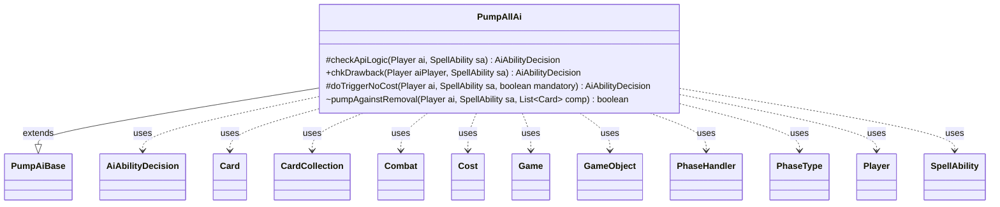

---
aliases:
  - PumpAllAi
tags:
  - java/class
  - module/forge-ai
  - pkg/forge/ai/ability
fqn: forge.ai.ability.PumpAllAi
package: forge.ai.ability
module: forge-ai
kind: Class
---

# PumpAllAi

**Package:** `forge.ai.ability`   **Module:** `forge-ai`   **Kind:** Class



## Relationships
**Extends:**
- [[forge.ai.ability.PumpAiBase|PumpAiBase]]
**Uses:**
- [[forge.ai.AiAbilityDecision|AiAbilityDecision]]
- [[forge.game.Game|Game]]
- [[forge.game.GameObject|GameObject]]
- [[forge.game.card.Card|Card]]
- [[forge.game.card.CardCollection|CardCollection]]
- [[forge.game.combat.Combat|Combat]]
- [[forge.game.cost.Cost|Cost]]
- [[forge.game.phase.PhaseHandler|PhaseHandler]]
- [[forge.game.phase.PhaseType|PhaseType]]
- [[forge.game.player.Player|Player]]
- [[forge.game.spellability.SpellAbility|SpellAbility]]

## Design Description

PumpAllAi supplies the AI's decision logic for "pump all" effects—spells and abilities that buff or debuff every creature matching a `ValidCards` filter rather than a single target. Extending PumpAiBase, it overrides the standard AI hooks (`checkApiLogic`, `chkDrawback`, `doTriggerNoCost`) to return AiAbilityDecision verdicts telling the engine whether, and how eagerly, to play the SpellAbility.

Its central responsibility is board evaluation. It splits the battlefield into the AI's own valid CardCollection and the opponent's, then branches on whether the effect is a curse or a boost. For curses it identifies lethal `-X/-X` and combat-shrinking `-X/-0` cases, consulting Combat, PhaseHandler, and PhaseType so it fires only during the right combat step and when the opponent's creatures are collectively worth more. For boosts it defers to `shouldPumpCard` heuristics and, via `pumpAgainstRemoval`, reacts defensively to creatures threatened on the stack. Cost and Game collaborators gate activations by affordability and timing.

## Source
`forge-ai/src/main/java/forge/ai/ability/PumpAllAi.java`

```java
package forge.ai.ability;

import forge.ai.*;
import forge.game.Game;
import forge.game.GameObject;
import forge.game.ability.AbilityUtils;
import forge.game.card.Card;
import forge.game.card.CardCollection;
import forge.game.card.CardLists;
import forge.game.combat.Combat;
import forge.game.cost.Cost;
import forge.game.keyword.Keyword;
import forge.game.phase.PhaseHandler;
import forge.game.phase.PhaseType;
import forge.game.player.Player;
import forge.game.spellability.SpellAbility;
import forge.game.zone.ZoneType;

import java.util.ArrayList;
import java.util.Arrays;
import java.util.List;

public class PumpAllAi extends PumpAiBase {

    /* (non-Javadoc)
     * @see forge.card.abilityfactory.SpellAiLogic#canPlayAI(forge.game.player.Player, java.util.Map, forge.card.spellability.SpellAbility)
     */
    @Override
    protected AiAbilityDecision checkApiLogic(final Player ai, final SpellAbility sa) {
        final Card source = sa.getHostCard();
        final Game game = ai.getGame();
        final Combat combat = game.getCombat();
        final Cost abCost = sa.getPayCosts();
        final String logic = sa.getParamOrDefault("AILogic", "");

        if (logic.equals("UntapCombatTrick")) {
            PhaseHandler ph = ai.getGame().getPhaseHandler();
            if (!(ph.is(PhaseType.COMBAT_DECLARE_BLOCKERS, ai)
                    || (!ph.getPlayerTurn().equals(ai) && ph.is(PhaseType.COMBAT_DECLARE_ATTACKERS)))) {
                return new AiAbilityDecision(0, AiPlayDecision.CantPlayAi);
            }
        }

        if (abCost != null && source.hasSVar("AIPreference")) {
            if (!ComputerUtilCost.checkSacrificeCost(ai, abCost, source, sa, true)) {
                return new AiAbilityDecision(0, AiPlayDecision.CantPlayAi);
            }
        }
        
        final Player opp = ai.getStrongestOpponent();

        if (sa.usesTargeting()) {
            if (sa.canTarget(opp) && sa.isCurse()) {
                sa.resetTargets();
                sa.getTargets().add(opp);
                return new AiAbilityDecision(100, AiPlayDecision.WillPlay);
            }

            if (sa.canTarget(ai) && !sa.isCurse()) {
                sa.resetTargets();
                sa.getTargets().add(ai);
                return new AiAbilityDecision(100, AiPlayDecision.WillPlay);
            }
        }

        final int power = AbilityUtils.calculateAmount(source, sa.getParam("NumAtt"), sa);
        final int defense = AbilityUtils.calculateAmount(source, sa.getParam("NumDef"), sa);
        final List<String> keywords = sa.hasParam("KW") ? Arrays.asList(sa.getParam("KW").split(" & ")) : new ArrayList<>();
        final PhaseType phase = game.getPhaseHandler().getPhase();

        final String valid = sa.getParamOrDefault("ValidCards", "");

        CardCollection comp = CardLists.getValidCards(ai.getCardsIn(ZoneType.Battlefield), valid, source.getController(), source, sa);
        CardCollection human = CardLists.getValidCards(opp.getCardsIn(ZoneType.Battlefield), valid, source.getController(), source, sa);

        if (sa.isCurse()) {
            if (defense < 0) { // try to destroy creatures
                comp = CardLists.filter(comp, c -> {
                    if (c.getNetToughness() <= -defense) {
                        return true; // can kill indestructible creatures
                    }
                    return ComputerUtilCombat.getDamageToKill(c, false) <= -defense && !c.hasKeyword(Keyword.INDESTRUCTIBLE);
                }); // leaves all creatures that will be destroyed
                human = CardLists.filter(human, c -> {
                    if (c.getNetToughness() <= -defense) {
                        return true; // can kill indestructible creatures
                    }
                    return ComputerUtilCombat.getDamageToKill(c, false) <= -defense && !c.hasKeyword(Keyword.INDESTRUCTIBLE);
                }); // leaves all creatures that will be destroyed
            } // -X/-X end
            else if (power < 0) { // -X/-0
                if (phase.isAfter(PhaseType.COMBAT_DECLARE_BLOCKERS)
                        || phase.isBefore(PhaseType.COMBAT_DECLARE_ATTACKERS)
                        || game.getPhaseHandler().isPlayerTurn(sa.getActivatingPlayer())
                        || game.getReplacementHandler().isPreventCombatDamageThisTurn()) {
                    return new AiAbilityDecision(0, AiPlayDecision.CantPlayAi);
                }
                int totalPower = 0;
                for (Card c : human) {
                    if (combat == null || !combat.isAttacking(c)) {
                        continue;
                    }
                    totalPower += Math.min(c.getNetPower(), power * -1);
                    if (phase == PhaseType.COMBAT_DECLARE_BLOCKERS && combat.isUnblocked(c)) {
                        if (ComputerUtilCombat.lifeInDanger(sa.getActivatingPlayer(), combat)) {
                            return new AiAbilityDecision(100, AiPlayDecision.WillPlay);
                        }
                        totalPower += Math.min(c.getNetPower(), power * -1);
                    }
                    if (totalPower >= power * -2) {
                        return new AiAbilityDecision(100, AiPlayDecision.WillPlay);
                    }
                }
                return new AiAbilityDecision(0, AiPlayDecision.CantPlayAi);
            } // -X/-0 end
            
            if (comp.isEmpty() && ComputerUtil.activateForCost(sa, ai)) {
            	return new AiAbilityDecision(100, AiPlayDecision.WillPlay);
            }

            // evaluate both lists and pass only if human creatures are more valuable
            boolean result = (ComputerUtilCard.evaluateCreatureList(comp) + 200) < ComputerUtilCard.evaluateCreatureList(human);
            return result ? new AiAbilityDecision(100, AiPlayDecision.WillPlay) : new AiAbilityDecision(0, AiPlayDecision.CantPlayAi);
        } // end Curse

        if (!game.getStack().isEmpty()) {
            boolean result = pumpAgainstRemoval(ai, sa, comp);
            return result ? new AiAbilityDecision(100, AiPlayDecision.WillPlay) : new AiAbilityDecision(0, AiPlayDecision.CantPlayAi);
        }

        boolean result = ai.getCreaturesInPlay().anyMatch(c -> c.isValid(valid, source.getController(), source, sa)
                && ComputerUtilCard.shouldPumpCard(ai, sa, c, defense, power, keywords));
        return result ? new AiAbilityDecision(100, AiPlayDecision.WillPlay) : new AiAbilityDecision(0, AiPlayDecision.CantPlayAi);
    }

    @Override
    public AiAbilityDecision chkDrawback(Player aiPlayer, SpellAbility sa) {
        return new AiAbilityDecision(100, AiPlayDecision.WillPlay);
    }

    @Override
    protected AiAbilityDecision doTriggerNoCost(Player ai, SpellAbility sa, boolean mandatory) {
        // it might help so take it
        if (!sa.usesTargeting() && !sa.isCurse() && sa.hasParam("ValidCards") && sa.getParam("ValidCards").contains("YouCtrl")) {
            return new AiAbilityDecision(100, AiPlayDecision.WillPlay);
        }

        // important to call canPlay first so targets are added if needed
        AiAbilityDecision decision = canPlay(ai, sa);
        if (mandatory && !decision.decision().willingToPlay()) {
            return new AiAbilityDecision(50, AiPlayDecision.MandatoryPlay);
        }
        return decision;
    }

    boolean pumpAgainstRemoval(Player ai, SpellAbility sa, List<Card> comp) {
        final List<GameObject> objects = ComputerUtil.predictThreatenedObjects(sa.getActivatingPlayer(), sa, true);
        for (final Card c : comp) {
            if (objects.contains(c)) {
                return true;
            }
        }
        return false;
    }
}
```

## Python
`forge/ai/ability/PumpAllAi.py`

```python
from forge.ai.ability.PumpAiBase import PumpAiBase
from forge.ai.AiAbilityDecision import AiAbilityDecision
from forge.ai.AiPlayDecision import AiPlayDecision
from forge.ai.ComputerUtil import ComputerUtil
from forge.ai.ComputerUtilCard import ComputerUtilCard
from forge.ai.ComputerUtilCombat import ComputerUtilCombat
from forge.ai.ComputerUtilCost import ComputerUtilCost
from forge.game.Game import Game
from forge.game.GameObject import GameObject
from forge.game.ability.AbilityUtils import AbilityUtils
from forge.game.card.Card import Card
from forge.game.card.CardCollection import CardCollection
from forge.game.card.CardLists import CardLists
from forge.game.combat.Combat import Combat
from forge.game.cost.Cost import Cost
from forge.game.keyword.Keyword import Keyword
from forge.game.phase.PhaseHandler import PhaseHandler
from forge.game.phase.PhaseType import PhaseType
from forge.game.player.Player import Player
from forge.game.spellability.SpellAbility import SpellAbility
from forge.game.zone.ZoneType import ZoneType


class PumpAllAi(PumpAiBase):

    # (non-Javadoc)
    # @see forge.card.abilityfactory.SpellAiLogic#canPlayAI(forge.game.player.Player, java.util.Map, forge.card.spellability.SpellAbility)
    def checkApiLogic(self, ai: Player, sa: SpellAbility) -> AiAbilityDecision:
        source = sa.getHostCard()
        game = ai.getGame()
        combat = game.getCombat()
        abCost = sa.getPayCosts()
        logic = sa.getParamOrDefault("AILogic", "")

        if logic == "UntapCombatTrick":
            ph = ai.getGame().getPhaseHandler()
            if not (ph.is_(PhaseType.COMBAT_DECLARE_BLOCKERS, ai)
                    or (not ph.getPlayerTurn() == ai and ph.is_(PhaseType.COMBAT_DECLARE_ATTACKERS))):
                return AiAbilityDecision(0, AiPlayDecision.CantPlayAi)

        if abCost is not None and source.hasSVar("AIPreference"):
            if not ComputerUtilCost.checkSacrificeCost(ai, abCost, source, sa, True):
                return AiAbilityDecision(0, AiPlayDecision.CantPlayAi)

        opp = ai.getStrongestOpponent()

        if sa.usesTargeting():
            if sa.canTarget(opp) and sa.isCurse():
                sa.resetTargets()
                sa.getTargets().add(opp)
                return AiAbilityDecision(100, AiPlayDecision.WillPlay)

            if sa.canTarget(ai) and not sa.isCurse():
                sa.resetTargets()
                sa.getTargets().add(ai)
                return AiAbilityDecision(100, AiPlayDecision.WillPlay)

        power = AbilityUtils.calculateAmount(source, sa.getParam("NumAtt"), sa)
        defense = AbilityUtils.calculateAmount(source, sa.getParam("NumDef"), sa)
        keywords = sa.getParam("KW").split(" & ") if sa.hasParam("KW") else []
        phase = game.getPhaseHandler().getPhase()

        valid = sa.getParamOrDefault("ValidCards", "")

        comp = CardLists.getValidCards(ai.getCardsIn(ZoneType.Battlefield), valid, source.getController(), source, sa)
        human = CardLists.getValidCards(opp.getCardsIn(ZoneType.Battlefield), valid, source.getController(), source, sa)

        if sa.isCurse():
            if defense < 0:  # try to destroy creatures
                def kills(c):
                    if c.getNetToughness() <= -defense:
                        return True  # can kill indestructible creatures
                    return ComputerUtilCombat.getDamageToKill(c, False) <= -defense and not c.hasKeyword(Keyword.INDESTRUCTIBLE)
                comp = CardLists.filter(comp, kills)  # leaves all creatures that will be destroyed
                human = CardLists.filter(human, kills)  # leaves all creatures that will be destroyed
            # -X/-X end
            elif power < 0:  # -X/-0
                if (phase.isAfter(PhaseType.COMBAT_DECLARE_BLOCKERS)
                        or phase.isBefore(PhaseType.COMBAT_DECLARE_ATTACKERS)
                        or game.getPhaseHandler().isPlayerTurn(sa.getActivatingPlayer())
                        or game.getReplacementHandler().isPreventCombatDamageThisTurn()):
                    return AiAbilityDecision(0, AiPlayDecision.CantPlayAi)
                totalPower = 0
                for c in human:
                    if combat is None or not combat.isAttacking(c):
                        continue
                    totalPower += min(c.getNetPower(), power * -1)
                    if phase == PhaseType.COMBAT_DECLARE_BLOCKERS and combat.isUnblocked(c):
                        if ComputerUtilCombat.lifeInDanger(sa.getActivatingPlayer(), combat):
                            return AiAbilityDecision(100, AiPlayDecision.WillPlay)
                        totalPower += min(c.getNetPower(), power * -1)
                    if totalPower >= power * -2:
                        return AiAbilityDecision(100, AiPlayDecision.WillPlay)
                return AiAbilityDecision(0, AiPlayDecision.CantPlayAi)
            # -X/-0 end

            if comp.isEmpty() and ComputerUtil.activateForCost(sa, ai):
                return AiAbilityDecision(100, AiPlayDecision.WillPlay)

            # evaluate both lists and pass only if human creatures are more valuable
            result = (ComputerUtilCard.evaluateCreatureList(comp) + 200) < ComputerUtilCard.evaluateCreatureList(human)
            return AiAbilityDecision(100, AiPlayDecision.WillPlay) if result else AiAbilityDecision(0, AiPlayDecision.CantPlayAi)
        # end Curse

        if not game.getStack().isEmpty():
            result = self.pumpAgainstRemoval(ai, sa, comp)
            return AiAbilityDecision(100, AiPlayDecision.WillPlay) if result else AiAbilityDecision(0, AiPlayDecision.CantPlayAi)

        result = ai.getCreaturesInPlay().anyMatch(lambda c: c.isValid(valid, source.getController(), source, sa)
                                                  and ComputerUtilCard.shouldPumpCard(ai, sa, c, defense, power, keywords))
        return AiAbilityDecision(100, AiPlayDecision.WillPlay) if result else AiAbilityDecision(0, AiPlayDecision.CantPlayAi)

    def chkDrawback(self, aiPlayer: Player, sa: SpellAbility) -> AiAbilityDecision:
        return AiAbilityDecision(100, AiPlayDecision.WillPlay)

    def doTriggerNoCost(self, ai: Player, sa: SpellAbility, mandatory: bool) -> AiAbilityDecision:
        # it might help so take it
        if not sa.usesTargeting() and not sa.isCurse() and sa.hasParam("ValidCards") and "YouCtrl" in sa.getParam("ValidCards"):
            return AiAbilityDecision(100, AiPlayDecision.WillPlay)

        # important to call canPlay first so targets are added if needed
        decision = self.canPlay(ai, sa)
        if mandatory and not decision.decision().willingToPlay():
            return AiAbilityDecision(50, AiPlayDecision.MandatoryPlay)
        return decision

    def pumpAgainstRemoval(self, ai: Player, sa: SpellAbility, comp: list[Card]) -> bool:
        objects = ComputerUtil.predictThreatenedObjects(sa.getActivatingPlayer(), sa, True)
        for c in comp:
            if c in objects:
                return True
        return False
```
