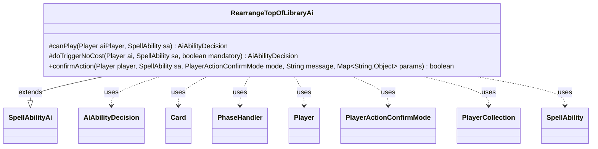

---
aliases:
  - RearrangeTopOfLibraryAi
tags:
  - java/class
  - module/forge-ai
  - pkg/forge/ai/ability
fqn: forge.ai.ability.RearrangeTopOfLibraryAi
package: forge.ai.ability
module: forge-ai
kind: Class
---

# RearrangeTopOfLibraryAi

**Package:** `forge.ai.ability`   **Module:** `forge-ai`   **Kind:** Class



## Relationships
**Extends:**
- [[forge.ai.SpellAbilityAi|SpellAbilityAi]]
**Uses:**
- [[forge.ai.AiAbilityDecision|AiAbilityDecision]]
- [[forge.game.card.Card|Card]]
- [[forge.game.phase.PhaseHandler|PhaseHandler]]
- [[forge.game.player.Player|Player]]
- [[forge.game.player.PlayerActionConfirmMode|PlayerActionConfirmMode]]
- [[forge.game.player.PlayerCollection|PlayerCollection]]
- [[forge.game.spellability.SpellAbility|SpellAbility]]

## Design Description

RearrangeTopOfLibraryAi supplies the AI's decision logic for abilities that let a player rearrange (and optionally shuffle) the top cards of a library, such as scry-like and library-manipulation effects. Extending SpellAbilityAi, it overrides canPlay to gate activation—respecting sorcery-speed and cost restrictions, limiting paid uses to once per turn before the AI's own turn, and selecting a target player (self, opponent, or a coin-flip between them) via PlayerCollection and life comparison—while doTriggerNoCost reuses that judgment and falls back to a mandatory play when required.

Its confirmAction implements the shuffle-or-keep choice using profile-driven heuristics (configurable land counts and uncastable-CMC thresholds) that inspect the revealed top card, mana availability, and lands in play, deciding to shuffle away uncastable or unwanted cards differently for allies versus opponents. The class collaborates with PhaseHandler, Card, and Player but delegates the actual card ordering to PlayerControllerAi, keeping itself focused purely on strategic intent.

## Source
`forge-ai/src/main/java/forge/ai/ability/RearrangeTopOfLibraryAi.java`

```java
package forge.ai.ability;

import forge.ai.*;
import forge.game.ability.AbilityUtils;
import forge.game.card.Card;
import forge.game.card.CardLists;
import forge.game.card.CardPredicates;
import forge.game.phase.PhaseHandler;
import forge.game.phase.PhaseType;
import forge.game.player.Player;
import forge.game.player.PlayerActionConfirmMode;
import forge.game.player.PlayerCollection;
import forge.game.player.PlayerPredicates;
import forge.game.spellability.SpellAbility;
import forge.game.zone.ZoneType;
import forge.util.MyRandom;

import java.util.Map;

public class RearrangeTopOfLibraryAi extends SpellAbilityAi {
    /* (non-Javadoc)
     * @see forge.card.abilityfactory.SpellAiLogic#canPlayAI(forge.game.player.Player, java.util.Map, forge.card.spellability.SpellAbility)
     */
    @Override
    protected AiAbilityDecision canPlay(Player aiPlayer, SpellAbility sa) {
        // Specific details of ordering cards are handled by PlayerControllerAi#orderMoveToZoneList
        final PhaseHandler ph = aiPlayer.getGame().getPhaseHandler();
        final Card source = sa.getHostCard();

        if (!sa.isTrigger()) {
            if (source.isPermanent() && !sa.getRestrictions().isSorcerySpeed()
                    && (sa.getPayCosts().hasTapCost() || sa.getPayCosts().hasManaCost())) {
                // If it has an associated cost, try to only do this before own turn
                if (!(ph.is(PhaseType.END_OF_TURN) && ph.getNextTurn() == aiPlayer)) {
                    return new AiAbilityDecision(0, AiPlayDecision.CantPlayAi);
                }
            }

            // Do it once per turn, generally (may be improved later)
            if (source.getAbilityActivatedThisTurn().getActivators(sa).contains(aiPlayer)) {
                return new AiAbilityDecision(0, AiPlayDecision.CantPlayAi);
            }
        }

        if (sa.usesTargeting()) {
            sa.resetTargets();

            PlayerCollection targetableOpps = aiPlayer.getOpponents().filter(PlayerPredicates.isTargetableBy(sa));
            Player opp = targetableOpps.min(PlayerPredicates.compareByLife());
            final boolean canTgtAI = sa.canTarget(aiPlayer);
            final boolean canTgtHuman = sa.canTarget(opp);

            if (canTgtHuman && canTgtAI) {
                // TODO: maybe some other consideration rather than random?
                Player preferredTarget = MyRandom.percentTrue(50) ? aiPlayer : opp;
                sa.getTargets().add(preferredTarget);
            } else if (canTgtAI) {
                sa.getTargets().add(aiPlayer);
            } else if (canTgtHuman) {
                sa.getTargets().add(opp);
            } else {
                return new AiAbilityDecision(0, AiPlayDecision.CantPlayAi); // could not find a valid target
            }
        }

        return new AiAbilityDecision(100, AiPlayDecision.WillPlay);
    }

    /* (non-Javadoc)
     * @see forge.card.abilityfactory.SpellAiLogic#doTriggerAINoCost(forge.game.player.Player, java.util.Map, forge.card.spellability.SpellAbility, boolean)
     */
    @Override
    protected AiAbilityDecision doTriggerNoCost(Player ai, SpellAbility sa, boolean mandatory) {
        AiAbilityDecision decision = canPlay(ai, sa);
        if (decision.willingToPlay()) {
            return decision;
        }

        if (mandatory) {
            return new AiAbilityDecision(50, AiPlayDecision.MandatoryPlay);
        }

        return decision;
    }

    /* (non-Javadoc)
     * @see forge.card.ability.SpellAbilityAi#confirmAction(forge.game.player.Player, forge.card.spellability.SpellAbility, forge.game.player.PlayerActionConfirmMode, java.lang.String)
     */
    @Override
    public boolean confirmAction(Player player, SpellAbility sa, PlayerActionConfirmMode mode, String message, Map<String, Object> params) {
        // Confirming this action means shuffling the library if asked.

        // First, let's check if we can play the top card of the library
        PlayerCollection pc = sa.usesTargeting() ? new PlayerCollection(sa.getTargets().getTargetPlayers())
                : AbilityUtils.getDefinedPlayers(sa.getHostCard(), sa.getParam("Defined"), sa);

        Player p = pc.getFirst(); // currently always a single target spell
        Card top = p.getCardsIn(ZoneType.Library).isEmpty() ? null : p.getCardsIn(ZoneType.Library).getFirst();
        if (top == null) {
            return false;
        }

        int minLandsToScryLandsAway = AiProfileUtil.getIntProperty(player, AiProps.SCRY_NUM_LANDS_TO_NOT_NEED_MORE);
        int uncastableCMCThreshold = AiProfileUtil.getIntProperty(player, AiProps.SCRY_IMMEDIATELY_UNCASTABLE_CMC_DIFF);

        int landsOTB = CardLists.count(p.getCardsIn(ZoneType.Battlefield), CardPredicates.LANDS_PRODUCING_MANA);
        int cmc = top.isSplitCard() ? Math.min(top.getCMC(Card.SplitCMCMode.LeftSplitCMC), top.getCMC(Card.SplitCMCMode.RightSplitCMC))
                : top.getCMC();
        int maxCastable = ComputerUtilMana.getAvailableManaEstimate(p, false);

        if (!top.isLand() && cmc - maxCastable >= uncastableCMCThreshold) {
            // Can't cast in the foreseeable future. Shuffle if doing it to ourselves or an ally, otherwise keep it
            return !p.isOpponentOf(player);
        } else if (top.isLand() && landsOTB <= minLandsToScryLandsAway) {
            // We don't want to give the opponent a free land if his land count is low
            return p.isOpponentOf(player);
        }

        // Usually we don't want to shuffle if we arranged things carefully
        return false;
    }
}
```

## Python
`forge/ai/ability/RearrangeTopOfLibraryAi.py`

```python
from typing import Map

from forge.ai.AiAbilityDecision import AiAbilityDecision
from forge.ai.AiPlayDecision import AiPlayDecision
from forge.ai.AiProfileUtil import AiProfileUtil
from forge.ai.AiProps import AiProps
from forge.ai.ComputerUtilMana import ComputerUtilMana
from forge.ai.SpellAbilityAi import SpellAbilityAi
from forge.game.ability.AbilityUtils import AbilityUtils
from forge.game.card.Card import Card
from forge.game.card.CardLists import CardLists
from forge.game.card.CardPredicates import CardPredicates
from forge.game.phase.PhaseHandler import PhaseHandler
from forge.game.phase.PhaseType import PhaseType
from forge.game.player.Player import Player
from forge.game.player.PlayerActionConfirmMode import PlayerActionConfirmMode
from forge.game.player.PlayerCollection import PlayerCollection
from forge.game.player.PlayerPredicates import PlayerPredicates
from forge.game.spellability.SpellAbility import SpellAbility
from forge.game.zone.ZoneType import ZoneType
from forge.util.MyRandom import MyRandom


class RearrangeTopOfLibraryAi(SpellAbilityAi):
    # (non-Javadoc)
    # @see forge.card.abilityfactory.SpellAiLogic#canPlayAI(forge.game.player.Player, java.util.Map, forge.card.spellability.SpellAbility)
    def canPlay(self, aiPlayer: Player, sa: SpellAbility) -> AiAbilityDecision:
        # Specific details of ordering cards are handled by PlayerControllerAi#orderMoveToZoneList
        ph = aiPlayer.getGame().getPhaseHandler()
        source = sa.getHostCard()

        if not sa.isTrigger():
            if (source.isPermanent() and not sa.getRestrictions().isSorcerySpeed()
                    and (sa.getPayCosts().hasTapCost() or sa.getPayCosts().hasManaCost())):
                # If it has an associated cost, try to only do this before own turn
                if not (ph.is_(PhaseType.END_OF_TURN) and ph.getNextTurn() == aiPlayer):
                    return AiAbilityDecision(0, AiPlayDecision.CantPlayAi)

            # Do it once per turn, generally (may be improved later)
            if aiPlayer in source.getAbilityActivatedThisTurn().getActivators(sa):
                return AiAbilityDecision(0, AiPlayDecision.CantPlayAi)

        if sa.usesTargeting():
            sa.resetTargets()

            targetableOpps = aiPlayer.getOpponents().filter(PlayerPredicates.isTargetableBy(sa))
            opp = targetableOpps.min(PlayerPredicates.compareByLife())
            canTgtAI = sa.canTarget(aiPlayer)
            canTgtHuman = sa.canTarget(opp)

            if canTgtHuman and canTgtAI:
                # TODO: maybe some other consideration rather than random?
                preferredTarget = aiPlayer if MyRandom.percentTrue(50) else opp
                sa.getTargets().add(preferredTarget)
            elif canTgtAI:
                sa.getTargets().add(aiPlayer)
            elif canTgtHuman:
                sa.getTargets().add(opp)
            else:
                return AiAbilityDecision(0, AiPlayDecision.CantPlayAi)  # could not find a valid target

        return AiAbilityDecision(100, AiPlayDecision.WillPlay)

    # (non-Javadoc)
    # @see forge.card.abilityfactory.SpellAiLogic#doTriggerAINoCost(forge.game.player.Player, java.util.Map, forge.card.spellability.SpellAbility, boolean)
    def doTriggerNoCost(self, ai: Player, sa: SpellAbility, mandatory: bool) -> AiAbilityDecision:
        decision = self.canPlay(ai, sa)
        if decision.willingToPlay():
            return decision

        if mandatory:
            return AiAbilityDecision(50, AiPlayDecision.MandatoryPlay)

        return decision

    # (non-Javadoc)
    # @see forge.card.ability.SpellAbilityAi#confirmAction(forge.game.player.Player, forge.card.spellability.SpellAbility, forge.game.player.PlayerActionConfirmMode, java.lang.String)
    def confirmAction(self, player: Player, sa: SpellAbility, mode: PlayerActionConfirmMode, message: str, params: Map[str, object]) -> bool:
        # Confirming this action means shuffling the library if asked.

        # First, let's check if we can play the top card of the library
        pc = (PlayerCollection(sa.getTargets().getTargetPlayers()) if sa.usesTargeting()
              else AbilityUtils.getDefinedPlayers(sa.getHostCard(), sa.getParam("Defined"), sa))

        p = pc.getFirst()  # currently always a single target spell
        top = None if p.getCardsIn(ZoneType.Library).isEmpty() else p.getCardsIn(ZoneType.Library).getFirst()
        if top is None:
            return False

        minLandsToScryLandsAway = AiProfileUtil.getIntProperty(player, AiProps.SCRY_NUM_LANDS_TO_NOT_NEED_MORE)
        uncastableCMCThreshold = AiProfileUtil.getIntProperty(player, AiProps.SCRY_IMMEDIATELY_UNCASTABLE_CMC_DIFF)

        landsOTB = CardLists.count(p.getCardsIn(ZoneType.Battlefield), CardPredicates.LANDS_PRODUCING_MANA)
        cmc = (min(top.getCMC(Card.SplitCMCMode.LeftSplitCMC), top.getCMC(Card.SplitCMCMode.RightSplitCMC)) if top.isSplitCard()
               else top.getCMC())
        maxCastable = ComputerUtilMana.getAvailableManaEstimate(p, False)

        if not top.isLand() and cmc - maxCastable >= uncastableCMCThreshold:
            # Can't cast in the foreseeable future. Shuffle if doing it to ourselves or an ally, otherwise keep it
            return not p.isOpponentOf(player)
        elif top.isLand() and landsOTB <= minLandsToScryLandsAway:
            # We don't want to give the opponent a free land if his land count is low
            return p.isOpponentOf(player)

        # Usually we don't want to shuffle if we arranged things carefully
        return False
```
