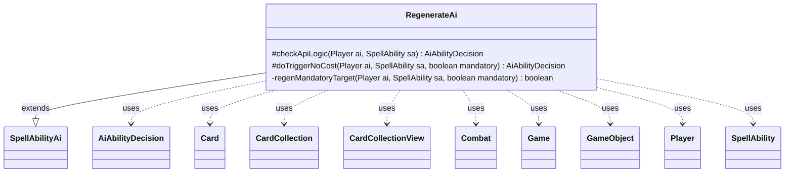

---
aliases:
  - RegenerateAi
tags:
  - java/class
  - module/forge-ai
  - pkg/forge/ai/ability
fqn: forge.ai.ability.RegenerateAi
package: forge.ai.ability
module: forge-ai
kind: Class
---

# RegenerateAi

**Package:** `forge.ai.ability`   **Module:** `forge-ai`   **Kind:** Class



## Relationships
**Extends:**
- [[forge.ai.SpellAbilityAi|SpellAbilityAi]]
**Uses:**
- [[forge.ai.AiAbilityDecision|AiAbilityDecision]]
- [[forge.game.Game|Game]]
- [[forge.game.GameObject|GameObject]]
- [[forge.game.card.Card|Card]]
- [[forge.game.card.CardCollection|CardCollection]]
- [[forge.game.card.CardCollectionView|CardCollectionView]]
- [[forge.game.combat.Combat|Combat]]
- [[forge.game.player.Player|Player]]
- [[forge.game.spellability.SpellAbility|SpellAbility]]

## Design Description

Forge MTG engine, providing the artificial-intelligence decision logic for regeneration-shield effects. Extending `SpellAbilityAi`, it overrides `checkApiLogic` to decide whether the AI should activate or cast a regeneration ability, and `doTriggerNoCost` to resolve mandatory or triggered cases. The core heuristic is purely defensive: it regenerates a creature only when one of the AI's permanents is genuinely at risk—threatened by something on the stack (via `ComputerUtil.predictThreatenedObjects`) or likely to be destroyed during the declare-blockers step (via `ComputerUtilCombat`)—and otherwise declines to avoid wasting the ability.

It collaborates with the game model (`Game`, `Combat`, `Player`, `Card`, `CardCollection`) and the shared `ComputerUtil*` helpers, returning its verdict as an `AiAbilityDecision` carrying a confidence score and an `AiPlayDecision` reason. Notable intent includes targeting the best at-risk creature via `getBestCreatureAI`, skipping creatures that already hold regeneration shields, and seeking slightly more value by trying to save up to two permanents when multiple are defined.

## Source
`forge-ai/src/main/java/forge/ai/ability/RegenerateAi.java`

```java
/*
 * Forge: Play Magic: the Gathering.
 * Copyright (C) 2011  Forge Team
 *
 * This program is free software: you can redistribute it and/or modify
 * it under the terms of the GNU General Public License as published by
 * the Free Software Foundation, either version 3 of the License, or
 * (at your option) any later version.
 * 
 * This program is distributed in the hope that it will be useful,
 * but WITHOUT ANY WARRANTY; without even the implied warranty of
 * MERCHANTABILITY or FITNESS FOR A PARTICULAR PURPOSE.  See the
 * GNU General Public License for more details.
 * 
 * You should have received a copy of the GNU General Public License
 * along with this program.  If not, see <http://www.gnu.org/licenses/>.
 */
package forge.ai.ability;

import forge.ai.*;
import forge.game.Game;
import forge.game.GameObject;
import forge.game.ability.AbilityUtils;
import forge.game.card.*;
import forge.game.combat.Combat;
import forge.game.phase.PhaseType;
import forge.game.player.Player;
import forge.game.spellability.SpellAbility;
import forge.game.zone.ZoneType;

import java.util.ArrayList;
import java.util.List;

/**
 * <p>
 * AbilityFactory_Regenerate class.
 * </p>
 * 
 * @author Forge
 * @version $Id$
 */
public class RegenerateAi extends SpellAbilityAi {

    @Override
    protected AiAbilityDecision checkApiLogic(final Player ai, final SpellAbility sa) {
        final Game game = ai.getGame();
        final Combat combat = game.getCombat();
        final Card hostCard = sa.getHostCard();
        boolean chance = false;

        if (sa.usesTargeting()) {
            sa.resetTargets();
            // filter AIs battlefield by what I can target
            List<Card> targetables = CardLists.getTargetableCards(ai.getCardsIn(ZoneType.Battlefield), sa);

            if (targetables.isEmpty()) {
                return new AiAbilityDecision(0, AiPlayDecision.TargetingFailed);
            }

            if (!game.getStack().isEmpty()) {
                // check stack for something on the stack will kill anything i control
                final List<GameObject> objects = ComputerUtil.predictThreatenedObjects(sa.getActivatingPlayer(), sa, true);

                final List<Card> threatenedTargets = new ArrayList<>();

                for (final Card c : targetables) {
                    if (objects.contains(c) && !ComputerUtil.canRegenerate(ai, c)) {
                        threatenedTargets.add(c);
                    }
                }

                if (!threatenedTargets.isEmpty()) {
                    // Choose "best" of the remaining to regenerate
                    sa.getTargets().add(ComputerUtilCard.getBestCreatureAI(threatenedTargets));
                    chance = true;
                }
            } else if (game.getPhaseHandler().is(PhaseType.COMBAT_DECLARE_BLOCKERS)) {
                final CardCollection combatants = CardLists.filter(targetables, CardPredicates.CREATURES);
                ComputerUtilCard.sortByEvaluateCreature(combatants);

                for (final Card c : combatants) {
                    if (c.getShieldCount() == 0 && ComputerUtilCombat.combatantWouldBeDestroyed(ai, c, combat)) {
                        sa.getTargets().add(c);
                        chance = true;
                        break;
                    }
                }
            }
            if (sa.getTargets().isEmpty()) {
                return new AiAbilityDecision(0, AiPlayDecision.TargetingFailed);
            }
        } else {
            final List<Card> list = AbilityUtils.getDefinedCards(hostCard, sa.getParam("Defined"), sa);
            if (list.isEmpty()) {
                return new AiAbilityDecision(0, AiPlayDecision.MissingNeededCards);
            }
            // when regenerating more than one is possible try for slightly more value
            int numToSave = Math.min(2, list.size());
            int saved = 0;

            if (game.getPhaseHandler().is(PhaseType.COMBAT_DECLARE_BLOCKERS)) {
                for (final Card c : list) {
                    if (c.getShieldCount() == 0 && ComputerUtil.predictCreatureWillDieThisTurn(ai, c, sa)) {
                        saved++;
                    }
                    if (saved == numToSave) {
                        break;
                    }
                }
            } else {
                final List<GameObject> objects = ComputerUtil.predictThreatenedObjects(sa.getActivatingPlayer(), sa, true);
                objects.retainAll(list);
                saved = objects.size();
            }
            // if nothing on the stack, and it's not declare blockers no need to regen
            chance = saved >= numToSave;
        }

        if (chance) {
            return new AiAbilityDecision(100, AiPlayDecision.WillPlay);
        }

        return new AiAbilityDecision(0, AiPlayDecision.CantPlayAi);
    }

    @Override
    protected AiAbilityDecision doTriggerNoCost(Player ai, SpellAbility sa, boolean mandatory) {
        boolean chance;
        if (sa.usesTargeting()) {
            chance = regenMandatoryTarget(ai, sa, mandatory);
        } else {
            // If there's no target on the trigger, just say yes.
            chance = true;
        }
        return chance ? new AiAbilityDecision(100, AiPlayDecision.WillPlay) : new AiAbilityDecision(0, AiPlayDecision.CantPlayAi);
    }

    private static boolean regenMandatoryTarget(final Player ai, final SpellAbility sa, final boolean mandatory) {
        final Game game = ai.getGame();
        sa.resetTargets();
        // filter AIs battlefield by what I can target
        CardCollectionView targetables = CardLists.getTargetableCards(game.getCardsIn(ZoneType.Battlefield), sa);
        final List<Card> compTargetables = CardLists.filterControlledBy(targetables, ai);

        if (targetables.isEmpty()) {
            return false;
        }

        if (!mandatory && compTargetables.isEmpty()) {
            return false;
        }

        if (compTargetables.size() > 0) {
            final CardCollection combatants = CardLists.filter(compTargetables, CardPredicates.CREATURES);
            ComputerUtilCard.sortByEvaluateCreature(combatants);
            if (game.getPhaseHandler().is(PhaseType.COMBAT_DECLARE_BLOCKERS)) {
                Combat combat = game.getCombat();
                for (final Card c : combatants) {
                    if (c.getShieldCount() == 0 && ComputerUtilCombat.combatantWouldBeDestroyed(ai, c, combat)) {
                        sa.getTargets().add(c);
                        return true;
                    }
                }
            }

            // TODO see if something on the stack is about to kill something i can target

            // choose my best X without regen
            if (CardLists.getNotType(compTargetables, "Creature").isEmpty()) {
                for (final Card c : combatants) {
                    if (c.getShieldCount() == 0) {
                        sa.getTargets().add(c);
                        return true;
                    }
                }
                sa.getTargets().add(combatants.get(0));
                return true;
            } else {
                CardLists.sortByCmcDesc(compTargetables);
                for (final Card c : compTargetables) {
                    if (c.getShieldCount() == 0) {
                        sa.getTargets().add(c);
                        return true;
                    }
                }
                sa.getTargets().add(compTargetables.get(0));
                return true;
            }
        }

        sa.getTargets().add(ComputerUtilCard.getCheapestPermanentAI(targetables, sa, false));
        return true;
    }

}
```

## Python
`forge/ai/ability/RegenerateAi.py`

```python
from forge.ai.SpellAbilityAi import SpellAbilityAi
from forge.ai.AiAbilityDecision import AiAbilityDecision
from forge.ai.AiPlayDecision import AiPlayDecision
from forge.ai.ComputerUtil import ComputerUtil
from forge.ai.ComputerUtilCard import ComputerUtilCard
from forge.ai.ComputerUtilCombat import ComputerUtilCombat
from forge.game.Game import Game
from forge.game.GameObject import GameObject
from forge.game.ability.AbilityUtils import AbilityUtils
from forge.game.card.Card import Card
from forge.game.card.CardCollection import CardCollection
from forge.game.card.CardCollectionView import CardCollectionView
from forge.game.card.CardLists import CardLists
from forge.game.card.CardPredicates import CardPredicates
from forge.game.combat.Combat import Combat
from forge.game.phase.PhaseType import PhaseType
from forge.game.player.Player import Player
from forge.game.spellability.SpellAbility import SpellAbility
from forge.game.zone.ZoneType import ZoneType


class RegenerateAi(SpellAbilityAi):

    def checkApiLogic(self, ai: Player, sa: SpellAbility) -> AiAbilityDecision:
        game = ai.getGame()
        combat = game.getCombat()
        hostCard = sa.getHostCard()
        chance = False

        if sa.usesTargeting():
            sa.resetTargets()
            # filter AIs battlefield by what I can target
            targetables = CardLists.getTargetableCards(ai.getCardsIn(ZoneType.Battlefield), sa)

            if not targetables:
                return AiAbilityDecision(0, AiPlayDecision.TargetingFailed)

            if not game.getStack().isEmpty():
                # check stack for something on the stack will kill anything i control
                objects = ComputerUtil.predictThreatenedObjects(sa.getActivatingPlayer(), sa, True)

                threatenedTargets = []

                for c in targetables:
                    if c in objects and not ComputerUtil.canRegenerate(ai, c):
                        threatenedTargets.append(c)

                if threatenedTargets:
                    # Choose "best" of the remaining to regenerate
                    sa.getTargets().add(ComputerUtilCard.getBestCreatureAI(threatenedTargets))
                    chance = True
            elif game.getPhaseHandler().is_(PhaseType.COMBAT_DECLARE_BLOCKERS):
                combatants = CardLists.filter(targetables, CardPredicates.CREATURES)
                ComputerUtilCard.sortByEvaluateCreature(combatants)

                for c in combatants:
                    if c.getShieldCount() == 0 and ComputerUtilCombat.combatantWouldBeDestroyed(ai, c, combat):
                        sa.getTargets().add(c)
                        chance = True
                        break
            if sa.getTargets().isEmpty():
                return AiAbilityDecision(0, AiPlayDecision.TargetingFailed)
        else:
            list = AbilityUtils.getDefinedCards(hostCard, sa.getParam("Defined"), sa)
            if not list:
                return AiAbilityDecision(0, AiPlayDecision.MissingNeededCards)
            # when regenerating more than one is possible try for slightly more value
            numToSave = min(2, len(list))
            saved = 0

            if game.getPhaseHandler().is_(PhaseType.COMBAT_DECLARE_BLOCKERS):
                for c in list:
                    if c.getShieldCount() == 0 and ComputerUtil.predictCreatureWillDieThisTurn(ai, c, sa):
                        saved += 1
                    if saved == numToSave:
                        break
            else:
                objects = ComputerUtil.predictThreatenedObjects(sa.getActivatingPlayer(), sa, True)
                objects.retainAll(list)
                saved = objects.size()
            # if nothing on the stack, and it's not declare blockers no need to regen
            chance = saved >= numToSave

        if chance:
            return AiAbilityDecision(100, AiPlayDecision.WillPlay)

        return AiAbilityDecision(0, AiPlayDecision.CantPlayAi)

    def doTriggerNoCost(self, ai: Player, sa: SpellAbility, mandatory: bool) -> AiAbilityDecision:
        if sa.usesTargeting():
            chance = RegenerateAi.regenMandatoryTarget(ai, sa, mandatory)
        else:
            # If there's no target on the trigger, just say yes.
            chance = True
        return AiAbilityDecision(100, AiPlayDecision.WillPlay) if chance else AiAbilityDecision(0, AiPlayDecision.CantPlayAi)

    @staticmethod
    def regenMandatoryTarget(ai: Player, sa: SpellAbility, mandatory: bool) -> bool:
        game = ai.getGame()
        sa.resetTargets()
        # filter AIs battlefield by what I can target
        targetables = CardLists.getTargetableCards(game.getCardsIn(ZoneType.Battlefield), sa)
        compTargetables = CardLists.filterControlledBy(targetables, ai)

        if targetables.isEmpty():
            return False

        if not mandatory and compTargetables.isEmpty():
            return False

        if compTargetables.size() > 0:
            combatants = CardLists.filter(compTargetables, CardPredicates.CREATURES)
            ComputerUtilCard.sortByEvaluateCreature(combatants)
            if game.getPhaseHandler().is_(PhaseType.COMBAT_DECLARE_BLOCKERS):
                combat = game.getCombat()
                for c in combatants:
                    if c.getShieldCount() == 0 and ComputerUtilCombat.combatantWouldBeDestroyed(ai, c, combat):
                        sa.getTargets().add(c)
                        return True

            # TODO see if something on the stack is about to kill something i can target

            # choose my best X without regen
            if CardLists.getNotType(compTargetables, "Creature").isEmpty():
                for c in combatants:
                    if c.getShieldCount() == 0:
                        sa.getTargets().add(c)
                        return True
                sa.getTargets().add(combatants.get(0))
                return True
            else:
                CardLists.sortByCmcDesc(compTargetables)
                for c in compTargetables:
                    if c.getShieldCount() == 0:
                        sa.getTargets().add(c)
                        return True
                sa.getTargets().add(compTargetables.get(0))
                return True

        sa.getTargets().add(ComputerUtilCard.getCheapestPermanentAI(targetables, sa, False))
        return True
```
