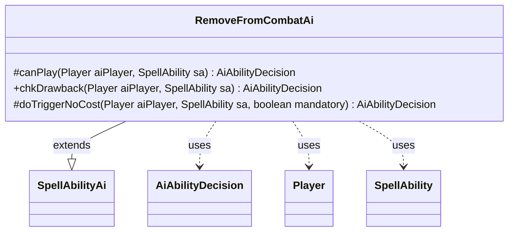

---
aliases:
  - RemoveFromCombatAi
tags:
  - java/class
  - module/forge-ai
  - pkg/forge/ai/ability
fqn: forge.ai.ability.RemoveFromCombatAi
package: forge.ai.ability
module: forge-ai
kind: Class
---

# RemoveFromCombatAi

**Package:** `forge.ai.ability` &nbsp; **Module:** `forge-ai` &nbsp; **Kind:** Class



## Relationships
**Extends:**
- [[forge.ai.SpellAbilityAi|SpellAbilityAi]]
**Uses:**
- [[forge.ai.AiAbilityDecision|AiAbilityDecision]]
- [[forge.game.player.Player|Player]]
- [[forge.game.spellability.SpellAbility|SpellAbility]]

## Design Description

RemoveFromCombatAi supplies the AI decision logic for the RemoveFromCombat spell ability, determining whether and how the computer player should employ effects that pull creatures out of combat. As a concrete subclass of `SpellAbilityAi`, it overrides the framework's evaluation hooks—`canPlay`, `chkDrawback`, and `doTriggerNoCost`—each returning an `AiAbilityDecision` that pairs a confidence score with an `AiPlayDecision` verdict, evaluated against a given `Player` and `SpellAbility`.

The implementation is largely a deliberate stub: `canPlay` is hard-disabled (reserved for Gideon Jura), and the trigger path is unimplemented pending future work. The one active branch handles the `RemoveBestAttacker` AILogic parameter as a drawback, committing to play. This reflects a data-driven design where card-specific behavior is selected via string parameters on the SpellAbility rather than dedicated subclasses, with conservative defaults that decline to act until proper heuristics are written.

## Source
`forge-ai/src/main/java/forge/ai/ability/RemoveFromCombatAi.java`

```java
package forge.ai.ability;

import forge.ai.AiAbilityDecision;
import forge.ai.AiPlayDecision;
import forge.ai.SpellAbilityAi;
import forge.game.player.Player;
import forge.game.spellability.SpellAbility;

public class RemoveFromCombatAi extends SpellAbilityAi {

    @Override
    protected AiAbilityDecision canPlay(Player aiPlayer, SpellAbility sa) {
        // disabled for the AI for now. Only for Gideon Jura at this time.
        return new AiAbilityDecision(0, AiPlayDecision.CantPlayAi);
    }

    @Override
    public AiAbilityDecision chkDrawback(Player aiPlayer, SpellAbility sa) {
        if ("RemoveBestAttacker".equals(sa.getParam("AILogic"))) {
            return new AiAbilityDecision(100, AiPlayDecision.WillPlay);
        }

        // TODO - implement AI
        return new AiAbilityDecision(0, AiPlayDecision.CantPlayAi);
    }

    /* (non-Javadoc)
     * @see forge.card.abilityfactory.SpellAiLogic#doTriggerAINoCost(forge.game.player.Player, java.util.Map, forge.card.spellability.SpellAbility, boolean)
     */
    @Override
    protected AiAbilityDecision doTriggerNoCost(Player aiPlayer, SpellAbility sa, boolean mandatory) {
        boolean chance;

        // TODO - implement AI
        chance = false;

        return chance ? new AiAbilityDecision(100, AiPlayDecision.WillPlay) : new AiAbilityDecision(0, AiPlayDecision.CantPlayAi);
    }
}
```
