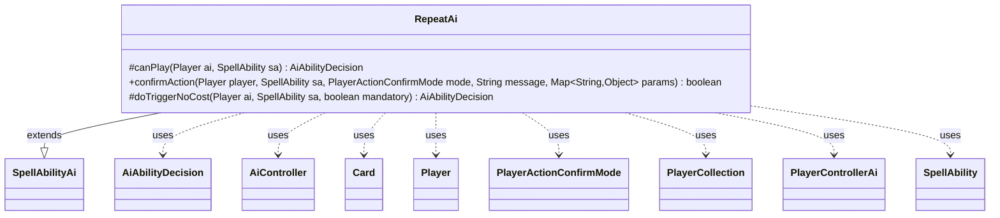

---
aliases:
  - RepeatAi
tags:
  - java/class
  - module/forge-ai
  - pkg/forge/ai/ability
fqn: forge.ai.ability.RepeatAi
package: forge.ai.ability
module: forge-ai
kind: Class
---

# RepeatAi

**Package:** `forge.ai.ability` &nbsp; **Module:** `forge-ai` &nbsp; **Kind:** Class



## Relationships
**Extends:**
- [[forge.ai.SpellAbilityAi|SpellAbilityAi]]
**Uses:**
- [[forge.ai.AiAbilityDecision|AiAbilityDecision]]
- [[forge.ai.AiController|AiController]]
- [[forge.ai.PlayerControllerAi|PlayerControllerAi]]
- [[forge.game.card.Card|Card]]
- [[forge.game.player.Player|Player]]
- [[forge.game.player.PlayerActionConfirmMode|PlayerActionConfirmMode]]
- [[forge.game.player.PlayerCollection|PlayerCollection]]
- [[forge.game.spellability.SpellAbility|SpellAbility]]

## Design Description

RepeatAi is the AI decision-maker for "Repeat" spell abilities, extending SpellAbilityAi to plug into Forge's ability-resolution framework. It overrides canPlay to evaluate whether the AI should cast the ability—handling targeting of a preferred opponent and special "MaxX"/"MaxXAtOppEOT" logic that maximizes the X cost, optionally deferring until the opponent's end of turn—and returns its verdict as an AiAbilityDecision carrying both a score and an AiPlayDecision rationale.

Its core responsibility lives in doTriggerNoCost, which configures the repeated sub-ability: it selects targets per the AILogic parameter (e.g., copying the AI's best creature, or targeting the lowest-life opponent), retrieves the nested "RepeatSubAbility", and delegates evaluation to the AiController obtained through PlayerControllerAi. confirmAction is deliberately stubbed to decline, reflecting an acknowledged gap (per the TODO) where smarter choice logic is still needed.

## Source
`forge-ai/src/main/java/forge/ai/ability/RepeatAi.java`

```java
package forge.ai.ability;


import forge.ai.*;
import forge.game.card.Card;
import forge.game.card.CardPredicates;
import forge.game.phase.PhaseType;
import forge.game.player.Player;
import forge.game.player.PlayerActionConfirmMode;
import forge.game.player.PlayerCollection;
import forge.game.player.PlayerPredicates;
import forge.game.spellability.SpellAbility;
import forge.util.IterableUtil;

import java.util.Map;

public class RepeatAi extends SpellAbilityAi {

    @Override
    protected AiAbilityDecision canPlay(Player ai, SpellAbility sa) {
        final Player opp = AiAttackController.choosePreferredDefenderPlayer(ai);
        String logic = sa.getParamOrDefault("AILogic", "");

        if (sa.usesTargeting()) {
            if (!sa.canTarget(opp)) {
                return new AiAbilityDecision(0, AiPlayDecision.CantPlayAi);
            }
            sa.resetTargets();
            sa.getTargets().add(opp);
        }
        if ("MaxX".equals(logic) || "MaxXAtOppEOT".equals(logic)) {
            if ("MaxXAtOppEOT".equals(logic) && !(ai.getGame().getPhaseHandler().is(PhaseType.END_OF_TURN) && ai.getGame().getPhaseHandler().getNextTurn() == ai)) {
                return new AiAbilityDecision(0, AiPlayDecision.CantPlayAi);
            }
            final int max = ComputerUtilCost.setMaxXValue(sa, ai, sa.isTrigger());
            if (max <= 0) {
                return new AiAbilityDecision(0, AiPlayDecision.CantAffordX);
            }
            return new AiAbilityDecision(100, AiPlayDecision.WillPlay);
        }
        return new AiAbilityDecision(100, AiPlayDecision.WillPlay);
    }
    
    @Override
    public boolean confirmAction(Player player, SpellAbility sa, PlayerActionConfirmMode mode, String message, Map<String, Object> params) {
      //TODO add logic to have computer make better choice (ArsenalNut)
        return false;
    }

    @Override
    protected AiAbilityDecision doTriggerNoCost(Player ai, SpellAbility sa, boolean mandatory) {
        String logic = sa.getParamOrDefault("AILogic", "");

        if (sa.usesTargeting()) {
            if (logic.startsWith("CopyBestCreature")) {
                Card best = null;
                Iterable<Card> targetableAi = IterableUtil.filter(ai.getCreaturesInPlay(), CardPredicates.isTargetableBy(sa));
                if (!logic.endsWith("IgnoreLegendary")) {
                    best = ComputerUtilCard.getBestAI(IterableUtil.filter(targetableAi, Card::ignoreLegendRule));
                } else {
                    best = ComputerUtilCard.getBestAI(targetableAi);
                }
                if (best == null && mandatory && sa.canTarget(sa.getHostCard())) {
                    best = sa.getHostCard();
                }
                if (best != null) {
                    sa.resetTargets();
                    sa.getTargets().add(best);
                    return new AiAbilityDecision(100, AiPlayDecision.WillPlay);
                }
                return new AiAbilityDecision(0, AiPlayDecision.CantPlayAi);
            }

            PlayerCollection targetableOpps = ai.getOpponents().filter(PlayerPredicates.isTargetableBy(sa));
            Player opp = targetableOpps.min(PlayerPredicates.compareByLife());
            if (opp != null) {
                sa.resetTargets();
                sa.getTargets().add(opp);
            } else if (!mandatory) {
                return new AiAbilityDecision(0, AiPlayDecision.CantPlayAi);
            }

        }

    	// setup subability to repeat
        final SpellAbility repeat = sa.getAdditionalAbility("RepeatSubAbility");

        if (repeat == null) {
            if (mandatory) {
                return new AiAbilityDecision(50, AiPlayDecision.MandatoryPlay);
            } else {
                return new AiAbilityDecision(0, AiPlayDecision.CantPlayAi);
            }
        }

        AiController aic = ((PlayerControllerAi)ai.getController()).getAi();
        if (aic.doTrigger(repeat, mandatory)) {
            return new AiAbilityDecision(100, AiPlayDecision.WillPlay);
        } else {
            return new AiAbilityDecision(0, AiPlayDecision.CantPlayAi);
        }
    }
}
```
