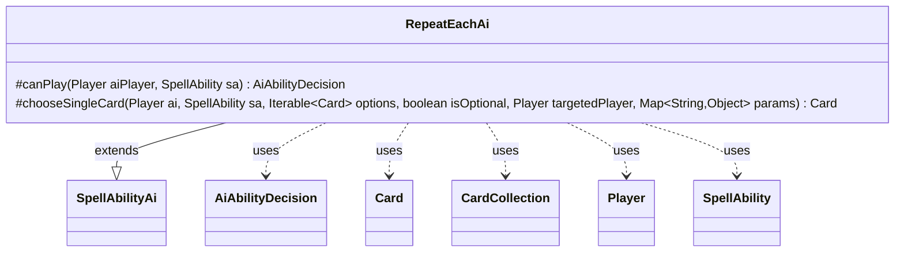

---
aliases:
  - RepeatEachAi
tags:
  - java/class
  - module/forge-ai
  - pkg/forge/ai/ability
fqn: forge.ai.ability.RepeatEachAi
package: forge.ai.ability
module: forge-ai
kind: Class
---

# RepeatEachAi

**Package:** `forge.ai.ability` &nbsp; **Module:** `forge-ai` &nbsp; **Kind:** Class



## Relationships
**Extends:**
- [[forge.ai.SpellAbilityAi|SpellAbilityAi]]
**Uses:**
- [[forge.ai.AiAbilityDecision|AiAbilityDecision]]
- [[forge.game.card.Card|Card]]
- [[forge.game.card.CardCollection|CardCollection]]
- [[forge.game.player.Player|Player]]
- [[forge.game.spellability.SpellAbility|SpellAbility]]

## Design Description

Forge AI's decision handler for the "RepeatEach" spell ability, residing in the `forge.ai.ability` package alongside Forge's other per-ability AI strategy classes. By extending `SpellAbilityAi`, it slots into the engine's ability-AI dispatch framework, overriding `canPlay` to decide whether the computer should cast the ability and `chooseSingleCard` to select a target.

Its defining design intent is the `AILogic` parameter switch in `canPlay`: rather than encoding one fixed heuristic, it branches on named logics (`PriceOfProgress`, `CloneAllTokens`, `BalanceLands`, `EquipAll`, `AllPlayerLoseLife`, `Never`) so individual cards can declare bespoke evaluation rules, delegating to `SpecialCardAi` where needed and defaulting to "will play." It collaborates with `Player`, `Card`/`CardCollection`, and `SpellAbility` to inspect board state, returning `AiAbilityDecision` verdicts, and reuses `ComputerUtilCard.getBestCreatureAI` to pick the strongest creature when a choice is required.

## Source
`forge-ai/src/main/java/forge/ai/ability/RepeatEachAi.java`

```java
package forge.ai.ability;

import forge.ai.*;
import forge.game.ability.AbilityUtils;
import forge.game.card.*;
import forge.game.phase.PhaseType;
import forge.game.player.Player;
import forge.game.spellability.SpellAbility;
import forge.game.zone.ZoneType;
import forge.util.TextUtil;

import java.util.List;
import java.util.Map;


public class RepeatEachAi extends SpellAbilityAi {

    /* (non-Javadoc)
     * @see forge.card.abilityfactory.SpellAiLogic#canPlayAI(forge.game.player.Player, forge.card.spellability.SpellAbility)
     */
    @Override
    protected AiAbilityDecision canPlay(Player aiPlayer, SpellAbility sa) {
        String logic = sa.getParam("AILogic");

        if ("PriceOfProgress".equals(logic)) {
            return SpecialCardAi.PriceOfProgress.consider(aiPlayer, sa);
        } else if ("Never".equals(logic)) {
            return new AiAbilityDecision(0, AiPlayDecision.CantPlayAi);
        } else if ("CloneAllTokens".equals(logic)) {
            List<Card> humTokenCreats = CardLists.filter(aiPlayer.getOpponents().getCreaturesInPlay(), CardPredicates.TOKEN);
            List<Card> compTokenCreats = aiPlayer.getTokensInPlay();

            if (compTokenCreats.size() > humTokenCreats.size()) {
                return new AiAbilityDecision(100, AiPlayDecision.WillPlay);
            } else {
                return new AiAbilityDecision(0, AiPlayDecision.CantPlayAi);
            }
        } else if ("BalanceLands".equals(logic)) {
            if (aiPlayer.getLandsInPlay().size() >= 5) {
                return new AiAbilityDecision(0, AiPlayDecision.CantPlayAi);
            }

            List<Player> opponents = aiPlayer.getOpponents();
            for(Player opp : opponents) {
                if (opp.getLandsInPlay().size() < 4) {
                    return new AiAbilityDecision(0, AiPlayDecision.CantPlayAi);
                }
            }
        } else if ("AllPlayerLoseLife".equals(logic)) {
            final Card source = sa.getHostCard();
            SpellAbility repeat = sa.getAdditionalAbility("RepeatSubAbility");

            String svar = repeat.getSVar(repeat.getParam("LifeAmount"));
            // replace RememberedPlayerCtrl with YouCtrl
            String svarYou = TextUtil.fastReplace(svar, "RememberedPlayer", "You");

            // Currently all Cards with that are affect all player, including AI
            if (aiPlayer.canLoseLife()) {
                int lossYou = AbilityUtils.calculateAmount(source, svarYou, repeat);

                // if playing it would cause AI to lose most life, don't do that
                if (lossYou + 5 > aiPlayer.getLife()) {
                    return new AiAbilityDecision(0, AiPlayDecision.CantPlayAi);
                }
            }

            boolean hitOpp = false;
            // need a copy for source so YouCtrl can be faked
            final Card sourceLKI = CardCopyService.getLKICopy(source);

            // check if any opponent is affected
            for (final Player opp : aiPlayer.getOpponents()) {
                if (opp.canLoseLife()) {
                    sourceLKI.setOwner(opp);
                    int lossOpp = AbilityUtils.calculateAmount(source, svarYou, repeat);
                    if (lossOpp > 0) {
                        hitOpp = true;
                    }
                }
            }

            if (hitOpp) {
                return new AiAbilityDecision(100, AiPlayDecision.WillPlay);
            } else {
                return new AiAbilityDecision(0, AiPlayDecision.CantPlayAi);
            }
        } else if ("EquipAll".equals(logic)) {
            if (aiPlayer.getGame().getPhaseHandler().is(PhaseType.MAIN1, aiPlayer)) {
                final CardCollection unequipped = CardLists.filter(aiPlayer.getCardsIn(ZoneType.Battlefield), card -> card.isEquipment() && card.getAttachedTo() != sa.getHostCard());

                if (!unequipped.isEmpty()) {
                    return new AiAbilityDecision(100, AiPlayDecision.WillPlay);
                } else {
                    return new AiAbilityDecision(0, AiPlayDecision.CantPlayAi);
                }
            }

            return new AiAbilityDecision(0, AiPlayDecision.CantPlayAi);
        }

        // TODO Add some normal AI variability here

        return new AiAbilityDecision(100, AiPlayDecision.WillPlay);
    }

    @Override
    protected Card chooseSingleCard(Player ai, SpellAbility sa, Iterable<Card> options, boolean isOptional, Player targetedPlayer, Map<String, Object> params) {
        return ComputerUtilCard.getBestCreatureAI(options);
    }
}
```

## Python
`forge/ai/ability/RepeatEachAi.py`

```python
from forge.ai.SpellAbilityAi import SpellAbilityAi
from forge.ai.AiAbilityDecision import AiAbilityDecision
from forge.ai.AiPlayDecision import AiPlayDecision
from forge.ai.SpecialCardAi import SpecialCardAi
from forge.ai.ComputerUtilCard import ComputerUtilCard
from forge.game.ability.AbilityUtils import AbilityUtils
from forge.game.card.Card import Card
from forge.game.card.CardLists import CardLists
from forge.game.card.CardPredicates import CardPredicates
from forge.game.card.CardCollection import CardCollection
from forge.game.card.CardCopyService import CardCopyService
from forge.game.phase.PhaseType import PhaseType
from forge.game.player.Player import Player
from forge.game.spellability.SpellAbility import SpellAbility
from forge.game.zone.ZoneType import ZoneType
from forge.util.TextUtil import TextUtil

from typing import Iterable, Map  # noqa
from typing import List, Dict, Any, Optional


class RepeatEachAi(SpellAbilityAi):

    # (non-Javadoc)
    # @see forge.card.abilityfactory.SpellAiLogic#canPlayAI(forge.game.player.Player, forge.card.spellability.SpellAbility)
    def canPlay(self, aiPlayer: Player, sa: SpellAbility) -> AiAbilityDecision:
        logic = sa.getParam("AILogic")

        if "PriceOfProgress" == logic:
            return SpecialCardAi.PriceOfProgress.consider(aiPlayer, sa)
        elif "Never" == logic:
            return AiAbilityDecision(0, AiPlayDecision.CantPlayAi)
        elif "CloneAllTokens" == logic:
            humTokenCreats: List[Card] = CardLists.filter(aiPlayer.getOpponents().getCreaturesInPlay(), CardPredicates.TOKEN)
            compTokenCreats: List[Card] = aiPlayer.getTokensInPlay()

            if len(compTokenCreats) > len(humTokenCreats):
                return AiAbilityDecision(100, AiPlayDecision.WillPlay)
            else:
                return AiAbilityDecision(0, AiPlayDecision.CantPlayAi)
        elif "BalanceLands" == logic:
            if len(aiPlayer.getLandsInPlay()) >= 5:
                return AiAbilityDecision(0, AiPlayDecision.CantPlayAi)

            opponents: List[Player] = aiPlayer.getOpponents()
            for opp in opponents:
                if len(opp.getLandsInPlay()) < 4:
                    return AiAbilityDecision(0, AiPlayDecision.CantPlayAi)
        elif "AllPlayerLoseLife" == logic:
            source: Card = sa.getHostCard()
            repeat: SpellAbility = sa.getAdditionalAbility("RepeatSubAbility")

            svar = repeat.getSVar(repeat.getParam("LifeAmount"))
            # replace RememberedPlayerCtrl with YouCtrl
            svarYou = TextUtil.fastReplace(svar, "RememberedPlayer", "You")

            # Currently all Cards with that are affect all player, including AI
            if aiPlayer.canLoseLife():
                lossYou = AbilityUtils.calculateAmount(source, svarYou, repeat)

                # if playing it would cause AI to lose most life, don't do that
                if lossYou + 5 > aiPlayer.getLife():
                    return AiAbilityDecision(0, AiPlayDecision.CantPlayAi)

            hitOpp = False
            # need a copy for source so YouCtrl can be faked
            sourceLKI: Card = CardCopyService.getLKICopy(source)

            # check if any opponent is affected
            for opp in aiPlayer.getOpponents():
                if opp.canLoseLife():
                    sourceLKI.setOwner(opp)
                    lossOpp = AbilityUtils.calculateAmount(source, svarYou, repeat)
                    if lossOpp > 0:
                        hitOpp = True

            if hitOpp:
                return AiAbilityDecision(100, AiPlayDecision.WillPlay)
            else:
                return AiAbilityDecision(0, AiPlayDecision.CantPlayAi)
        elif "EquipAll" == logic:
            if aiPlayer.getGame().getPhaseHandler().is_(PhaseType.MAIN1, aiPlayer):
                unequipped: CardCollection = CardLists.filter(aiPlayer.getCardsIn(ZoneType.Battlefield), lambda card: card.isEquipment() and card.getAttachedTo() != sa.getHostCard())

                if not unequipped.isEmpty():
                    return AiAbilityDecision(100, AiPlayDecision.WillPlay)
                else:
                    return AiAbilityDecision(0, AiPlayDecision.CantPlayAi)

            return AiAbilityDecision(0, AiPlayDecision.CantPlayAi)

        # TODO Add some normal AI variability here

        return AiAbilityDecision(100, AiPlayDecision.WillPlay)

    def chooseSingleCard(self, ai: Player, sa: SpellAbility, options: Iterable[Card], isOptional: bool, targetedPlayer: Player, params: Dict[str, Any]) -> Card:
        return ComputerUtilCard.getBestCreatureAI(options)
```
