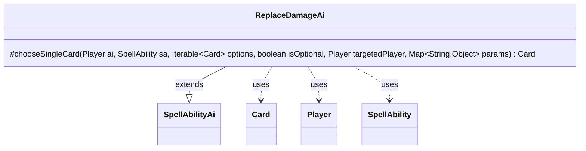

---
aliases:
  - ReplaceDamageAi
tags:
  - java/class
  - module/forge-ai
  - pkg/forge/ai/ability
fqn: forge.ai.ability.ReplaceDamageAi
package: forge.ai.ability
module: forge-ai
kind: Class
---

# ReplaceDamageAi

**Package:** `forge.ai.ability`   **Module:** `forge-ai`   **Kind:** Class



## Relationships
**Extends:**
- [[forge.ai.SpellAbilityAi|SpellAbilityAi]]
**Uses:**
- [[forge.game.card.Card|Card]]
- [[forge.game.player.Player|Player]]
- [[forge.game.spellability.SpellAbility|SpellAbility]]

## Design Description

ReplaceDamageAi supplies the computer-player decision logic for a damage-replacement ability, determining which card the AI should choose when a replacement effect (such as redirecting or preventing damage) offers a set of candidate targets. As a concrete subclass of SpellAbilityAi, it overrides only `chooseSingleCard`, plugging into the engine's generic ability-resolution framework while delegating all other AI behavior to the base class.

Its design intent is a prioritized heuristic: it scans the candidate Cards and immediately returns the first that matches a high-value protection criterion—cards that must be blocked, infect creatures, the commander, or lifelink sources—falling back to `ComputerUtilCard.getBestAI` when none qualify. It collaborates with Card and Player to inspect keywords and SVars, and reads SpellAbility for context. The embedded TODOs (shield counting, counter placement) mark the heuristic as deliberately approximate and open to refinement.

## Source
`forge-ai/src/main/java/forge/ai/ability/ReplaceDamageAi.java`

```java
package forge.ai.ability;

import forge.ai.ComputerUtilCard;
import forge.ai.SpellAbilityAi;
import forge.game.card.Card;
import forge.game.keyword.Keyword;
import forge.game.player.Player;
import forge.game.spellability.SpellAbility;

import java.util.Map;

public class ReplaceDamageAi extends SpellAbilityAi {

    @Override
    protected Card chooseSingleCard(Player ai, SpellAbility sa, Iterable<Card> options, boolean isOptional, Player targetedPlayer, Map<String, Object> params) {
        for (Card c : options) {
            // TODO check if enough shields to prevent trigger
            if (c.hasSVar("MustBeBlocked")) {
                return c;
            }
            // TODO check if target can receive counters + sort these to the front if that can prevent loss
            if (c.hasKeyword(Keyword.INFECT)) {
                return c;
            }
            if (c.isCommander()) {
                return c;
            }
            if (c.hasKeyword(Keyword.LIFELINK) || c.hasSVar("LikeLifeLink")) {
                return c;
            }
        }
        return ComputerUtilCard.getBestAI(options);
    }
}
```

## Python
`forge/ai/ability/ReplaceDamageAi.py`

```python
from forge.ai.ComputerUtilCard import ComputerUtilCard
from forge.ai.SpellAbilityAi import SpellAbilityAi
from forge.game.card.Card import Card
from forge.game.keyword.Keyword import Keyword
from forge.game.player.Player import Player
from forge.game.spellability.SpellAbility import SpellAbility


class ReplaceDamageAi(SpellAbilityAi):

    def chooseSingleCard(self, ai: Player, sa: SpellAbility, options, isOptional: bool, targetedPlayer: Player, params: dict) -> Card:
        for c in options:
            # TODO check if enough shields to prevent trigger
            if c.hasSVar("MustBeBlocked"):
                return c
            # TODO check if target can receive counters + sort these to the front if that can prevent loss
            if c.hasKeyword(Keyword.INFECT):
                return c
            if c.isCommander():
                return c
            if c.hasKeyword(Keyword.LIFELINK) or c.hasSVar("LikeLifeLink"):
                return c
        return ComputerUtilCard.getBestAI(options)
```
