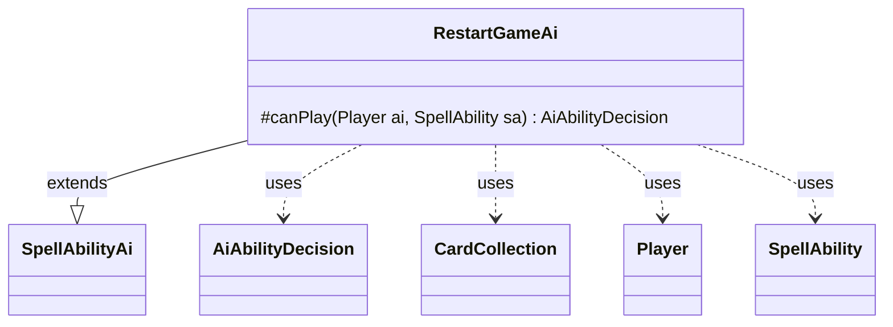

---
aliases:
  - RestartGameAi
tags:
  - java/class
  - module/forge-ai
  - pkg/forge/ai/ability
fqn: forge.ai.ability.RestartGameAi
package: forge.ai.ability
module: forge-ai
kind: Class
---

# RestartGameAi

**Package:** `forge.ai.ability` &nbsp; **Module:** `forge-ai` &nbsp; **Kind:** Class



## Relationships
**Extends:**
- [[forge.ai.SpellAbilityAi|SpellAbilityAi]]
**Uses:**
- [[forge.ai.AiAbilityDecision|AiAbilityDecision]]
- [[forge.game.card.CardCollection|CardCollection]]
- [[forge.game.player.Player|Player]]
- [[forge.game.spellability.SpellAbility|SpellAbility]]

## Design Description

RestartGameAi supplies the AI decision logic for the RestartGame spell ability, extending the abstract `SpellAbilityAi` base class and overriding `canPlay` to return an `AiAbilityDecision`. Its responsibility is narrow: judge whether the computer should cast a game-restarting effect. It collaborates with the engine's `Player`, `SpellAbility`, and `CardCollection` types, and leans on the `ComputerUtil`/`ComputerUtilCard` helper utilities to evaluate game state.

The design intent is opportunistic and self-serving: the AI commits fully (a weight of 100 with `WillPlay`) only when restarting is advantageous — either as an escape when its life is in danger, or as a near-guaranteed win when the exiled, remembered non-Aura permanents it would reclaim evaluate above a threshold. Otherwise it declines with `CantPlayAi`, reflecting a conservative default that avoids restarting without clear benefit.

## Source
`forge-ai/src/main/java/forge/ai/ability/RestartGameAi.java`

```java
package forge.ai.ability;

import forge.ai.*;
import forge.game.card.CardCollection;
import forge.game.card.CardLists;
import forge.game.player.Player;
import forge.game.spellability.SpellAbility;
import forge.game.zone.ZoneType;

public class RestartGameAi extends SpellAbilityAi {

    /*
     * (non-Javadoc)
     * 
     * @see
     * forge.card.abilityfactory.AbilityFactoryAlterLife.SpellAiLogic#canPlayAI
     * (forge.game.player.Player, java.util.Map,
     * forge.card.spellability.SpellAbility)
     */
    @Override
    protected AiAbilityDecision canPlay(Player ai, SpellAbility sa) {
        if (ComputerUtil.aiLifeInDanger(ai, true, 0)) {
            return new AiAbilityDecision(100, AiPlayDecision.WillPlay);
        }

        // check if enough good permanents will be available to be returned, so AI can "autowin"
        CardCollection exiled = CardLists.getValidCards(ai.getGame().getCardsIn(ZoneType.Exile), "Permanent.nonAura+IsRemembered", ai, sa.getHostCard(), sa);
        if (ComputerUtilCard.evaluatePermanentList(exiled) > 20) {
            return new AiAbilityDecision(100, AiPlayDecision.WillPlay);
        }

        return new AiAbilityDecision(0, AiPlayDecision.CantPlayAi);
    }

}
```
