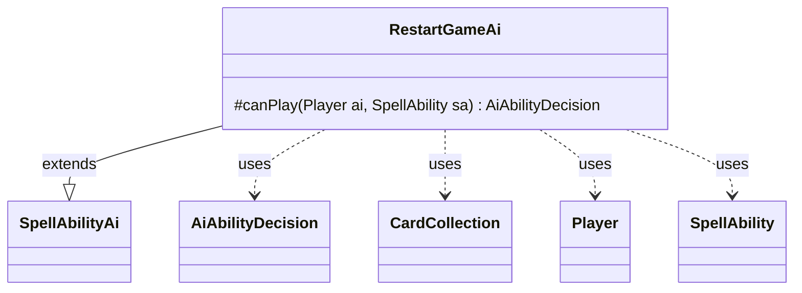

---
aliases:
  - RestartGameAi
tags:
  - java/class
  - module/forge-ai
  - pkg/forge/ai/ability
fqn: forge.ai.ability.RestartGameAi
package: forge.ai.ability
module: forge-ai
kind: Class
---

# RestartGameAi

**Package:** `forge.ai.ability`   **Module:** `forge-ai`   **Kind:** Class



## Relationships
**Extends:**
- [[forge.ai.SpellAbilityAi|SpellAbilityAi]]
**Uses:**
- [[forge.ai.AiAbilityDecision|AiAbilityDecision]]
- [[forge.game.card.CardCollection|CardCollection]]
- [[forge.game.player.Player|Player]]
- [[forge.game.spellability.SpellAbility|SpellAbility]]

## Design Description

RestartGameAi supplies the AI decision logic for the RestartGame spell ability, extending the abstract `SpellAbilityAi` base class and overriding `canPlay` to return an `AiAbilityDecision`. Its responsibility is narrow: judge whether the computer should cast a game-restarting effect. It collaborates with the engine's `Player`, `SpellAbility`, and `CardCollection` types, and leans on the `ComputerUtil`/`ComputerUtilCard` helper utilities to evaluate game state.

The design intent is opportunistic and self-serving: the AI commits fully (a weight of 100 with `WillPlay`) only when restarting is advantageous — either as an escape when its life is in danger, or as a near-guaranteed win when the exiled, remembered non-Aura permanents it would reclaim evaluate above a threshold. Otherwise it declines with `CantPlayAi`, reflecting a conservative default that avoids restarting without clear benefit.

## Source
`forge-ai/src/main/java/forge/ai/ability/RestartGameAi.java`

```java
package forge.ai.ability;

import forge.ai.*;
import forge.game.card.CardCollection;
import forge.game.card.CardLists;
import forge.game.player.Player;
import forge.game.spellability.SpellAbility;
import forge.game.zone.ZoneType;

public class RestartGameAi extends SpellAbilityAi {

    /*
     * (non-Javadoc)
     * 
     * @see
     * forge.card.abilityfactory.AbilityFactoryAlterLife.SpellAiLogic#canPlayAI
     * (forge.game.player.Player, java.util.Map,
     * forge.card.spellability.SpellAbility)
     */
    @Override
    protected AiAbilityDecision canPlay(Player ai, SpellAbility sa) {
        if (ComputerUtil.aiLifeInDanger(ai, true, 0)) {
            return new AiAbilityDecision(100, AiPlayDecision.WillPlay);
        }

        // check if enough good permanents will be available to be returned, so AI can "autowin"
        CardCollection exiled = CardLists.getValidCards(ai.getGame().getCardsIn(ZoneType.Exile), "Permanent.nonAura+IsRemembered", ai, sa.getHostCard(), sa);
        if (ComputerUtilCard.evaluatePermanentList(exiled) > 20) {
            return new AiAbilityDecision(100, AiPlayDecision.WillPlay);
        }

        return new AiAbilityDecision(0, AiPlayDecision.CantPlayAi);
    }

}
```

## Python
`forge/ai/ability/RestartGameAi.py`

```python
package forge.ai.ability is the package; fqn is forge.ai.ability.RestartGameAi.

Let me write the Python port.

The Java uses `forge.ai.*` wildcard. Relationships list specific symbols: AiAbilityDecision (forge.ai). Also used: ComputerUtil, ComputerUtilCard, AiPlayDecision, SpellAbilityAi ΓÇö all in forge.ai. But Relationships only lists AiAbilityDecision under Uses, plus SpellAbilityAi under Extends. However the code also uses ComputerUtil, ComputerUtilCard, AiPlayDecision, CardLists, ZoneType.

The rule says: for wildcard imports, import specific symbols actually used; their FQNs are listed in Relationships section. But Relationships only lists some. The code uses ComputerUtil, ComputerUtilCard, AiPlayDecision from forge.ai. I should import those too since they're actually used. Their FQN would be forge.ai.ComputerUtil etc.

Also non-wildcard imports: CardCollection (forge.game.card), CardLists (forge.game.card), Player (forge.game.player), SpellAbility (forge.game.spellability), ZoneType (forge.game.zone).

Let me produce imports for all used types.from forge.ai.SpellAbilityAi import SpellAbilityAi
from forge.ai.AiAbilityDecision import AiAbilityDecision
from forge.ai.AiPlayDecision import AiPlayDecision
from forge.ai.ComputerUtil import ComputerUtil
from forge.ai.ComputerUtilCard import ComputerUtilCard
from forge.game.card.CardCollection import CardCollection
from forge.game.card.CardLists import CardLists
from forge.game.player.Player import Player
from forge.game.spellability.SpellAbility import SpellAbility
from forge.game.zone.ZoneType import ZoneType


class RestartGameAi(SpellAbilityAi):

    """
     * (non-Javadoc)
     *
     * @see
     * forge.card.abilityfactory.AbilityFactoryAlterLife.SpellAiLogic#canPlayAI
     * (forge.game.player.Player, java.util.Map,
     * forge.card.spellability.SpellAbility)
    """
    def canPlay(self, ai: Player, sa: SpellAbility) -> AiAbilityDecision:
        if ComputerUtil.aiLifeInDanger(ai, True, 0):
            return AiAbilityDecision(100, AiPlayDecision.WillPlay)

        # check if enough good permanents will be available to be returned, so AI can "autowin"
        exiled: CardCollection = CardLists.getValidCards(ai.getGame().getCardsIn(ZoneType.Exile), "Permanent.nonAura+IsRemembered", ai, sa.getHostCard(), sa)
        if ComputerUtilCard.evaluatePermanentList(exiled) > 20:
            return AiAbilityDecision(100, AiPlayDecision.WillPlay)

        return AiAbilityDecision(0, AiPlayDecision.CantPlayAi)
```
