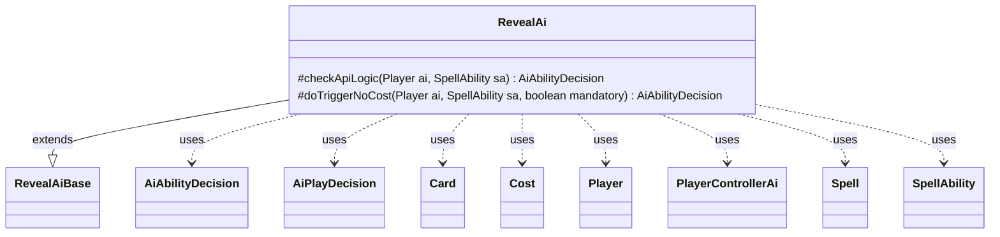

---
aliases:
  - RevealAi
tags:
  - java/class
  - module/forge-ai
  - pkg/forge/ai/ability
fqn: forge.ai.ability.RevealAi
package: forge.ai.ability
module: forge-ai
kind: Class
---

# RevealAi

**Package:** `forge.ai.ability` &nbsp; **Module:** `forge-ai` &nbsp; **Kind:** Class



## Relationships
**Extends:**
- [[forge.ai.ability.RevealAiBase|RevealAiBase]]
**Uses:**
- [[forge.ai.AiAbilityDecision|AiAbilityDecision]]
- [[forge.ai.AiPlayDecision|AiPlayDecision]]
- [[forge.ai.PlayerControllerAi|PlayerControllerAi]]
- [[forge.game.card.Card|Card]]
- [[forge.game.cost.Cost|Cost]]
- [[forge.game.player.Player|Player]]
- [[forge.game.spellability.Spell|Spell]]
- [[forge.game.spellability.SpellAbility|SpellAbility]]

## Design Description

RevealAi is a forge-ai ability handler that supplies the computer player's reasoning for "reveal" spell abilities, deciding whether and how strongly the AI should play or trigger them. Extending RevealAiBase, it overrides `checkApiLogic` to gate play on a successful hand-reveal target check and to favor reusable effects, otherwise deferring to the base implementation. Its `doTriggerNoCost` override encodes card-specific intent: it evaluates Miracle-cost spells and the Kefnet AILogic by copying each basic Spell, applying timing restrictions and an adjusted cost, and querying PlayerControllerAi's evaluator to confirm the card is worth casting. Decisions are returned as AiAbilityDecision pairs of a numeric weight and an AiPlayDecision enum, collaborating with Card, Cost, Player, and SpellAbility to model these conditional, special-case evaluations within Forge's broader AI decision framework.

## Source
`forge-ai/src/main/java/forge/ai/ability/RevealAi.java`

```java
package forge.ai.ability;

import com.google.common.collect.Iterables;
import forge.ai.AiAbilityDecision;
import forge.ai.AiPlayDecision;
import forge.ai.PlayerControllerAi;
import forge.game.ability.AbilityUtils;
import forge.game.card.Card;
import forge.game.cost.Cost;
import forge.game.player.Player;
import forge.game.spellability.Spell;
import forge.game.spellability.SpellAbility;

public class RevealAi extends RevealAiBase {

    @Override
    protected AiAbilityDecision checkApiLogic(final Player ai, final SpellAbility sa) {
        if (!revealHandTargetAI(ai, sa, false)) {
            return new AiAbilityDecision(0, AiPlayDecision.TargetingFailed);
        }

        if (playReusable(ai, sa)) {
            return new AiAbilityDecision(100, AiPlayDecision.WillPlay);
        }

        return super.checkApiLogic(ai, sa);
    }

    @Override
    protected AiAbilityDecision doTriggerNoCost(Player ai, SpellAbility sa, boolean mandatory) {
        // logic to see if it should reveal Miracle Card
        if (sa.hasParam("MiracleCost")) {
            final Card c = sa.getHostCard();
            for (SpellAbility s : c.getBasicSpells()) {
                Spell spell = (Spell) s;
                s.setActivatingPlayer(ai);
                // timing restrictions still apply
                if (!s.getRestrictions().checkTimingRestrictions(c, s))
                    continue;

                spell = (Spell) spell.copyWithDefinedCost(new Cost(sa.getParam("MiracleCost"), false));

                AiPlayDecision decision = ((PlayerControllerAi) ai.getController()).getAi()
                        .canPlayFromEffectAI(spell, false, false);

                if (AiPlayDecision.WillPlay == decision) {
                    return new AiAbilityDecision(100, decision);
                }
            }
            return new AiAbilityDecision(0, AiPlayDecision.CantPlayAi);
        }

        if ("Kefnet".equals(sa.getParam("AILogic"))) {
            final Card c = Iterables.getFirst(
                AbilityUtils.getDefinedCards(sa.getHostCard(), sa.getParam("RevealDefined"), sa), null
            );

            if (c == null || (!c.isInstant() && !c.isSorcery())) {
                return new AiAbilityDecision(0, AiPlayDecision.CantPlayAi);
            }
            for (SpellAbility s : c.getBasicSpells()) {
                Spell spell = (Spell) s.copy(ai);
                // timing restrictions still apply
                if (!spell.getRestrictions().checkTimingRestrictions(c, spell))
                    continue;

                // use hard coded reduce cost
                spell.putParam("ReduceCost", "2");
                AiPlayDecision decision = ((PlayerControllerAi) ai.getController()).getAi()
                        .canPlayFromEffectAI(spell, false, false);

                if (AiPlayDecision.WillPlay == decision) {
                    return new AiAbilityDecision(100, decision);
                }
            }
            return new AiAbilityDecision(0, AiPlayDecision.CantPlayAi);
        }

        if (!revealHandTargetAI(ai, sa, mandatory)) {
            return new AiAbilityDecision(0, AiPlayDecision.CantPlayAi);
        }

        return new AiAbilityDecision(100, AiPlayDecision.WillPlay);
    }

}
```

## Python
`forge/ai/ability/RevealAi.py`

```python
from forge.ai.AiAbilityDecision import AiAbilityDecision
from forge.ai.AiPlayDecision import AiPlayDecision
from forge.ai.PlayerControllerAi import PlayerControllerAi
from forge.ai.ability.RevealAiBase import RevealAiBase
from forge.game.ability.AbilityUtils import AbilityUtils
from forge.game.card.Card import Card
from forge.game.cost.Cost import Cost
from forge.game.player.Player import Player
from forge.game.spellability.Spell import Spell
from forge.game.spellability.SpellAbility import SpellAbility


class RevealAi(RevealAiBase):

    def checkApiLogic(self, ai: Player, sa: SpellAbility) -> AiAbilityDecision:
        if not self.revealHandTargetAI(ai, sa, False):
            return AiAbilityDecision(0, AiPlayDecision.TargetingFailed)

        if self.playReusable(ai, sa):
            return AiAbilityDecision(100, AiPlayDecision.WillPlay)

        return super().checkApiLogic(ai, sa)

    def doTriggerNoCost(self, ai: Player, sa: SpellAbility, mandatory: bool) -> AiAbilityDecision:
        # logic to see if it should reveal Miracle Card
        if sa.hasParam("MiracleCost"):
            c = sa.getHostCard()
            for s in c.getBasicSpells():
                spell = s
                s.setActivatingPlayer(ai)
                # timing restrictions still apply
                if not s.getRestrictions().checkTimingRestrictions(c, s):
                    continue

                spell = spell.copyWithDefinedCost(Cost(sa.getParam("MiracleCost"), False))

                decision = ai.getController().getAi().canPlayFromEffectAI(spell, False, False)

                if AiPlayDecision.WillPlay == decision:
                    return AiAbilityDecision(100, decision)
            return AiAbilityDecision(0, AiPlayDecision.CantPlayAi)

        if "Kefnet" == sa.getParam("AILogic"):
            c = Iterables.getFirst(
                AbilityUtils.getDefinedCards(sa.getHostCard(), sa.getParam("RevealDefined"), sa), None
            )

            if c is None or (not c.isInstant() and not c.isSorcery()):
                return AiAbilityDecision(0, AiPlayDecision.CantPlayAi)
            for s in c.getBasicSpells():
                spell = s.copy(ai)
                # timing restrictions still apply
                if not spell.getRestrictions().checkTimingRestrictions(c, spell):
                    continue

                # use hard coded reduce cost
                spell.putParam("ReduceCost", "2")
                decision = ai.getController().getAi().canPlayFromEffectAI(spell, False, False)

                if AiPlayDecision.WillPlay == decision:
                    return AiAbilityDecision(100, decision)
            return AiAbilityDecision(0, AiPlayDecision.CantPlayAi)

        if not self.revealHandTargetAI(ai, sa, mandatory):
            return AiAbilityDecision(0, AiPlayDecision.CantPlayAi)

        return AiAbilityDecision(100, AiPlayDecision.WillPlay)
```
