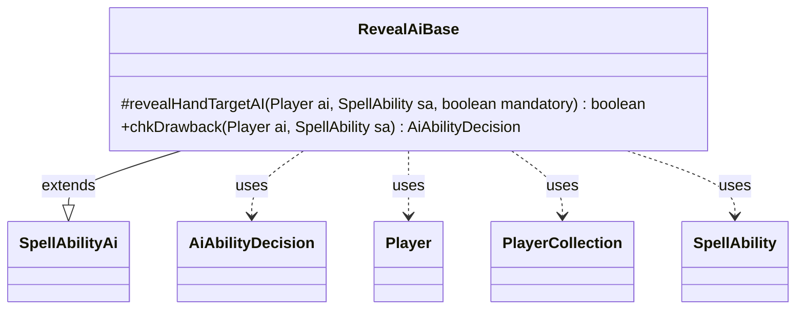

---
aliases:
  - RevealAiBase
tags:
  - java/class
  - module/forge-ai
  - pkg/forge/ai/ability
fqn: forge.ai.ability.RevealAiBase
package: forge.ai.ability
module: forge-ai
kind: Class
---

# RevealAiBase

**Package:** `forge.ai.ability`   **Module:** `forge-ai`   **Kind:** Class



## Relationships
**Extends:**
- [[forge.ai.SpellAbilityAi|SpellAbilityAi]]
**Uses:**
- [[forge.ai.AiAbilityDecision|AiAbilityDecision]]
- [[forge.game.player.Player|Player]]
- [[forge.game.player.PlayerCollection|PlayerCollection]]
- [[forge.game.spellability.SpellAbility|SpellAbility]]


## Design Description

`RevealAiBase` is an abstract AI helper that centralizes the decision logic shared by Forge's "reveal hand" abilities. Extending `SpellAbilityAi`, it occupies the ability-evaluator layer of the AI hierarchy, supplying a reusable routine to concrete reveal-ability AI classes rather than driving play itself. Its protected `revealHandTargetAI` method performs target selection: when an ability is targeted it clears prior targets, filters opponents to those legally targetable by the `SpellAbility`, and uses a `PlayerCollection` with `PlayerPredicates` to pick the opponent holding the largest hand—the most informative reveal. The `mandatory` flag governs fallbacks, letting the AI target itself or decline when no worthwhile target exists.

By exposing this routine to subclasses and overriding `chkDrawback` to run it non-mandatorily and always return an `AiAbilityDecision` of `WillPlay`, the class treats revealing a hand as a near-costless drawback while deferring primary play decisions to its subtypes.

## Source
`forge-ai/src/main/java/forge/ai/ability/RevealAiBase.java`

```java
package forge.ai.ability;

import forge.ai.AiAbilityDecision;
import forge.ai.AiPlayDecision;
import forge.ai.SpellAbilityAi;
import forge.game.player.Player;
import forge.game.player.PlayerCollection;
import forge.game.player.PlayerPredicates;
import forge.game.spellability.SpellAbility;
import forge.game.zone.ZoneType;

public abstract class RevealAiBase extends SpellAbilityAi {

    protected  boolean revealHandTargetAI(final Player ai, final SpellAbility sa, boolean mandatory) {
        if (sa.usesTargeting()) {
            // ability is targeted
            sa.resetTargets();

            PlayerCollection opps = ai.getOpponents().filter(PlayerPredicates.isTargetableBy(sa));

            if (opps.isEmpty()) {
                if (mandatory && sa.canTarget(ai)) {
                    sa.getTargets().add(ai);
                    return true;
                }
                return false;
            }

            Player p = opps.max(PlayerPredicates.compareByZoneSize(ZoneType.Hand));

            if (!mandatory && p.getCardsIn(ZoneType.Hand).isEmpty()) {
                return false;
            }
            sa.getTargets().add(p);
        } else {
            // if it's just defined, no big deal
        }

        return true;
    }

    /* (non-Javadoc)
     * @see forge.card.abilityfactory.SpellAiLogic#chkAIDrawback(java.util.Map, forge.card.spellability.SpellAbility, forge.game.player.Player)
     */
    @Override
    public AiAbilityDecision chkDrawback(Player ai, SpellAbility sa) {
        revealHandTargetAI(ai, sa, false);
        return new AiAbilityDecision(100, AiPlayDecision.WillPlay);
    }
}
```

## Python
`forge/ai/ability/RevealAiBase.py`

```python
from forge.ai.AiAbilityDecision import AiAbilityDecision
from forge.ai.AiPlayDecision import AiPlayDecision
from forge.ai.SpellAbilityAi import SpellAbilityAi
from forge.game.player.Player import Player
from forge.game.player.PlayerCollection import PlayerCollection
from forge.game.player.PlayerPredicates import PlayerPredicates
from forge.game.spellability.SpellAbility import SpellAbility
from forge.game.zone.ZoneType import ZoneType


class RevealAiBase(SpellAbilityAi):

    def revealHandTargetAI(self, ai: Player, sa: SpellAbility, mandatory: bool) -> bool:
        if sa.usesTargeting():
            # ability is targeted
            sa.resetTargets()

            opps = ai.getOpponents().filter(PlayerPredicates.isTargetableBy(sa))

            if opps.isEmpty():
                if mandatory and sa.canTarget(ai):
                    sa.getTargets().add(ai)
                    return True
                return False

            p = opps.max(PlayerPredicates.compareByZoneSize(ZoneType.Hand))

            if not mandatory and p.getCardsIn(ZoneType.Hand).isEmpty():
                return False
            sa.getTargets().add(p)
        else:
            # if it's just defined, no big deal
            pass

        return True

    # (non-Javadoc)
    # @see forge.card.abilityfactory.SpellAiLogic#chkAIDrawback(java.util.Map, forge.card.spellability.SpellAbility, forge.game.player.Player)
    def chkDrawback(self, ai: Player, sa: SpellAbility) -> AiAbilityDecision:
        self.revealHandTargetAI(ai, sa, False)
        return AiAbilityDecision(100, AiPlayDecision.WillPlay)
```
