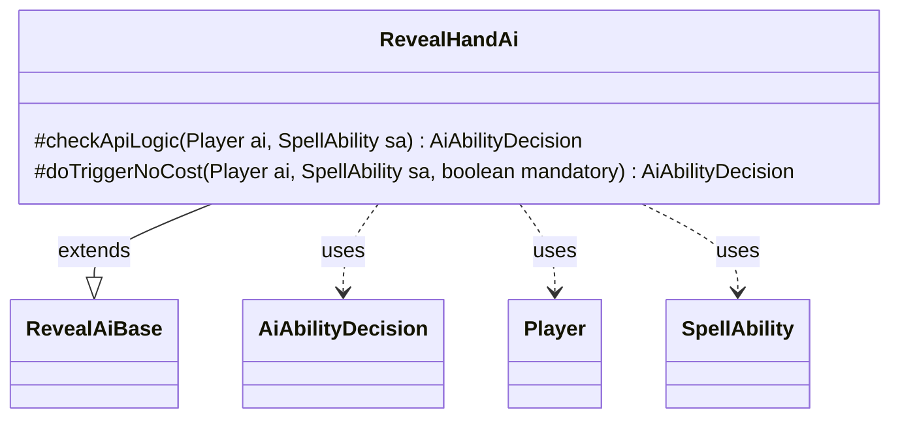

---
aliases:
  - RevealHandAi
tags:
  - java/class
  - module/forge-ai
  - pkg/forge/ai/ability
fqn: forge.ai.ability.RevealHandAi
package: forge.ai.ability
module: forge-ai
kind: Class
---

# RevealHandAi

**Package:** `forge.ai.ability` &nbsp; **Module:** `forge-ai` &nbsp; **Kind:** Class



## Relationships
**Extends:**
- [[forge.ai.ability.RevealAiBase|RevealAiBase]]
**Uses:**
- [[forge.ai.AiAbilityDecision|AiAbilityDecision]]
- [[forge.game.player.Player|Player]]
- [[forge.game.spellability.SpellAbility|SpellAbility]]

## Design Description

RevealHandAi is the AI decision handler for the "reveal hand" spell ability in Forge's AI module, determining whether and how the computer player should play or trigger an effect that reveals an opponent's hand. As a concrete subclass of RevealAiBase, it implements the two standard hooks—`checkApiLogic` for proactive casting and `doTriggerNoCost` for mandatory/triggered resolution—returning AiAbilityDecision values that encode both a numeric score and an AiPlayDecision verdict.

The design delegates target validation to the inherited `revealHandTargetAI` helper and reuses the base class's `playReusable` check, short-circuiting to a high-confidence WillPlay when the ability is reusable and otherwise deferring to `super.checkApiLogic`. This layering keeps shared reveal logic in the base while RevealHandAi contributes only the hand-reveal-specific targeting and scoring, collaborating with Player and SpellAbility to evaluate game state.

## Source
`forge-ai/src/main/java/forge/ai/ability/RevealHandAi.java`

```java
package forge.ai.ability;

import forge.ai.AiAbilityDecision;
import forge.ai.AiPlayDecision;
import forge.game.player.Player;
import forge.game.spellability.SpellAbility;

public class RevealHandAi extends RevealAiBase {

    /* (non-Javadoc)
     * @see forge.card.abilityfactory.SpellAiLogic#canPlayAI(forge.game.player.Player, java.util.Map, forge.card.spellability.SpellAbility)
     */
    @Override
    protected AiAbilityDecision checkApiLogic(final Player ai, final SpellAbility sa) {
        if (!revealHandTargetAI(ai, sa, false)) {
            return new AiAbilityDecision(0, AiPlayDecision.TargetingFailed);
        }

        if (playReusable(ai, sa)) {
            return new AiAbilityDecision(100, AiPlayDecision.WillPlay);
        }

        return super.checkApiLogic(ai, sa);
    }

    @Override
    protected AiAbilityDecision doTriggerNoCost(Player ai, SpellAbility sa, boolean mandatory) {
        if (revealHandTargetAI(ai, sa, mandatory)) {
            return new AiAbilityDecision(100, AiPlayDecision.WillPlay);
        } else {
            return new AiAbilityDecision(0, AiPlayDecision.CantPlayAi);
        }
    }
}
```
